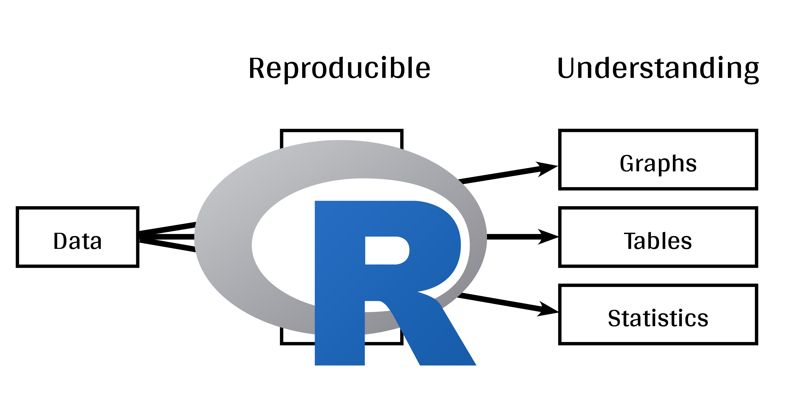

# (PART\*) Introduction to `ggplot2` {-}

# Introduction

Whether you are calculating summary statistics (e.g. Excel), performing more advanced statistical analysis (e.g. JMP, SAS, SPSS), or producing figures and tables (e.g. Sigmaplot, Excel), it is easy to get lost in a workflow when you are using a variety of software. This can become especially problematic when you import and export your dataset to accomplish a downstream task. With each operation, you increase the risk of introducing errors into your data or losing track of the correct version of your data. `R` provides a solution to this by unifying all of the tools you need for advanced data manipulation, statistical analysis, and powerful graphical engines in a single programming language. By unifying your workflow with `R`, you can reduce the chance of making mistakes and ensure your work is reproducible. Believe us, the future "you" will not regret it!

Instead of using a suite of various software tools...

.center[]

You can use `R` to generate reproducible data visualizations all within a single program, `R` Studio. 

.center[]

`Ggplot2` is the most flexible and complete package available for advanced data visualization in `R`. This package was created for R by Hadley Wickham based on the Grammar of Graphics by Leland Wilkinson. The source code is hosted on github: https://github.com/hadley/ggplot2.

{width="200"}

Today we will walk you through the basics of ggplot2 so that you have the necessary tools to explore its use for your own projects. Here is an outline of the workshop:

**1.** Visualization in science

**2.** `ggplot2` mechanics: the basics

**3 ** Aesthetic mapping

**4.** Fine-tuning

**5.** Saving your plots

**6.** Conclusion

# Learning objectives

Our main objectives today are to:

**1.** Teach the basics of data visualization using R.

**2.** Find packages and resources to meet your needs.

**3.** Inspire creativity in science!

**4.** Develop understanding of design for effective graphical communication.

# Preparing for the workshop

Before you begin this workshop, you must do the following steps:

**1.** Download the `R` script for this workshop:

-    [R Script](https://qcbsrworkshops.github.io/workshop07/book-en/workshop03-script-en.R)

You can save these files by clicking on the links above, and right click + save on the webpage they open.

**2.** Download the follow `R` packages which are required for this workshop:

-    [grid](http://cran.r-project.org/web/packages/grid/index.html)
-    [gridExtra](http://cran.r-project.org/web/packages/gridExtra/index.html)
-    [ggplot2](http://cran.r-project.org/web/packages/ggplot2/index.html)
-    [ggsignif](http://cran.r-project.org/web/packages/ggsignif/index.html)
-    [ggdendro](http://cran.r-project.org/web/packages/ggdendro/index.html)
-    [maps](http://cran.r-project.org/web/packages/maps/index.html)
-    [mapproj](http://cran.r-project.org/web/packages/mapproj/index.html)
-    [RColorBrewer](http://cran.r-project.org/web/packages/RColorBrewer/index.html)
-    [GGally](http://cran.r-project.org/web/packages/GGally/index.html)
-    [patchwork](http://cran.r-project.org/web/packages/patchwork/index.html)
-    [plotly](http://cran.r-project.org/web/packages/plotly/index.html)
-    [reshape2](http://cran.r-project.org/web/packages/reshape2/index.html)
-    [palmerpenguins](http://cran.r-project.org/web/packages/palmerpenguins/index.html)

To install them from CRAN, run:

```{r, echo = TRUE, eval = TRUE, message=FALSE, warning=FALSE}
install.packages(c('grid', 
                   'gridExtra', 
                   'ggplot2', 
                   'ggsignif', 
                   'ggdendro', 
                   'maps', 
                   'mapproj', 
                   'RColorBrewer', 
                   'GGally', 
                   'patchwork', 
                   'plotly', 
                   'palmerpenguins'))
```

To load these packages, run:

```{r, echo = TRUE, eval = TRUE, message=FALSE, warning=FALSE}
library(grid)
library(gridExtra)
library(ggplot2)
library(ggsignif)
library(ggdendro)
library(maps)
library(mapproj)
library(RColorBrewer)
library(GGally)
library(patchwork)
library(plotly)
library(palmerpenguins)
```
