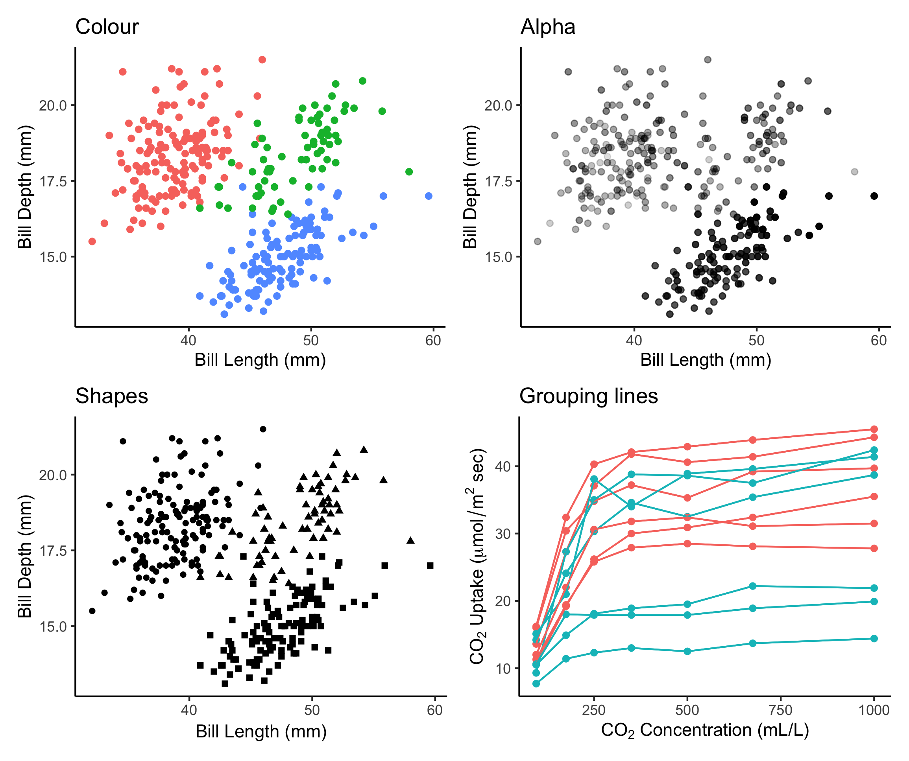

# (PART\*) Aesthetic mapping {-}

# Aesthetics

Let's talk more about the aesthetic layer, this is where we can get really creative with our data! We can use aesthetics (`aes()`) to distinguish classes, groups and structure.

In this section, we will talk about colour, shape, size, labels and transparency so that you can make your plots look exactly how you imagined them.

```{r, echo=FALSE, fig.cap="Aesthetics allow us to represent many dimensions of our dataset in one plot by varying colour, shape, size, labels and transparency.", fig.align="center", purl = FALSE}

```

# Colours: make your points talk

When we are designed plots, we may want to change the colour of our data points in order to communicate different parts of the data. We may want to:

-   Differentiate between groups
-   Represent data values
-   Highlight specific elements of the data

<div class = "split">
<div class = "split-left">
```{r, echo = FALSE, fig.height=4.8, fig.width = 5, warning=FALSE}
ggplot(penguins,
       aes(x = bill_length_mm,
           y = bill_depth_mm)) +
  geom_point(aes(colour = species)) +
  labs(title = "Qualitative colour for groups",
       x = "Bill length (mm)",
       y = "Bill depth (mm)") +
  theme(title = element_text(size = 16, face = "bold"),
        legend.title = element_text(size = 14),
        legend.position = 'bottom')
```
</div>
<div class = "split-right">
```{r, echo = FALSE, fig.height=4.8, fig.width = 5, warning = FALSE}
ggplot(penguins,
       aes(x = bill_length_mm,
           y = bill_depth_mm)) +
  geom_point(aes(colour = log10(body_mass_g))) +
  labs(title = "Gradient colour for values",
       x = "Bill length (mm)",
       y = "Bill depth (mm)",
       col = "Body mass (log10 g)") +
  theme(title = element_text(size = 16, face = "bold"),
        legend.title = element_text(size = 14),
        legend.position = 'bottom')
```
</div>
</div>

*Reference: Fundamentals of Data Visualization [@wilke2019fundamentals].*

## Using `aes()` use to change colour

We can use the aesthetic layer `aes()` to map colours to our data in our plots. This will allow us to clearly communicate specific messages about our data. For instance, if we want to know whether bill length and flipper length vary differently across species, which of these plots allows us to answer that question?

```{r, fig.align = 'default', fig.asp=2/3, warning = FALSE, message = FALSE}
# No colour mapping
ggplot(data = penguins,
       aes(x = bill_length_mm,
           y = flipper_length_mm)) +
  geom_point() +
  geom_smooth(method = lm)+
  labs(title = "No colour mapping",
       x = "Bill length (mm)",
       y = "Bill depth (mm)")
```

```{r,  fig.align = 'default', fig.asp=2/3, warning = FALSE, message = FALSE}
# With colour mapping
ggplot(data = penguins,
       aes(x = bill_length_mm,
           y = flipper_length_mm,
           col = species)) + # Using the col argument, we can colour by species
  geom_point() +
  geom_smooth(method=lm) +
  labs(title = "With colour mapping",
       x = "Bill length (mm)",
       y = "Bill depth (mm)")
```


## Manual colour change

In the above example, we used the `col` argument within `aes()` in order to colour our data points by species automatically. This is possible because `aes()` can call our data variables. However, this method will use a default colour palette. If we want to add specific colours to our plots, we can do it manually using `scale_colour_manual()` or `scale_fill_manual()`.


```{r, fig.align = 'default', fig.asp=2/3, warning = FALSE, message = FALSE}
# Default

# Let ggplot assign colours to species
pp <- ggplot(data = penguins) +
  geom_point(aes(x = bill_length_mm,
                 y = bill_depth_mm,
                 colour = species)) +
  labs(title = "Default",
       x = "Bill length (mm)",
       y = "Bill depth (mm)")
pp
```


```{r, fig.align = 'default', fig.asp=2/3, warning = FALSE, message = FALSE}
# Manual colour change

# By using scale_colour_manual(),
# we can specify the exact colours we want to use
pp +
scale_colour_manual(
  # Note that the colour order will correspond to
  # the order of the species given in the legend
  values = c("grey55", "orange", "skyblue"))
```

:::explanation
Here, we are saving our plot as an object (`pp`), and adding elements to this object with a `+` to change the scaling of the colour mapping. We do not need to rewrite the whole ggplot to customize it!
:::

## Gradients

We can do the same thing with colour gradients using `scale_colour_gradient()` if we want to communicate something different about our data. In this example, we are colouring our data points by body mass using a gradient.

```{r, fig.align = 'default', fig.asp=2/3, warning = FALSE, message = FALSE}
# Default

# Using the colour argument within aes() will use a
# default colour palette to make our gradient
pp2 <- ggplot(data = penguins) +
  geom_point(aes(x = bill_length_mm,
                 y = bill_depth_mm,
                 colour = log10(body_mass_g))) +
  labs(title = "Default",
       x = "Bill length (mm)",
       y = "Bill depth (mm)")
pp2
```


```{r, fig.align = 'default', fig.asp=2/3, warning = FALSE, message = FALSE}
# Manual

# By using scale_colour_graduent,
# we can set our colour gradient manually
pp2 +
  scale_colour_gradient(low = "blue",
                        high = "red") +
  labs(title = "Manual")
# Note: there is also scale_colour_gradient2() to create a
# gradient with a midpoint value for diverging palettes

```


## Use a new colour palette

If you prefer to use a pre-set colour palette rather than setting your colours manually, but you do not want to use the default palette - don't worry! There are a lot of options for you.

There are many `R` colour packages specifically designed to provide you with a range of colour palette options that all strike a different mood! For example, the `RColorBrewer` package have 35 palettes to choose from!

Here you can see they are organized into different groups depending on whether the colours are sequential, diverging or a mixture of the two. You can imagine that different palettes are better for different data types.

```{r, eval = FALSE}
require(RColorBrewer)
display.brewer.all()
```

```{r, echo=FALSE, fig.align="center", purl = FALSE}
knitr::include_graphics("images/rcolorbrewer_palette.png")
```


Want to see these palettes in action? Here is an example of the Dark2 palette being used to group data points with the `scale_colour_brewer()` function and the `palette` arguemnt.

```{r, fig.align = 'center', fig.height = 5, fig.width=6.5, warning = FALSE, message = FALSE}
# Palette for groups
pp +
  scale_colour_brewer(palette = "Dark2") +
  labs(title = "Palette for groups")
```

There are other functions within the `RColorBrewer` package as well. By using `scale_color_viridis()`, we can use a default package that will translate from colour to gray scale without losing information. (Note that this is also an important consideration for colourblindness, which we will discuss soon).

```{r, fig.align = 'center', fig.height = 5, fig.width=6.5, warning = FALSE, message = FALSE}
# Palette for continuous values
pp2 +
  scale_color_viridis_c()+
  labs(title = "Palette for continuous values")
```


Now what if we want to use just gray-scale palette for publication purposes? We can use the `scale_colour_grey()` function to colour our grouped data points.

```{r, fig.align = 'center', fig.height = 5, fig.width=6.5, warning = FALSE, message = FALSE}
# Palette for groups
pp +
  scale_colour_grey() +
  labs(title = "Palette for groups")
```

Or we can use the `scale_colour_gradient()` function for continuous data, and set our low and high gradient points to black and light gray.

```{r, fig.align = 'center', fig.height = 5, fig.width=6.5, warning = FALSE, message = FALSE}
# Palette for continuous values
pp2 +
  scale_colour_gradient(low = "grey85", high = "black") +
  labs(title = "Palette for continuous values")
```


## Colourblind-friendly palettes

Have you ever considered how your figure might appear under various forms of colourblindness?
We can use the package [colorblindr](https://github.com/clauswilke/colorblindr) to consider this. This package is not currently on CRAN, so we install it with the packages [remotes](https://cran.r-project.org/web/packages/remotes/index.html).

```{R colorblindr_install, message = FALSE}
# Let's install the colorblindr package from GitHub using remotes
install.packages("remotes", quiet = TRUE)
remotes::install_github("clauswilke/colorblindr@cc54c8a35f8e7689ef4cc128b0da3af92f8cd540", quiet = TRUE)
library(colorblindr)
```

Let's start by testing out some colours using the `cvd_grid()` function. This will show us how our current plot looks for different forms of colourblindness.

```{r, warning = FALSE, message = FALSE, out.width="150%"}
cvd_grid(pp)  # Let's check how our plot looks with different forms of colourblindness
```

As you can see, our current colour palette is not accessible! By using [`viridis`](https://cran.r-project.org/web/packages/viridis/vignettes/intro-to-viridis.html) palettes, we can guarantee our plots always communicate the same information no matter who the audience is.

### Example for grouped data

Here is an example with grouped data points:

```{r, fig.height = 5, warning = FALSE, message = FALSE}
# Let's use a viridis palette to make our plot more accessible
pp_viridis <- pp +
      scale_colour_viridis_d() +
      labs(title = "Viridis palette for groups")
pp_viridis
```


```{r, warning = FALSE, message = FALSE}
# Did we succeed? Let'd use cvd_grid() to check again
cvd_grid(pp_viridis)
# We succeeded!
```


### Example for continuous data

Note that we are using slightly different functions for different colours (ex. `scale_colour_viridis_c()`, `scale_colour_viridis_d()`)


```{r, fig.height = 5, warning = FALSE, message = FALSE}
pp2_viridis <- pp2 +
        scale_colour_viridis_c() +
        labs(title = "Viridis palette for continuous values")
pp2_viridis
```


```{r, warning = FALSE, message = FALSE}
cvd_grid(pp2_viridis)
```


# Changing `shape`, `size` and `alpha`

Now let's look beyond colour! If we want to change the shape of our data points, we can start by using the `shape` argument within the `aes()` layer just like we did with colour. This will group our data points by the variable we provide using different shapes (here we are using the variable species).

If we want to adjust the size of the data points instead, we can use the `size` argument in the same spot. We can also use the `alpha` argument if we want to play with transparency. Both of these are good options for continuous data.

```{r, warning = FALSE, message = FALSE}
# shape for groups
ggplot(data = penguins) +
  geom_point(aes(x = bill_length_mm,
                 y = bill_depth_mm,
                 shape = species)) + # Group data with data point shape
  labs(title = "Shapes for groups")
```


```{r, warning = FALSE, message = FALSE}
# size and alpha for continuous values
ggplot(data = penguins) +
  geom_point(aes(x = bill_length_mm,
                 y = bill_depth_mm,
                 size = body_mass_g,# Group data using point size
                 alpha = flipper_length_mm)) + # Group data using transparency
  labs(title = "Size and alpha for continuous values")
```

You may have noted in the second plot that you can even combine multiple of these options at once! But, setting many variables to visual cues like color, shape, size, and alpha at once tends to be overwhelming for the viewer. Adding 4 levels of complexity on top of the 2-dimensional representation of points can be too much to process properly. It is preferable to choose the visual cues and key variables for the desired message than to overload a plot with every possibility in the `aes()` function.


## Challenge 2

- Produce an **informative plot** from built-in datasets such as `mtcars`, `CO2` or `msleep`.

- Use appropriate aesthetic mappings for different data types!


Data| x | y | Aesthetics
:-------------:|:-------------:|:-------------:|:-------------:
mtcars |*wt* |*mpg* | *disp* and *hp*
CO2 |*conc* |*uptake* | *Treatment* and *Type*
msleep |log10(*bodywt*) |*awake* | *vore* and *conservation*
ToothGrowth | *dose* | *len* | *supp*

:::explanation
Pay attention to the data types!
:::

```{r, echo = FALSE, include = FALSE}
# Challenge 2 ----

# Produce an informative plot from built-in datasets such as `mtcars`, `CO2` or `msleep`.
# Use appropriate aesthetic mappings for different data types!


# SOLUTION # -----
```


---

### Challenge 2: Solution (`mtcars`)

There are multiple ways to respond to this challenge. Here is one example using the `mtcars` dataset:

Data| x | y | Aesthetics
:-------------:|:-------------:|:-------------:|:-------------:
mtcars |*wt* |*mpg* | *disp* and *hp*


```{r}
# One of many solutions: mtcars
data(mtcars)
ggplot(data = mtcars) +
  geom_point(aes(x = wt,
                 y = mpg,
                 colour = disp,
                 alpha = hp))
```

Could you use `size` instead of `alpha`? What about `shape`?

### Challenge 2: Solution (`CO2`)

Here is a second example using the `CO2` dataset:

Data| x | y | Aesthetics
:-------------:|:-------------:|:-------------:|:-------------:
CO2 |*conc* |*uptake* | *Treatment* and *Type*


```{r}
# Another possible solution
data(CO2)
ggplot(data = CO2) +
  geom_point(
    aes(x = conc,
        y = uptake,
        colour = Treatment,
        shape = Type))
```


### Challenge 2: Solution (`msleep`)

Here is a third example using the `msleep` dataset:

Data| x | y | Aesthetics
:-------------:|:-------------:|:-------------:|:-------------:
msleep |log10(*bodywt*) |*awake* | *vore* and *conservation*


```{r, fig.height=3.5, fig.width=6, warning = FALSE, message = FALSE}
# Another possible solution
data(msleep)
ggplot(data = msleep) +
  geom_point(
    aes(x = log10(bodywt),
        y = awake,
        colour = vore,
        shape = conservation))
```


### Challenge 2: Solution (`ToothGrowth`)

Here is a final example using the `ToothGrowth` dataset:

Data| x | y | Aesthetics
:-------------:|:-------------:|:-------------:|:-------------:
ToothGrowth | *dose* | *len* | *supp*


```{r, message = FALSE, warning = FALSE}
data(ToothGrowth)
ggplot(ToothGrowth, 
       aes(x = dose,
           y = len,
           color = supp)) +
  geom_point() +
  geom_smooth(method = lm, formula = 'y ~ x')
```


# Changing the scale of the axes

We can also adjust the scale of our axes using the `coord_trans()` function.

Sometimes transforming our axes is necessary to show certain relationships within our data. A common example is a log transformation with `log10()`.

Let us compare an example with an untransformed axes, followed by $log_{10}$-transformed axes.

Example A: x axis on the original (untransformed) scale

```{r,fig.height=4}
ggplot(diamonds) +
  geom_point(aes(x = carat, 
                           y = price)) +
  labs(title = "Original scale")
```


Example B: x-axis and y-axis in $log_{10}$ scale
```{r,fig.height=4}
ggplot(diamonds) +
  geom_point(mapping = aes(x = carat, y = price)) +
  coord_trans(x = "log10", y = "log10") +
  labs(title = "log10 scale")
```


:::explanation
It is also possible to transform the coordinate system using `scale_x_log10()` and `scale_y_log10()`.
:::
