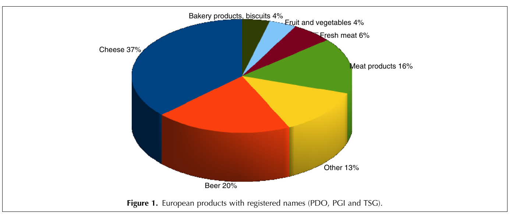

# (PART\*) Visualication en science {-}

# Pourquoi visualiser des données ?

Avant de voir *comment* nous pouvons visualiser nos données, commençons par répondre à la question *pourquoi* la visualisation des données est importante. La visualisation peut être utile (voire *essentielle*) pour représenter les résultats d'analyses statistiques, pour formuler des hypothèses et résumer la théorie, pour explorer vos données afin de mieux les comprendre via une analyse exploratoire ou la détection de valeurs aberrantes, et plus encore. 

Plus important encore, la visualisation est surtout efficace pour communiquer et rapporter vos résultats lorsqu'elle est faite :

  - De manière claire (en utilisant de bons principes de design) ;
  - Avec précision et exactitude (un graphique vaut 1000 mots) ;
  - De manière efficace.
  
:::noway

Voici un exemple de visualisation *inéfficace* :

```{r, echo=FALSE, out.width="100%", fig.align="center", fig.cap = "An example of an *ineffective* visualization.", purl = FALSE}

```

Quels sont des défauts de cette figure? Essayez de répondre par vous-même à cette question: que pensez-vous que cette figure essaie de communiquer et est-ce qu'elle y parvient? Comment cette image pourrait-elle être améliorée ?

*Indices:* Pourquoi cette image est-elle en [**3D**](https://www.data-to-viz.com/caveat/3d.html)? Quels éléments attirent votre [attention](https://www.data-to-viz.com/caveat/declutter.html)? Comment un [**diagramme circulaire**](https://www.data-to-viz.com/caveat/pie.html) communique-t-il visuellement l'information?
:::

Pour vous assurer que vous communiquez efficacement, voici quelques questions importantes à vous poser lorsque vous visualisez vos données:

- Que voulez-vous communiquer?
- Qui est votre public?
- Quelle est la meilleure façon de visualiser votre message?

:::explanation
**Une règle générale : restez simple - utilisez moins d'encre!**
:::

# Pourquoi utiliser `R`?

Que vous effectuiez des statistiques descriptives (e.g. Excel), des analyses plus avancées (e.g. SAS, JMP, SPSS) ou des graphiques et des tableaux (e.g. Sigmaplot, Excel), il est facile de se perdre dans le flux de travail lorsqu'on utilise plusieurs logiciels. Ceci s'avère particulièrement problématique lorsqu'on doit importer ou exporter des données pour effectuer une tâche en aval. À chaque opération, on augmente le risque d'introduire des erreurs dans les données ou de perdre de vue le "bon" fichier de données. Le langage statistique `R` fournit une solution à ce problème en regroupant tous les outils nécessaires pour manipuler des données, effectuer des analyses statistiques et produire des graphiques sous un seul logiciel. En regroupant notre flux de travail sous le même toit avec `R`, on réduit la probabilité de faire des erreurs et on rend notre flux de travail beaucoup plus compréhensible et reproductible. Tout ceci en vaut grandement l'effort!

Au lieu d'utiliser une suite de logiciels...

```{r, echo=FALSE, out.width="70%", fig.align="center", purl = FALSE}
knitr::include_graphics("images/Divided_reproducible workflow.png")
```

Vous pouvez utiliser `R` pour générer des visualisations de données reproductibles, le tout dans un seul programme, `R` Studio. 

```{r, echo=FALSE, out.width="70%", fig.align="center", purl = FALSE}
knitr::include_graphics("images/Divided_reproducible workflow2.png")
```

Quel est l'avantage d'utiliser `R` pour la visualisation des données?

## Reproductibilité

L'une des principales raisons d'utiliser `R` pour la visualisation est qu'elle rend votre graphique entièrement reproductible. Vous pouvez annoter votre script, ajouter des informations supplémentaires (ex. titres, étiquettes, légendes, etc.) et maintenir le code pour toutes les versions de vos figures afin de toujours savoir comment elles ont été produites. 

La science reproductible demande des efforts, mais elle devient rapidement une **norme de travail** et constitue un investissement qui vous fera gagner beaucoup de temps, à vous et à vos collaborateurs, à long terme!

## Puissantes fonctionnalités

Une autre raison d'utiliser `R` concerne ses puissantes fonctionnalités, comme `ggplot2`. 

`ggplot2` est la librairie la plus flexible et la plus complète disponible pour la visualisation avancée de données en `R`. Cette librairie a été créée pour `R` par Hadley Wickham sur la base de la Grammar of Graphics de Leland Wilkinson. 

```{r, echo=FALSE, out.width="50%", fig.cap="Le code source de la librairie `ggplot2` est hébergé sur GitHub: [github.com/hadley/ggplot2](https://github.com/hadley/ggplot2).", fig.align="center", purl = FALSE}
knitr::include_graphics("images/ggplot2_logo.png")
```


Dans cet atelier, nous nous concentrons uniquement sur `ggplot2`, mais il y a beaucoup d'autres outils et fonctions (https://insileco.github.io/wiki/rgraphpkgs/) qui peuvent être utilisés pour la visualisation (par exemple, [`base R`](https://bookdown.org/rdpeng/exdata/the-base-plotting-system-1.html), [`plotly`](https://plot.ly/r/), [`sjPlot`](http://www.strengejacke.de/sjPlot/), [`mapview`](https://r-spatial.github.io/mapview/), [`igraph`](https://igraph.org/r/)). Voici quelques exemples de graphiques que vous pouvez faire avec la base `R`, ou avec `ggplot2`.

```{r, echo=FALSE, fig.cap="Un petit aperçu de figures que vous pouvez réaliser avec `base R` (row 1) et `ggplot2` (row 2), basées sur la librairie de données [`palmerpenguins`](http://cran.r-project.org/web/packages/palmerpenguins/index.html).", fig.align="center", purl = FALSE}
knitr::include_graphics("images/multiExamplePlot.png")
```

Nous nous concentrons sur `ggplot2` en raison de sa **versatilité**.

**1.** [`ggplot2`](https://ggplot2.tidyverse.org/) vous permet de créer de *beaux* graphiques personnalisables;

**2.** [`ggplot2`](https://ggplot2.tidyverse.org/) implémente la grammaire des graphiques, qui est un système fiable pour construire des graphiques.

**3.** Il existe [de nombreuses extensions](https://exts.ggplot2.tidyverse.org/gallery/) pour ajouter encore plus de fonctionnalités à `ggplot2`, ce qui permet une multitude d'applications.