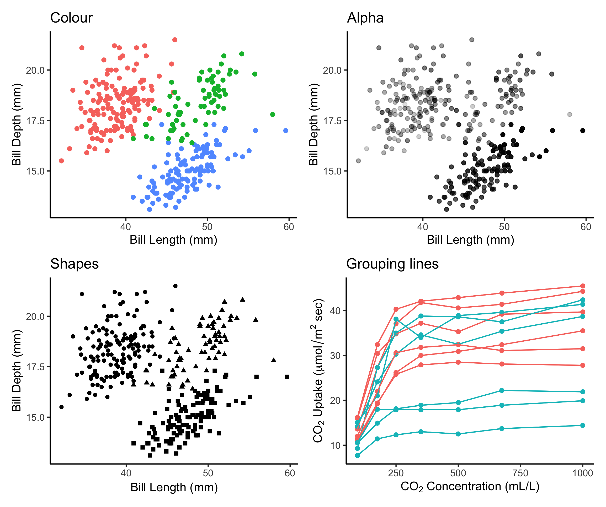

# (PART\*) Esthétique ou *Aesthetic mappings* {-}

# Esthétiques

Parlons plus en détail de la couche esthétique. C'est ici que nous pouvons être vraiment créatifs avec nos données! Nous pouvons utiliser l'esthétique (`aes()`) pour distinguer les classes, les groupes et la structure.

Dans cette section, nous parlerons de la couleur, de la forme, de la taille, des étiquettes et de la transparence afin que vous puissiez faire en sorte que vos graphiques ressemblent exactement à ce que vous avez imaginé.

```{r, echo=FALSE, fig.cap="L'esthétique nous permet de représenter plusieurs dimensions de notre ensemble de données dans un seul graphique en variant la couleur, la forme, la taille, les légendes et la transparence.", fig.align="center", purl = FALSE}

```

# Les couleurs: faites parler vos données

Lorsque nous concevons des graphiques, nous pouvons vouloir changer la couleur de nos points de données afin de communiquer différentes informations sur les données. Nous pouvons vouloir:

-   Différencier entre des groupes
-   Représenter les valeurs des données
-   Mettre en évidence des éléments spécifiques

<div class = "split">
<div class = "split-left">
```{r, echo = FALSE, fig.height=4.8, fig.width = 5, warning=FALSE}
ggplot(penguins,
       aes(x = bill_length_mm,
           y = bill_depth_mm)) +
  geom_point(aes(colour = species)) +
  labs(title = "Couleurs qualitatives \npour des groupes",
       x = "Longueur du bec (mm)",
       y = "Profondeur du bec (mm)",
       col = "Espèce") +
  theme(title = element_text(size = 16, face = "bold"),
        legend.title = element_text(size = 14),
        legend.position = 'bottom')
```
</div>
<div class = "split-right">
```{r, echo = FALSE, fig.height=4.8, fig.width = 5, warning = FALSE}
ggplot(penguins,
       aes(x = bill_length_mm,
           y = bill_depth_mm)) +
  geom_point(aes(colour = log10(body_mass_g))) +
  labs(title = "Gradient de couleurs \npour des valeurs",
       x = "Longueur du bec (mm)",
       y = "Profondeur du bec (mm)",
       col = "Masse corporelle (g)") +
  theme(title = element_text(size = 16, face = "bold"),
        legend.title = element_text(size = 14),
        legend.position = 'bottom')
```
</div>
</div>

*Référence: Fundamentals of Data Visualization [@wilke2019fundamentals].*

## Utiliser `aes()` pour changer les couleurs

Nous pouvons utiliser la couche esthétique `aes()` pour associer des couleurs à nos données dans nos graphiques. Cela nous permettra de communiquer clairement des messages spécifiques sur nos données. Par exemple, si nous voulons savoir si la longueur du bec et la longueur des nageoires varient différemment d'une espèce à l'autre, lequel de ces graphiques nous permet de répondre à cette question?

```{r, fig.align = 'default', fig.asp=2/3, warning = FALSE, message = FALSE}
# No colour mapping
ggplot(data = penguins,
       aes(x = bill_length_mm,
           y = flipper_length_mm)) +
  geom_point() +
  geom_smooth(method = lm)+
  labs(title = "Sans code de couleur",
       x = "Longueur du bec (mm)",
       y = "Profondeur du bec (mm)")
```

```{r,  fig.align = 'default', fig.asp=2/3, warning = FALSE, message = FALSE}
# Avec code de couleur
ggplot(data = penguins,
       aes(x = bill_length_mm,
           y = flipper_length_mm,
           col = species)) + # l'argument col met une couleur par espèce
  geom_point() +
  geom_smooth(method=lm) +
  labs(title = "Avec code de couleur",
       x = "Longueur du bec (mm)",
       y = "Profondeur du bec (mm)")
```


## Changer les couleurs manuellement

Dans l'exemple ci-dessus, nous avons utilisé l'argument `col` dans `aes()` afin de colorer automatiquement nos points de données par espèce. Ceci est possible car `aes()` peut appeler nos variables de données. Cependant, cette méthode utilisera une palette de couleurs par défaut. Si nous voulons ajouter des couleurs spécifiques à nos graphiques, nous pouvons le faire manuellement en utilisant `scale_colour_manual()` ou `scale_fill_manual()`.

```{r, fig.align = 'default', fig.asp=2/3, warning = FALSE, message = FALSE}
# Défaut

# Permettre à ggplot d'assigner un code de couleurs aux espèces
pp <- ggplot(data = penguins) +
  geom_point(aes(x = bill_length_mm,
                 y = bill_depth_mm,
                 colour = species)) +
  labs(title = "Default",
       x = "Longueur du bec (mm)",
       y = "Profondeur du bec (mm)")
pp
```


```{r, fig.align = 'default', fig.asp=2/3, warning = FALSE, message = FALSE}
# Créer un code de couleur manuellement

# En utilisant scale_colour_manual(),
# nous pouvons spécifier les couleurs précises que nous voulons utiliser
pp +
scale_colour_manual(
  # Notez que l'ordre des couleurs correspondra à
  # l'ordre des espèces indiqué dans la légende
  values = c("grey55", "orange", "skyblue"))
```

:::explanation
Ici, nous enregistrons notre graphique en tant qu'objet (`pp`), et nous ajoutons des éléments à cet objet avec un `+` pour changer l'échelle de couleurs. Nous n'avons pas besoin de réécrire tout le ggplot pour le personnaliser!
:::

## Gradients

Nous pouvons faire la même chose avec des gradients de couleur en utilisant `scale_colour_gradient()` si nous voulons communiquer quelque chose sur nos données continues. Dans cet exemple, nous colorons nos points de données par masse corporelle en utilisant un gradient.

```{r, fig.align = 'default', fig.asp=2/3, warning = FALSE, message = FALSE}
# Défaut

# L'utilisation de l'argument couleur dans aes() va utiliser une
# palette de couleurs par défaut pour créer notre gradient.
pp2 <- ggplot(data = penguins) +
  geom_point(aes(x = bill_length_mm,
                 y = bill_depth_mm,
                 colour = log10(body_mass_g))) +
  labs(title = "Défaut",
       x = "Longueur du bec (mm)",
       y = "Profondeur du bec (mm)")
pp2
```


```{r, fig.align = 'default', fig.asp=2/3, warning = FALSE, message = FALSE}
# Manual

# En utilisant scale_colour_graduent,
# nous pouvons définir manuellement notre gradient de couleur.
pp2 +
  scale_colour_gradient(low = "blue",
                        high = "red") +
  labs(title = "Manuellement")
# Note : il existe aussi scale_colour_gradient2() pour créer un # gradient avec 
# une valeur médiane pour les palettes divergentes.
```


## Utiliser une palette de couleurs prédéfinie

Si vous préférez utiliser une palette de couleurs prédéfinie plutôt que de définir vos couleurs manuellement, mais que vous ne souhaitez pas utiliser la palette par défaut, ne vous inquiétez pas! De nombreuses options s'offrent à vous.

Il existe de nombreuses librairies de couleurs `R` spécialement conçus pour vous fournir une gamme d'options de palette de couleurs! Par exemple, la librairie `RColorBrewer` propose 35 palettes!

Vous pouvez voir ici qu'elles sont organisées en palettes séquentielles, divergentes ou un mélange des deux. Vous pouvez imaginer que différentes palettes sont plus pertinentes pour différents types de données.

```{r, eval = FALSE}
require(RColorBrewer)
display.brewer.all()
```

```{r, echo=FALSE, fig.align="center", purl = FALSE}
knitr::include_graphics("images/rcolorbrewer_palette.png")
```


Vous voulez voir ces palettes en action? Voici un exemple d'utilisation de la palette Dark2 pour grouper des points de données avec la fonction `scale_colour_brewer()` et l'argument `palette`.

```{r, fig.align = 'center', fig.height = 5, fig.width=6.5, warning = FALSE, message = FALSE}
# Palette pour des groupes
pp +
  scale_colour_brewer(palette = "Dark2") +
  labs(title = "Palette pour des groupes")
```

There are other functions within the `RColorBrewer` package as well. By using `scale_color_viridis()`, we can use a default package that will translate from colour to gray scale without losing information. (Note that this is also an important consideration for colourblindness, which we will discuss soon).

```{r, fig.align = 'center', fig.height = 5, fig.width=6.5, warning = FALSE, message = FALSE}
# Palette pour des variables continues
pp2 +
  scale_color_viridis_c()+
  labs(title = "Palette pour des variables continues")
```


Maintenant, que faire si nous voulons utiliser uniquement la palette de gris à des fins de publication? Nous pouvons utiliser la fonction `scale_colour_grey()` pour colorer nos points de données.

```{r, fig.align = 'center', fig.height = 5, fig.width=6.5, warning = FALSE, message = FALSE}
# Palette pour groupes
pp +
  scale_colour_grey() +
  labs(title = "Palette pour des groups")
```

Ou nous pouvons utiliser la fonction `scale_colour_gradient()` pour les données continues, et définir notre gradient du noir au gris clair.

```{r, fig.align = 'center', fig.height = 5, fig.width=6.5, warning = FALSE, message = FALSE}
# Palette pour des variables continues
pp2 +
  scale_colour_gradient(low = "grey85", high = "black") +
  labs(title = "Palette for continuous values")
```


## Utiliser des palettes de couleurs visibles pour les daltoniens

Comment votre figure peut-elle apparaître sous différentes formes de daltonisme ?
Nous pouvons utiliser [colorblindr](https://github.com/clauswilke/colorblindr) qui n'est pas actuellement sur CRAN, donc nous l'installons avec la librairie [remotes](https://cran.r-project.org/web/packages/remotes/index.html).

```{R colorblindr_install, message = FALSE}
# Installons la librairie colorblindr de GitHub avec remotes
install.packages("remotes", quiet = TRUE)
remotes::install_github("clauswilke/colorblindr@cc54c8a35f8e7689ef4cc128b0da3af92f8cd540", quiet = TRUE)
library(colorblindr)
```

Commençons par tester quelques couleurs en utilisant la fonction `cvd_grid()`. Cela nous montrera comment notre graphique actuel se présente pour différentes formes de daltonisme.

```{r, warning = FALSE, message = FALSE, out.width="150%"}
cvd_grid(pp)  # Vérifions le résultat de notre graphique selon les différentes formes de daltonisme.
```

Comme vous pouvez le constater, notre palette de couleurs actuelle n'est pas accessible ! En utilisant les palettes [`viridis`](https://cran.r-project.org/web/packages/viridis/vignettes/intro-to-viridis.html), nous pouvons garantir que nos graphiques communiquent toujours les mêmes informations, quel que soit le public.

### Example pour des variables qualitatives

Voici un exemple avec des variables qualitatives (en groupes)

```{r, fig.height = 5, warning = FALSE, message = FALSE}
# Utilisons une palette viridis pour rendre notre graphique plus accessible.
pp_viridis <- pp +
      scale_colour_viridis_d() +
      labs(title = "Palette viridis palette pour des groupes")
pp_viridis
```


```{r, warning = FALSE, message = FALSE}
# Avons-nous réussi ? Utilisons cvd_grid() pour vérifier à nouveau.
cvd_grid(pp_viridis)
# On a réussi!
```


### Exemple pour variables continues

Notez que nous utilisons des fonctions légèrement différentes pour les différentes types de données (ex. `scale_colour_viridis_c()`, `scale_colour_viridis_d()`).


```{r, fig.height = 5, warning = FALSE, message = FALSE}
pp2_viridis <- pp2 +
        scale_colour_viridis_c() +
        labs(title = "Palette viridis pour des variables continues")
pp2_viridis
```


```{r, warning = FALSE, message = FALSE}
cvd_grid(pp2_viridis)
```


# Changer la forme, la taille et la transparence

Maintenant, regardons plus loin que la couleur ! Si nous voulons changer la forme de nos points de données, nous pouvons commencer par utiliser l'argument `shape` dans la couche `aes()` comme nous l'avons fait avec la couleur. Cela regroupera nos points de données par la variable que nous fournissons en utilisant différentes formes (ici nous utilisons la variable espèce).

Si nous voulons ajuster la taille des points de données, nous pouvons utiliser l'argument `size` au même endroit. Nous pouvons également utiliser l'argument `alpha` si nous voulons jouer avec la transparence. Les deux sont de bonnes options pour les données continues.

```{r, warning = FALSE, message = FALSE}
# changer la forme des points
ggplot(data = penguins) +
  geom_point(aes(x = bill_length_mm,
                 y = bill_depth_mm,
                 shape = species)) + # regrouper les données par formes
  labs(title = "Formes pour des groupes")
```


```{r, warning = FALSE, message = FALSE}
# size and alpha for continuous values
ggplot(data = penguins) +
  geom_point(aes(x = bill_length_mm,
                 y = bill_depth_mm,
                 size = body_mass_g, # regrouper les données par taille des points
                 alpha = flipper_length_mm)) + # code de transparence par longueur de nageoire
  labs(title = "Taille et transparence pour des variables continues")
```

Notez que le fait de définir simultanément de nombreuses variables pour les repères visuels tels que la couleur, la forme, la taille et l'alpha a tendance à être excessif pour le lecteur. L'ajout de quatre niveaux de complexité à la représentation en 2D des points peut être trop important pour être bien interprété. Il est préférable de choisir les indices visuels et les variables clés pour le message souhaité plutôt que de surcharger un graphique avec toutes les possibilités de la fonction `aes()`.


## Défi 2

- Créer un **graphique informatif** à partir de jeu de données disponible de R, comme `mtcars`, `CO2` ou `msleep`.

- Utiliser les esthétiques appropriés pour différents types de données

Données | x | y | Esthétiques
:-------------:|:-------------:|:-------------:|:-------------:
mtcars |*wt* |*mpg* | *disp* et *hp*
CO2 |*conc* |*uptake* | *Treatment* et *Type*
msleep |log10(*bodywt*) |*awake* | *vore* et *conservation*
ToothGrowth | *dose* | *len* | *supp*

:::explanation
Faites attention aux types de données !
:::

```{r, echo = FALSE, include = FALSE}
# Défi 2 ----

# Créer un graphique informatif à partir de jeu de données disponible de R, comme mtcars, CO2 ou msleep.
# Utiliser les esthétiques appropriés pour différents types de données


# SOLUTION # -----
```


---

### Défi 2: Solution (`mtcars`)

There are multiple ways to respond to this challenge. Here is one example using the `mtcars` dataset:

Données | x | y | Esthétiques
:-------------:|:-------------:|:-------------:|:-------------:
mtcars |*wt* |*mpg* | *disp* et *hp*


```{r}
# Une de plusieurs solutions: mtcars
data(mtcars)
ggplot(data = mtcars) +
  geom_point(aes(x = wt,
                 y = mpg,
                 colour = disp,
                 alpha = hp))
```

Pourriez-vous utiliser `size` au lieu de `alpha`? Et `shape`?

### Défi 2: Solution (`CO2`)

Voici un autre exemple avec le jeu de données`CO2`:

Données | x | y | Esthétiques
:-------------:|:-------------:|:-------------:|:-------------:
CO2 |*conc* |*uptake* | *Treatment* et *Type*


```{r}
# Another possible solution
data(CO2)
ggplot(data = CO2) +
  geom_point(
    aes(x = conc,
        y = uptake,
        colour = Treatment,
        shape = Type))
```


### Défi 2: Solution (`msleep`)

Voici un autre exemple avec le jeu de données `msleep`:

Données | x | y | Esthétiques
:-------------:|:-------------:|:-------------:|:-------------:
msleep |log10(*bodywt*) |*awake* | *vore* et *conservation*


```{r, fig.height=3.5, fig.width=6, warning = FALSE, message = FALSE}
# Une autre solution
data(msleep)
ggplot(data = msleep) +
  geom_point(
    aes(x = log10(bodywt),
        y = awake,
        colour = vore,
        shape = conservation))
```


### Défi 2: Solution (`ToothGrowth`)

Voici un dernier exemple avec le jeu de données `ToothGrowth`:

Données | x | y | Esthétiques
:-------------:|:-------------:|:-------------:|:-------------:
ToothGrowth | *dose* | *len* | *supp*


```{r, message = FALSE, warning = FALSE}
data(ToothGrowth)
ggplot(ToothGrowth, 
       aes(x = dose,
           y = len,
           color = supp)) +
  geom_point() +
  geom_smooth(method = lm, formula = 'y ~ x')
```


# Changer l'échelle des axes

Nous pouvons également ajuster l'échelle de nos axes en utilisant la fonction `coord_trans()`.

Parfois, la transformation de nos axes est nécessaire pour montrer certaines relations dans nos données. Un exemple courant est une transformation logarithmique avec `log10()`.

Comparons un exemple avec des axes non transformés, puis des axes transformés en $log_{10}$.

Exemple A : axe des x à l'échelle originale (non transformée)

```{r,fig.height=4}
ggplot(diamonds) +
  geom_point(aes(x = carat, 
                           y = price)) +
  labs(title = "Original scale")
```


Exemple B : axe des x et axe des y à l'échelle $log_{10}$.

```{r,fig.height=4}
ggplot(diamonds) +
  geom_point(mapping = aes(x = carat, y = price)) +
  coord_trans(x = "log10", y = "log10") +
  labs(title = "log10 scale")
```


:::explanation
Il est également possible de transformer le système de coordonnées en utilisant `scale_x_log10()` et `scale_y_log10()`.
:::
