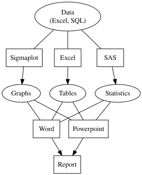
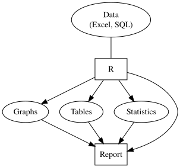
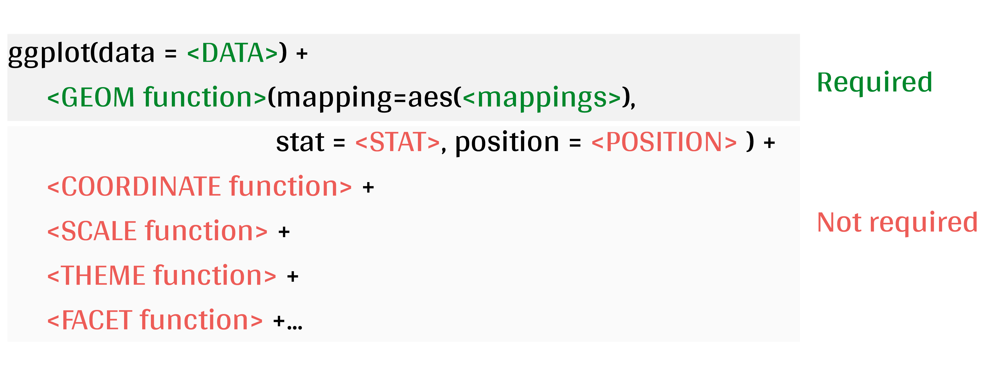
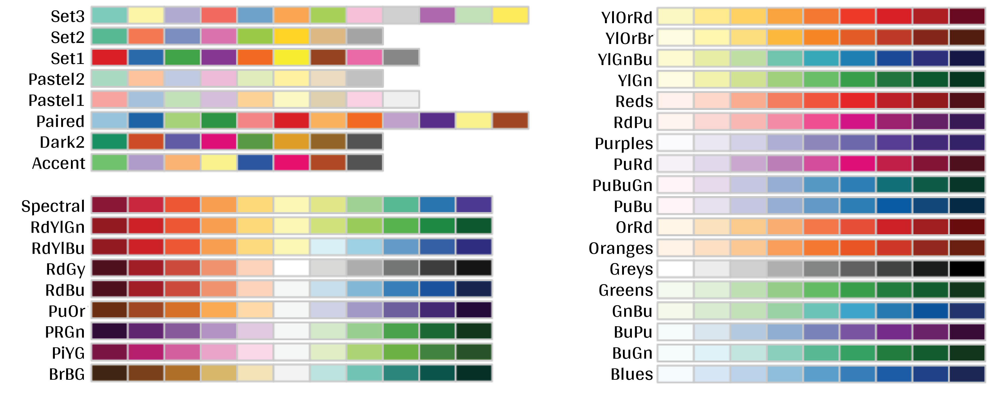

class: inverse, center, middle

```{r setup, echo = FALSE}
knitr::opts_chunk$set(
  comment = "#",
  collapse = TRUE,
  warning = FALSE,
  message = FALSE,
  cache = TRUE,
  fig.width = 6, 
  fig.height = 6,
  fig.retina = 3,
  fig.align = 'center'
)
options(repos = structure(c(CRAN = "http://cran.r-project.org")))
```

```{r install_pkgs, message=FALSE, warning=FALSE, include=FALSE, results=0}
# Standard procedure to check and install packages and their dependencies, if needed.

# Install xaringanExtra and countdown

if(nzchar(system.file(package = "xaringanExtra")) == FALSE) {
  remotes::install_github("gadenbuie/xaringanExtra", 
                          upgrade = "always", 
                          quiet = TRUE)
  }

if(nzchar(system.file(package = "countdown")) == FALSE) {
  remotes::install_github("gadenbuie/countdown", 
                          upgrade = "always", 
                          quiet = TRUE)
  }

if(nzchar(system.file(package = "gganimate")) == FALSE) {
  remotes::install_github("thomasp85/gganimate", 
                          upgrade = "always", 
                          quiet = TRUE)
  }

if(nzchar(system.file(package = "gifski")) == FALSE) {
  remotes::install_github("r-rust/gifski", 
                          upgrade = "always", 
                          quiet = TRUE)
  }

# Install other packages

list.of.packages <- c('gridExtra', 
                      'ggplot2', 
                      'ggsignif',
                      'ggdendro', 
                      'maps',
                      'mapproj',
                      'RColorBrewer',
                      'GGally',
                      'patchwork',
                      'plotly',
                      'palmerpenguins',
                      'sf',
                      'mdsr',
                      'tidyverse',
                      'ggspatial',
                      "DiagrammeR",
                      "DiagrammeRsvg",
                      "rsvg",
                      "sjPlot",
                      "countdown",
                      "xaringanExtra",
                      "colorBlindness",
                      "gganimate",
                      "gapminder")

new.packages <- list.of.packages[!(list.of.packages %in% installed.packages()[,"Package"])]

if(length(new.packages) > 0) {
  install.packages(new.packages, dependencies = TRUE)
  print(paste0("The following package was installed:", new.packages))
} else if(length(new.packages) == 0) {
    print("All packages were already installed previously")
}

# load all packages
invisible(lapply(list.of.packages, library, character.only = TRUE))
```

```{r, echo = FALSE}
# set theme so the axis labels are bigger
theme_set(theme_classic())
```

# About this workshop
[](https://github.com/QCBSRworkshops/workshop03)
[](https://r.qcbs.ca.github.io/workshop03/workshop03-en/workshop03-en.html)
[](https://r.qcbs.ca/workshop03/workshop03-en/workshop03-en.pdf)
[](https://r.qcbs.ca//workshop03/book-en/workshop03-script-en.R)


---

<p style="font-size:75%">

.center[
**Contributors to the development of this workshop**

by modifying and improving its content as part of the <br> *Le*arning *a*nd *D*evelopment *A*ward
]


.pull-left[
.right[

 **2022** - **2021** - **2020**

[Pedro Henrique P. Braga]()

[Katherine Hébert]()

[Linley Sherin]()

[Jake Lawlor]()

[Marie-Hélène Brice]()

[Kevin Cazelles]()
]
]

.pull-right[
.left[
**2019** - **2018** - **2017**

[Willian Vieira]()

[Rémi Maglione]()

[Alexis Carteron]()

[Pedro Henrique P. Braga]()

[Katherine Hébert]()

<br>

**2016** - **2015** - **2014**

[Xavier Giroux-Bougard]()

[Maxwell Farrell]()

[Amanda Winegardner]()

[Étienne Low-Decarie]()

[Monica Granados]()


]
]
</p>

---

# Required material

To follow this workshop, you are required to have downloaded and installed the earliest [RStudio](https://rstudio.com/products/rstudio/download/#download) and [R](https://cran.rstudio.com/) versions.

.pull-left3[
You must also use these packages:

* [gridExtra](https://cran.r-project.org/package=gridExtra)
* [ggplot2](https://cran.r-project.org/package=ggplot2)
* [ggsignif](https://cran.r-project.org/package=ggsignif)
* [ggdendro](https://cran.r-project.org/package=ggdendro)
* [maps](https://cran.r-project.org/package=maps)
* [mapproj](https://cran.r-project.org/package=mapproj)
* [RColorBrewer](https://cran.r-project.org/package=RColorBrewer)
* [GGally](https://cran.r-project.org/package=GGally)
* [patchwork](https://cran.r-project.org/package=patchwork)
* [palmerpenguins](https://cran.r-project.org/package=palmerpenguins)
* [plotly](https://cran.r-project.org/package=plotly)
* [colorBlindness](https://cran.r-project.org/package=colorBlindness)

All workshop materials are found at [r.qcbs.ca/workshops/r-workshop-03/](https://r.qcbs.ca/workshops/r-workshop-03/).
]

.pull-right3[

To install them from CRAN, run:

```{r, echo = TRUE, eval = FALSE}
install.packages(
  c('grid', 
    'gridExtra', 
    'ggplot2', 
    'ggsignif', 
    'ggdendro', 
    'maps', 
    'mapproj',
    'RColorBrewer', 
    'GGally', 
    'patchwork', 
    'plotly',
    'palmerpenguins',
    'colorBlindness'
    )
)
```

]

---

### Learning objectives

**1.** Learn the basics of data visualisation using `R`;

**2.** Learn and identify the basic dynamics on building figures following the layered *grammar of graphics* approach; 

**3.** Use `R` and the `ggplot2` package to create and modify figures;

**4.** Critically think and discuss about data representation and visualisation.

--

<br>

.pull-left[
**Recommendations**

1. Create and manage your own new script;
2. Refrain from always referring to the pre-built code; *i.e. get your hands dirty!*
3. Avoid copy-pasting or running the code directly from the script;
4. Interact with the presenters!
]

--

.pull-left[
**Disclaimer**

While we will discuss about principles on data visualisation throughout this workshop, our main objective is to show you how to produce figures with `ggplot2`. 

We are time-constrained, but we recommend you to interrupt us to discuss about these princples as well as to consult other resources. 

]

---
class: inverse, center, middle

# Introduction

---

class: middle

## Outline

###### 1. Tiny discussion on data visualisation;

###### 2. `ggplot2` mechanics;

###### 3. Aesthetic mapping;

###### 4. Fine-tuning;

###### 5. Saving plots;

###### 6. Extra resources and tips.

---
class: inverse, center, middle

# Data visualization

---

class: middle

## What is data visualization?

**_Data visualization_ is the presentation of data in a pictorial or graphical format**, and a _data visualization tool_ is the software that generates this presentation.

<br>

**_Effective data visualization_** provides users with intuitive means to: 
- **interactively explore and analyze data**, enabling them to 
- effectively **identify interesting patterns**, 
- **infer correlations and causalities**, and 
- **supports sense-making activities**.

<br>
.xsmall[Bikakis, Nikos. "Big data visualization tools." arXiv preprint arXiv:1801.08336 ([2018](http://arxiv.org/abs/1801.08336)).]

---

class: middle

##### A short, historical example: have you ever heard of John Snow?

.pull-left3[
In the 1850s, it was believed that cholera was transmitted and spread by a ‘bad air’ or ‘bad smells’ from rotting organic matter, and the sudden and serious outbreak of cholera in London's Soho was a mystery.

So, the physician John Snow decided to interview residents and **map the deaths from cholera**.

It became apparent that there was a link between cholera and the contaminated drinking water: most deaths were from people whose nearest access to water was the Broad Street pump, which was later found to be drawing fecal bacteria from a nearby cesspit.

]

.pull-right3[


]

---


##### A short, historical example: have you ever heard of John Snow?

```{r xaringan-panelset, echo=FALSE}
xaringanExtra::use_panelset()
```

.xsmall[

While John Snow had to hand draw his map, we have the advantage of possessing computational resources to quickly represent (_his_) data!

]

.pull-left3[

.panelset[

.panel[.panel-name[Figure]
.xsmall[

```{r echo=FALSE, message = FALSE, warning = FALSE}
library(tidyverse)
library(mdsr)
library(sf)
library(ggspatial)

dsn <- fs::path("data", 
                "SnowGIS_SHP")

CholeraDeaths <- st_read(dsn, 
                         layer = "Cholera_Deaths",
                         quiet = TRUE)

cholera_latlong <- CholeraDeaths %>%
  st_set_crs(27700) %>%
  st_transform(4326)

pumps <- st_read(dsn, 
                 layer = "Pumps",
                 quiet = TRUE)

pumps_latlong <- pumps %>% 
  st_set_crs(27700) %>%
  st_transform(4326)

ggplot(cholera_latlong) + 
  annotation_map_tile(type = "osm", 
                      zoomin = 0) + 
  geom_sf(aes(size = Count,
              alpha = 0.7)) +
  geom_sf(data = pumps_latlong, 
          size = 3,
          color = "red")

```

.xsmall[Recreation of John Snow’s original map of the 1854 cholera outbreak.]

]
]

.panel[.panel-name[R Code]
.xsmall[ 
```{r panel-chunk, echo = TRUE, eval = FALSE, fig.show='hide', message=FALSE, warning=FALSE}
library(tidyverse); library(mdsr)
library(sf); library(ggspatial)

dsn <- fs::path("data", 
                "SnowGIS_SHP")

ggplot(st_read(dsn, 
               layer = "Cholera_Deaths") %>%
         st_set_crs(27700) %>%
         st_transform(4326)) + 
  annotation_map_tile(type = "osm", 
                      zoomin = 0) + 
  geom_sf(aes(size = Count,
              alpha = 0.7)) +
  geom_sf(data = st_read(dsn, 
                         layer = "Pumps") %>% 
            st_set_crs(27700) %>%
            st_transform(4326), 
          size = 3, colour = "red")

```


Source: [Modern Data Science with R](https://mdsr-book.github.io/mdsr2e/ch-spatial.html)

]

]

]

]

.pull-right3[


]

???

The size of each black dot is proportional to the number of people who died from cholera at that location. The red dots indicate the location of public water pumps.

---
class: middle, center

#### Everyone has done a figure like this before !

<br>

.center[]
<br>
**What issues exist with it, and what can be improved?** 

<br>

_Time to discuss!_ <br>
_(If there are no volunteers, a random name will be chosen!)_

???

The 3D graphical representation does not add any information, it distorts the proportions of each category, so that the categories in the foreground appear more important than those in the second plan.

Text labels aren't clear enough to be useful: they're small, intrude on the chart, and include a percentage that should be communicated by the chart itself.

Pie charts are not recommended anymore because they rely on angles to represent the difference between parts, but the human eye is not very good at reading / interpreting angles. We are much better at reading area differences! You can find a good demonstration of the pie chart problem at: https://www.data-to-viz.com/caveat/pie.html.

---
class: middle

##### The effectiveness of data visualisation depends on several factors

- What would you like to communicate?
- Who is your audience? 
  - _Researchers? Journalists? General public? Grant reviewers?_
- What is the best way to represent your data and your message?
  - _Is it through a box plot?_ 
  - _Should you use blue or red?_
  - _What scale should you use?_
  - _Should you add or should you remove information?_
<br>

---
# Why use `R` to represent figures?

.pull-left[

.center[An example of a workflow to analyze data _without_ `R`.]

<br>

```{r workflow-without-R-flow, echo = FALSE, out.width = '90%'}
grViz("
      digraph {

      node [shape = oval, fillcolor = PaleTurquoise]
      'Data \n (Excel, SQL)'; 
      Graphs; 
      Tables; 
      Statistics

      node [shape = box]
      Sigmaplot; Excel; SAS

      ##add arrows
      edge [arrowhead = none]
      'Data \n (Excel, SQL)' -> Sigmaplot; 
      'Data \n (Excel, SQL)' -> Excel; 
      'Data \n (Excel, SQL)' -> SAS; 
      Graphs -> Word; Tables -> Word; 
      Statistics -> Word;  
      Graphs -> Powerpoint; 
      Tables -> Powerpoint; 
      Statistics -> Powerpoint

      edge [arrowhead = normal]
      Sigmaplot -> Graphs; 
      Excel -> Tables; 
      SAS -> Statistics; 
      Word -> Report; 
      Powerpoint -> Report

      }
    ") %>%
  export_svg() %>%
  charToRaw() %>%
  rsvg_svg("images/workflow-without-R-flow.svg")


```
]

--

.pull-right[

.center[`R` allows you to converge many tasks without using other programs.]

<br>

```{r workflow-with-R-flow, echo = FALSE, out.width = '90%'}
grViz("
      digraph {

      node [shape = oval, fillcolor = Red]
      'Data \n (Excel, SQL)'; 
      Graphs;
      Tables; 
      Statistics

      node [shape = box]
      R

      ##add arrows
      edge [arrowhead = none]
      'Data \n (Excel, SQL)' -> R;

      edge [arrowhead = normal]
      R -> Graphs; 
      R -> Tables; 
      R -> Statistics; 
      Graphs -> Report; 
      Tables -> Report; 
      Statistics -> Report;
      R -> Report

      }") %>%
  export_svg() %>%
  charToRaw() %>%
  rsvg_svg("images/workflow-with-R-flow.svg")



```

]

---
### Many `R` packages can help us create figures

[Multiple packages and functions](https://insileco.github.io/wiki/rgraphpkgs/) can be used for great visualization (*e.g.*, [`base R`](https://bookdown.org/rdpeng/exdata/the-base-plotting-system-1.html), [`plotly`](https://plot.ly/r/), [`sjPlot`](http://www.strengejacke.de/sjPlot/), [`mapview`](https://r-spatial.github.io/mapview/), [`igraph`](https://igraph.org/r/)).

.pull-left3[
```{r echo=FALSE, out.width = "40%", fig.cap = "Using base::plot()"}
plot(DNase$conc, DNase$density,
  ylab = attr(DNase, "labels")$y,
  xlab = paste(attr(DNase, "labels")$x, attr(DNase, "units")$x),
  pch = 3,
  col = "blue")
```

```{r echo=FALSE,  out.width = "40%", fig.cap = "Using sjPlot::plot_model()"}
library(sjPlot)
library(sjmisc)
library(ggplot2)
data(efc)
theme_set(theme_sjplot())

# make categorical
efc$c161sex <- to_factor(efc$c161sex)

# fit model with interaction
fit <- lm(neg_c_7 ~ c12hour + barthtot * c161sex, data = efc)

plot_model(fit, 
           type = "pred", 
           terms = c("barthtot", "c161sex"))
```
]

.pull-right3[

<br>

```{r echo=FALSE, fig.cap = "Figures generated using ggplot2::ggplot()"}
# libraries
library(ggplot2)
library(gridExtra)
 
# Make 3 simple graphics:
g1 <- ggplot(mtcars, aes(x=qsec)) + geom_density(fill="slateblue")
g2 <- ggplot(mtcars, aes(x=drat, y=qsec, color=cyl)) + geom_point(size=5) + theme(legend.position="none")
g3 <- ggplot(mtcars, aes(x=factor(cyl), y=qsec, fill=cyl)) + geom_boxplot() + theme(legend.position="none")
g4 <- ggplot(mtcars , aes(x=factor(cyl), fill=factor(cyl))) +  geom_bar()
 
# Plots
grid.arrange(g2, arrangeGrob(g3, g4, ncol=2), nrow = 2)

```

]

---
### Many `R` packages can help us create figures, but...

.pull-left[
We will focus on [`ggplot2`](https://ggplot2.tidyverse.org/) because:

1. It allows one to easily make *beautiful* and customizable plots;
2. It implements a standardized, layered system for building plots (*i.e.* the Grammar of Graphics, which we will discuss in a bit!);
3. [Many extensions](https://exts.ggplot2.tidyverse.org/gallery/) have been developed and are easily accessible (*e.g.* `gganimate`).

<br>

.center[]

]

.pull-right[
```{r echo=FALSE, fig.height = 2}
# libraries
library(ggplot2)
library(gridExtra)
 
# Make 3 simple graphics:
g1 <- ggplot(mtcars, aes(x=qsec)) + geom_density(fill="slateblue")
g2 <- ggplot(mtcars, aes(x=drat, y=qsec, colour=cyl)) + geom_point(size=5) + theme(legend.position="none")
g3 <- ggplot(mtcars, aes(x=factor(cyl), y=qsec, fill=cyl)) + geom_boxplot() + theme(legend.position="none")
g4 <- ggplot(mtcars , aes(x=factor(cyl), fill=factor(cyl))) +  geom_bar()
 
# Plots
grid.arrange(g2, nrow = 1)
```

```{r echo=FALSE, fig.cap = "Figures generated using ggplot2::ggplot()"}
library(gapminder)

ggplot(gapminder, aes(gdpPercap, lifeExp, size = pop, colour = country)) +
  geom_point(alpha = 0.7, show.legend = FALSE) +
  scale_colour_manual(values = country_colors) +
  scale_size(range = c(2, 12)) +
  scale_x_log10() +
  facet_wrap(~continent) +
  # Here comes the gganimate specific bits
  labs(title = 'Year: {frame_time}', x = 'GDP per capita', y = 'life expectancy') +
  transition_time(year) +
  ease_aes('linear')
```


]

---
class: inverse, center, middle

# `ggplot2` mechanics: the basics

---
class: middle, darkerinverse

## `ggplot2` and the grammar of graphics

.pull-left[

`ggplot2` was created by [Hadley Wickham](http://hadley.nz/), and published as _A Layered Grammar of Graphics_ ([2005](https://byrneslab.net/classes/biol607/readings/wickham_layered-grammar.pdf)). The inspiration comes from the _The Grammar of Graphics_ book ([1999](https://www.google.ca/books/edition/The_Grammar_of_Graphics/NRyGnjeNKJIC?hl=en&gbpv=1&printsec=frontcover)), from Leland Wilkinson.

It proposes **a layered approach to build visualizations** or graphics in a structured manner.
]

.pull-right[


]

---
class: middle, darkerinverse

## `ggplot2` and the grammar of graphics

.pull-left[

**Data**
  - Provides the essential ingredients for the figure;
  - Usually, one row for every observation that you want to plot.

Tip: Use `tidyverse` techniques to prepare data.

]

.pull-right[


]

---
class: middle, darkerinverse

## `ggplot2` and the grammar of graphics

.pull-left2[

**Aesthetics** (`aes()`) make data visible:
  - `x`, `y`: variables
  - `colour`: colours the lines of geometries
  - `fill`: fill geometries
  - `group`: groups based on the data
  - `shape`: defines the shape (point, triangles)
  - `linetype`: defines the type of line (solid, dashed)
  - `size`: define sizes of elements
  - `alpha`: changes the transparency
]

.pull-right2[

.vertical-center[

.center[


]
]
]

???

The presenter does not need to spend time to make participants memorize the commands. They are here just to illustrate some of the possibiltiies.


---
class: middle, darkerinverse

## `ggplot2` and the grammar of graphics

.pull-left2[

**Geometries** (`geom_*()`)
 - `geom_point()`: scatter-plot
 - `geom_line()`: lines connecting points
 - `geom_path()`: lines connecting points in sequence of appearance
 - `geom_boxplot()`: box plot for categorical variables
 - `geom_bar()`: bar charts for categorical `x` axis
 - `geom_histogram()`: histogram for continuous `x` axis
 - `geom_violin()`: distribution kernel of data dispersion
 - `geom_smooth()`: function line based on data
]

.pull-right2[
.vertical-center[

.center[


]
]
]

???

The presenter does not need to spend time to make participants memorize the commands. They are here just to illustrate some of the possibiltiies.

---
class: middle, darkerinverse

## `ggplot2` and the grammar of graphics

.pull-left2[

**Facets** divides figures across panels:
 - `facet_wrap()` strings together plots in different frames (facets) based in a single variable;
 - `facet_grid()` does the same as above, but can take different variables.
 
]

.pull-right2[
.vertical-center[

.center[


]
]
]

---
class: middle, darkerinverse

## `ggplot2` and the grammar of graphics

.pull-left2[

**Statistics** (`stat_*()`) computed on the data.
 - `stat_*()`-like functions perform computations such as means, counts, linear models, and other statistical summaries of data.
 
]

.pull-right2[
.vertical-center[

.center[


]
]
]

---
class: middle, darkerinverse

## `ggplot2` and the grammar of graphics

.pull-left2[

**Coordinates** (`coord_*()`) establish representation rules to print the data
 - `coord_cartesian()` for the Cartesian plane;
 - `coord_polar()` for circular plots;
 - `coord_map()` for different map projections.
 
]

.pull-right2[
.vertical-center[

.center[


]
]
]

---
class: middle, darkerinverse

## `ggplot2` and the grammar of graphics

.pull-left2[

Themes (`theme_*()`) allows for the fine-tuning of visuals
  - Fonts; 
  - Background colour;
  - Line width;
  - Axis label sizes and colours;
  - Tick label sizes and colours;
  - and, many, many other properties.
]

.pull-right2[
.vertical-center[

.center[


]
]
]

---

## How to assemble layers in `ggplot2`?

1. Create a simple plot object:
  * `plot.object <- ggplot()`

2. Add geometric layers:
  * `plot.object <- plot.object + geom_*()`

3. Add appearance layers:
  * `plot.object <- plot.object + coord_*() + theme()`

4. Repeat steps 2 and 3 until satisfied, then print:
  * `plot.object` or `print(plot.object)`

.center[

]

---
## Today's dataset: `palmerpenguins`

.pull-right2[

]

.pull-left2[
We will use the `palmerpenguins` data set:

```{r, eval=FALSE}
install.packages("palmerpenguins")
library(palmerpenguins)
```

.small[This data set contains size measurements for three penguin species observed on three islands in the Palmer Archipelago, Antarctica:]
]


.center[.xsmall[Artwork by [@allison_horst](https://twitter.com/allison_horst).]]


???

These data were collected from 2007 - 2009 by Dr. Kristen Gorman with the Palmer Station Long Term Ecological Research Program, part of the US Long Term Ecological Research Network.

This dataset is often used to replace the iris dataset, which has some problems for teaching data science, including its ties to eugenics (more on this at https://armchairecology.blog/iris-dataset/).

This dataset was also used for a TidyTuesday challenge, showing the many possibilities of visualising the dataset creatively. For example: [this](https://twitter.com/LauraNavarroSol/status/1289216490307063814?ref_src=twsrc%5Etfw%7Ctwcamp%5Etweetembed%7Ctwterm%5E1289216490307063814%7Ctwgr%5E%7Ctwcon%5Es1_c10&ref_url=https%3A%2F%2Fnsgrantham.shinyapps.io%2Ftidytuesdayrocks%2F), and [this](https://twitter.com/CedScherer/status/1288181995714093057?ref_src=twsrc%5Etfw%7Ctwcamp%5Etweetembed%7Ctwterm%5E1288181995714093057%7Ctwgr%5E%7Ctwcon%5Es1_c10&ref_url=https%3A%2F%2Fnsgrantham.shinyapps.io%2Ftidytuesdayrocks%2F).

---
## Today's dataset: `palmerpenguins`

Let us take a look at the variables in the penguins dataset:

```{r}
str(penguins)
```

.center[

]

???

Note that species, island, and sex are factor variables, which will be important for grouping the data with colour, shapes, etc. in ggplot2. There are then 2 numeric variables (bill measurements depicted in the image), and two integer variables (flipper length and body mass). The data also has a small temporal component, spanning from 2007 to 2009.

---
# Prepare data for `ggplot2`

`ggplot2` requires you to prepare the data as an object of class `data.frame` or `tibble` (common in the `tidyverse`).

```{r eval = TRUE, echo = TRUE}
library(tibble)
class(penguins) # all set!

peng <- as_tibble(penguins) # acceptable
class(peng)
```
<br>

**&#x267B; Recall from the [*Loading and manipulating data*](https://qcbsrworkshops.github.io/workshop02/pres-en/workshop02-pres-en.html#1) workshop**:


More complex plots in `ggplot2` require the long data frame format.

---
# Scientific questions about penguins

.center[

]

.center[**Scientific questions**]
<br>
- Is there a relationship between the **length** & the **depth** of bills?
- Does the size of the **bill & flipper** vary together ?
- How are these measures distributed among the **3 penguin species** ?

<br>

.center[.alert[How can we graphically address these questions with `ggplot`?]]

---
# Exploring data structure: `GGally::ggpairs()`

<!-- Explain the databases before the examples  -->

```{r, fig.width = 10.25, fig.height = 6.5}
GGally::ggpairs(penguins, aes(colour = species)) + theme_bw()
```

???
ggpairs is in the GGally package (loaded and installed in the beginning of the workshop)
note: _ggpairs (ggplot version of psych package) allows us to explore correlations in data_

We can already see some species groupings between bill length and bill depth, flipper length, and body mass. When plotting, it will be important to keep in mind that differentiating species might be important.

---
# `ggplot()` layers: data

```{r, fig.height = 5, fig.width = 6, echo = TRUE, eval = FALSE}
ggplot(data = penguins)
#
#
#
#
```

```{r echo=FALSE, fig.height=5, fig.width=6}
ggplot(data = penguins)
```

---
# `ggplot()` layers: aesthetics

```{r, fig.height = 5, fig.width = 6, echo = TRUE, eval = FALSE}
ggplot(data = penguins,
       aes(x = bill_length_mm, y = bill_depth_mm))
#
#
#
```

```{r echo=FALSE, fig.height=5, fig.width=6}
ggplot(data = penguins,
       aes(x = bill_length_mm, y = bill_depth_mm))
```

---
# `ggplot()` layers: geometries

```{r, fig.height = 5, fig.width = 6, echo = TRUE, eval = FALSE}
ggplot(data = penguins,
       aes(x = bill_length_mm, y = bill_depth_mm)) +
  geom_point()
#
#
```

```{r echo=FALSE, fig.height=5, fig.width=6}
ggplot(data = penguins,
       aes(x = bill_length_mm, y = bill_depth_mm)) +
  geom_point()
```

???

Note that ggplot2 code is easier to read if each line represents a new element. This style is generally favored for ggplot2 code in the R community.

---
# `ggplot()` layers: facets and coordinates 

```{r, fig.height=5, fig.width=6}
ggplot(data = penguins,
       aes(x = bill_length_mm, y = bill_depth_mm)) +
  geom_point() +
  facet_wrap(~species) +
  coord_trans(x = "log10", y = "log10")
```

---
# Putting everything together, in a single code

Let us explore how some of this data is structured by species:

```{r, echo = TRUE, fig.height=7, fig.width=9, eval = FALSE}
ggplot(data = penguins,               # Data
       aes(x = bill_length_mm,        # Your X-value
           y = bill_depth_mm,         # Your Y-value
           col = species)
       ) +                            # Aesthetics
  geom_point(size = 5, alpha = 0.8) + # Point
  geom_smooth(method = "lm") +        # Linear regression
  labs(title = "Relationship between bill length and depth\nfor different penguin species", # Title
       x = "Bill length (mm)",
       y = "Bill depth (mm)",
       col = "Species") +
  theme_classic() + # apply a clean theme
  theme(title = element_text(size = 18, face = "bold"),
      text = element_text(size = 16))
```

.small[&#x267B; See [*Loading and manipulating data workshop*](https://r.qcbs.ca/workshops/r-workshop-02/) to learn how to clean your dataset.]

???

Take the time to explain each line of this plot code (especially the aesthetics and the geoms), and what it tells us.
For example, by differentiating species, we can see that there is a pretty consistent relationship between bill length and depth across species (similar slopes), but that the ranges of these variables is different (the groupings are clearly shown by the colours). Adelie penguins tend to have smaller bill length but fairly large bill depth, while the inverse is true for Gentoo penguins.

---
# Putting everything together, in a single plot

```{r, echo = FALSE, fig.height=7, fig.width=9}
ggplot(data = penguins,               # Data
       aes(x = bill_length_mm,        # Your X-value
           y = bill_depth_mm,         # Your Y-value
           col = species)) +          # Aesthetics
  geom_point(size = 5, alpha = 0.8) + # Point
  geom_smooth(method = "lm") +        # Linear regression
  labs(title = "Relationship between bill length and depth\nfor different penguin species", # Title
       x = "Bill length (mm)",
       y = "Bill depth (mm)",
       col = "Species") +
  theme_classic() + # apply a clean theme
  theme(title = element_text(size = 18, face = "bold"),
      text = element_text(size = 16))
```

.small[&#x267B; See [*Loading and manipulating data workshop*](https://r.qcbs.ca/workshops/r-workshop-02/) to learn how to clean your dataset.]

---
exclude: true
# Inheritance in `ggplot2`

.small[

.pull-left[
**Inheritance from ggplot**
```{r, fig.height = 5}
p <- ggplot(data = penguins,
            aes(x = bill_length_mm,
                y = bill_depth_mm))
p <- p + geom_point()
p
```
]

.pull-right[
**No inheritance from ggplot**
```{r, fig.height = 5}
s <- ggplot()
s <- s + geom_point(data = penguins,
                    aes(x = bill_length_mm,
                        y = bill_depth_mm))
s # Print your final plot
```
]

]

???

note: _removed this slide because it felt random, but is maybe worth going over at some point - edit. moved to challenge 1 answer_


---
# Challenge 1 (5-min) 

**Code and print your first `ggplot()` object!**

**Your mission**: visually represent and answer whether:

1. There is an apparent relationship between **bill length** and **flipper length**?

2. **Bill length** *increases* with **flipper length** ?

<br>

.center[Parameters to consider when addressing this question:]

 data | geom_*() | x-value | y-value
:-------------:|:-------------:|:-------------:|:-------------:
`penguins`|`geom_point()`|`bill_length_mm`|`flipper_length_mm`


```{r echo=FALSE}
library(countdown)

countdown(minutes = 5, seconds = 0, bottom = 0)
```

---
# Challenge 1: Solution 

```{r}
ggplot(data = penguins,
       aes(x = bill_length_mm,
           y = flipper_length_mm)) +
  geom_point()
```


---
# Challenge 1: Solution 

.pull-left2[
```{r}
ggplot(data = penguins,
       aes(x = bill_length_mm,
           y = flipper_length_mm)) +
  geom_point()
```
]

.pull-right2[
**Note**: aesthetics can either be in the `ggplot()` line, and will be inherited by every `geom_*()`, or in the `geom_*()` line to apply to that `geom_*()` only!
]

---
# Challenge 1: Solution 

.pull-left2[
```{r}
ggplot(data = penguins,
       aes(x = bill_length_mm,
           y = flipper_length_mm)) +
  geom_point(shape = 2, colour = "blue")
```
]

.pull-right2[
**Note**: aesthetics can either be in the `ggplot()` line, and will be inherited by every `geom_*()`, or in the `geom_*()` line to apply to that `geom_*()` only!

<br>
<br>

**Note 2**: `colour`, `alpha`, `shape`, and `size` commands can be set outside of `aes()` values, and will be static, not data-dependent.
]
---

class: inverse, center, middle

# Aesthetic mapping

## `colour`, `shape`, `size`, `labels` and `alpha`

---
# Aesthetic

**Use aesthetics (`aes()`) to distinguish classes, groups and structure**


---
# Colours: make your points talk

Change **colour** to

&nbsp;  differentiate between groups

&nbsp;  represent data values

&nbsp;  highlight specific elements

```{r, echo = FALSE}
theme_set(theme_classic())
```


.pull-left[
```{r, echo = FALSE, fig.height=4.8, fig.width = 5}
ggplot(penguins,
       aes(x = bill_length_mm,
           y = bill_depth_mm)) +
  geom_point(aes(colour = species)) +
  labs(title = "Qualitative colour for groups",
       x = "Bill length (mm)",
       y = "Bill depth (mm)") +
  theme(title = element_text(size = 16, face = "bold"),
        legend.title = element_text(size = 14),
        legend.position = 'bottom')
```
]

.pull-right[
```{r, echo = FALSE, fig.height=4.8, fig.width = 5}
ggplot(penguins,
       aes(x = bill_length_mm,
           y = bill_depth_mm)) +
  geom_point(aes(colour = log10(body_mass_g))) +
  labs(title = "Gradient colour for values",
       x = "Bill length (mm)",
       y = "Bill depth (mm)",
       col = "Body mass (log10 g)") +
  theme(title = element_text(size = 16, face = "bold"),
        legend.title = element_text(size = 14),
        legend.position = 'bottom')
```
]

.footnote[See [Fundamentals of Data Visualization](https://serialmentor.com/dataviz/colour-basics.html)]

---
# Using `aes()` use to change colour

Does bill length and flipper length vary differently across species?

.pull-left[
```{r, fig.align = 'default', fig.asp=2/3}
# No colour mapping
ggplot(data = penguins,
       aes(x = bill_length_mm,
           y = flipper_length_mm)) +
  geom_point() +
  geom_smooth(method = lm)+
  labs(title = "No colour mapping")
```
]

.pull-right[
```{r,  fig.align = 'default', fig.asp=2/3}
# With colour mapping
ggplot(data = penguins,
       aes(x = bill_length_mm,
           y = flipper_length_mm,
           col = species)) +
  geom_point() +
  geom_smooth(method=lm) +
  labs(title = "With colour mapping")
```
]

---
# Change colour manually
.pull-left[
```{r, fig.align = 'default', fig.asp=2/3}
# Default
pp <- ggplot(data = penguins) +
  geom_point(aes(x = bill_length_mm,
                 y = bill_depth_mm,
                 colour = species))
pp + labs(title = "Default")
```
]
.pull-right[
```{r, fig.align = 'default', fig.asp=2/3}
# Manual
pp +
scale_colour_manual(
  values = c("grey55", "orange",
             "skyblue")) +
  labs(title = "Manual")
```
]

???
scale_colour_manual() and scale_fill_manual() allow you to choose your own colour values, but it's important to still make sure these colours are a good choice (clarity, colorblind-friendly, etc.). More on this in a few slides!

---
# Colour gradients

.pull-left[
```{r, fig.align = 'default', fig.asp=2/3}
# Default
pp2 <- ggplot(data = penguins) +
  geom_point(aes(x = bill_length_mm,
                 y = bill_depth_mm,
                 colour = body_mass_g))
pp2 + labs(title = "Default")
```
]
.pull-right[
```{r, fig.align = 'default', fig.asp=2/3}
# Manual
pp2 +
  scale_colour_gradient(low = "blue",
                        high = "red") +
  labs(title = "Manual")

```
]

???
There is also scale_colour_gradient2() to create a gradient with a midpoint value, for diverging palettes.

---
# Use a predefined colour palette

```{r, eval = FALSE}
install.packages("RColorBrewer")
require(RColorBrewer)
display.brewer.all()
```




---
# Use a predefined colour palette

```{r, fig.align = 'center', fig.height = 5, fig.width=6.5}
# Palette for groups
pp +
  scale_colour_brewer(palette = "Dark2") +
  labs(title = "Palette for groups")
```

---
# Use a predefined colour palette

```{r, fig.align = 'center', fig.height = 5, fig.width=6.5}
# Palette for continuous values
pp2 +
  scale_colour_viridis_c()+
  labs(title = "Palette for continuous values")
```


---
# Use a predefined colour palette

Grey-scale palette for publication purposes

```{r, fig.align = 'center', fig.height = 5, fig.width=6.5}
# Palette for groups
pp +
  scale_colour_grey() +
  labs(title = "Palette for groups")
```

---
# Use a predefined colour palette

Grey-scale palette for publication purposes

```{r, fig.align = 'center', fig.height = 5, fig.width=6.5}
# Palette for continuous values
pp2 +
  scale_colour_gradient(low = "grey85", high = "black") +
  labs(title = "Palette for continuous values")
```


---
# Use colourblind-friendly palettes

Have you ever considered how your figure might appear under various forms of colourblindness?
We can use the package [colorBlindness](https://cran.r-project.org/web/packages/colorBlindness/index.html) to consider this.

```{R colorBlindness_load, message = FALSE}
library(colorBlindness)
```

---
# Use colourblind-friendly palettes

```{r, fig.width = 11, fig.height = 7}
cvdPlot(pp)
```

???

As you can see, our current colour palette is not accessible! By using [`viridis`](https://cran.r-project.org/web/packages/viridis/vignettes/intro-to-viridis.html) palettes, we can guarantee our plots always communicate the same information no matter who the audience is.

---
# Use colourblind-friendly palettes


.pull-left[
```{r, fig.height = 5}
# Palette for groups
pp +
  scale_colour_viridis_d() +
  labs(title = "Viridis palette for groups")
```
]

.pull-right[
```{r, fig.height = 5}
# Palette for continuous values
pp2 +
  scale_colour_viridis_c() +
  labs(title = "Viridis palette for continuous values")
```
]

???

If you would like to demonstrate the difference, you can run cvdPlot() on these plots during the workshop.


---
# Changing `shape`, `size` and `alpha`

.pull-left[
```{r, fig.height = 5}
# shape for groups
ggplot(data = penguins) +
  geom_point(aes(x = bill_length_mm,
                 y = bill_depth_mm,
                 shape = species)
             ) +
  labs(title = "Shapes for groups")
```
]

.pull-right[
```{r, fig.height = 5}
# size and alpha for continuous values
ggplot(data = penguins) +
  geom_point(aes(x = bill_length_mm,
                 y = bill_depth_mm,
                 size = body_mass_g,
                 alpha = flipper_length_mm)) +
  labs(title = "Size and alpha for continuous values")
```
]

???

Note that setting many variables to visual cues like color, shape, size, and alpha at once tends to be overwhelming for the viewer. Adding 4 levels of complexity on top of the 2-dimensional representation of points can be too much to process properly. It is better to choose the visual cues and key variables for the desired message than to overload a plot with every possibility in the aes() function.
---
# Challenge 2 

- Produce an informative plot from built-in data sets such as `mtcars`, `CO2` or `msleep`.

- Use appropriate aesthetic mappings for different data types


<br>

Data| x | y | Aesthetics
:-------------:|:-------------:|:-------------:|:-------------:
mtcars |*wt* |*mpg* | *disp* and *hp*
CO2 |*conc* |*uptake* | *Treatment* and *Type*
msleep |log10(*bodywt*) |*awake* | *vore* and *conservation*
ToothGrowth | *dose* | *len* | *supp*

<br>
.center[.alert[
 Pay attention to the data types!
]
]

---
# Challenge 2 

#### .alert[Breakout rooms! - 15 min]
<br> make a plot to share with the group


???
note: _assign each group a dataset to make a plot from: mtcars, CO2, msleep, and ToothGrowth to make exploratory plots_
---
# Challenge 2 - Solution example 1

.small[

Data| x | y | Aesthetics
:-------------:|:-------------:|:-------------:|:-------------:
mtcars |*wt* |*mpg* | *disp* and *hp*

]

```{r, fig.height=3.5, fig.width=6}
data(mtcars)
ggplot(data = mtcars) +
  geom_point(mapping = aes(x = wt, y = mpg,
                           colour = disp,
                           alpha = hp))
```

.comment[Could you use `size` instead of `alpha`? What about `shape`?]

---
# Challenge 2 - Solution example 2

.small[

Data| x | y | Aesthetics
:-------------:|:-------------:|:-------------:|:-------------:
CO2 |*conc* |*uptake* | *Treatment* and *Type*

]

```{r, fig.height=3.5, fig.width=6}
data(CO2)
ggplot(data = CO2) +
    geom_point(mapping = aes(x = conc,
                             y = uptake,
                             colour = Treatment,
                             shape = Type))
```

.comment[Why not use `size = Type`?]

---
# Challenge 2 - Solution example 3

.small[

Data| x | y | Aesthetics
:-------------:|:-------------:|:-------------:|:-------------:
msleep |log10(*bodywt*) |*awake* | *vore* and *conservation*

]

```{r, fig.height=3.5, fig.width=6}
data(msleep)
ggplot(data = msleep) +
    geom_point(mapping = aes(x = log10(bodywt),
                             y = awake,
                             colour = vore,
                             shape = conservation))
```

---
# Challenge 2 - Solution example 4

.small[

Data| x | y | Aesthetics
:-------------:|:-------------:|:-------------:|:-------------:
ToothGrowth | *dose* | *len* | *supp*

]

```{r, fig.height=3.5, fig.width=6}
data(ToothGrowth)
ggplot(ToothGrowth, aes(x = dose,
                        y = len,
                        color = supp)) +
  geom_point() +
  geom_smooth(method = lm, formula = 'y~x')
```

---
class: small-code
# Changing the scale of the axes
.tiny[
.pull-left[
x axis in regular scale
```{r,fig.height=4}
ggplot(diamonds) +
  geom_point(aes(x = carat,
                 y = price)) +
  labs(title = "Original scale")
```
]
]
.pull-right[
x-axis and y-axis in log10() scale
```{r,fig.height=4}
ggplot(diamonds) +
  geom_point(aes(x = carat,
                 y = price)) +
  coord_trans(x = "log10",
              y = "log10") +
  labs(title = "log10 scale")
```
]


.small[It is also possible to transform the coordinate system using `scale_x_log10()` and `scale_y_log10()`.]

<!-- explain the difference -->

???
Explain the difference and why the transformation can be useful for visualization. For example, body mass is often transformed with log10.

---
class: inverse, center, middle

# Fine-tuning your plots

# Using `theme()` to make it look good!

---
# `theme()`

**Default: theme_grey()**
```{r, fig.height = 5, fig.align='center'}
# Theme grey
pp + scale_colour_grey() +
  theme_grey() +
  labs(title = "Default: Grey")
```

---
# `theme()`

.pull-left[
**Theme Classic**
```{r, fig.height = 5}
pp + scale_colour_grey() +
  theme_classic() +
  labs(title = "Classic")
```
]

.pull-right[
**Theme Minimal**
```{r, fig.height = 5}
pp + scale_colour_grey() +
  theme_minimal() +
  labs(title = "Minimal")
```
]

.footnote[NB: Good choices for publication purposes!]

???

This presentation has been using theme_classic() for the plots, because the grey background can make certain colours harder to see. These are good options for publishing figures.

---
# `theme()`

Use `theme_set()` to change theme for all your future plots,
or `theme_update()` to edit aspects of a theme setting.


.pull-left[
**Set theme**
```{r, fig.height = 4.5}
# Set black & white theme as default
theme_set(theme_bw())
pp
```
]

.pull-right[
**Update theme**
```{r, fig.height = 4.5}
# remove minor gridlines
theme_update(
  panel.grid.minor = element_blank())
pp
```
]


```{r, include=FALSE}
theme_set(theme_bw())
theme_update(panel.grid.minor = element_blank(),
             axis.text = element_text(size = 16),
             axis.title = element_text(size = 18))
```

---
exclude: true
# ggThemeAssist: RStudio-addin


???

note: _removed this slide to add theme image instead_


---
# `theme()`

Elements of a theme by ([Isabella Benabaye](https://isabella-b.com/blog/ggplot2-theme-elements-reference/)).


---
class: inverse, center, middle

# Fine-tuning your plots

# Using facets to split up your plot

---
Facetting by one variable
```{r, fig.align="center"}
ggplot(data = penguins) +
  geom_point(mapping = aes(x = bill_length_mm,
                           y = bill_depth_mm,
                           colour = species)) +
  facet_grid(~ species, scales = "free")
```

---
# Facetting by two variables

```{r, fig.align="center", fig.width=9, fig.height=5}
ggplot(data = penguins) +
  geom_point(mapping = aes(x = bill_length_mm,
                           y = bill_depth_mm,
                           colour = species)) +
  facet_grid(year ~ species, scales = "free")
```

<!-- relabeling ticks -->

---
exclude: true

# Title and axes components: changing size, colour and face

.center[]

???
This is redundant with the elements of a theme figure from slide 74, and now out of date due to the removal of iris.

---
# Title and axes components: size, colour and face

.pull-left[
**Default**
<br><br>
```{r, echo=FALSE, fig.align="center", fig.width=6, fig.height=7}
pp
```
]

.pull-right[
**Axes and title tuning**
<br><br>
```{r, echo=FALSE, fig.align="center", fig.width=6, fig.height=7,message=FALSE}
pp +
  labs(title = "Relationship between Bill Length & Depth",
       x = "Bill Length (mm)",
       y = "Bill Depth (mm)",
       col = "Species") +
  theme(axis.title.x = element_text(size = 16),
        axis.title.y = element_text(size = 16),
        axis.text.x = element_text(size = 12),
        axis.text.y = element_text(size = 12),
        plot.title = element_text(size = 16, face="bold"),
        legend.title = element_text(size=14, face="bold"),
        legend.text = element_text(size=12))
```

]

---
# Challenge 3 

Use the `tips` dataset found in `reshape2` &#x1F4E6; to reproduce the plot below.

Our tip: Go step by step! When fine-tuning your plot, start from `theme_classic()` and add `theme()` to make your additional changes.

```{r, echo=FALSE, fig.width=10, fig.height=5}
library(reshape2)
tips.gg <- ggplot(tips, aes(x = total_bill,
                            y = tip/total_bill,
                            shape = smoker,
                            colour = sex,
                            size = size)) +
  geom_point() +
  facet_grid( ~ time) +
  scale_colour_grey() +
  labs(title = "Relation between total bill and tips during lunch and dinner",
       x = "Total bill ($)", y = "Ratio between tips and total bill") +
  theme_classic() +
  theme(axis.title = element_text(size = 16,
                                  colour = "navy"),
        axis.text = element_text(size = 12),
        plot.title = element_text(size = 16,
                                  colour = "orange3",
                                  face = "bold"),
        strip.text.x = element_text(size = 14, face="bold"))
tips.gg
```

---
# Challenge 3 

#### .alert[Breakout rooms! - 15 min]

???
note: _give teams time to work together to recreate this plot. Refer to theme elements slide_

---
# Challenge 3: Solution

```{r, eval=FALSE}
library(reshape2)
tips.gg <- ggplot(tips, aes(x = total_bill,
                            y = tip/total_bill,
                            shape = smoker,
                            colour = sex,
                            size = size)) +
  geom_point() +
  facet_grid( ~ time) +
  scale_colour_grey() +
  labs(title = "Relation between total bill and tips during lunch and dinner",
       x = "Total bill ($)", y = "Ratio between tips and total bill") +
  theme_classic() +
  theme(axis.title = element_text(size = 16,
                                  colour = "navy"),
        axis.text = element_text(size = 12),
        plot.title = element_text(size = 16,
                                  colour = "orange3",
                                  face = "bold"),
        strip.text.x = element_text(size = 14, face="bold"))
tips.gg
```

---
# Challenge 3: step-by-step solution

#### `aes()`

```{r, fig.width = 6, fig.height=4}
tips.gg <- ggplot(tips) +
  geom_point(mapping = aes(x = total_bill,
                           y = tip/total_bill,
                           shape = smoker,
                           colour = sex,
                           size = size)) +
  theme_classic()
tips.gg
```

```{r, include=FALSE, eval = FALSE}
theme_set(theme_classic())
```

---
# Challenge 3: step-by-step solution

#### `facet_grid()`

```{r, fig.width=7, fig.height=5}
tips.gg <- tips.gg +
  facet_grid(~ time)
tips.gg
```


---
# Challenge 3: step-by-step solution

#### Grey-scale palette

```{r, fig.width=7,fig.height=5}
tips.gg <- tips.gg +
  scale_colour_grey()
tips.gg
```

---
# Challenge 3: step-by-step solution

#### Adding plot title and labels

```{r, fig.width=7,fig.height=5}
tips.gg <- tips.gg +
  labs(title = "Relation between total bill and tips during lunch and dinner",
       x = "Total bill ($)", y = "Ratio between tips and total bill")
tips.gg
```

---
# Challenge 3: step-by-step solution

#### Adding a theme and fine tuning it

.small[
```{r, fig.width=6, fig.height=4}
tips.gg <- tips.gg +
  theme_classic() +
  theme(axis.title = element_text(size = 16, colour = "navy"),
        axis.text = element_text(size = 12),
        plot.title = element_text(size = 16, colour = "orange3", face = "bold"),
        strip.text.x = element_text(size = 14, face = "bold"))
tips.gg
```
]

---
class: inverse, center, middle

# Fine-tuning your plots

# Using `geom_*()` to create different plots

---
# `ggplot2::geom_*()`

.center[

]

---
exclude: true
# `base::plot()`

.center[

]

???
note: removed this slide. Not sure why it's here.

---
# `ggplot2::ggplot()`

```{r, include=FALSE}
theme_set(theme_bw())
theme_update(panel.grid.minor = element_blank(),
             axis.text = element_text(size = 16),
             axis.title = element_text(size = 18))
```


This is a blank plot, before we add any `geom_*` to represent variables in the dataset.

```{r, fig.align="center",fig.height=5}
ggplot(penguins)
```

---
# Histograms: `geom_histogram()`

A **histogram** is an accurate graphical representation of the distribution of numeric data. There is only one aesthetic required: the `x` variable.

```{r, fig.align="center", fig.height=5}
ggplot(penguins,
       aes(x = bill_length_mm)) +
  geom_histogram() +
  ggtitle("Histogram of penguin bill length ")
```

---
# Scatterplot and linear-fit: `geom_point()` and `geom_smooth()`
.small[
.pull-left[
```{r, fig.height=5}
ggplot(mpg, aes(displ, hwy)) +
  geom_point() +
  labs(title = "Scatterplot")
```
]

.pull-right[
```{r, fig.height=4.5}
ggplot(mpg, aes(displ, hwy)) +
  geom_point() +
  labs(title = "Linear Regression") +
  geom_smooth(method = lm)
```
]
]

???

A scatter plot is a great way to visualize data points for two variables. Two aesthetics are required in `geom_point()`: the `x` and `y` variables.

It can, however, be difficult to discern any potential relationship in a scatter plot. You can use `geom_smooth()` to fit a line through your data with a variety of methods. Here, we will add a linear fit to the scatter plot.

---
# Boxplot: `geom_boxplot()`

```{r, fig.align="center", fig.height=5}
ggplot(data = penguins,
       aes(x = species,
           y = bill_length_mm,
           fill = species)) +
  geom_boxplot() +
  labs(title = "Boxplot")
```

---
# Boxplot: `geom_boxplot()`

```{r, echo=FALSE, fig.align="center", fig.width = 5, fig.height = 3.2}
ggplot(data = penguins,
       aes(x = species,
           y = bill_length_mm,
           fill = species)) +
  geom_boxplot() +
  labs(title = "Boxplot")
```

.center[

]

???

Boxplots are a popular way to plot the distribution of data across some grouping variable, like species. You can specify this grouping variable in  `aes()` using `group =`, or the aesthetics used to represent the data (`fill =`, `col = `, `shape = `) to generate the boxplot.

Though boxplots are very popular to summarise data, someone looking at your plot may not intuitively grasp how this summary works and what it might be hiding. Using boxplots well requires an understanding of their anatomy, as seen below. More on the pitfalls of boxplots [here](https://www.data-to-viz.com/caveat/boxplot.html).

---
# Boxplot with annotations: `geom_boxplot()` and `geom_signif()`

.pull-left3[
```{r, fig.align="center",fig.height=5.5, eval = FALSE}
library(ggsignif)
ggplot(data = penguins,
       aes(x = species,
           y= bill_length_mm,
           fill = species)) +
  geom_boxplot() +
  geom_signif(comparisons =
                list(c("Adelie", "Gentoo")),
              map_signif_level=TRUE)
```
]
.pull-right3[
```{r, fig.align="center",fig.height=5.5, echo = FALSE}
library(ggsignif)
ggplot(data = penguins,
       aes(x = species,
           y= bill_length_mm,
           fill = species)) +
  geom_boxplot() +
  # specify the comparison we are interested in
  geom_signif(comparisons =
                list(c("Adelie", "Gentoo")),
              map_signif_level=TRUE)
```
]

???

To help boxplots speak for themselves, we can add annotations with `geom_signif()`. The function `geom_signif()` calculates the significance of a difference between groups and adds the annotation to the plot in a single line.

---
# Violin plot: `geom_violin()`

As explained on https://www.data-to-viz.com/graph/violin.html

> Violin plot allows to visualize the distribution of a numeric variable for one or several groups. [...] It is really close to a boxplot, but allows a deeper understanding of the distribution.

.pull-left[
```{r, echo=FALSE, fig.height=4.5}
# Data
names <- c(rep("A", 80) , rep("B", 50) , rep("C", 70))
value <- c(sample(2:5, 80 ,replace=TRUE), sample(4:10, 50 , replace=TRUE),
       sample(1:7, 70 , replace=TRUE))
data <- data.frame(names,value)

#Graph
qplot(x=names ,y=value ,data=data ,geom=c("boxplot","jitter") ,fill=names)
```
]
.pull-right[
```{r, echo=FALSE, fig.height=4.5}
ggplot(data = data, aes(names, value, fill=names)) + geom_violin()

```
]

???

Like boxplots, violin plots visualise the distribution of a numeric variable for one or several groups. However, a violin's shape represents the distribution of points that is obscured in a boxplot's summarisation, allowing for a more accurate representation of the data ([Data-to-Viz)](https://www.data-to-viz.com/graph/violin.html)).

Let us compare a boxplot and a violin plot on some generated data. Notice how the violin plot *shows* us the range **and** the variability in our data, while the boxplot cannot communicate these two things as intuitively.

---
# Violin plot: `geom_violin()`

```{r, fig.align="center"}
violin <- ggplot(data = penguins,
                 aes(x = species, y = bill_length_mm)) +
  geom_violin(trim = FALSE, fill = "grey70", alpha = .5) +
  labs(title = "Violin plot")
violin
```

---
# Violin plot: `geom_violin()` + `_boxplot()` + `_jitter()`

```{r, fig.align="center"}
violin +
    geom_jitter(shape = 16, position = position_jitter(0.2),
              alpha = .3)+
  geom_boxplot(width = .05)
```

???
Although we have a good idea of how the data is distributed, we can enhance the plot by visualising some summary statistics and the data points. Let us plot a boxplot and the data points *on top* of our violin plot with `geom_violin()` + `geom_boxplot()` + `geom_jitter()`.

---
# Summarise y values: `stat_summary()`

.pull-left[
```{r, fig.height=5, fig.width=4}
ggplot(mtcars,
       aes(cyl, mpg)) +
  geom_point() +
  stat_summary(fun.y = "median",
               geom = "point",
               colour = "red",
               size = 6) +
  labs(title = "Medians")
```
]

.pull-right[
```{r, fig.height=5, fig.width=4}
ggplot(mtcars,
       aes(cyl, mpg)) +
  geom_point() +
  stat_summary(fun.data = "mean_cl_boot",
               colour = "red",
               size = 1.6) +
  labs(title = "Means and confidence intervals")
```
]

---
# Summarise values

To display more summary statistics, see:

- `geom_errorbar()`
- `geom_pointrange()`
- `geom_linerange()`
- `geom_crossbar()`
- and others!

---
# Representing maps: `geom_map()`

.small[
```{r, eval = FALSE, fig.height = 6, fig.width = 7}
# load maps library
library(maps)
states_map <- map_data("state") # get a state-level map of the US

# State name is set as rownames. Let's make a new column for these
# that matches the column of state names in our states_map
USArrests$region <- tolower(rownames(USArrests))

# Build our map
ggplot(USArrests,
       aes(map_id = region)) + # the variable name to link our map and dataframe
  geom_map(aes(fill = Murder), # variable we want to represent with an aesthetic
           map = states_map) + # data frame that contains coordinates
  expand_limits(x = states_map$long,
                y = states_map$lat) +
  coord_map() +  # projection
  labs(x = "", y = "") # remove axis labels
```
]

???
USArrests: Violent Crime Rates by US State dataset, included in R. This data set contains statistics, in arrests per 100,000 residents for assault, murder, and rape in each of the 50 US states in 1973. Also given is the percent of the population living in urban areas.

The map is on the next slide. Feel free to flip between the slides to explain each element if there is interest in mapping.

---
# Representing maps: `geom_map()`

```{r, echo = FALSE, fig.width = 10}
# load maps library
library(maps)
states_map <- map_data("state") # get a state-level map of the US

# State name is set as rownames. Let's make a new column for these
# that matches the column of state names in our states_map
USArrests$region <- tolower(rownames(USArrests))

# Build our map
ggplot(USArrests,
       aes(map_id = region)) +
  geom_map(aes(fill = Murder),
           map = states_map) +
  expand_limits(x = states_map$long,
                y = states_map$lat) +
  coord_map() +  # projection
  labs(x = "", y = "") # remove axis labels
```

---
## Density plots: `geom_density()`

.small[A density plot shows the distribution of a numerical variable and it takes only set of numeric values as input.]
.pull-left[
```{r, echo=TRUE, fig.width=5, fig.height=4.4}
(peng.dens <- ggplot(penguins,
                     aes(x = bill_length_mm)) +
   geom_density())
```
]

.pull-right[
```{r, echo=TRUE, fig.width=5, fig.height=4.4}
(cars.dens <- ggplot(cars,
                    aes(x = dist)) +
   geom_density())
```
]

???

Wrapping the plot objects in () prints them whenever these lines are run, rather than printing the plot object on another line as we have been doing.

---
# Dendogram: `ggdendrogram()`

Which US states have similar arrest rates?

```{r, fig.height = 4}
library(ggdendro)
USArrests.short <- USArrests[1:10,] # take a small sample for simplicity
hc <- hclust(dist(USArrests.short), "average") # cluster by average distance (UPGMA)

ggdendrogram(hc, rotate = TRUE)
```


---
# Arrange plots: `patchwork`

```{r, fig.width=9, fig.height=5, message=FALSE, warning=FALSE}
library(patchwork)
peng.dens + cars.dens +
  plot_annotation(tag_levels = 'a') # adds a) and b) to your plots, to reference
# in your figure captions.
```

???

We have used facets to split our plot into multiple windows. However, this is restricted to plotting the same variables from the same dataset. The `patchwork` package makes it easy to arrange separate ggplots together in one frame with `+` (arrange plots beside each other), `/` (arrange one plot on top of the other), `()` (group this arrangement of plots)  as though you are writing an equation. You can demo variations of this arrangement live.

---
# Challenge 4

Create your own ggplot and follow these recommendations:
  * Dataset: any (recommended: use your dataset)
  * Explore a new geom_* and other plot elements

Use the following links for tips and inspiration:

- [ggplot2 Reference](https://ggplot2.tidyverse.org/reference/index.html)
- [R Graph Gallery](https://www.r-graph-gallery.com/ggplot2-package.html)
- [Data to Viz](https://www.data-to-viz.com/)

---
# Challenge 4: Solution example #1
.small[
```{r, fig.align='center',fig.height=4}
data(msleep)
ggplot(msleep,
       aes(x = vore,
           y = log10(brainwt),
           fill = vore)) +
  geom_violin() +
  geom_signif(comparisons = list(c("herbi", "insecti"))) +
  labs(main = "Brain weight among different vore",
       y = "log10(Brain weight (Kg))") +
  scale_fill_grey() +
  theme_classic()
```
]

---
# Challenge 4: Solution example #2

.small[
```{r, fig.align='center', fig.height=3.5}
data(mtcars)
# let's do some clustering!
mtcars.short <- mtcars[1:20,]
mtcars.short.hc <- hclust(dist(mtcars.short), "average")

ggdendrogram(mtcars.short.hc, rotate = TRUE) +
  # fine-tuning
  labs(title = "Car dendro from motor spec", y ="Cars") +
  theme(axis.title.y = element_text(size = 16),
        axis.text.y = element_text(size = 12),
        axis.title.x = element_blank(), axis.text.x = element_blank(),
        plot.title = element_text(size = 14, face="bold"))
```
]

---
# Miscellaneous: interactive plots using `plotly()`
.small[

```{r, echo = TRUE, fig.width=10, fig.height=5}
library(plotly)
p <- ggplot(penguins,
           aes(x = bill_length_mm, y = bill_depth_mm,
               colour = species, shape = species)) +
    geom_point(size=6, alpha=0.6)
# convert to a plotly object!
ggplotly(p)
```
]

???
The `plotly()` library contains the function `ggplotly()`, which translates your `ggplot` code into an interactive `plotly` object in one line of code.

You can click on the species in the legend to add/remove species. You can also see values while hovering over points.

---
class: inverse, center, middle

# Saving your plots with ggplot2

---
exclude: true

# Saving plots in RStudio

<div style="text-align:center">

</div>
.small[
.alert[Think about the margin of the document you are using. If you resize the image after saving it, the labels and text will change size as well which could be hard to read.]
]
---
# Saving plots in code

`ggsave()` writes directly to your working directory and allows you to specify the name of the file, the dimensions of the plot, the resolution, etc.

```{r, eval=FALSE}
my1rstPlot <-
  ggplot(penguins,
         aes(x = bill_length_mm,
             y = bill_depth_mm)) +
  geom_point()

ggsave("my1stPlot.pdf",
       my1rstPlot,
       height = 8.5, width = 11, units = "in", res = 300)
```

NB: Vectors (e.g., pdf, svg) format are more flexible than raster format (jpeg,
png, ...) if the image needs modification afterwards.

**Tip:** `quartz()` (mac) or `window()` (pc) functions make sizing easier before `ggsave()`!

???

Tip:`quartz()` (mac) or `window()` (pc) functions make sizing easier before `ggsave()`! Just plot your ggplot in quartz() or window(), adjust the size until it looks good, and run ggsave() with the filename to see which dimensions you used! You can then add this in your code with height = and width = as shown above. You can demo this.


---
# Saving plots in code
<br>

Other methods to save image: see `?pdf` `?jpeg`

```{r, eval=FALSE}
pdf("./graph_du_jour.pdf")
  print(my1rstPlot) # print function is necessary
graphics.off()
```


---
class: inverse, center, middle

# Concluding remarks

---
# Additional resources

- `help(package = ggplot2)`
- [Data Visualization with ggplot2 Cheat Sheet](https://github.com/rstudio/cheatsheets/raw/master/data-visualization.pdf)
- [ggplot2 Reference](http://ggplot2.tidyverse.org/reference/)
- [Fundamentals of Data Visualization](https://serialmentor.com/dataviz/)
- [From Data to Viz](https://www.data-to-viz.com/)
- [A Compendium of Clean Graphs in R](https://www.shinyapps.org/apps/RGraphCompendium/index.php#line-plots) (base R)
- [Graphics Principles](https://graphicsprinciples.github.io/) (design tips)
- [The R Graph gallery](https://www.r-graph-gallery.com)
-  Lecture notes from Hadley's course Stat 405 (the other lessons are
awesome too!)
  -   <http://stat405.had.co.nz/lectures/11-adv-data-manip.pdf>
  -   <http://stat405.had.co.nz/lectures/19-tables.pdf>

???

Show the ggplot2 cheatsheet https://github.com/rstudio/cheatsheets/raw/master/data-visualization.pdf

---
# Additional resources

.center[]

---
# Concluding remarks
<br>

There are other useful packages that can be used with `ggplot2`!

To name a few: `ggbio`, `ggpmisc`, `geomnet`, `gganimate`, `ggnetwork` and `ggtree`. Have a look at [www.ggplot2-exts.org](https://www.ggplot2-exts.org/) for other `ggplot2` extensions.

Note that you can learn more about design and image manipulation with the QCBS workshop ["Introduction to graphic design and image manipulation with open source tools"](https://wiki.qcbs.ca/graphics).

- [Fundamentals of Data Visualization](https://serialmentor.com/dataviz/) (ggplot)
- [A Compendium of Clean Graphs in R](https://www.shinyapps.org/apps/RGraphCompendium/index.php#line-plots) (base plot)
- [Graphics Principles](https://graphicsprinciples.github.io/) (design tips)

---
class: inverse, center, bottom

# Thank you for attending!


