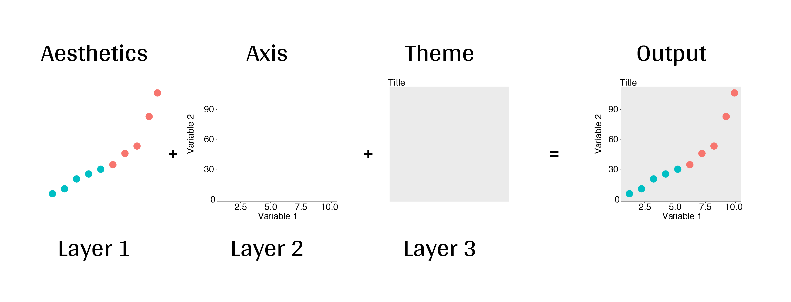
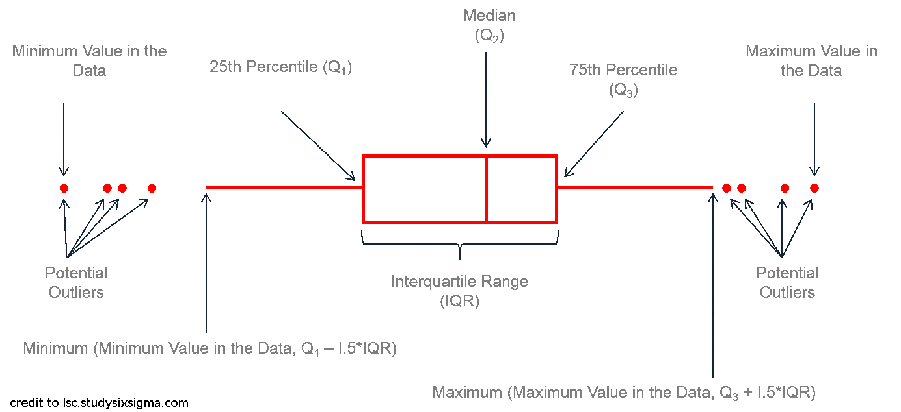

class: inverse, center, middle

```{r setup, echo = FALSE}
knitr::opts_chunk$set(
  comment = "#",
  collapse = TRUE,
  warning = FALSE,
  message = FALSE,
  cache = TRUE,
  fig.width = 6, fig.height = 6,
  fig.retina = 3,
  fig.align = 'center'
)
options(repos=structure(c(CRAN="http://cran.r-project.org")))
```

```{r install_pkgs, message=FALSE, warning=FALSE, include=FALSE, results=0}
# Standard procedure to check and install packages and their dependencies, if needed.

list.of.packages <- c('gridExtra', 'ggplot2', 'ggsignif','ggdendro', 'maps', 'mapproj', 'RColorBrewer','GGally','patchwork','plotly', 'palmerpenguins')

new.packages <- list.of.packages[!(list.of.packages %in% installed.packages()[,"Package"])]

if(length(new.packages) > 0) {
  install.packages(new.packages, dependencies = TRUE) 
  print(paste0("The following package was installed:", new.packages)) 
} else if(length(new.packages) == 0) {
    print("All packages were already installed previously")
}

# load all packages
invisible(lapply(list.of.packages, library, character.only = TRUE))
```

```{r, echo = FALSE}
# set theme so the axis labels are bigger
theme_set(theme_classic())
```

# About this workshop
[](https://github.com/QCBSRworkshops/workshop03)
[](https://wiki.qcbs.ca/r_workshop3)
[](https://qcbsrworkshops.github.io/workshop03/workshop03-en/workshop03-en.html)
[](https://qcbsrworkshops.github.io/workshop03/workshop03-en/workshop03-en.pdf)
[](https://qcbsrworkshops.github.io/workshop03/workshop03-en/workshop03-en.R)

---

# Required packages

.pull-left4[
* [gridExtra](https://cran.r-project.org/package=gridExtra)
* [ggplot2](https://cran.r-project.org/package=ggplot2)
* [ggsignif](https://cran.r-project.org/package=ggsignif)
* [ggdendro](https://cran.r-project.org/package=ggdendro)
* [maps](https://cran.r-project.org/package=maps)
* [mapproj](https://cran.r-project.org/package=mapproj)
* [RColorBrewer](https://cran.r-project.org/package=RColorBrewer)
* [GGally](https://cran.r-project.org/package=GGally)
* [patchwork](https://cran.r-project.org/package=patchwork)
* [palmerpenguins](https://cran.r-project.org/package=palmerpenguins)
* [plotly](https://cran.r-project.org/package=plotly)
]

.pull-right4[

Install the required packages:

```{r, eval = FALSE}
install.packages("gridExtra")
install.packages("ggplot2")
install.packages("ggsignif")
install.packages("ggdendro")
install.packages("maps")
install.packages("mapproj")
install.packages("RColorBrewer")
install.packages("GGally")
install.packages("patchwork")
install.packages("plotly")
install.packages("palmerpenguins")
```

]

---
class: inverse, center, middle

# Introduction

---
# Introduction

##### To follow along:

All workshop materials are found at [github.com/QCBSRworkshops/workshop03](https://github.com/QCBSRworkshops/workshop03). This includes an [R script](https://qcbsrworkshops.github.io/workshop03/book-en/workshop03-script-en.R) the code in this presentation.

##### Recommendations:

  1. create your own new script;
  2. refer to provided code only if needed;
  3. avoid copy-pasting or running the code directly from the script.

###### [ggplot2](https://ggplot2.tidyverse.org/) is also on GitHub: https://github.com/tidyverse/ggplot2


---
# Outline

###### 1. Visualization in science

###### 2. `ggplot2` mechanics

.center[

]


###### 3. Advanced visualization

###### 4. Fine-tuning

###### 5. Saving plots

###### 6. Conclusion

---
# Learning objectives

In this workshop, we will:

- Learn the basics of data visualization using R.
- Learn how to find packages and resources to meet your needs.
- Inspire creativity in science!
- Develop an understanding of design for effective visual communication.

---
class: inverse, center, middle

# Visualization in science

---
# Visualization in science

#### Why are we using data visualization?

#### What makes an effective visualization?

<br>

.center[]

How could we improve this figure ?


???

Plotting this in 3D is not adding information, it is distorting the proportions of each category so the ones in the foreground look more important than those in the back. 

The text labels are also not clear enough to be useful: they are small, overlap with the pie chart, and also include a percentage that should be communicated by the plot itself. 

Pie charts are also not recommended because they rely on angles to represent the difference between parts, but the human eye is not very good at reading/interpreting angles. We are much better at reading differences in area! There is a good demonstration of the pie chart problem here: https://www.data-to-viz.com/caveat/pie.html.


---
# Visualization in science
<br>

1. To represent results of statistical analyses
2. To formulate hypotheses and summarize theory
3. To explore your own data (exploratory analysis, outlier detection)
4. To communicate and report
  - Clearly (using good design principles)
  - Precisely and accurately (a plot is worth 1000 words)
  - Effectively and efficiently

???

note: _changed points here as answers from previous slide question_
---
# Visualization in science
<br>

#### Important questions:

- What do you want to communicate?
- Who is your audience?
- What is the best way to do it?

.center[
.alert[A rule of thumb: think simple! use less ink!]
]

--

#### Additional resources

- [Fundamentals of Data Visualization](https://serialmentor.com/dataviz/) (ggplot)
- [A Compendium of Clean Graphs in R](https://www.shinyapps.org/apps/RGraphCompendium/index.php#line-plots) (base plot)
- [Graphics Principles](https://graphicsprinciples.github.io/) (design tips)

---
# WARNING!

<br>

.alert[
 `R` is not made for drawings.
]

Other drawing softwares are probably better options such as [GIMP](https://www.gimp.org/) or [Inkscape](https://inkscape.org/). It is important to get the right tool for the right task!

---
# Why use R for plotting?

.center[]

---
# Why use R for plotting? Reproducibility

.center[]


.alert[Reproducible science comes with effort]:
- comment your script
- add information in the figures (titles, labels, captions, annotations)

---
# Why R for graphs?

#### .alert[ Because of its powerful features!]

In this workshop, we focus only on `ggplot2`, but [multiple packages and functions](https://insileco.github.io/wiki/rgraphpkgs/) can be used for great visualization (e.g., [`base R`](https://bookdown.org/rdpeng/exdata/the-base-plotting-system-1.html), [`plotly`](https://plot.ly/r/), [`sjPlot`](http://www.strengejacke.de/sjPlot/), [`mapview`](https://r-spatial.github.io/mapview/), [`igraph`](https://igraph.org/r/)).

.center[]

---
# `ggplot2` is versatile

1. [`ggplot2`](https://ggplot2.tidyverse.org/) package lets you make *beautiful* and customizable plots;
2. it implements the grammar of graphics, a reliable system for building plots.
3. it [has many extensions](https://exts.ggplot2.tidyverse.org/gallery/).


.center[]


---
class: inverse, center, middle

# `ggplot2` mechanics: the basics

---
# Grammar of Graphics (GG) basics

```{r, eval = FALSE}
install.packages("ggplot2") # if not already installed
library(ggplot2)
```

```{r, echo = FALSE}
library(ggplot2)
```

A graphic is made of different layers:

.center[

]

Using the GG system, we can build graphs step by step for customizable results. 

---
# Grammar of Graphics (GG) basics

GG layers have specific names that you will see throughout the presentation:


.small[image adapted from [The Grammar of Graphics](https://www.springer.com/gp/book/9780387245447)]

???

note: _changed image to more intuitive layers_

---
exclude: true
# Grammar of Graphics (GG) basics

.center[

]

???

note: _removed this slide becase it felt random_

---
# Grammar of Graphics (GG) basics

Here are the basic requirements to draw the simplest `ggplot`:

.center[

]


---
# Grammar of Graphics (GG)

GG layers:
- Data
    - your data, in tidy format, will provide ingredients for your plot
    - use `dplyr` techniques to prep data for optimal plotting format
    - usually, one row for every observation that you want to plot

---
# Grammar of Graphics (GG)

GG layers:
- Data
- Aesthetics (aes), to make data visible
    - `x`, `y`: variable along the x and y axis
    - `colour`: color of geoms according to data
    - `fill`: the inside color of the geom
    - `group`: what group a geom belongs to
    - `shape`: the figure used to plot a point
    - `linetype`: the type of line used (solid, dashed, etc)
    - `size`: size scaling for an extra dimension
    - `alpha`: the transparency of the geom

---
# Grammar of Graphics (GG)

GG layers:
- Data
- Aesthetics (aes), to make data visible
    - `x`, `y`: variable along the x and y axis
    - `colour`: color of geoms according to data
    - `fill`: the inside color of the geom
    - `group`: what group a geom belongs to
    - `shape`: the figure used to plot a point
    - `linetype`: the type of line used (solid, dashed, etc)
    - `size`: size scaling for an extra dimension
    - `alpha`: the transparency of the geom

.alert[note: aesthetics are based on qualities in your data, but plots may have some of these qualities not based in data as well. (ie, colouring based on a data group is an aesthetic, but points will always have a colour even if not based on data).]
---
# Grammar of Graphics (GG)

GG layers:
- Data
- Aesthetics (aes)
- Geometric objects (geoms)
    * `geom_point()`: scatterplot
    * `geom_line()`: lines connecting points by increasing value of x
    * `geom_path()`: lines connecting points in sequence of appearance
    * `geom_boxplot()`: box and whiskers plot for categorical variables
    * `geom_bar()`: bar charts for categorical x axis
    * `geom_histogram()`: histogram for continuous x axis
    * `geom_violin()`: distribution kernel of data dispersion 
    * `geom_smooth()`: function line based on data

---
# Grammar of Graphics (GG)

GG layers:
- Data
- Aesthetics (aes)
- Geometric objects (geoms)
- Facets
    * `facet_wrap()` or `facet_grid()` for small multiples
    
???

note: _descriptions of scales to talk about more layers_

---
# Grammar of Graphics (GG)

GG layers:
- Data
- Aesthetics (aes)
- Geometric objects (geoms)
- Facets
- Statistics
    * similar to geoms, but computed
    * show means, counts, and other statistical summaries of data
    
    
???

note: _descriptions of themes to talk about more  layers_

---
# Grammar of Graphics (GG)

GG layers:
- Data
- Aesthetics (aes)
- Geometric objects (geoms)
- Facets
- Statistics
- Coordinates - fitting data onto a page
    * `coord_cartesian` to set limits
    * `coord_polar` for circular plots
    * `coord_map` for different map projections
    
    
???

note: _descriptions of other layerss_


---
# Grammar of Graphics (GG)

GG layers:
- Data
- Aesthetics (aes)
- Geometric objects (geoms)
- Facets
- Statistics
- Coordinates 
- Themes
    * overall visual defaults
    * fonts, colors, shapes, outlines
    
???

note: _descriptions of other layerss_

---
# How layers in `ggplot2` works

1. Create a simple plot object:
  * `plot.object <- ggplot()`

2. Add geometric layers:
  * `plot.object <- plot.object + geom_*()`
  
3. Add appearance layers:
  * `plot.object <- plot.object + coord_*() + theme()`

3. Repeat step 2-3 until satisfied, then print:
  * `plot.object` or `print(plot.object)`

???

note: _changed to +geom because it implied that layer() was a function to be used_

---
# Today's dataset: palmerpenguins

.pull-right2[

]

.pull-left2[
We will be using the `palmerpenguins` dataset.

```{r, eval=FALSE}
install.packages("palmerpenguins")
library(palmerpenguins)
```

.small[This dataset contains size measurements for three penguin species observed on three islands in the Palmer Archipelago, Antarctica:] 
]


.center[.xsmall[Artwork by [@allison_horst](https://twitter.com/allison_horst).]]


???

These data were collected from 2007 - 2009 by Dr. Kristen Gorman with the Palmer Station Long Term Ecological Research Program, part of the US Long Term Ecological Research Network.

This dataset is often being used to replace the iris dataset, which has some problems for teaching data science, including its ties to eugenics (more on this at https://armchairecology.blog/iris-dataset/).

This dataset was also used for a TidyTuesday challenge, showing the many possibilities of visualising the dataset creatively. For example: [this](https://twitter.com/LauraNavarroSol/status/1289216490307063814?ref_src=twsrc%5Etfw%7Ctwcamp%5Etweetembed%7Ctwterm%5E1289216490307063814%7Ctwgr%5E%7Ctwcon%5Es1_c10&ref_url=https%3A%2F%2Fnsgrantham.shinyapps.io%2Ftidytuesdayrocks%2F), and [this](https://twitter.com/CedScherer/status/1288181995714093057?ref_src=twsrc%5Etfw%7Ctwcamp%5Etweetembed%7Ctwterm%5E1288181995714093057%7Ctwgr%5E%7Ctwcon%5Es1_c10&ref_url=https%3A%2F%2Fnsgrantham.shinyapps.io%2Ftidytuesdayrocks%2F).

---
# Today's dataset: palmerpenguins

Let's take a look at the variables in the penguins dataset:

```{r}
str(penguins)
```

.center[

]

???

Note that species, island, and sex are factor variables, which will be important for grouping the data with colour, shapes, etc. in ggplot2. There are then 2 numeric variables (bill measurements depicted in the image), and two integer variables (flipper length and body mass). The data also has a small temporal component, spanning from 2007 to 2009.

---
# Prepare data for `ggplot2`

`ggplot2` requires you to prepare the data as an object of class `data.frame` or `tibble` (common in the `tidyverse`).

```{r eval=TRUE, echo=TRUE}
library(tibble)
class(penguins) # all set!

peng <- as_tibble(penguins) # acceptable
class(peng)
```

**&#x267B; Recall from the [*Loading and manipulating data*](https://qcbsrworkshops.github.io/workshop02/pres-en/workshop02-pres-en.html#1) workshop**:

More complex plots in `ggplot` require the long data frame format.

---
# Scientific questions about penguins

.center[

]

.center[**Scientific questions**]
<br>
- Is there a relationship between the **length** & the **depth** of bills?
- Does the size of the **bill & flipper** vary together ?
- How are these measures distributed among the **3 penguin species** ?

.center[.alert[How can we graphically address these questions with `ggplot`?]]

---
# Exploring data structure

<!-- Explain the databases before the examples  -->

```{r, fig.width = 10.25, fig.height = 6.5}
ggpairs(penguins, aes(colour = species)) + theme_bw()
```

???
ggpairs is in the GGally package (loaded and installed in the beginning of the workshop)
note: _ggpairs (ggplot version of psych package) allows us to explore correlations in data_

We can already see some species groupings between bill length and bill depth, flipper length, and body mass. When plotting, it will be important to keep in mind that differentiating species might be important.

---
# Exploring data structure

Let's explore how some of this data is structured by species:

```{r, echo = TRUE, fig.height=7, fig.width=9, eval = FALSE}
ggplot(data = penguins,               # Data
       aes(x = bill_length_mm,        # Your X-value
           y = bill_depth_mm,         # Your Y-value
           col = species)) +          # Aesthetics
  geom_point(size = 5, alpha = 0.8) + # Point
  geom_smooth(method = "lm") +        # Linear regression
  labs(title = "Relationship between bill length and depth\nfor different penguin species", # Title
       x = "Bill length (mm)",
       y = "Bill depth (mm)",
       col = "Species") + 
  theme_classic() + # apply a clean theme
  theme(title = element_text(size = 18, face = "bold"),
      text = element_text(size = 16))
```

.small[&#x267B; See [*Loading and manipulating data workshop*](https://qcbsrworkshops.github.io/workshop02/pres-en/workshop02-pres-en.html#1) to learn how to clean your dataset.]

???

Take the time to explain each line of this plot code (especially the aesthetics and the geoms), and what it tells us.
For example, by differentiating species, we can see that there is a pretty consistent relationship between bill length and depth across species (similar slopes), but that the ranges of these variables is different (the groupings are clearly shown by the colours). Adelie penguins tend to have smaller bill length but fairly large bill depth, while the inverse is true for Gentoo penguins.

---
# Exploring data structure

```{r, echo = FALSE, fig.height=7, fig.width=9}
ggplot(data = penguins,               # Data
       aes(x = bill_length_mm,        # Your X-value
           y = bill_depth_mm,         # Your Y-value
           col = species)) +          # Aesthetics
  geom_point(size = 5, alpha = 0.8) + # Point
  geom_smooth(method = "lm") +        # Linear regression
  labs(title = "Relationship between bill length and depth\nfor different penguin species", # Title
       x = "Bill length (mm)",
       y = "Bill depth (mm)",
       col = "Species") + 
  theme_classic() + # apply a clean theme
  theme(title = element_text(size = 18, face = "bold"),
      text = element_text(size = 16))
```

.small[&#x267B; See [*Loading and manipulating data workshop*](http://qcbs.ca/wiki/r_workshop2) to learn how to clean your dataset.]


---
exclude: true
# Inheritance in `ggplot2`

.small[

.pull-left[
**Inheritance from ggplot**
```{r, fig.height = 5}
p <- ggplot(data = penguins,
            aes(x = bill_length_mm,
                y = bill_depth_mm))
p <- p + geom_point()
p
```
]

.pull-right[
**No inheritance from ggplot**
```{r, fig.height = 5}
s <- ggplot()
s <- s + geom_point(data = penguins,
                    aes(x = bill_length_mm,
                        y = bill_depth_mm))
s # Print your final plot
```
]

]

??? 

note: _removed this slide because it felt random, but is maybe worth going over at some point - edit. moved to challenge 1 answer_

---
# Grammar of Graphics: *recall*

Remember: a graphic is made of different layers:


---
# `ggplot()` dynamics: data layer

```{r, echo = FALSE, results=0}
theme_update(axis.text = element_text(size = 16),
             axis.title = element_text(size = 18))
```

```{r, fig.height=5, fig.width=6}
ggplot(data = penguins)
```

???

theme_classic() was applied to all plots in the presentation to help with clarity using theme_set at the beginning of this slide deck, so these plots do not have the ggplot2 default grey background. There is a section about themes later in the presentation, but it is a good idea to mention that a theme has been applied to remove the default background, which the participants might see if they run the code chunks themselves as they follow along.

---
# `ggplot()` dynamics: aesthetics layer

```{r, fig.height=5, fig.width=6}
ggplot(data = penguins, 
       aes(x = bill_length_mm, y = bill_depth_mm)) 
```

---
# `ggplot()` dynamics: geometric Layer

```{r, fig.height=5, fig.width=6}
ggplot(data = penguins, 
       aes(x = bill_length_mm, y = bill_depth_mm)) +
  geom_point()
```

???

Note that ggplot2 code is easier to read if each line represents a new element. This style is generally favored for ggplot2 code in the R community.

---
# `ggplot()` dynamics: extras- facet, stats, coord layers

```{r,fig.height=5, fig.width=6}
ggplot(data = penguins, 
       aes(x = bill_length_mm, y = bill_depth_mm)) +
  geom_point() + 
  facet_wrap(~species) +
  coord_trans(x = "log10", y = "log10")
```

---
# Challenge #1 (5min) 

#### Draw your 1st ggplot!

.alert[Question]

> Is there a relationship between **bill length** & **flipper length**?

> Does *bill length* increase with flipper *length* ?

.center[Parameters to consider when addressing this question:]

 data | geom | x value | y value
:-------------:|:-------------:|:-------------:|:-------------:
penguins|geom_point|bill_length_mm|flipper_length_mm


---
# Challenge 1#: Solution 

```{r}
ggplot(data = penguins, 
       aes(x = bill_length_mm,
           y = flipper_length_mm)) +
  geom_point()
```


---
# Challenge 1#: Solution 

.pull-left2[
```{r}
ggplot(data = penguins, 
       aes(x = bill_length_mm,
           y = flipper_length_mm)) +
  geom_point()
```
]

.pull-right2[
**note**: aesthetics can either be in the `ggplot()` line, and will be inherited by every geom, or in the `geom_*()` line to apply to that geom only!
]

---
# Challenge 1#: Solution 

.pull-left2[
```{r}
ggplot(data = penguins,
       aes(x = bill_length_mm,
           y = flipper_length_mm)) +
  geom_point(shape = 2, color = "blue")
```
]

.pull-right2[
**note**: aesthetics can either be in the `ggplot()` line, and will be inherited by every geom, or in the `geom_*()` line to apply to that geom only!

<br>
<br>

**note 2**: colour, alpha, shape, and size commands can be set outside of `aes()` values, and will be static, not data-dependent. 
]
---

class: inverse, center, middle

# Aesthetic mapping

## colour, shape, size, labels and transparency

---
# Aesthetic

**Use aesthetics (`aes()`) to distinguish classes, groups and structure**


```{r echo = FALSE, fig.width = 8, fig.height = 6.5}
library(gridExtra)
source(file="./scripts/4plot_aesthetic.R")
```

---
# Colours: make your points talk

Change **colour** to

&nbsp;  differentiate between groups

&nbsp;  represent data values

&nbsp;  highlight specific elements

.pull-left[
```{r, echo = FALSE, fig.height=4.8, fig.width = 5}
ggplot(penguins, 
       aes(x = bill_length_mm, 
           y = bill_depth_mm)) +
  geom_point(aes(colour = species)) +
  labs(title = "Qualitative colour for groups") +
  theme(title = element_text(size = 16, face = "bold"),
        legend.title = element_text(size = 14),
        legend.position = 'bottom')
```
]

.pull-right[
```{r, echo = FALSE, fig.height=4.8, fig.width = 5}
ggplot(penguins, 
       aes(x = bill_length_mm, 
           y = bill_depth_mm)) +
  geom_point(aes(colour = body_mass_g)) +
  labs(title = "Gradient colour for values") +
  theme(title = element_text(size = 16, face = "bold"),
        legend.title = element_text(size = 14),
        legend.position = 'bottom')
```
]

.footnote[See [Fundamentals of Data Visualization](https://serialmentor.com/dataviz/colour-basics.html)]

---
# Using `aes()` use to change colour

Does bill length and flipper length vary differently across species?

.pull-left[
```{r, fig.align = 'default', fig.asp=2/3}
# No colour mapping
ggplot(data = penguins, 
       aes(x = bill_length_mm, 
           y = flipper_length_mm)) +
  geom_point() +
  geom_smooth(method = lm)+
  labs(title = "No colour mapping")
```
]

.pull-right[
```{r,  fig.align = 'default', fig.asp=2/3}
# With colour mapping
ggplot(data = penguins, 
       aes(x = bill_length_mm, 
           y = flipper_length_mm,
           col = species)) +
  geom_point() +
  geom_smooth(method=lm) +
  labs(title = "With colour mapping")
```
]

---
# Change colour manually
.pull-left[
```{r, fig.align = 'default', fig.asp=2/3}
# Default
pp <- ggplot(data = penguins) +
  geom_point(aes(x = bill_length_mm, 
                 y = bill_depth_mm, 
                 colour = species))
pp + labs(title = "Default")
```
]
.pull-right[
```{r, fig.align = 'default', fig.asp=2/3}
# Manual
pp + 
scale_colour_manual(
  values = c("grey55", "orange", 
             "skyblue")) +
  labs(title = "Manual")
```
]

???
scale_colour_manual() and scale_fill_manual() allow you to choose your own colour values, but it's important to still make sure these colours are a good choice (clarity, colorblind-friendly, etc.). More on this in a few slides!

---
# Colour gradients

.pull-left[
```{r, fig.align = 'default', fig.asp=2/3}
# Default
pp2 <- ggplot(data = penguins) +
  geom_point(aes(x = bill_length_mm, 
                 y = bill_depth_mm,
                 colour = body_mass_g))
pp2 + labs(title = "Default")
```
]
.pull-right[
```{r, fig.align = 'default', fig.asp=2/3}
# Manual
pp2 + 
  scale_colour_gradient(low = "blue", 
                        high = "red") +
  labs(title = "Manual")

```
]

???
There is also scale_colour_gradient2() to create a gradient with a midpoint value, for diverging palettes.

---
# Use a predefined colour palette

```{r, eval = FALSE}
install.packages("RColorBrewer")
require(RColorBrewer)
display.brewer.all()
```


---
# Use a predefined colour palette

```{r, fig.align = 'center', fig.height = 5, fig.width=6.5}
# Palette for groups
pp + 
  scale_colour_brewer(palette = "Dark2") +
  labs(title = "Palette for groups")
```

---
# Use a predefined colour palette

```{r, fig.align = 'center', fig.height = 5, fig.width=6.5}
# Palette for continuous values
pp2 + 
  scale_color_viridis_c()+
  labs(title = "Palette for continuous values")
```


---
# Use a predefined colour palette

Grey-scale palette for publication purposes

```{r, fig.align = 'center', fig.height = 5, fig.width=6.5}
# Palette for groups
pp + 
  scale_colour_grey() +
  labs(title = "Palette for groups")
```

---
# Use a predefined colour palette

Grey-scale palette for publication purposes

```{r, fig.align = 'center', fig.height = 5, fig.width=6.5}
# Palette for continuous values
pp2 + 
  scale_colour_gradient(low = "grey85", high = "black") +
  labs(title = "Palette for continuous values")
```


---
# Use colourblind-friendly palettes

Have you ever considered how your figure might appear under various forms of colourblindness?
We can use the package [colorblindr](https://github.com/clauswilke/colorblindr) to consider this. This package is not currently on CRAN, so we install it with the packages [remotes](https://cran.r-project.org/web/packages/remotes/index.html).

```{R colorblindr_install, message = FALSE}
install.packages("remotes", quiet = TRUE)
remotes::install_github("clauswilke/colorblindr@1d0d5afef105df0f97715fcdd67f3203a383a2dc", quiet = TRUE)
library(colorblindr)
```


???

The long string of numbers are letters are the GitHub SHA code for a specific version of this package, because recent commits have broken the installation. This is not important for the participants to know, but might be worth explaning briefly to avoid confusion about this installation.

---
# Use colourblind-friendly palettes

```{r, fig.width = 11, fig.height = 7}
cvd_grid(pp)
```

---
# Use colourblind-friendly palettes


.pull-left[
```{r, fig.height = 5}
# Palette for groups
pp + 
  scale_colour_viridis_d() +
  labs(title = "Viridis palette for groups")
```
]

.pull-right[
```{r, fig.height = 5}
# Palette for continuous values
pp2 + 
  scale_colour_viridis_c() +
  labs(title = "Viridis palette for continuous values")
```
]


---
# Changing `shape`, `size` and `alpha`

.pull-left[
```{r, fig.height = 5}
# shape for groups
ggplot(data = penguins) +
  geom_point(aes(x = bill_length_mm, 
                 y = bill_depth_mm, 
                 shape = species)) +
  labs(title = "Shapes for groups")
```
]

.pull-right[
```{r, fig.height = 5}
# size and alpha for continuous values
ggplot(data = penguins) +
  geom_point(aes(x = bill_length_mm, 
                 y = bill_depth_mm, 
                 size = body_mass_g,
                 alpha = flipper_length_mm)) +
  labs(title = "Size and alpha for continuous values")
```
]

???

Note that setting many variables to visual cues like color, shape, size, and alpha at once tends to be overwhelming for the viewer. Adding 4 levels of complexity on top of the 2-dimensional representation of points can be too much to process properly. It is better to choose the visual cues and key variables for the desired message than to overload a plot with every possibility in the aes() function.
---
# Challenge #2 

- Produce an informative plot from built-in datasets such as `mtcars`, `CO2` or `msleep`.

- Use appropriate aesthetic mappings for different data types


<br>

Data| x | y | Aesthetics
:-------------:|:-------------:|:-------------:|:-------------:
mtcars |*wt* |*mpg* | *disp* and *hp*
CO2 |*conc* |*uptake* | *Treatment* and *Type*
msleep |log10(*bodywt*) |*awake* | *vore* and *conservation*
ToothGrowth | *dose* | *len* | *supp* 

<br>
.center[.alert[
 Pay attention to the data types!
]
]

---
# Challenge #2 

#### .alert[Breakout rooms! - 15 min]
<br> make a plot to share with the group


???
note: _assign each group a dataset to make a plot from: mtcars, CO2, msleep, and ToothGrowth to make exploratory plots_
---
# Challenge #2 - Solution example #1

.small[

Data| x | y | Aesthetics
:-------------:|:-------------:|:-------------:|:-------------:
mtcars |*wt* |*mpg* | *disp* and *hp*

]

```{r, fig.height=3.5, fig.width=6}
data(mtcars)
ggplot(data = mtcars) +
  geom_point(mapping = aes(x = wt, y = mpg,
                           colour = disp,
                           alpha = hp))
```

.comment[Could you use `size` instead of `alpha`? What about `shape`?]

---
# Challenge #2 - Solution example #2

.small[

Data| x | y | Aesthetics
:-------------:|:-------------:|:-------------:|:-------------:
CO2 |*conc* |*uptake* | *Treatment* and *Type*

]

```{r, fig.height=3.5, fig.width=6}
data(CO2)
ggplot(data = CO2) +
    geom_point(mapping = aes(x = conc, 
                             y = uptake,
                             colour = Treatment, 
                             shape = Type))
```

.comment[Why not use `size = Type`?]

---
# Challenge #2 - Solution example #3

.small[

Data| x | y | Aesthetics
:-------------:|:-------------:|:-------------:|:-------------:
msleep |log10(*bodywt*) |*awake* | *vore* and *conservation*

]

```{r, fig.height=3.5, fig.width=6}
data(msleep)
ggplot(data = msleep) +
    geom_point(mapping = aes(x = log10(bodywt), 
                             y = awake,
                             colour = vore, 
                             shape = conservation))
```

---
# Challenge #2 - Solution example #4

.small[

Data| x | y | Aesthetics
:-------------:|:-------------:|:-------------:|:-------------:
ToothGrowth | *dose* | *len* | *supp* 

]

```{r, fig.height=3.5, fig.width=6}
data(ToothGrowth)
ggplot(ToothGrowth, aes(x = dose,
                        y = len,
                        color = supp)) +
  geom_point() + 
  geom_smooth(method = lm, formula = 'y~x')
```

---
class: small-code
# Changing the scale of the axes
.tiny[
.pull-left[
x axis in regular scale
```{r,fig.height=4}
ggplot(diamonds) +
  geom_point(mapping = aes(x = carat, y = price)) +
  labs(title = "Original scale")
```
]
]
.pull-right[
x-axis and y-axis in log10() scale
```{r,fig.height=4}
ggplot(diamonds) + geom_point(mapping = aes(x = carat, y = price)) +
  coord_trans(x = "log10",
              y = "log10") +
  labs(title = "log10 scale")
```
]

<br>
.small[It is also possible to transform the coordinate system using `scale_x_log10()` and `scale_y_log10()`.]

<!-- explain the difference -->

???
Explain the difference and why the transformation can be useful for visualization. For example, body mass is often transformed with log10.

---
class: inverse, center, middle

# Fine-tuning your plots

# Using `theme()` to make it look good!

---
# `theme()`

**Default: theme_grey()**
```{r, fig.height = 5, fig.align='center'}
# Theme grey
pp + scale_colour_grey() +
  theme_grey() +
  labs(title = "Default: Grey")
```

---
# `theme()`

.pull-left[
**Theme Classic**
```{r, fig.height = 5}
pp + scale_colour_grey() +
  theme_classic() +
  labs(title = "Classic")
```
]

.pull-right[
**Theme Minimal**
```{r, fig.height = 5}
pp + scale_colour_grey() +
  theme_minimal() +
  labs(title = "Minimal")
```
]

.footnote[NB: Good choices for publication purposes!]

???

This presentation has been using theme_classic() for the plots, because the grey background can make certain colours harder to see. These are good options for publishing figures.

---
# `theme()`

Use `theme_set()` to change theme for all your future plots, 
or `theme_update()` to edit aspects of a theme setting. 


.pull-left[
**Set theme**
```{r, fig.height = 4.5}
# Set black & white theme as default
theme_set(theme_bw())
pp
```
]

.pull-right[
**Update theme**
```{r, fig.height = 4.5}
# remove minor gridlines 
theme_update(
  panel.grid.minor = element_blank())
pp
```
]


```{r, include=FALSE}
theme_set(theme_bw())
theme_update(panel.grid.minor = element_blank(),
             axis.text = element_text(size = 16),
             axis.title = element_text(size = 18))
```

---
exclude: true
# ggThemeAssist: RStudio-addin


???

note: _removed this slide to add theme image instead_


---
# `theme()`

Elements of a theme


---
class: inverse, center, middle

# Fine-tuning your plots

# Using `facet_grid()` to change the arrangement of plots

---
# penguins dataset: per-species facets
```{r, fig.align="center", fig.width=10, fig.height=5.5}
ggplot(data = penguins) +
  geom_point(mapping = aes(x = bill_length_mm, 
                           y = bill_depth_mm, 
                           colour = species)) +
  facet_grid(~ species, scales = "free")
```

---
# CO2 dataset: per-type facets
```{r, fig.align="center", fig.width=9, fig.height=5}
ggplot(data = CO2) +
  geom_point(mapping = aes(x = conc, 
                           y = uptake, 
                           colour = Treatment)) +
  xlab("CO2 Concentration (mL/L)") + 
  ylab("CO2 Uptake (umol/m^2 sec)") +
  facet_grid(~ Type)
```

<!-- relabeling ticks -->

---
exclude: true

# Title and axes components: changing size, colour and face

.center[]

???
This is redundant with the elements of a theme figure from slide 74, and now out of date due to the removal of iris.

---
# Title and axes components: size, colour and face

.pull-left[
**Default**
<br><br>
```{r, echo=FALSE, fig.align="center", fig.width=6, fig.height=7}
pp
```
]

.pull-right[
**Axes and title tuning**
<br><br>
```{r, echo=FALSE, fig.align="center", fig.width=6, fig.height=7,message=FALSE}
pp +
  labs(title = "Relationship between Bill Length & Depth",
       x = "Bill Length (mm)",
       y = "Bill Depth (mm)",
       col = "Species") +
  theme(axis.title.x = element_text(size = 16),
        axis.title.y = element_text(size = 16),
        axis.text.x = element_text(size = 12),
        axis.text.y = element_text(size = 12),
        plot.title = element_text(size = 16, face="bold"),
        legend.title = element_text(size=14, face="bold"),
        legend.text = element_text(size=12))
```

]

---
# Challenge #3 

Use the `tips` dataset found in `reshape2` &#x1F4E6; to reproduce the plot below.

Our tip: start from `theme_classic()` and add `theme()` to make your additional changes.

```{r, echo=FALSE, fig.width=10, fig.height=5}
library(reshape2)
tips.gg <- ggplot(tips, aes(x = total_bill,
                            y = tip/total_bill,
                            shape = smoker,
                            colour = sex,
                            size = size)) +
  geom_point() +
  facet_grid( ~ time) +
  scale_colour_grey() +
  labs(title = "Relation between total bill and tips during lunch and dinner",
       x = "Total bill ($)", y = "Ratio between tips and total bill") +
  theme_classic() +
  theme(axis.title = element_text(size = 16,
                                  colour = "navy"),
        axis.text = element_text(size = 12),
        plot.title = element_text(size = 16,
                                  colour = "orange3",
                                  face = "bold"),
        strip.text.x = element_text(size = 14, face="bold"))
tips.gg
```

---
# Challenge #3 

#### .alert[Breakout rooms! - 15 min]

???
note: _give teams time to work together to recreate this plot. Refer to theme elements slide_

---
# Challenge #3: Solution

```{r, eval=FALSE}
library(reshape2)
tips.gg <- ggplot(tips, aes(x = total_bill,
                            y = tip/total_bill,
                            shape = smoker,
                            colour = sex,
                            size = size)) +
  geom_point() +
  facet_grid( ~ time) +
  scale_colour_grey() +
  labs(title = "Relation between total bill and tips during lunch and dinner",
       x = "Total bill ($)", y = "Ratio between tips and total bill") +
  theme_classic() +
  theme(axis.title = element_text(size = 16,
                                  colour = "navy"),
        axis.text = element_text(size = 12),
        plot.title = element_text(size = 16,
                                  colour = "orange3",
                                  face = "bold"),
        strip.text.x = element_text(size = 14, face="bold"))
tips.gg
```

---
# Challenge #3: step-by-step solution

#### `aes()`

```{r, fig.width = 6, fig.height=4}
tips.gg <- ggplot(tips) +
  geom_point(mapping = aes(x = total_bill, 
                           y = tip/total_bill,
                           shape = smoker, 
                           colour = sex, 
                           size = size)) +
  theme_classic()
tips.gg
```

```{r, include=FALSE, eval = FALSE}
theme_set(theme_classic())
```

---
# Challenge #3: step-by-step solution

#### `facet_grid()`

```{r, fig.width=7, fig.height=5}
tips.gg <- tips.gg +
  facet_grid(~ time)
tips.gg
```


---
# Challenge #3: step-by-step solution

#### Grey-scale palette

```{r, fig.width=7,fig.height=5}
tips.gg <- tips.gg +
  scale_colour_grey()
tips.gg
```

---
# Challenge #3: step-by-step solution

#### Adding plot title and labels

```{r, fig.width=7,fig.height=5}
tips.gg <- tips.gg +
  labs(title = "Relation between total bill and tips during lunch and dinner",
       x = "Total bill ($)", y = "Ratio between tips and total bill")
tips.gg
```

---
# Challenge #3: step-by-step solution

#### Adding a theme and fine tuning it

.small[
```{r, fig.width=6, fig.height=4}
tips.gg <- tips.gg +
  theme_classic() +
  theme(axis.title = element_text(size = 16, colour = "navy"),
        axis.text = element_text(size = 12),
        plot.title = element_text(size = 16, colour = "orange3", face = "bold"),
        strip.text.x = element_text(size = 14, face = "bold"))
tips.gg
```
]

---
class: inverse, center, middle

# Fine-tuning your plots

# Using `geom_*()` to create different plots

---
# `ggplot2::geom_*()`

.center[

]

---
exclude: true
# `base::plot()`

.center[

]

???
note: removed this slide. Not sure why it's here. 

---
# `ggplot2::ggplot()`

```{r, include=FALSE}
theme_set(theme_bw())
theme_update(panel.grid.minor = element_blank(),
             axis.text = element_text(size = 16),
             axis.title = element_text(size = 18))
```


This is a blank plot, before we add any `geom_*` to represent variables in the dataset.

```{r, fig.align="center",fig.height=5}
ggplot(penguins)
```

---
# Histograms: `geom_histogram()`

A **histogram** is an accurate graphical representation of the distribution of numeric data. There is only one aesthetic required: the `x` variable.

```{r, fig.align="center", fig.height=5}
ggplot(penguins, 
       aes(x = bill_length_mm)) +
  geom_histogram() +
  ggtitle("Histogram of penguin bill length ")
```

---
# Scatterplot and linear-fit: `geom_point()` and `geom_smooth()`
.small[
.pull-left[
```{r, fig.height=5}
ggplot(mpg, aes(displ, hwy)) +
  geom_point() +
  labs(title = "Scatterplot")
```
]

.pull-right[
```{r, fig.height=4.5}
ggplot(mpg, aes(displ, hwy)) +
  geom_point() +
  labs(title = "Linear Regression") +
  geom_smooth(method = lm)
```
]
]
---
# Boxplot: `geom_boxplot()`

```{r, fig.align="center", fig.height=5}
ggplot(data = penguins, 
       aes(x = species, 
           y = bill_length_mm,
           fill = species)) +
  geom_boxplot() +
  labs(title = "Boxplot")
```

---
# Boxplot: `geom_boxplot()`

```{r, echo=FALSE, fig.align="center", fig.width = 5, fig.height = 3.2}
ggplot(data = penguins, 
       aes(x = species, 
           y = bill_length_mm,
           fill = species)) +
  geom_boxplot() +
  labs(title = "Boxplot")
```

.center[

]

---
## Boxplot with annotations: `geom_boxplot()` and `geom_signif()`

.pull-left3[
```{r, fig.align="center",fig.height=5.5, eval = FALSE}
library(ggsignif)
ggplot(data = penguins, 
       aes(x = species, 
           y= bill_length_mm,
           fill = species)) +
  geom_boxplot() +
  geom_signif(comparisons = 
                list(c("Adelie", "Gentoo")),
              map_signif_level=TRUE)
```
]
.pull-right3[
```{r, fig.align="center",fig.height=5.5, echo = FALSE}
library(ggsignif)
ggplot(data = penguins, 
       aes(x = species, 
           y= bill_length_mm,
           fill = species)) +
  geom_boxplot() +
  # specify the comparison we are interested in
  geom_signif(comparisons = 
                list(c("Adelie", "Gentoo")),
              map_signif_level=TRUE)
```
]

???

geom_signif calculates the significance of a difference between groups and adds the annotation to the plot in a single line.

---
# Violin plot: `geom_violin()`

As explained on https://www.data-to-viz.com/graph/violin.html

> Violin plot allows to visualize the distribution of a numeric variable for one or several groups. [...] It is really close to a boxplot, but allows a deeper understanding of the distribution.

.pull-left[
```{r, echo=FALSE, fig.height=4.5}
# Data
names <- c(rep("A", 80) , rep("B", 50) , rep("C", 70))
value <- c(sample(2:5, 80 ,replace=TRUE), sample(4:10, 50 , replace=TRUE),
       sample(1:7, 70 , replace=TRUE))
data <- data.frame(names,value)

#Graph
qplot(x=names ,y=value ,data=data ,geom=c("boxplot","jitter") ,fill=names)
```
]
.pull-right[
```{r, echo=FALSE, fig.height=4.5}
ggplot(data = data, aes(names, value, fill=names)) + geom_violin()

```
]

---
# Violin plot: `geom_violin()`

```{r, fig.align="center"}
violin <- ggplot(data = penguins, 
                 aes(x = species, y = bill_length_mm)) +
  geom_violin(trim = FALSE, fill = "grey70", alpha = .5) +
  labs(title = "Violin plot")
violin
```

---
# Violin plot: `geom_violin()` + `_boxplot()` + `_jitter()`

```{r, fig.align="center"}
violin + 
    geom_jitter(shape = 16, position = position_jitter(0.2),
              alpha = .3)+
  geom_boxplot(width = .05)
```

???
note: Multiple geoms can be used together! The order determines how they overlap.
---
# Summarise y values: `stat_summary()`

.pull-left[
```{r, fig.height=5, fig.width=4}
ggplot(mtcars, 
       aes(cyl, mpg)) +
  geom_point() +
  stat_summary(fun.y = "median", 
               geom = "point",
               colour = "red",
               size = 6) +
  labs(title = "Means")
```
]

.pull-right[
```{r, fig.height=5, fig.width=4}
ggplot(mtcars, 
       aes(cyl, mpg)) +
  geom_point() +
  stat_summary(fun.data = "mean_cl_boot",
               colour = "red",
               size = 1.6) +
  labs(title = "Means and confidence intervals")
```
]

---
# Summarise values

See also `geom_errorbar()`, `geom_pointrange()`, `geom_linerange()`, `geom_crossbar()` for geoms to display summarised data.


---
# Representing maps: `geom_map()`
.small[
```{r}
crimes <- data.frame(state = tolower(rownames(USArrests)), USArrests)
crimesm <- reshape2::melt(crimes, id = 1)

library(maps)
states_map <- map_data("state")

ggplot(crimes, aes(map_id = state)) +
  geom_map(aes(fill = Murder), map = states_map) +
  expand_limits(x = states_map$long, y = states_map$lat) +
  coord_map()
```
]
---


## Density plots: `geom_density()`

.small[A density plot shows the distribution of a numerical variable and it takes only set of numeric values as input.]
.pull-left[
```{r, echo=TRUE, fig.width=5, fig.height=4.4}
(peng.dens <- 
   ggplot(penguins, 
          aes(bill_length_mm)) +
   geom_density())
```
]

.pull-right[
```{r, echo=TRUE, fig.width=5, fig.height=4.4}
(cars.dens <- 
   ggplot(cars, aes(dist)) +
   geom_density())
```
]

---
# Dendogram: `ggdendrogram()`

```{r}
library(ggdendro)
USArrests.short = USArrests[1:10,]
hc <- hclust(dist(USArrests.short), "ave")

ggdendrogram(hc, rotate = TRUE, theme_dendro = FALSE)
```


---
# Arrange plots: `patchwork`

**Add multiple graphs on the same plot**

```{r, fig.width=9, fig.height=5, message=FALSE, warning=FALSE}
library(patchwork)
peng.dens + cars.dens +
  plot_annotation(tag_levels = 'a')
```

---
# Final Challenge

Create your own graph and follow these recommendations:
  * Dataset: any (recommended: use your dataset)
  * Explore a new geom_* and other plot elements

Use the following links for tips:
https://ggplot2.tidyverse.org/reference/index.html
http://shinyapps.stat.ubc.ca/r-graph-catalog/

---
# Final Challenge: Solution example #1
.small[
```{r, fig.align='center',fig.height=4}
data(msleep)
msleep.challenge4 <- ggplot(msleep, 
                            aes(x = vore, y = log10(brainwt), fill = vore))
msleep.challenge4 + 
  geom_violin() +
  geom_signif(comparisons = list(c("herbi", "insecti"))) +
  labs(main = "Brain weight among different vore", 
       y = "log10(Brain weight (Kg))") +
  scale_fill_grey() +
  theme_classic()
```
]
---
# Final Challenge: Solution example #2
.small[
```{r, fig.align='center', fig.width=5, fig.height=4}
data(mtcars)
mtcars.short <- mtcars[1:20,]
mtcars.short.hc <- hclust(dist(mtcars.short), "complete")
dendro.challenge4 <- ggdendrogram(mtcars.short.hc, 
                                  rotate = TRUE, theme_dendro = FALSE)
dendro.challenge4 + 
  labs(title = "Car dendro from motor spec", y ="Cars") +
  theme(axis.title.y = element_text(size = 16),
        axis.text.y = element_text(size = 12),
        axis.title.x = element_blank(), axis.text.x = element_blank(),
        plot.title = element_text(size = 14, face="bold"))
```
]

---
## Miscellaneous: interactive plots using `plotly()`
.small[
.alert[**Select the species data to display directly from the legend**]

```{r, echo = TRUE, fig.width=10, fig.height=5}
p <- ggplot(penguins,
           aes(x = bill_length_mm, y = bill_depth_mm, 
               colour = species, shape = species)) +
    geom_point(size=6, alpha=0.6)
# convert to a plotly object!
plotly::ggplotly(p)
```
]

???

You can click on the species in the legend to add/remove species. You can also see values while hovering over points.

---
class: inverse, center, middle

# Saving your plots with ggplot2

---
# Saving plots in RStudio

<div style="text-align:center">

</div>
.small[
.alert[Think about the margin of the document you are using. If you resize the image after saving it, the labels and text will change size as well which could be hard to read.]
]
---
# Saving plots in code

`ggsave()` writes directly to your working directory and allows you to specify the name of the file, the dimensions of the plot, the resolution, etc.

```{r, eval=FALSE}
my1rstPlot <- 
  ggplot(penguins, 
         aes(x = bill_length_mm, 
             y = bill_depth_mm)) +
  geom_point()

ggsave("my1stPlot.pdf",
       my1rstPlot,
       height = 8.5, width = 11, units = "in", res = 300)
```

NB: Vectors (e.g., pdf, svg) format are more flexible than raster format (jpeg,
png, ...) if the image needs modification afterwards.

---
# Saving plots in code
<br>

Other methods to save image: see `?pdf` `?jpeg`

```{r, eval=FALSE}
pdf("./graph_du_jour.pdf")
  print(my1rstPlot) # print function is necessary
graphics.off()
```


---
# Saving plots in code
<br>

**Tip:** `quartz()` (mac) or `window()` (pc) functions make sizing easier before `ggsave()`!

???

note: _this function allows to resize plot live, then use ggsave without specifying plot._
```


---
class: inverse, center, middle

# Going further


---
# Available elements


[Data Visualization with ggplot2 Cheat Sheet](https://www.rstudio.com/wp-content/uploads/2015/03/ggplot2-cheatsheet.pdf)

.center[]

https://www.rstudio.com/resources/cheatsheets

---
# Additional resources

* `help(package = ggplot2)`
* http://ggplot2.tidyverse.org/reference/
* Fundamentals of Data Visualization https://serialmentor.com/dataviz/

.center[]

---
# Concluding remarks
<br>

  1. There are other useful packages that can be used with `ggplot2`! To name a few: `ggbio`, `ggpmisc`, `geomnet`, `gganimate`, `ggnetwork` and `ggtree`. Have a look at [www.ggplot2-exts.org](https://www.ggplot2-exts.org/) for other `ggplot2` extensions.


  2. Note that you can learn more about design and image manipulation with the "Introduction to graphic design and image manipulation with open source tools": https://qcbs.ca/wiki/graphics


---
class: inverse, center, bottom

# Thank you for attending!


