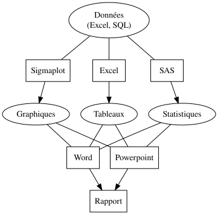
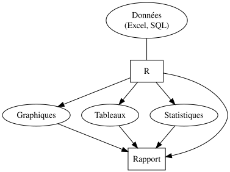

class: inverse, center, middle


```{r setup, echo = FALSE}
knitr::opts_chunk$set(
  comment = "#",
  collapse = TRUE,
  warning = FALSE,
  message = FALSE,
  cache = TRUE,
  fig.width = 6, 
  fig.height = 6,
  fig.retina = 3,
  fig.align = 'center'
)
options(repos = structure(c(CRAN = "http://cran.r-project.org")))
```

```{r install_pkgs, message=FALSE, warning=FALSE, include=FALSE, results=0}
# Standard procedure to check and install packages and their dependencies, if needed.

# Install xaringanExtra and countdown

if(nzchar(system.file(package = "xaringanExtra")) == FALSE) {
  remotes::install_github("gadenbuie/xaringanExtra", 
                          upgrade = "always", 
                          quiet = TRUE)
  }

if(nzchar(system.file(package = "countdown")) == FALSE) {
  remotes::install_github("gadenbuie/countdown", 
                          upgrade = "always", 
                          quiet = TRUE)
  }

if(nzchar(system.file(package = "gganimate")) == FALSE) {
  remotes::install_github("thomasp85/gganimate", 
                          upgrade = "always", 
                          quiet = TRUE)
  }

if(nzchar(system.file(package = "gifski")) == FALSE) {
  remotes::install_github("r-rust/gifski", 
                          upgrade = "always", 
                          quiet = TRUE)
}

if(nzchar(system.file(package = "mdsr")) == FALSE) {
  remotes::install_github("mdsr-book/mdsr", 
                          upgrade = "always", 
                          quiet = TRUE)
  }

# Install other packages

list.of.packages <- c('gridExtra', 
                      'ggplot2', 
                      'ggsignif',
                      'ggdendro', 
                      'maps',
                      'mapproj',
                      'RColorBrewer',
                      'GGally',
                      'patchwork',
                      'plotly',
                      'palmerpenguins',
                      'sf',
                      'tidyverse',
                      'ggspatial',
                      "DiagrammeR",
                      "DiagrammeRsvg",
                      "rsvg",
                      "sjPlot",
                      "countdown",
                      "xaringanExtra",
                      "colorBlindness",
                      "gganimate",
                      "gapminder")

new.packages <- list.of.packages[!(list.of.packages %in% installed.packages()[,"Package"])]

if(length(new.packages) > 0) {
  install.packages(new.packages, dependencies = TRUE)
  print(paste0("The following package was installed:", new.packages))
} else if(length(new.packages) == 0) {
    print("All packages were already installed previously")
}

# load all packages
invisible(lapply(list.of.packages, library, character.only = TRUE))
```

```{r, echo = FALSE}
# set theme so the axis labels are bigger
theme_set(theme_classic())
```

# À propos de cet atelier

[](https://github.com/QCBSRworkshops/workshop03)
[](https://r.qcbs.ca/workshop03/workshop03-fr/workshop03-fr.html)
[](https://r.qcbs.ca/workshop03/workshop03-fr/workshop03-fr.pdf)
[](https://r.qcbs.ca//workshop03/book-fr/workshop03-script-fr.R)

---

<p style="font-size:75%">

.center[
**Contributeurs et contributrices au développement de cet atelier**

en modifiant et en améliorant son contenu dans le cadre du <br>_**Le**arning **a**nd **D**evelopment **A**ward_ du **CSBQ**:
]


.pull-left[
.right[

 **2022** - **2021** - **2020**

[Pedro Henrique P. Braga]()

[Katherine Hébert]()

[Linley Sherin]()

[Jake Lawlor]()

[Marie-Hélène Brice]()

[Kevin Cazelles]()
]
]

.pull-right[
.left[
**2019** - **2018** - **2017**

[Willian Vieira]()

[Rémi Maglione]()

[Alexis Carteron]()

[Pedro Henrique P. Braga]()

[Katherine Hébert]()

<br>

**2016** - **2015** - **2014**

[Xavier Giroux-Bougard]()

[Maxwell Farrell]()

[Amanda Winegardner]()

[Étienne Low-Decarie]()

[Monica Granados]()


]
]
</p>

---

# Matériel requis

.small[Pour suivre cet atelier, vous devez avoir téléchargé et installé les dernières versions de [RStudio](https://rstudio.com/products/rstudio/download/#download) et de [R](https://cran.rstudio.com/).]

.pull-left3[
.small[Vous devez également utiliser les paquets suivants :]

* [gridExtra](https://cran.r-project.org/package=gridExtra)
* [ggplot2](https://cran.r-project.org/package=ggplot2)
* [ggsignif](https://cran.r-project.org/package=ggsignif)
* [ggdendro](https://cran.r-project.org/package=ggdendro)
* [maps](https://cran.r-project.org/package=maps)
* [mapproj](https://cran.r-project.org/package=mapproj)
* [RColorBrewer](https://cran.r-project.org/package=RColorBrewer)
* [GGally](https://cran.r-project.org/package=GGally)
* [patchwork](https://cran.r-project.org/package=patchwork)
* [palmerpenguins](https://cran.r-project.org/package=palmerpenguins)
* [plotly](https://cran.r-project.org/package=plotly)
* [colorBlindness](https://cran.r-project.org/package=colorBlindness)

]

.pull-right3[

.small[Pour les installer depuis CRAN, exécutez :]
```{r, echo = TRUE, eval = FALSE}
install.packages(
  c('grid', 'gridExtra', 
    'ggplot2', 'ggsignif', 
    'ggdendro', 'maps',    
    'mapproj', 'RColorBrewer', 
    'GGally', 'patchwork', 
    'plotly','palmerpenguins',
    'colorBlindness')
)
```

]

.small[Tout le matériel de l'atelier se trouve sur le site [r.qcbs.ca/workshops/r-workshop-03/](https://r.qcbs.ca/workshops/r-workshop-03/).]
---

# Objectifs d'apprentissage

**1.** Apprendre les bases de la visualisation de données en utilisant `R` ;

**2.** Apprendre et identifier les dynamiques de base pour construire des figures en suivant l'approche de la *grammaire des graphiques* en couches ; 

**3.** Utiliser `R` et le paquet `ggplot2` pour créer et modifier des figures ;

**4.** Réfléchir de manière critique et discuter sur la représentation et sur la visualisation des données.

--


.pull-left[
**Recommandations**

1. Créez et gérez votre propre nouveau script ;
2. Abstenez-vous de toujours vous référer au code préconstruit ; *c'est-à-dire, sortir des sentiers battus !*.
3. Évitez de copier-coller ou d'exécuter le code directement à partir du script ;
4. Interagissez avec les présentateurs !
]

--

.pull-left[
**Disclaimer**

Bien que nous discuterons des principes de la visualisation de données tout au long de cet atelier, notre objectif principal est de vous montrer comment produire des figures avec `ggplot2`. 

Nous sommes limités par le temps, mais nous vous recommandons de nous interrompre pour discuter de ces principes ainsi que pour consulter d'autres ressources. 

]


---
class: inverse, center, middle

# Introduction

---
# Outline

###### 1. Petite discussion sur la visualisation des données ;

###### 2. Mécanique de `ggplot2` ;

###### 3. Cartographie esthétique ;

###### 4. Ajustement fin ;

###### 5. Enregistrement des tracés ;

###### 6. Ressources et conseils supplémentaires.

---

# Qu'est-ce que la visualisation de données ?

**_La visualisation de données_ est la présentation de données dans un format pictural ou graphique**, et un _outil de visualisation de données_ est le logiciel qui génère cette présentation.

<br>

**_Une visualisation efficace des données_** fournit aux utilisateurs et utilisatrices des moyens intuitifs pour : 
- **explorer et analyser les données de manière interactive**, ce qui leur permet de 
- **identifier efficacement des patrons d'intérêt**, 
- **inférer des corrélations et des causalités**, et 
- **soutenir les opérations de prise de décisions**

<br>
.xsmall[Bikakis, Nikos. "Big data visualization tools." arXiv preprint arXiv:1801.08336 ([2018](http://arxiv.org/abs/1801.08336)).]

---

# Un exemple court et historique : 

**Avez-vous déjà entendu parler de John Snow ?**

.pull-left3[
Dans les années 1850, on pensait que le choléra était transmis et propagé par du "mauvais air" provenant de matières organiques en décomposition. L'épidémie soudaine et grave de choléra dans le quartier londonien de Soho était un mystère.


Le médecin John Snow a décidé d'interroger les habitants et de **cartographier les décès dus au choléra**.

Il a  constaté qu'il y avait un lien entre le choléra et l'eau potable contaminée : la plupart des décès étaient dus à des personnes dont l'accès le plus proche à l'eau était la pompe de Broad Street, où l'on a découvert que des bactéries fécales provenaient d'une fosse d'aisance voisine.

]

.pull-right3[


]

---

# Un exemple court et historique : 

**Avez-vous déjà entendu parler de John Snow ?**

```{r xaringan-panelset, echo=FALSE}
xaringanExtra::use_panelset()
```

.small[Alors que John Snow a dû dessiner sa carte à la main, nous avons l'avantage de disposer de ressources informatiques pour représenter des données rapidement !]

.pull-left3[

.panelset[

.panel[.panel-name[Figure]
.xsmall[
```{r echo = FALSE, message = FALSE, warning = FALSE}
library(tidyverse)
library(mdsr)
library(sf)
library(ggspatial)

dsn <- fs::path("data", 
                "SnowGIS_SHP")

CholeraDeaths <- st_read(dsn, 
                         layer = "Cholera_Deaths",
                         quiet = TRUE)

cholera_latlong <- CholeraDeaths %>%
  st_set_crs(27700) %>%
  st_transform(4326)

pumps <- st_read(dsn, 
                 layer = "Pumps",
                 quiet = TRUE)

pumps_latlong <- pumps %>% 
  st_set_crs(27700) %>%
  st_transform(4326)

ggplot(cholera_latlong) + 
  annotation_map_tile(type = "osm", 
                      zoomin = 0) + 
  geom_sf(aes(size = Count,
              alpha = 0.7)) +
  geom_sf(data = pumps_latlong, 
          size = 3,
          color = "red")
```
.center[.xsmall[Reconstitution de la carte originale de John Snow sur l'épidémie de choléra de 1854.]]

]
]

.panel[.panel-name[R Code]
.xsmall[ 
```{r panel-chunk, echo = TRUE, eval = FALSE, fig.show='hide', message=FALSE, warning=FALSE}
library(tidyverse); library(mdsr)
library(sf); library(ggspatial)

dsn <- fs::path("data", 
                "SnowGIS_SHP")

ggplot(st_read(dsn, 
               layer = "Cholera_Deaths") %>%
         st_set_crs(27700) %>%
         st_transform(4326)) + 
  annotation_map_tile(type = "osm", 
                      zoomin = 0) + 
  geom_sf(aes(size = Count,
              alpha = 0.7)) +
  geom_sf(data = st_read(dsn, 
                         layer = "Pumps") %>% 
            st_set_crs(27700) %>%
            st_transform(4326), 
          size = 3, colour = "red")

```

Source: [Modern Data Science with R](https://mdsr-book.github.io/mdsr2e/ch-spatial.html)

]

]

]

]

.pull-right3[


]

???

La taille de chaque point noir est proportionnelle au nombre de personnes qui sont mortes du choléra à cet endroit. Les points rouges indiquent l'emplacement des pompes à eau publiques.

---
class: middle, center

#### Tout le monde a déjà fait une figure comme celle-ci !

<br>

.center[ ]
<br>
**Quels sont les problèmes qu'elle pose, et qu'est-ce qui peut être amélioré ?** 

<br>

_Il est temps de discuter !_ <br>

???

La représentation graphique en 3D n'ajoute aucune information, elle déforme les proportions de chaque catégorie, de sorte que les catégories au premier plan semblent plus importantes que celles du second plan.

Les étiquettes de texte ne sont pas assez claires pour être utiles : elles sont petites, empiètent sur le graphique et incluent un pourcentage qui devrait être communiqué par le graphique lui-même.

Les diagrammes circulaires ne sont plus recommandés car ils s'appuient sur des angles pour représenter la différence entre les parties, mais l'œil humain n'est pas très doué pour lire/interpréter les angles. Nous sommes bien meilleurs pour lire les différences de surface ! Vous trouverez une bonne démonstration du problème des diagrammes circulaires à l'adresse suivante : https://www.data-to-viz.com/caveat/pie.html.


---
# L'efficacité de la visualisation des données dépend de plusieurs facteurs

- Que voulez-vous communiquer ?
<br>

- Qui est votre public ? 
  - Des chercheurs ? Des journalistes ? Le grand public ? Les évaluateurs de subventions ?
  <br>
  
- Quelle est la meilleure façon de représenter vos données et votre message ?
  - Est-ce par un _box plot_ ? 
  - Devriez-vous utiliser du bleu ou du rouge ?
  - Quelle échelle devriez-vous utiliser ?
  - Devriez-vous ajouter ou supprimer des informations ?
<br>

---
# Pourquoi utiliser `R` pour représenter des figures ?

.pull-left[

.center[Un exemple de flux de travail pour analyser les données _sans_ `R`.]

<br>

```{r workflow-without-R-flow, echo = FALSE, out.width = '90%'}
grViz("
      digraph {

      node [shape = oval, fillcolor = PaleTurquoise]
      'Données \n (Excel, SQL)'; 
      Graphiques; 
      Tableaux; 
      Statistiques

      node [shape = box]
      Sigmaplot; Excel; SAS

      ##add arrows
      edge [arrowhead = none]
      'Données \n (Excel, SQL)' -> Sigmaplot; 
      'Données \n (Excel, SQL)' -> Excel; 
      'Données \n (Excel, SQL)' -> SAS; 
      Graphiques -> Word; Tableaux -> Word; 
      Statistiques -> Word;  
      Graphiques -> Powerpoint; 
      Tableaux -> Powerpoint; 
      Statistiques -> Powerpoint

      edge [arrowhead = normal]
      Sigmaplot -> Graphiques; 
      Excel -> Tableaux; 
      SAS -> Statistiques; 
      Word -> Rapport; 
      Powerpoint -> Rapport

      }
    ") %>%
  export_svg() %>%
  charToRaw() %>%
  rsvg_svg("images/workflow-without-R-flow.svg")


```
]

--

.pull-right[

.center[`R` allows you to converge many tasks without using other programs.]

<br>

```{r workflow-with-R-flow, echo = FALSE, out.width = '90%'}
grViz("
      digraph {

      node [shape = oval, fillcolor = Red]
      'Données \n (Excel, SQL)'; 
      Graphiques ;
      Tableaux ; 
      Statistiques

      node [shape = box]
      R

      ##add arrows
      edge [arrowhead = none]
      'Données \n (Excel, SQL)' -> R;

      edge [arrowhead = normal]
      R -> Graphiques ; 
      R -> Tableaux ; 
      R -> Statistiques ; 
      Graphiques -> Rapport ; 
      Tableaux -> Rapport ; 
      Statistiques -> Rapport ;
      R -> Rapport
      
      }") %>%
  export_svg() %>%
  charToRaw() %>%
  rsvg_svg("images/workflow-with-R-flow.svg")



```

]

---
###### De nombreux paquets `R` peuvent nous aider à créer des figures

[De nombreux paquets et fonctions](https://insileco.github.io/wiki/rgraphpkgs/) peuvent être utilisés pour une visualisation de haute qualité (*e.g.*, [`base R`](https://bookdown.org/rdpeng/exdata/the-base-plotting-system-1.html), [`plotly`](https://plot.ly/r/), [`sjPlot`](http://www.strengejacke.de/sjPlot/), [`mapview`](https://r-spatial.github.io/mapview/), [`igraph`](https://igraph.org/r/)).

.pull-left3[
```{r echo=FALSE, out.width = "40%", fig.cap = "Using base::plot()"}
plot(DNase$conc, DNase$density,
  ylab = attr(DNase, "labels")$y,
  xlab = paste(attr(DNase, "labels")$x, attr(DNase, "units")$x),
  pch = 3,
  col = "blue")
```

```{r echo=FALSE,  out.width = "40%", fig.cap = "Using sjPlot::plot_model()"}
library(sjPlot)
library(sjmisc)
library(ggplot2)
data(efc)
theme_set(theme_sjplot())

# make categorical
efc$c161sex <- to_factor(efc$c161sex)

# fit model with interaction
fit <- lm(neg_c_7 ~ c12hour + barthtot * c161sex, data = efc)

plot_model(fit, 
           type = "pred", 
           terms = c("barthtot", "c161sex"))
```
]

.pull-right3[

<br>

```{r echo=FALSE, fig.cap = "Figures generated using ggplot2::ggplot()"}
# libraries
library(ggplot2)
library(gridExtra)
 
# Make 3 simple graphics:
g1 <- ggplot(mtcars, aes(x=qsec)) + geom_density(fill="slateblue")
g2 <- ggplot(mtcars, aes(x=drat, y=qsec, color=cyl)) + geom_point(size=5) + theme(legend.position="none")
g3 <- ggplot(mtcars, aes(x=factor(cyl), y=qsec, fill=cyl)) + geom_boxplot() + theme(legend.position="none")
g4 <- ggplot(mtcars , aes(x=factor(cyl), fill=factor(cyl))) +  geom_bar()
 
# Plots
grid.arrange(g2, arrangeGrob(g3, g4, ncol=2), nrow = 2)

```

]

---
###### De nombreux paquets `R` peuvent nous aider à créer des figures, mais...

.small[
.pull-left[
Nous allons nous concentrer sur [`ggplot2`](https://ggplot2.tidyverse.org/) car :

1. Il permet de créer facilement de très beaux graphiques personnalisables ;
2. Il implémente un système standardisé, en _couches_, pour la construction de graphiques (*c'est-à-dire* la _Grammaire des Graphiques_ ou _Grammar of Graphics_, dont nous parlerons plus tard !) ;
3. De [nombreuses extensions](https://exts.ggplot2.tidyverse.org/gallery/) ont été développées et sont facilement accessibles (*e.g.* `gganimate`).

.center[]

]
]

.pull-right[
```{r echo=FALSE, fig.height = 2}
# libraries
library(ggplot2)
library(gridExtra)
 
# Make 3 simple graphics:
g1 <- ggplot(mtcars, aes(x=qsec)) + geom_density(fill="slateblue")
g2 <- ggplot(mtcars, aes(x=drat, y=qsec, colour=cyl)) + geom_point(size=5) + theme(legend.position="none")
g3 <- ggplot(mtcars, aes(x=factor(cyl), y=qsec, fill=cyl)) + geom_boxplot() + theme(legend.position="none")
g4 <- ggplot(mtcars , aes(x=factor(cyl), fill=factor(cyl))) +  geom_bar()
 
# Plots
grid.arrange(g2, nrow = 1)
```

```{r echo=FALSE}
library(gapminder)

ggplot(gapminder, aes(gdpPercap, lifeExp, size = pop, colour = country)) +
  geom_point(alpha = 0.7, show.legend = FALSE) +
  scale_colour_manual(values = country_colors) +
  scale_size(range = c(2, 12)) +
  scale_x_log10() +
  facet_wrap(~continent) +
  # Here comes the gganimate specific bits
  labs(title = 'Year: {frame_time}', x = 'GDP per capita', y = 'Life expectancy') +
  transition_time(year) +
  ease_aes('linear')
```

]


---
class: inverse, center, middle

# La mécanique `ggplot2`: les bases

---
class: middle, darkerinverse

## `ggplot2` et la grammaire des graphiques

.pull-left[

`ggplot2` a été créé par [Hadley Wickham](http://hadley.nz/), et publié sous le titre _A Layered Grammar of Graphics_ ([2005](https://byrneslab.net/classes/biol607/readings/wickham_layered-grammar.pdf)). L'inspiration vient du livre _The Grammar of Graphics_ ([1999](https://www.google.ca/books/edition/The_Grammar_of_Graphics/NRyGnjeNKJIC?hl=en&gbpv=1&printsec=frontcover)), de Leland Wilkinson.

Il propose **une approche structurée en couches pour construire des visualisations** ou des graphiques.
]

.pull-right[


]

---
class: middle, darkerinverse

## `ggplot2` et la grammaire des graphiques

.pull-left[

**Données** ou **_data_** fournit les ingrédients essentiels pour la figure :
  - Habituellement, une ligne pour chaque observation que vous voulez tracer.

Conseil : Utilisez les outils `tidyverse` pour préparer les données.
]

.pull-right[


]

---
class: middle, darkerinverse

## `ggplot2` et la grammaire des graphiques

.pull-left2[

**Asthétique** ou **_aesthetics_** (`aes()`) rend les données visibles :
  - `x`, `y` : variables
  - `colour` : colore les lignes des géométries
  - `fill` : remplit les géométries
  - `group` : regroupe les données en fonction des groupes.
  - `shape` : définit la forme (point, triangles)
  - `linetype` : Définit le type de ligne (solide, pointillé)
  - `size` : Définit la taille des éléments.
  - `alpha` : Modifie la transparence.
]

.pull-right2[

.vertical-center[

.center[


]
]
]

???

Le présentateur n'a pas besoin de passer du temps à faire mémoriser les commandes aux participants. Elles ne sont là que pour illustrer certaines des possibilités.

---
class: middle, darkerinverse

## `ggplot2` et la grammaire des graphiques

.pull-left2[

**Géométries** (`geom_*()`) fournit des formes aux données :
 - `geom_point()` : nuage de points
 - `geom_line()` : lignes reliant des points
 - `geom_path()` : lignes reliant les points dans la séquence d'apparition
 - `geom_boxplot()` : diagramme en boîte pour les variables catégoriques
 - `geom_bar()` : diagrammes à barres pour l'axe `x` catégorique
 - `geom_histogram()` : histogramme pour l'axe `x` continu
 - `geom_violin()` : noyau de distribution de la dispersion des données
 - `geom_smooth()` : ligne de fonction basée sur les données
]

.pull-right2[
.vertical-center[

.center[


]
]
]

???

Le présentateur n'a pas besoin de passer du temps à faire mémoriser les commandes aux participants. Elles ne sont là que pour illustrer certaines des possibilités.

---
class: middle, darkerinverse

## `ggplot2` et la grammaire des graphiques

.pull-left2[

**_Facets_** divise les figures entre les panneaux :
 - `facet_wrap()` enchaîne des graphiques dans différents cadres (facettes) basés sur une seule variable ;
 - `facet_grid()` fait la même chose que ci-dessus, mais peut prendre différentes variables.
 
]

.pull-right2[
.vertical-center[

.center[


]
]
]

---
class: middle, darkerinverse

## `ggplot2` et la grammaire des graphiques

.pull-left2[

**Statistiques** (`stat_*()`) qui sont calculées sur les données.
 - Les fonctions de type `stat_*()` effectuent des calculs tels que des moyennes, des comptages, des modèles linéaires et d'autres résumés statistiques de données.
 
]

.pull-right2[
.vertical-center[

.center[


]
]
]

---
class: middle, darkerinverse

## `ggplot2` et la grammaire des graphiques

.pull-left2[

**Coordonnées** (`coord_*()`) établissent des règles de représentation pour afficher les données
 - `coord_cartesian()` pour le plan cartésien ;
 - `coord_polar()` pour les tracés circulaires ;
 - `coord_map()` pour les différentes projections cartographiques.
 
]

.pull-right2[
.vertical-center[

.center[


]
]
]

---
class: middle, darkerinverse

# `ggplot2` et la grammaire des graphiques

.pull-left2[

Les **thèmes** (`theme_*()`) permettent d'ajuster les visuels avec précision.
  - Polices de caractères ; 
  - Couleur de fond ;
  - La largeur des lignes ;
  - Taille et couleur des étiquettes d'axe ;
  - la taille et la couleur des étiquettes de coche ;
  - et beaucoup, beaucoup d'autres propriétés.
]

.pull-right2[
.vertical-center[

.center[


]
]
]

---


# Comment assembler des couches dans `ggplot2` ?

1. Créez un objet de graphique simple :
  * `plot.object <- ggplot()`

2. Ajouter des couches géométriques :
  * `plot.object <- plot.object + geom_*()`

3. Ajouter des couches d'apparence :
  * `plot.object <- plot.object + coord_*() + theme()`

4. Répétez les étapes 2 et 3 jusqu'à ce que vous soyez satisfait, puis affichez :
  * `plot.object` ou `print(plot.object)`

.center[

]

---

# Le jeu de données: `palmerpenguins`

.pull-right2[

]

.pull-left2[
Nous allons utiliser le jeu de données `palmerpenguins`.

```{r, eval=FALSE}
install.packages("palmerpenguins")
library(palmerpenguins)
```

.small[Ce jeu de données contient des mesures morphologiques pour trois espèces de manchots observées sur trois îles de l'archipel Palmer, en Antarctique: ]

]


.center[.xsmall[Artwork by [@allison_horst](https://twitter.com/allison_horst).]]


???

Ces données ont été recueillies de 2007 à 2009 par la Dre Kristen Gorman dans le cadre du programme de recherche écologique à long terme de la station Palmer, qui fait partie du réseau américain de recherche écologique à long terme.

Cet ensemble de données est souvent utilisé pour remplacer l'ensemble de données iris, qui pose certains problèmes pour l'enseignement de la science des données, notamment ses liens avec l'eugénisme (plus d'informations à ce sujet sur https://armchairecology.blog/iris-dataset/).

Cet ensemble de données a également été utilisé pour un défi TidyTuesday, montrant les nombreuses possibilités de visualisation créative de l'ensemble de données. Par exemple : [ceci](https://twitter.com/LauraNavarroSol/status/1289216490307063814?ref_src=twsrc%5Etfw%7Ctwcamp%5Etweetembed%7Ctwterm%5E1289216490307063814%7Ctwgr%5E%7Ctwcon%5Es1_c10&ref_url=https%3A%2F%2Fnsgrantham.shinyapps.io%2Ftidytuesdayrocks%2F), and [ceci](https://twitter.com/CedScherer/status/1288181995714093057?ref_src=twsrc%5Etfw%7Ctwcamp%5Etweetembed%7Ctwterm%5E1288181995714093057%7Ctwgr%5E%7Ctwcon%5Es1_c10&ref_url=https%3A%2F%2Fnsgrantham.shinyapps.io%2Ftidytuesdayrocks%2F).

---
# Le jeu de données: palmerpenguins

Regardons les variables du jeu de données des manchots :

```{r}
str(penguins)
```

.center[

]

???

Notez que l'espèce, l'île et le sexe sont des facteurs, qui seront importantes pour regrouper les données avec des couleurs, des formes, etc. dans ggplot2. Il y a ensuite 2 variables numériques (mesures du bec représentées dans l'image), et deux variables entières (longueur des nageoires et masse corporelle). Les données ont également une petite composante temporelle, s'étendant de 2007 à 2009.

---
# Préparer les données pour `ggplot2`

La librairie `ggplot2` requiert de préparer les données comme un objet de la classe "data.frame" ou "tibble" (commun dans l'univers `tidyverse`).

```{r eval=TRUE, echo=TRUE}
library(tibble)
class(penguins) # Tout est prêt !

peng <- as_tibble(penguins) # acceptable
class(peng)
```

<br>

**&#x267B; Rappel de l'atelier [*Charger et manipuler des données*](https://r.qcbs.ca/fr/workshops/r-workshop-03/)**:

Les graphiques plus complexes dans les `ggplot2` nécessitent que les données soient en format long.

---
# Questions scientifiques à propos des manchots

.center[

]

.center[**Questions scientifiques**]
<br>
- Existe-t-il une relation entre la **longueur** et la **profondeur** des becs ?
- Est-ce que la taille du **bâton et de la nageoire** varient ensemble ?
- Comment ces mesures sont-elles réparties parmi les **3 espèces de manchots** ?

.center[.alert[Comment pouvons-nous répondre graphiquement à ces questions avec `ggplot2`?]]

---
# Explorer la structure des données: 

<!-- Explain the databases before the examples  -->

```{r, fig.width = 10.25, fig.height = 6.5}
library(GGally)
ggpairs(penguins, aes(colour = species)) + theme_bw()
```

???
ggpairs est dans la librairie GGally (chargée et installée au début de l'atelier). ggpairs (version ggplot du paquet psych) nous permet d'explorer les corrélations dans les données.

On peut déjà voir certains regroupements d'espèces entre la longueur et la profondeur du bec, la longueur des nageoires et la masse corporelle. Lors de la visualisation, il faudra garder à l'esprit que la différenciation des espèces peut être importante.

---
# `ggplot()` : couche "données" ou "_Data_"

```{r, fig.height = 5, fig.width = 6, echo = TRUE, eval = FALSE}
ggplot(data = penguins)
#
#
#
#
```

---
# `ggplot()` : couche "esthétique" ou "_aesthetics_"

```{r, fig.height = 5, fig.width = 6, echo = TRUE, eval = FALSE}
ggplot(data = penguins,
       aes(x = bill_length_mm, y = bill_depth_mm))
#
#
#
```

```{r echo=FALSE, fig.height=5, fig.width=6}
ggplot(data = penguins,
       aes(x = bill_length_mm, y = bill_depth_mm))
```

---
# `ggplot()` : couche "géométries" ou "_geometries_"

```{r, fig.height = 5, fig.width = 6, echo = TRUE, eval = FALSE}
ggplot(data = penguins,
       aes(x = bill_length_mm, y = bill_depth_mm)) +
  geom_point()
#
#
```

```{r echo=FALSE, fig.height=5, fig.width=6}
ggplot(data = penguins,
       aes(x = bill_length_mm, y = bill_depth_mm)) +
  geom_point()
```

???

Notez que le code ggplot2 est plus facile à lire si chaque ligne représente un nouvel élément. Ce style est généralement privilégié pour le code ggplot2 dans la communauté R.

---
# `ggplot()`: couches "facettes" et "coordonnées" *

```{r, fig.height=5, fig.width=6}
ggplot(data = penguins,
       aes(x = bill_length_mm, y = bill_depth_mm)) +
  geom_point() +
  facet_wrap(~species) +
  coord_trans(x = "log10", y = "log10")
```

.xsmall[*"coordinates" ou "_facets_"]

---

# Tout mettre ensemble, en un seul code

Explorons comment certaines de ces données sont structurées par espèce :

```{r, echo = TRUE, fig.height=6, fig.width=8, eval = FALSE}
ggplot(data = penguins,               # Données
       aes(x = bill_length_mm,        # Valeurs X
           y = bill_depth_mm,         # Valeurs Y
           col = species)) +          # Esthétique (mettre une couleur par espèce)
  geom_point(size = 5, alpha = 0.8) + # Points
  geom_smooth(method = "lm") +        # Régression linéaire
  labs(title = "Relation entre la longueur et la profondeur du bec\ndes différentes espèces de manchots.", # Title
       x = "Longueur du bec (mm)", # titre de l'axe des X
       y = "Profondeur du bec (mm)", # titre de l'axe des Y
       col = "Espèces") +  # Légende pour les couleurs dans aes(col = species)
  theme_classic() + # Utiliser un thème propre
  theme(title = element_text(size = 18, face = "bold"),
      text = element_text(size = 16))
```

.small[&#x267B; Voir l'atelier [*Charger et manipuler des données*](https://r.qcbs.ca/fr/workshops/r-workshop-02/) pour apprendre comment nettoyer et manipuler vos données.]

???

Prenez le temps d'expliquer chaque ligne de code (surtout l'esthétique et les géomètres), et ce qu'elle nous dit.
Par exemple, en différenciant les espèces, on peut voir qu'il existe une relation assez cohérente entre la longueur et la profondeur du bec entre les espèces (pentes similaires), mais que les gammes de ces variables sont différentes (les regroupements sont clairement indiqués par les couleurs). Les manchots Adélie ont tendance à avoir une longueur de bec plus petite mais une profondeur de bec assez grande, alors que l'inverse est vrai pour les manchots Gentoo.

---
# Tout mettre ensemble, en une seule figure

Explorons comment ces données sont structurées par espèce:

```{r, echo = FALSE, fig.height=6, fig.width=8}
ggplot(data = penguins,               # Données
       aes(x = bill_length_mm,        # Valeurs X
           y = bill_depth_mm,         # Valeurs Y
           col = species)) +          # Esthétique (mettre une couleur par espèce)
  geom_point(size = 5, alpha = 0.8) + # Points
  geom_smooth(method = "lm") +        # Régression linéaire
  labs(title = "Relation entre la longueur et la profondeur du bec\ndes différentes espèces de manchots.", # Title
       x = "Longueur du bec (mm)", # titre de l'axe des X
       y = "Profondeur du bec (mm)", # titre de l'axe des Y
       col = "Espèces") +  # Légende pour les couleurs dans aes(col = species)
  theme_classic() + # Utiliser un thème propre
  theme(title = element_text(size = 18, face = "bold"),
      text = element_text(size = 16))
```

.small[&#x267B; Voir l'atelier [*Charger et manipuler des données*](https://r.qcbs.ca/fr/workshops/r-workshop-02/) pour apprendre comment  nettoyer et manipuler vos données.]

???

Prenez le temps d'expliquer chaque ligne de code (surtout l'esthétique et les géomètres), et ce qu'elle nous dit.
Par exemple, en différenciant les espèces, on peut voir qu'il existe une relation assez cohérente entre la longueur et la profondeur du bec entre les espèces (pentes similaires), mais que les gammes de ces variables sont différentes (les regroupements sont clairement indiqués par les couleurs). Les manchots Adélie ont tendance à avoir une longueur de bec plus petite mais une profondeur de bec assez grande, alors que l'inverse est vrai pour les manchots Gentoo.

---

# Défi 1 (5-min) 

**Codez et représentez votre premier objet `ggplot()` !**.

**Votre mission** : représenter visuellement et répondre si :

1. Il existe une relation apparente entre la **longueur du bec** et la **longueur de la nageoire**.

2. **La longueur du bec** *augmente* avec la **longueur de la nageoire**.

<br>

.center[Paramètres à prendre en compte pour répondre à cette question :]

 données | géométrie | valeurs x | valeurs y
:-------------:|:-------------:|:-------------:|:-------------:
`penguins`|`geom_point()`|`bill_length_mm`|`flipper_length_mm`


```{r echo=FALSE}
library(countdown)

countdown(minutes = 5, seconds = 0, bottom = 0)
```

---
# Défi 1: Solution 

```{r}
ggplot(data = penguins,
       aes(x = bill_length_mm,
           y = flipper_length_mm)) +
  geom_point()
```

---
# Défi 1: Solution 

.pull-left2[
```{r}
ggplot(data = penguins,
       aes(x = bill_length_mm,
           y = flipper_length_mm)) +
  geom_point()
```
]

.pull-right2[
**Note** : l'esthétique peut être soit dans la ligne `ggplot()`, et sera héritée par chaque `geom_*()`, soit dans la ligne `geom_*()` pour s'appliquer à ce `geom_*()` seulement !
]

---
# Défi 1: Solution 

.pull-left2[
```{r}
ggplot(data = penguins,
       aes(x = bill_length_mm,
           y = flipper_length_mm)) +
  geom_point(shape = 2, color = "blue")
```
]

.pull-right2[
**Note** : l'esthétique peut être soit dans la ligne `ggplot()`, et sera héritée par chaque `geom_*()`, soit dans la ligne `geom_*()` pour s'appliquer à ce `geom_*()` seulement !

<br>

**Note 2**: les commandes `colour`, `alpha`, `shape`, et `size` peuvent être définies en dehors des valeurs de `aes()`, et seront alors statiques, non dépendantes des données.
]
---

class: inverse, center, middle

# Esthétique ou *Aesthetic mappings*

## couleur, forme, taille, étiquettes et transparence

---
# Esthétique

**Utiliser l'esthétique `aes()` pour distinguer les classes, les groupes et la structure**


---
# Les couleurs: faites parler vos données

Changez la **couleur** pour

&nbsp;  différencier entre des groupes

&nbsp;  représenter les valeurs des données

&nbsp;  mettre en évidence des éléments spécifiques

.pull-left[
```{r, echo = FALSE, fig.height=4.8, fig.width = 5}
ggplot(penguins,
       aes(x = bill_length_mm,
           y = bill_depth_mm)) +
  geom_point(aes(colour = species)) +
  labs(title = "Couleurs qualitatives \npour des groupes",
       x = "Longueur du bec (mm)",
       y = "Profondeur du bec (mm)",
       col = "Espèce") +
  theme(title = element_text(size = 16, face = "bold"),
        legend.title = element_text(size = 14),
        legend.text = element_text(size = 14),
        legend.position = 'bottom')
```
]

.pull-right[
```{r, echo = FALSE, fig.height=4.8, fig.width = 5}
ggplot(penguins,
       aes(x = bill_length_mm,
           y = bill_depth_mm)) +
  geom_point(aes(colour = body_mass_g)) +
  labs(title = "Gradient de couleurs \npour des valeurs",
       x = "Longueur du bec (mm)",
       y = "Profondeur du bec (mm)",
       col = "Masse corporelle (g)") +
  theme(title = element_text(size = 16, face = "bold"),
        legend.title = element_text(size = 14),
        legend.text = element_text(size = 12, angle = 35),
        legend.position = 'bottom')
```
]

.footnote[Voir [Fundamentals of Data Visualization](https://serialmentor.com/dataviz/colour-basics.html)]

---
# Utiliser `aes()` pour changer les couleurs

La longueur des becs et des nageoires varient-elles selon les espèces ?

.pull-left[
```{r, fig.align = 'default', fig.asp=2/3}
# No colour mapping
ggplot(data = penguins,
       aes(x = bill_length_mm,
           y = flipper_length_mm)) +
  geom_point() +
  geom_smooth(method = lm)+
  labs(title = "Sans code de couleur")
```
]

.pull-right[
```{r,  fig.align = 'default', fig.asp=2/3}
# With colour mapping
ggplot(data = penguins,
       aes(x = bill_length_mm,
           y = flipper_length_mm,
           col = species)) +
  geom_point() +
  geom_smooth(method=lm) +
  labs(title = "Avec code de couleur")
```
]

---
# Changer les couleurs manuellement

.pull-left[
```{r, fig.align = 'default', fig.asp=2/3}
# Défaut
pp <- ggplot(data = penguins) +
  geom_point(aes(x = bill_length_mm,
                 y = bill_depth_mm,
                 colour = species))
pp + labs(title = "Défaut")
```
]
.pull-right[
```{r, fig.align = 'default', fig.asp=2/3}
# Personnalisé
pp +
scale_colour_manual(
  values = c("grey55", "orange",
             "skyblue")) +
  labs(title = "Personnalisé")
```
]

???
scale_colour_manual() et scale_fill_manual() permettent de choisir des colours, mais c'est important de s'assurer que les couleurs choisies sont un bon choix pour la visualisation (claires, assez de contraste, etc.). Plus sur ceci dans quelques diapos!

---
# Gradient de couleurs

.pull-left[
```{r, fig.align = 'default', fig.asp=2/3}
pp2 <- ggplot(data = penguins) +
  geom_point(aes(x = bill_length_mm,
                 y = bill_depth_mm,
                 colour = body_mass_g))
pp2 + labs(title = "Défaut")
```
]
.pull-right[
```{r, fig.align = 'default', fig.asp=2/3}
pp2 +
  scale_colour_gradient(low = "blue",
                        high = "red") +
  labs(title = "Personnalisé")
```
]

???
Il y a aussi scale_colour_gradient2() pour créer un gradient avec une valeur 'midpoint' pour un gradient qui diverge.

---
# Utiliser une palette de couleurs prédéfinie

```{r, eval = FALSE}
install.packages("RColorBrewer")
library(RColorBrewer)
display.brewer.all()
```


---
# Utiliser une palette de couleurs prédéfinie

```{r, fig.align = 'center', fig.height = 5, fig.width=6.5}
pp +
  scale_colour_brewer(palette = "Dark2") +
  labs(title = "Palette pour des groupes")
```

---
# Utiliser une palette de couleurs prédéfinie

```{r, fig.align = 'center', fig.height = 5, fig.width=6.5}
pp2 +
  scale_color_viridis_c()+
  labs(title = "Palette pour des variables continues")
```


---
# Utiliser une palette de couleurs prédéfinie

Palette de gris pour la publication

```{r, fig.align = 'center', fig.height = 5, fig.width=6.5}
pp +
  scale_colour_grey() +
  labs(title = "Palette pour des groupes")
```

---
# Utiliser une palette de couleurs prédéfinie

```{r, fig.align = 'center', fig.height = 5, fig.width=6.5}
pp2 +
  scale_colour_gradient(low = "grey85", high = "black") +
  labs(title = "Palette pour des variables continues")
```


---
# Utiliser des palettes de couleurs visibles pour les daltoniens

Comment votre figure peut-elle apparaître sous différentes formes de daltonisme ?
Nous pouvons utiliser [colorBlindness](https://cran.r-project.org/web/packages/colorBlindness/index.html).

```{R colorBlindness_install, message = FALSE}
install.packages("colorBlindness")
library(colorBlindness)
```

---
# Utiliser des palettes de couleurs visibles pour les daltoniens

```{r, fig.width = 11, fig.height = 6.5}
cvdPlot(pp)
```

???

Comme vous pouvez le constater, notre palette de couleurs actuelle n'est pas accessible ! En utilisant les palettes [`viridis`](https://cran.r-project.org/web/packages/viridis/vignettes/intro-to-viridis.html), nous pouvons garantir que nos graphiques communiquent toujours les mêmes informations, quel que soit le public.

---
# Utiliser des palettes de couleurs visibles pour les daltoniens


.pull-left[
```{r, fig.height = 5}
pp +
  scale_colour_viridis_d() +
  labs(title = "Palette viridis pour des groupes")
```
]

.pull-right[
```{r, fig.height = 5}
pp2 +
  scale_colour_viridis_c() +
  labs(title = "Palette viridis pour des variables continues")
```
]

???

Vous pouvez faire une démonstration de cvdPlot() pendant l'atelier sur ces graphiques pour montrer la différence si vous le souhaitez.

---
# Changer la forme, la taille et la transparence

.pull-left[
```{r, fig.height = 5}
ggplot(data = penguins) +
  geom_point(aes(x = bill_length_mm,
                 y = bill_depth_mm,
                 shape = species)) +
  labs(title = "Formes pour des groupes")
```
]

.pull-right[
```{r, fig.height = 5}
ggplot(data = penguins) +
  geom_point(aes(x = bill_length_mm,
                 y = bill_depth_mm,
                 size = body_mass_g,
                 alpha = flipper_length_mm)) +
  labs(title = "Taille et transparence pour des variables continues")
```
]

???
Notez que le fait de définir simultanément de nombreuses variables pour les repères visuels tels que la couleur, la forme, la taille et l'alpha a tendance à être excessif pour le lecteur. L'ajout de quatre niveaux de complexité à la représentation en 2D des points peut être trop important pour être bien interprété. Il est préférable de choisir les indices visuels et les variables clés pour le message souhaité plutôt que de surcharger un graphique avec toutes les possibilités de la fonction aes().

---
# Défi 2 

- Créer un graphique informatif à partir de jeu de données disponible de R, comme `mtcars`, `CO2` ou `msleep`.

- Utiliser les esthétiques appropriés pour différents types de données


<br>

Données | x | y | Esthétiques
:-------------:|:-------------:|:-------------:|:-------------:
mtcars |*wt* |*mpg* | *disp* et *hp*
CO2 |*conc* |*uptake* | *Treatment* et *Type*
msleep |log10(*bodywt*) |*awake* | *vore* et *conservation*
ToothGrowth | *dose* | *len* | *supp*

<br>
.center[.alert[
 Faites attention aux types de données !
]
]

---
# Défi #2 

#### .alert[Salles de réunion ! - 15 min]
<br>

Créez un graphique à partager avec le groupe


???
note: _assign each group a dataset to make a plot from: mtcars, CO2, msleep, and ToothGrowth to make exploratory plots_

---
# Défi 2 - Solution exemple 1

.small[

Données | x | y | Esthétiques
:-------------:|:-------------:|:-------------:|:-------------:
mtcars |*wt* |*mpg* | *disp* et *hp*

]

```{r, fig.height=3.5, fig.width=6}
data(mtcars)
ggplot(data = mtcars) +
  geom_point(aes(x = wt, y = mpg,
                 colour = disp,
                 alpha = hp))
```

.comment[Pourriez-vous utiliser `size` au lieu de `alpha`? Et `shape`?]

---
# Défi 2 - Solution exemple 2

.small[

Données | x | y | Esthétiques
:-------------:|:-------------:|:-------------:|:-------------:
CO2 |*conc* |*uptake* | *Treatment* et *Type*

]

```{r, fig.height=3.5, fig.width=6}
data(CO2)
ggplot(data = CO2) +
  geom_point(aes(x = conc,
                 y = uptake,
                 colour = Treatment,
                 shape = Type))
```

.comment[Pourquoi ne pas utiliser `size = Type`?]

---
# Défi 2 - Solution exemple 3

.small[

Données | x | y | Esthétiques
:-------------:|:-------------:|:-------------:|:-------------:
msleep |log10(*bodywt*) |*awake* | *vore* et *conservation*

]

```{r, fig.height=3.5, fig.width=6}
data(msleep)
ggplot(data = msleep) +
  geom_point(aes(x = log10(bodywt),
                 y = awake,
                 colour = vore,
                 shape = conservation))
```

---
# Défi 2 - Solution exemple 4

.small[

Données | x | y | Esthétiques
:-------------:|:-------------:|:-------------:|:-------------:
ToothGrowth | *dose* | *len* | *supp*

]

```{r, fig.height=3.5, fig.width=6}
data(ToothGrowth)
ggplot(ToothGrowth, aes(x = dose,
                        y = len,
                        color = supp)) +
  geom_point() +
  geom_smooth(method = lm, formula = 'y~x')
```

---
class: small-code
# Changer l'échelle des axes
.tiny[
.pull-left[
```{r,fig.height=4}
ggplot(diamonds) +
  geom_point(aes(x = carat,
                 y = price)) +
  labs(title = "Échelle originale")
```
]
]
.pull-right[
```{r,fig.height=4}
ggplot(diamonds) +
  geom_point(aes(x = carat,
                 y = price)) +
  coord_trans(x = "log10",
              y = "log10") +
  labs(title = "Échelle log10")
```
]

<br>
.small[Il est également possible de transformer le système de coordonnées en utilisant `scale_x_log10()` et `scale_y_log10()`.]


???
Expliquer la différence et pourquoi la transformation peut être utile pour la visualisation. Par exemple, la masse corporelle est souvent transformée avec log10.

---
class: inverse, center, middle

# Peaufinage

# Utiliser le `theme()` pour faire bonne figure!

---
# `theme()`

**Par défaut: theme_grey()**
```{r, fig.height = 5, fig.align='center'}
# Theme grey
pp + scale_colour_grey() +
  theme_grey() +
  labs(title = "Défaut: Thème gris")
```

---
# `theme()`


.pull-left[
**Thème classique**
```{r, fig.height = 5}
pp + scale_colour_grey() +
  theme_classic() +
  labs(title = "Thème classique")
```
]

.pull-right[
**Thème minimal**
```{r, fig.height = 5}
pp + scale_colour_grey() +
  theme_minimal() +
  labs(title = "Thème minimal")
```
]

.footnote[NB: De bons choix pour la publication !]

???

Cette présentation a utilisé theme_classic() pour les figures, puisque le fond gris rend certaines couleurs difficiles à voir. Ces thèmes sont des bonnes options pour publier des figures.

---
# `theme()`

Utiliser `theme_set()` pour changer le thème pour tous vos prochains graphiques,
ou `theme_update()` pour modifier certains aspects d'un thème.


.pull-left[
**Définir le thème**
```{r, fig.height = 4.5, fig.width = 6.5}
# Choisir le thème par défaut
theme_set(theme_bw())
pp
```
]

.pull-right[
**Mettre à jour le thème**
```{r, fig.height = 4.5, fig.width = 6.5}
# supprimer la grille mineure
theme_update(panel.grid.minor = element_blank())
pp
```
]


```{r, include=FALSE}
theme_set(theme_bw())
theme_update(panel.grid.minor = element_blank(),
             axis.text = element_text(size = 16),
             axis.title = element_text(size = 18),
             strip.text = element_text(size = 16),
             legend.text = element_text(size = 14),
             legend.title = element_text(size = 18))
```

---
exclude: true
# ggThemeAssist: Extension de RStudio


???
note: _removed this slide to add theme image instead_


---
# `theme()`

Les élements d'un thème par ([Isabella Benabaye](https://isabella-b.com/blog/ggplot2-theme-elements-reference/)).


---
class: inverse, center, middle

# Peaufiner vos graphiques

# Des facettes pour pour diviser votre graphique

---
# Facettes selon une variable

```{r, warning = FALSE, message = FALSE, fig.height = 5.5, fig.width = 8}
ggplot(data = penguins) +
  geom_point(mapping = aes(x = bill_length_mm,
                           y = bill_depth_mm,
                           colour = species)) +
  facet_grid(~ species,  scales = "free")
```

???

L'échelle de l'axe des y peut varier entre les facettes. Ne faites pas scales = 'free' si vous comparez des facettes via l'axe des y !


---
# Facettes selon deux variables

```{r, warning = FALSE, message = FALSE, fig.height = 5.5, fig.width = 8}
ggplot(data = penguins) +
  geom_point(mapping = aes(x = bill_length_mm,
                           y = bill_depth_mm,
                           colour = species)) +
  facet_grid(year ~ species, scales = "free")
```

---
exclude: true

# Titre et axes: changer la taille, la couleur et l'apparence

.center[]

???
This is redundant with the elements of a theme figure from slide 74, and now out of date due to the removal of iris.

---
# Titre et axes: changer la taille, la couleur et l'apparence

.pull-left[
**Défaut**
<br><br>
```{r, echo=FALSE, fig.align="center", fig.width=5.5, fig.height=5}
pp
```
]
.pull-right[
**Ajustement des axes et du titre**
<br><br>
```{r, echo=FALSE, fig.align="center", fig.width=5.5, fig.height=5}
pp +
  ggtitle("Relation entre longueur \net profondeur des becs") +
  xlab("Longueur des becs (mm)") +
  ylab("Profondeur des sépales (mm)") +
  theme(axis.title.x = element_text(size = 16),
        axis.title.y = element_text(size = 16),
        axis.text.x = element_text(size = 12),
        axis.text.y = element_text(size = 12),
        plot.title = element_text(size = 16, face = "bold"),
        legend.title = element_text(size = 14, face = "bold"),
        legend.text = element_text(size = 12))
```

]

---
# Défi 3 

Utilisez les données `tips` qui se trouvent dans `reshape2` &#x1F4E6; pour reproduire le graphique ci-dessous.

Notre conseil: Allez-y étape par étape! Commencez par `theme_classic()` et ajoutez `theme()` pour faire vos changements supplémentaires.

```{r, echo=FALSE, fig.width=10, fig.height=5}
library(reshape2)
tips.gg <- ggplot(tips, aes(x = total_bill,
                            y = tip/total_bill,
                            shape = smoker,
                            colour = sex,
                            size = size)) +
  geom_point() +
  facet_grid( ~ time) +
  scale_colour_grey() +
  labs(title = "Relation entre la facture totale et les pourboires pendant les repas",
       x = "Facture totale ($)", y = "Ratio entre pourboires et facture totale") +
  theme_classic() +
  theme(axis.title = element_text(size = 16,
                                  colour = "navy"),
        axis.text = element_text(size = 12),
        plot.title = element_text(size = 16,
                                  colour = "orange3",
                                  face = "bold"),
        strip.text.x = element_text(size = 14, face ="bold"))
tips.gg
```

---
# Défi 3 

#### .alert[Salles de réunion! - 15 min]

???
note: _give teams time to work together to recreate this plot. Refer to theme elements slide_

---
# Défi 3: Solution

```{r, eval=FALSE}
library(reshape2)
tips.gg <- ggplot(tips, aes(x = total_bill,
                            y = tip/total_bill,
                            shape = smoker,
                            colour = sex,
                            size = size)) +
  geom_point() +
  facet_grid( ~ time) +
  scale_colour_grey() +
  labs(title = "Relation entre la facture totale et les pourboires pendant les repas",
       x = "Facture totale ($)", y = "Ratio entre pourboires et facture totale") +
  theme_classic() +
  theme(axis.title = element_text(size = 16,
                                  colour = "navy"),
        axis.text = element_text(size = 12),
        plot.title = element_text(size = 16,
                                  colour = "orange3",
                                  face = "bold"),
        strip.text.x = element_text(size = 14, face ="bold"))
tips.gg
```

---
# Défi 3: solution par étapes

#### `aes()`

```{r, fig.width = 7, fig.height=5}
tips.gg <- ggplot(tips) +
  geom_point(mapping = aes(x = total_bill, y = tip/total_bill,
                           shape = smoker, colour = sex, size = size)) +
  theme_classic()
tips.gg
```

```{r, include=FALSE, eval = FALSE}
theme_set(theme_classic())
```

---
# Défi 3: solution par étapes

#### `facet_grid()`

```{r, fig.width=7, fig.height=5}
tips.gg <- tips.gg +
  facet_grid( ~ time)
tips.gg
```


---
# Défi 3: solution par étapes

#### Palette de gris

```{r, fig.width=7,fig.height=5}
tips.gg <- tips.gg +
  scale_colour_grey()
tips.gg
```

---
# Défi 3: solution par étapes

#### Ajout du titre et des étiquettes du graphique

```{r, fig.width=7,fig.height=5}
tips.gg <- tips.gg +
  labs(title = "Relation entre la facture totale et les pourboires pendant les repas",
       x = "Facture totale ($)", y = "Ratio entre pourboires et facture totale")
tips.gg
```

---
# Défi 3: solution par étapes

#### Ajout et ajustement du thème

.small[
```{r, fig.width=10, fig.height=4}
tips.gg <- tips.gg +
  theme_classic() +
  theme(axis.title = element_text(size = 16, colour = "navy"),
        axis.text = element_text(size = 12),
        plot.title = element_text(size = 16, colour = "orange3", face = "bold"),
        strip.text.x = element_text(size = 14, face = "bold"))
tips.gg
```
]

---
class: inverse, center, middle

# Peaufiner vos graphiques

# Utiliser `geom_*()` pour créer différents types de graphique

---
# `ggplot2::geom_*()`

.center[

]

---
exclude: true
# `base::plot()`

.center[

]

???
note: removed this slide. Not sure why it's here.

---
# `ggplot2::ggplot()`

```{r, include=FALSE}
theme_set(theme_bw())
theme_update(panel.grid.minor = element_blank(),
             axis.text = element_text(size = 16),
             axis.title = element_text(size = 18))
```

Sans `geom_*` pour représenter des variables, on a une figure vide:

```{r, fig.align="center",fig.height=5}
ggplot(penguins)
```


---
# Histogrammes: `geom_histogram()`

Un **histogramme** est une représentation graphique précise de la répartition des données numériques - une seule esthétique requise: la variable `x`.

```{r, fig.align="center", fig.height=5}
ggplot(penguins,
       aes(x = bill_length_mm)) +
  geom_histogram() +
  ggtitle("Histogramme de la longeur des becs")
```


---
# Nuage de points et régression linéaire: `geom_point()` et `geom_smooth()`

.small[
.pull-left[
```{r, fig.width=5.5, fig.height=5.5}
ggplot(mpg, aes(displ, hwy)) +
  geom_point() +
  labs(title = "Nuage de points")
```
]

.pull-right[
```{r, fig.width=5.5, fig.height=5.5}
ggplot(mpg, aes(displ, hwy)) +
  geom_point() +
  labs(title = "Régression linéaire") +
  geom_smooth(method = lm)
```
]
]

???

Un nuage de points est un excellent moyen de visualiser des points de données pour deux variables. Deux esthétiques sont requises dans `geom_point()` : les variables `x` et `y`.

Il peut cependant être difficile de discerner toute relation potentielle dans un nuage de points. Vous pouvez utiliser `geom_smooth()` pour ajuster une ligne à travers vos données avec une variété de méthodes. Ici, nous allons ajouter un ajustement linéaire au nuage de points.

---
# Diagramme en boîte: `geom_boxplot()`

```{r, fig.align="center", fig.height=5}
ggplot(data = penguins,
       aes(x = species,
           y = bill_length_mm,
           fill = species)) +
  geom_boxplot() +
  labs(title = "Diagramme en boîte")
```

---
# Diagramme en boîte: `geom_boxplot()`

```{r, echo=FALSE, fig.align="center", fig.width = 5, fig.height = 3.2}
ggplot(data = penguins,
       aes(x = species,
           y = bill_length_mm,
           fill = species)) +
  geom_boxplot() +
  labs(title = "Diagramme en boîte")
```

.center[

]

???

Les boxplots sont un moyen populaire de représenter la distribution des données en fonction d'une variable de regroupement, comme les espèces. Vous pouvez spécifier cette variable de regroupement dans `aes()` en utilisant `group =`, ou l'esthétique utilisée pour représenter les données (`fill =`, `col =`, `shape =`) pour générer le boxplot.

Bien que les boxplots soient très populaires pour résumer des données, quelqu'un qui regarde votre graphique peut ne pas comprendre intuitivement comment fonctionne ce résumé et ce qu'il peut cacher. Pour bien utiliser les boxplots, il faut en comprendre l'anatomie, comme indiqué ci-dessous. Plus d'informations sur les pièges des boxplots [ici](https://www.data-to-viz.com/caveat/boxplot.html).

---
# Diagramme en boîte avec annotations: `geom_boxplot()` et `geom_signif()`

.pull-left3[
```{r, fig.align="center",fig.height=5.5, eval = FALSE}
library(ggsignif)
ggplot(data = penguins,
       aes(x = species,
           y= bill_length_mm,
           fill = species)) +
  geom_boxplot() +
  geom_signif(comparisons =
                list(c("Adelie", "Gentoo")),
              map_signif_level=TRUE)
```
]
.pull-right3[
```{r, fig.align="center",fig.height=5.5, echo = FALSE}
library(ggsignif)
ggplot(data = penguins,
       aes(x = species,
           y= bill_length_mm,
           fill = species)) +
  geom_boxplot() +
  # spécifie la comparaison qu'on veut faire
  geom_signif(comparisons =
                list(c("Adelie", "Gentoo")),
              map_signif_level=TRUE)
```
]

???

Pour guider l'interprétation des boxplots, nous pouvons ajouter des annotations avec `geom_signif()`. La fonction `geom_signif()` calcule la signification d'une différence entre les groupes et ajoute l'annotation au graphique en une seule ligne.

---
# Diagramme en violon: `geom_violin()`

Comme expliqué sur le site [from Data to Viz](https://www.data-to-viz.com/graph/violin.html)

> Le graphique en forme de violon permet de visualiser la distribution d'une variable numérique pour un ou plusieurs groupes. [...] Il est très proche du diagramme en boîte, mais permet une compréhension plus approfondie de la distribution.

.pull-left[
```{r, echo=FALSE, fig.height=4.4}
# Data
names <- c(rep("A", 80), rep("B", 50), rep("C", 70))
value <- c(sample(2:5, 80, replace = TRUE),
           sample(4:10, 50, replace = TRUE),
           sample(1:7, 70, replace = TRUE))
data <- data.frame(names, value)

#Graph
qplot(x = names, y = value, data = data, geom = c("boxplot", "jitter"), fill = names)
```
]
.pull-right[
```{r, echo=FALSE, fig.height=4.4}
ggplot(data = data, aes(names, value, fill = names)) + geom_violin()
```
]

---
# Diagramme en violon: `geom_violin()`

```{r, fig.align="center"}
violin <- ggplot(data = penguins,
                 aes(x = species, y = bill_length_mm)) +
  geom_violin(trim = FALSE, fill = "grey70", alpha = .5) +
  labs(title = "Violin plot")
violin
```

???

Comme les boxplots, les diagrammes en violon visualisent la distribution d'une variable numérique pour un ou plusieurs groupes. Cependant, la forme d'un violon représente la distribution des points qui est masquée dans le résumé d'un boxplot, ce qui permet une représentation plus précise des données ([Data-to-Viz)](https://www.data-to-viz.com/graph/violin.html)).

Comparons un boxplot et un violin plot sur des données générées. Remarquez que le diagramme en violon *montre* l'étendue **et** la variabilité de nos données, alors que le boxplot ne peut pas communiquer ces deux éléments de manière aussi intuitive.

---
# Diagramme en violon: `geom_violin()` + `_boxplot()` + `_jitter()`

```{r, fig.align="center"}
violin +
  geom_jitter(shape = 16, position = position_jitter(0.2), alpha = .3) +
  geom_boxplot(width = .05)
```

???
Bien que nous ayons une bonne idée de la façon dont les données sont distribuées, nous pouvons améliorer le graphique en visualisant certaines statistiques sommaires et les points de données. Traçons un boxplot et les points de données *sur* notre graphique de violon avec `geom_violin()` + `geom_boxplot()` + `geom_jitter()`.

---
# Résumer des valeurs: `stat_summary()`

.pull-left[
```{r, fig.height=5, fig.width=4}
ggplot(mtcars, aes(cyl, mpg)) +
  geom_point() +
  stat_summary(fun = "mean", geom = "point",
               colour = "red", size = 5) +
  labs(title = "Moyenne")
```
]

.pull-right[
```{r, fig.height=5, fig.width=4}
ggplot(mtcars, aes(cyl, mpg)) +
  geom_point() +
  stat_summary(fun.data = "mean_cl_boot",
               colour = "red", size = 2) +
  labs(title = "Moyenne et intervalle de confiance")
```
]

---
# Résumer des valeurs

Pour afficher d'autres statistiques, consultez:

- `geom_errorbar()`
- `geom_pointrange()`
- `geom_linerange()`
- `geom_crossbar()`
- et autres!

---
# Créer des cartes: `geom_map()`

.small[
```{r, eval = FALSE, fig.height = 6, fig.width = 7}
# charger la librairie maps
library(maps)
states_map <- map_data("state") # obtient une carte des Etats-Unis à l'échelle des états

# Le nom de l'état est défini comme rownames. Créons une nouvelle colonne pour ceux-ci
# qui correspond à la colonne des noms d'états dans notre states_map.
USArrests$region <- tolower(rownames(USArrests))

# Construisons notre carte
ggplot(USArrests,
       aes(map_id = region)) + # le nom de la variable pour lier notre carte et notre dataframe
  geom_map(aes(fill = Murder), # variable que nous voulons représenter avec une esthétique
           map = states_map) + # cadre de données qui contient des coordonnées
  expand_limits(x = states_map$long,
                y = states_map$lat) +
  coord_map() + # projection
  labs(x = "", y = "") # suppression des titres des axes
```
]

???

USArrests : Violent Crime Rates by US State dataset, inclus dans R. Cet ensemble de données contient des statistiques, en arrestations pour 100 000 résidents pour agression, meurtre et viol dans chacun des 50 États américains en 1973. Le pourcentage de la population vivant dans des zones urbaines est également indiqué.

La carte se trouve sur la diapositive suivante. N'hésitez pas à passer d'une diapositive à l'autre pour expliquer chaque élément si la cartographie suscite de l'intérêt.

---
# Créer des cartes: `geom_map()`

```{r, echo = FALSE, fig.width = 10}
# charger la librairie maps
library(maps)
states_map <- map_data("state") # obtient une carte des Etats-Unis à l'échelle des états

# Le nom de l'état est défini comme rownames. Créons une nouvelle colonne pour ceux-ci
# qui correspond à la colonne des noms d'états dans notre states_map.
USArrests$region <- tolower(rownames(USArrests))

# Construisons notre carte
ggplot(USArrests,
       aes(map_id = region)) + # le nom de la variable pour lier notre carte et notre dataframe
  geom_map(aes(fill = Murder), # variable que nous voulons représenter avec une esthétique
           map = states_map) + # cadre de données qui contient des coordonnées
  expand_limits(x = states_map$long,
                y = states_map$lat) +
  coord_map() + # projection
  labs(x = "", y = "") # suppression des titres des axes
```

---
# Graphique de densité: `geom_density()`

.small[Un graphique de densité montre la distribution d'une variable numérique et il ne prend qu'un ensemble de valeurs numériques comme entrée.]
.pull-left[
```{r, echo=TRUE, fig.width=5, fig.height=4.4}
(peng.dens <-
   ggplot(penguins,
          aes(x = bill_length_mm)) +
   geom_density())
```
]

.pull-right[
```{r, echo=TRUE, fig.width=5, fig.height=4.4}
(cars.dens <-
   ggplot(cars,
          aes(x = dist)) +
   geom_density())
```
]

???

Envelopper les objets de graphique dans () les imprime à chaque fois que ces lignes sont exécutées, plutôt que d'imprimer l'objet de graphique sur une autre ligne comme nous l'avons fait.

---
# Dendogramme: `ggdendrogram()`

Quels états américains ont des taux d'arrestation similaires ?

```{r, fig.height = 4}
library(ggdendro)
USArrests.short = USArrests[1:10,]
hc <- hclust(dist(USArrests.short), "ave")

ggdendrogram(hc, rotate = TRUE, theme_dendro = FALSE)
```

---
# Disposition des graphiques: `patchwork`

```{r, fig.width=9, fig.height=5}
# install.packages("patchwork")
library(patchwork)
peng.dens + cars.dens +
  plot_annotation(tag_levels = 'a')
```

???
Jusqu'à présent, nous avons utilisé des facettes pour diviser notre graphique en plusieurs fenêtres. Cependant, ceci est limité au traçage des mêmes variables à partir du même ensemble de données.

Le paquet `patchwork` permet d'arranger facilement des ggplots distincts dans un même cadre avec `+` (arranger les graphes les uns à côté des autres), `/` (arranger un graphe par-dessus l'autre), `()` (grouper cet arrangement de graphes) comme si vous écriviez une équation.

---
# Défi 4 

Créez votre propre graphique et suivez ces recommandations :
  * Jeu de données : n'importe lequel (recommandation : utilisez votre jeu de données)
  * Explorez un nouveau `geom_*` et d'autres couches de graphiques


Utilisez les liens suivants pour obtenir des conseils :

- [ggplot2 Reference](https://ggplot2.tidyverse.org/reference/index.html)
- [R Graph Gallery](https://www.r-graph-gallery.com/ggplot2-package.html)
- [Data to Viz](https://www.data-to-viz.com/)

---
# Défi 4: Solution exemple 1

.small[
```{r, fig.align='center',fig.height=4, warning = FALSE, message = FALSE}
data(msleep)
ggplot(msleep,
       aes(x = vore,
           y = log10(brainwt),
           fill = vore)) +
  geom_violin() +
  geom_signif(comparisons = list(c("herbi", "insecti"))) +
  labs("Poids du cerveau pour les différents -vores",
       y = "log10(Poids du cerveau (Kg))") +
  scale_fill_grey() +
  theme_classic()
```
]

---
# Défi 4: Solution exemple 2
.small[
```{r, fig.align='center', fig.width=5, fig.height=4, eval = FALSE}
data(mtcars)
# let's do some clustering!
mtcars.short <- mtcars[1:20,]
mtcars.short.hc <- hclust(dist(mtcars.short), "average")

ggdendrogram(mtcars.short.hc, rotate = TRUE) +
  # fine-tuning
  labs(title = "Dendrogramme des voitures selon les spécifications du moteur",
       y ="Voitures")
```

```{r, fig.align='center', fig.width=5, fig.height=4, echo = FALSE}
data(mtcars)
# let's do some clustering!
mtcars.short <- mtcars[1:20,]
mtcars.short.hc <- hclust(dist(mtcars.short), "average")

ggdendrogram(mtcars.short.hc, rotate = TRUE) +
  # fine-tuning
  labs(title = "Dendrogramme des voitures selon les spécifications du moteur", y ="Voitures") +
  theme(axis.title.y = element_text(size = 16),
        axis.text.y = element_text(size = 12),
        axis.title.x = element_blank(), axis.text.x = element_blank(),
        plot.title = element_text(size = 14, face="bold"))
```
]

---
# Divers : graphiques interactifs avec `plotly()`

.small[

```{r, echo = TRUE, fig.width=10, fig.height=4.5}
library(plotly)
p <- ggplot(penguins,
           aes(x = bill_length_mm, y = bill_depth_mm,
               colour = species, shape = species)) +
    geom_point(size=6, alpha=0.6)
# convertir en objet plotly
ggplotly(p)
```
]

???

La librairie `plotly()` contient la fonction `ggplotly()`, qui traduit votre code `ggplot` en un objet interactif `plotly` en une seule ligne de code.

Vous pouvez cliquer sur les espèces dans la légende pour ajouter/supprimer des espèces. Vous pouvez également voir les valeurs en passant la souris sur les points.

---
class: inverse, center, middle

# Sauvegarder vos graphiques

---
exclude: true

# Sauvegarder des graphiques en RStudio

<div style="text-align:center">

</div>

.small[
.alert[Pensez à la marge du document que vous utilisez. Si vous redimensionnez l'image après l'avoir enregistrée, les étiquettes et le texte changeront également de taille, ce qui pourrait être difficile à lire.
]
]
---
# Sauvegarder des graphiques à l'aide de fonction R

`ggsave()` écrit directement dans votre répertoire de travail et vous permet de spécifier le nom du fichier, les dimensions du graphique, la résolution, etc.

```{r, eval=FALSE}
mon_1er_graph <- ggplot(penguins,
         aes(x = bill_length_mm,
             y = bill_depth_mm)) +
  geom_point()

ggsave("mon_1er_graph.pdf",
       mon_1er_graph,
       height = 8.5, width = 11, units = "in", res = 300)
```

NB: Le format vectoriel (par exemple, pdf, svg) est plus flexible que le format raster (jpeg, png, ...) si l'image doit être modifiée par la suite.

**Astuce:** Les fonctions `quartz()` (sur mac) ou `window()` (sur pc) facilitent la mise en forme avant de sauvegarder avec `ggsave()`!

???

Astuce : Les fonctions `quartz()` (mac) ou `window()` (pc) facilitent le dimensionnement avant `ggsave()` ! Tracez simplement votre ggplot dans quartz() ou window(), ajustez la taille jusqu'à ce qu'elle soit bonne, et lancez ggsave() avec le nom du fichier pour voir quelles dimensions vous avez utilisées ! Vous pouvez ensuite ajouter ceci dans votre code avec height = et width = comme indiqué ci-dessus.

---
# Sauvegarder des graphiques à l'aide de fonction R

<br>

Autres méthodes de sauvegarde des figures: voir `?pdf` `?jpeg`

```{r, eval=FALSE}
pdf("./graph_du_jour.pdf")
  print(mon_1er_graph) # la fonction print est nécessaire
graphics.off()
```


---
class: inverse, center, middle

# Considérations finales


---
# Ressources additionelles


- `help(package = ggplot2)`
- [Data Visualization with ggplot2 Cheat Sheet](https://github.com/rstudio/cheatsheets/raw/master/data-visualization.pdf)
- [ggplot2 Reference](http://ggplot2.tidyverse.org/reference/)
- [Fundamentals of Data Visualization](https://serialmentor.com/dataviz/)
- [From Data to Viz](https://www.data-to-viz.com/)
- [A Compendium of Clean Graphs in R](https://www.shinyapps.org/apps/RGraphCompendium/index.php#line-plots) (base R)
- [Graphics Principles](https://graphicsprinciples.github.io/) (design tips)
- [The R Graph gallery](https://www.r-graph-gallery.com)
-  Lecture notes from Hadley's course Stat 405 (the other lessons are
awesome too!)
  -   <http://stat405.had.co.nz/lectures/11-adv-data-manip.pdf>
  -   <http://stat405.had.co.nz/lectures/19-tables.pdf>

???

Montrer la fiche de référence pour ggplot2 https://github.com/rstudio/cheatsheets/raw/master/data-visualization.pdf

---
# Ressources additionelles

.center[]

---
# Considérations finales

Il y a d'autres librairies utiles qui peuvent être utilisés avec `ggplot2` !

Pour en nommer quelques-uns : `ggbio`, `ggpmisc`, `geomnet`, `gganimate`, `ggnetwork` et `ggtree`. Jetez un coup d'oeil à [www.ggplot2-exts.org](https://www.ggplot2-exts.org/) pour d'autres extensions de `ggplot2`.

Notez que vous pouvez en apprendre plus sur la conception et la manipulation d'images avec l'atelier QCBS ["Introduction à la conception graphique et à la manipulation d'images avec des outils open source"](https://wiki.qcbs.ca/graphics).


---
class: inverse, center, bottom

# Merci d'avoir participé !


