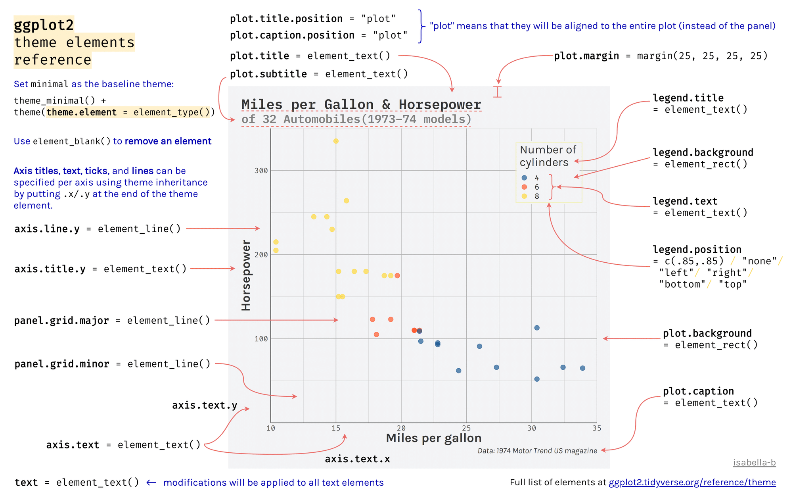

```{r setup, echo = FALSE}
knitr::opts_chunk$set(
  comment = "#",
  collapse = TRUE,
  warning = FALSE,
  message = FALSE,
  cache = TRUE,
  fig.width = 6, fig.height = 6,
  fig.retina = 3,
  fig.align = 'center'
)
options(repos=structure(c(CRAN="http://cran.r-project.org")))
```

class: inverse, center, middle

```{r install_pkgs, message=FALSE, warning=FALSE, include=FALSE, results=0}
# Standard procedure to check and install packages and their dependencies, if needed.

list.of.packages <- c('grid', 'gridExtra', 'ggplot2', 'ggsignif','ggdendro', 'maps', 'mapproj', 
                      'RColorBrewer','GGally','patchwork','plotly', 'reshape2', 'palmerpenguins')

new.packages <- list.of.packages[!(list.of.packages %in% installed.packages()[,"Package"])]

if(length(new.packages) > 0) {
  install.packages(new.packages, dependencies = TRUE) 
  print(paste0("The following package was installed:", new.packages)) 
} else if(length(new.packages) == 0) {
    print("All packages were already installed previously")
}

# load all packages
invisible(lapply(list.of.packages, library, character.only = TRUE))
```

```{r, echo = FALSE}
# set theme so the axis labels are bigger
theme_set(theme_classic())
```

# À propos de cet atelier
[](https://github.com/QCBSRworkshops/workshop03)
[](https://wiki.qcbs.ca/r_atelier3)
[](https://qcbsrworkshops.github.io/workshop03/workshop03-fr/workshop03-fr.html)
[](https://qcbsrworkshops.github.io/workshop03/workshop03-fr/workshop03-fr.pdf)
[](https://qcbsrworkshops.github.io/workshop03/workshop03-fr/workshop03-fr.R)

---

# Packages requis

* [grid](https://cran.r-project.org/package=grid)
* [gridExtra](https://cran.r-project.org/package=gridExtra)
* [ggplot2](https://cran.r-project.org/package=ggplot2)
* [ggsignif](https://cran.r-project.org/package=ggsignif)
* [ggdendro](https://cran.r-project.org/package=ggdendro)
* [maps](https://cran.r-project.org/package=maps)
* [mapproj](https://cran.r-project.org/package=mapproj)
* [RColorBrewer](https://cran.r-project.org/package=RColorBrewer)
* [GGally](https://cran.r-project.org/package=GGally)
* [patchwork](https://cran.r-project.org/package=patchwork)
* [palmerpenguins](https://cran.r-project.org/package=palmerpenguins)
* [plotly](https://cran.r-project.org/package=plotly)

<br>

```R
install.packages(c('grid', 'gridExtra', 'ggplot2', 'ggsignif', 'ggdendro', 'maps', 'mapproj', 'RColorBrewer', 'GGally', 'patchwork', 'plotly', 'palmerpenguins'))
```

---
# Objectifs d'apprentissage

Dans cet atelier, nous allons :

**1.** Apprendre les bases de la visualisation de données avec R.

**2.** Apprendre comment trouver des paquets et des ressources pour répondre à vos besoins.

**3.** Inspirer la créativité dans la science !

**4.** Développer une compréhension du design pour une communication visuelle efficace.


---

class: inverse, center, middle

# Introduction

---
# Introduction

##### Pour suivre cet atelier:

Code et .HTML sont disponibles à l'adresse suivante: http://qcbs.ca/wiki/r/workshop3

##### Recommandations:

  1. créez votre propre script R ;
  2. référez-vous au script R fourni uniquement si nécessaire ;
  3. évitez de copier-coller ou d'exécuter le code directement à partir du script.


---
# Plan de l'atelier

###### 1. La mécanique `ggplot2`

.center[

]


###### 2. Visualisation avancée

###### 3. Ajustement et peaufinage

###### 4. Enregistrer un graphique

###### 5. Conclusion

---
# Objectifs d'apprentissage

<br>

- Apprendre les bases de la visualisation des données à l'aide de R.
- Trouver des librairies et des ressources pour répondre à vos besoins.
- Inspirer plus de créativité dans les domaines scientifiques !
- Développer votre compréhension de la conception pour une communication graphique efficace.

---
class: inverse, center, middle

# Visualisation en science

---
# Visualisation en science
<br>

#### Pourquoi utilisons-nous la visualisation de données ?

#### Qu'est-ce qui rend une visualisation efficace ?

<br>

.center[]

Que pensez-vous de celle-ci ?

---
# Visualisation en science
<br>

1. Représenter les résultats des analyses statistiques
2. Formuler des hypothèses et comprendre/résumer des théories
3. Explorer vos propres données (analyse exploratoire, détection des valeurs aberrantes)
4. Communiquer et rendre compte
  - Clairement (en utilisant de bons principes de conception)
  - De manière précise et exacte (un bon graphique vaut 1000 mots)
  - De manière effective et efficace

---
# Visualisation en science
<br>

**Questions importantes** :

- Que voulez-vous communiquer?
- Qui est votre public?
- Quelle est la meilleure façon de visualiser votre message?

.center[
.alert[Une règle générale : restez simple - utilisez moins d'encre !]
]

--

#### Ressources utiles

- [Fundamentals of Data Visualization](https://serialmentor.com/dataviz/) (ggplot)
- [A Compendium of Clean Graphs in R](https://www.shinyapps.org/apps/RGraphCompendium/index.php#line-plots) (base plot)
- [Graphics Principles](https://graphicsprinciples.github.io/) (trucs et astuces de conception)

---
# AVERTISSEMENT!

<br>

.alert[
 `R` n'est pas fait pour le dessin.
]

D'autres logiciels de dessin sont probablement de meilleures options comme [GIMP](https://www.gimp.org/) ou [Inkscape](https://inkscape.org/). Il est important d'utiliser le bon outil pour la bonne tâche !

---
# Pourquoi utiliser R pour les graphiques ?

.center[]

---
# Pourquoi utiliser R pour les graphiques ?

#### .alert[Reproductibilité]

.center[]


.alert[La science reproductible requiert un effort]:
- commentez votre script
- ajoutez des informations dans vos figures (titres, étiquettes, légendes, annotations)
- ...

---
# Pourquoi utiliser R pour les graphiques ?

#### .alert[En raison de ses puissantes fonctionnalités !]

Dans cet atelier, nous nous concentrons uniquement sur `ggplot2`, mais [plusieurs librairies et fonctions](https://insileco.github.io/wiki/rgraphpkgs/) peuvent être utilisées pour une excellente visualisation (par exemple, ["base R"](https://bookdown.org/rdpeng/exdata/the-base-plotting-system-1.html), [plotly](https://plot.ly/r/), [sjPlot](http://www.strengejacke.de/sjPlot/), [mapview](https://r-spatial.github.io/mapview/), [igraph](https://igraph.org/r/)).


```{r, echo=FALSE, fig.width=9, fig.height=5.7}
source(file="./scripts/multiExamplePlot.R")
```


---
# `ggplot2` est polyvalent

1. La librairie [`ggplot2`](https://ggplot2.tidyverse.org/) vous permet de réaliser de *beaux* graphiques personnalisables;
2. `ggplot2` met en œuvre la grammaire des graphiques, un système fiable pour construire des graphiques;
3. `ggplot2` a de [nombreuses extensions](https://exts.ggplot2.tidyverse.org/gallery/).


.center[]


---
class: inverse, center, middle

# La mécanique `ggplot2`: les bases

---
# Les bases de la grammaire des graphiques (GG)

```{r, eval = FALSE}
install.packages("ggplot2") # if not already installed
library(ggplot2)
```

```{r, echo = FALSE}
library(ggplot2)
```

Un graphique est construit à partir de différente couches:

.center[

]

En utilisant le système GG, nous pouvons construire des graphiques étape par étape pour des résultats personnalisables.

---
# Les bases de la grammaire des graphiques (GG)

Ces couches ont des noms spécifiques que vous verrez tout au long de la présentation :


.small[image adaptée de [The Grammar of Graphics](https://www.springer.com/gp/book/9780387245447)]

???

note: _changed image to more intuitive layers_

---
exclude: true
# Les bases de la grammaire des graphiques (GG)

.center[

]

???

note: _removed this slide becase it felt random_

---
# Les bases de la grammaire des graphiques (GG)

Voici les éléments de base pour dessiner le plus simple des `ggplot`:


.center[

]


---
# La grammaire des graphiques (GG)

Un graphique est constitué d'éléments (couches):

- Données
    - vos données, dans un format bien ordonné, fourniront les ingrédients de votre graphique
    - utiliser les techniques `dplyr` pour préparer les données en vue d'un format de tracé optimal
    - en général, une ligne pour chaque observation que vous voulez représenter


---
# La grammaire des graphiques (GG)

Un graphique est constitué d'éléments (couches):

- Données
- Esthétique (aes), pour rendre les données visibles
    - `x`, `y`: position le long des axes x et y
    - `colour`: la couleur des géométries selon les données
    - `fill`: la couleur intérieure des géométries
    - `group`: à quel groupe appartient une géométrie
    - `shape`: la forme des points
    - `linetype`: le type de ligne utilisé (pleine, pointillée, etc.)
    - `size`: la taille des points ou des lignes
    - `alpha`: la transparence des géométries

--

.alert[note: l'esthétique est basée sur les quantités dans vos données, mais les graphiques peuvent également avoir certaines de ces qualités qui ne sont pas fonction des données (p. ex. la coloration basée sur un groupe de données est une esthétique, mais les points peuvent avoir une couleur qui n'est pas fonction des données)].

---
# La grammaire des graphiques (GG)

Un graphique est constitué d'éléments (couches):

- Données
- Esthétique (aes)
- Objets géométriques (geoms)
    * `geom_point()` : diagramme de dispersion
    * `geom_line()` : lignes reliant des points par une valeur croissante de x
    * `geom_path()` : lignes reliant des points dans l'ordre d'apparition
    * `geom_boxplot()` : diagramme en boîte (boxplot) pour les variables catégoriques
    * `geom_bar()` : diagrammes à barres pour un axe des x catégorique
    * `geom_histogram()` : histogramme pour l'axe des x continu
    * `geom_violin()` : kernel de distribution de la dispersion des données
    * `geom_smooth()` : ligne de lissage en fonction des données


---
# La grammaire des graphiques (GG)

Un graphique est constitué d'éléments (couches):

- Données
- Esthétique (aes)
- Objets géométriques (geoms)
- Facettes
    * `facet_wrap()` ou `facet_grid()` pour de petits multiples

???

note: _descriptions of scales to talk about more layers_

---
# La grammaire des graphiques (GG)

Un graphique est constitué d'éléments (couches):

- Données
- Esthétique (aes)
- Objets géométriques (geoms)
- Facettes
- Statistiques
    * similaire aux géométries, mais issue de calcul sur les données
    * indique les moyennes, les comptages et autres résumés statistiques des données


???

note: _descriptions of themes to talk about more  layers_

---
# La grammaire des graphiques (GG)

Un graphique est constitué d'éléments (couches):

- Données
- Esthétique (aes)
- Objets géométriques (geoms)
- Facettes
- Statistiques
- Coordonnées - ajustement des données sur une page
    * `coord_cartesian` pour fixer des limites
    * `coord_polar` pour les graphiques circulaires
    * `coord_map` pour différentes projections cartographiques


???

note: _descriptions of other layerss_


---
# La grammaire des graphiques (GG)

Un graphique est constitué d'éléments (couches):

- Données
- Esthétique (aes)
- Objets géométriques (geoms)
- Facettes
- Statistiques
- Coordonnées
- Thèmes
    * Effets visuels globaux par défaut
    * polices, couleurs, formes, contours

???

note: _descriptions of other layerss_

---
# Comment assembler ces couches

1. Créer un objet graphique simple :
  * `plot.object <- ggplot()`

2. Ajouter des couches géométriques :
  * `plot.object <- plot.object + geom_*()`

3. Ajouter des couches d'apparence :
  * `plot.object <- plot.object + coord_*() + theme()`

3. Répétez l'étape 2-3 jusqu'à ce que vous soyez satisfait, puis imprimez :
  * `plot.object` ou `print(plot.object)`.


---
# Le jeu de données: `palmerpenguins`

.pull-right2[

]

.pull-left2[
Nous allons utiliser le jeu de données `palmerpenguins`.

```{r, eval=FALSE}
install.packages("palmerpenguins")
library(palmerpenguins)
```

.small[Ce jeu de données contient des mesures morphologiques pour trois espèces de pingouins observées sur trois îles de l'archipel Palmer, en Antarctique: ]

]


.center[.xsmall[Artwork by [@allison_horst](https://twitter.com/allison_horst).]]


???

Ces données ont été recueillies de 2007 à 2009 par la Dre Kristen Gorman dans le cadre du programme de recherche écologique à long terme de la station Palmer, qui fait partie du réseau américain de recherche écologique à long terme.

Cet ensemble de données est souvent utilisé pour remplacer l'ensemble de données iris, qui pose certains problèmes pour l'enseignement de la science des données, notamment ses liens avec l'eugénisme (plus d'informations à ce sujet sur https://armchairecology.blog/iris-dataset/).

Cet ensemble de données a également été utilisé pour un défi TidyTuesday, montrant les nombreuses possibilités de visualisation créative de l'ensemble de données. Par exemple : [ceci](https://twitter.com/LauraNavarroSol/status/1289216490307063814?ref_src=twsrc%5Etfw%7Ctwcamp%5Etweetembed%7Ctwterm%5E1289216490307063814%7Ctwgr%5E%7Ctwcon%5Es1_c10&ref_url=https%3A%2F%2Fnsgrantham.shinyapps.io%2Ftidytuesdayrocks%2F), and [ceci](https://twitter.com/CedScherer/status/1288181995714093057?ref_src=twsrc%5Etfw%7Ctwcamp%5Etweetembed%7Ctwterm%5E1288181995714093057%7Ctwgr%5E%7Ctwcon%5Es1_c10&ref_url=https%3A%2F%2Fnsgrantham.shinyapps.io%2Ftidytuesdayrocks%2F).

---
# Le jeu de données: palmerpenguins

Regardons les variables du jeu de données des pingouins :

```{r}
str(penguins)
```

.center[

]

???

Notez que l'espèce, l'île et le sexe sont des facteurs, qui seront importantes pour regrouper les données avec des couleurs, des formes, etc. dans ggplot2. Il y a ensuite 2 variables numériques (mesures du bec représentées dans l'image), et deux variables entières (longueur des nageoires et masse corporelle). Les données ont également une petite composante temporelle, s'étendant de 2007 à 2009.

---
# Préparer les données pour `ggplot2`

La librairie `ggplot2` requiert de préparer les données comme un objet de la classe "data.frame" ou "tibble" (commun dans l'univers `tidyverse`).

```{r eval=TRUE, echo=TRUE}
library(tibble)
class(penguins) # Tout est prêt !

peng <- as_tibble(penguins) # acceptable
class(peng)
```

**&#x267B; Rappel de l'atelier [*Charger et manipuler des données*](https://qcbsrworkshops.github.io/workshop02/pres-fr/workshop02-pres-fr.html#1)**:

Les graphiques plus complexes dans les `ggplot2` nécessitent que les données soient en format long.

---
# Questions scientifiques à propos des pingouins

.center[

]

.center[**Questions scientifiques**]
<br>
- Y a-t-il une relation entre la **longueur** et la **profondeur** des **becs** ?
- Est-ce que la taille des **becs** et des **nageoires** varient ensemble ?
- Comment ces mesures sont-elles réparties entre les **3 espèces** ?

.center[.alert[Comment pouvons-nous répondre graphiquement à ces questions avec `ggplot2`?]]

---
# Explorer la structure des données

<!-- Explain the databases before the examples  -->

```{r, fig.width = 10.25, fig.height = 6.5}
library(GGally)
ggpairs(penguins, aes(colour = species)) + theme_bw()
```

???
ggpairs est dans la librairie GGally (chargée et installée au début de l'atelier). ggpairs (version ggplot du paquet psych) nous permet d'explorer les corrélations dans les données.

On peut déjà voir certains regroupements d'espèces entre la longueur et la profondeur du bec, la longueur des nageoires et la masse corporelle. Lors de la visualisation, il faudra garder à l'esprit que la différenciation des espèces peut être importante.

---
# Explorer la structure des données

Explorons comment ces données sont structurées par espèce:

```{r, echo = TRUE, fig.height=6, fig.width=8, eval = FALSE}
ggplot(data = penguins,               # Données
       aes(x = bill_length_mm,        # Valeurs X
           y = bill_depth_mm,         # Valeurs Y
           col = species)) +          # Esthétique (mettre une couleur par espèce)
  geom_point(size = 5, alpha = 0.8) + # Points
  geom_smooth(method = "lm") +        # Régression linéaire
  labs(title = "Relationship between bill length and depth\nfor different penguin species", # Title
       x = "Bill length (mm)", # titre de l'axe des X
       y = "Bill depth (mm)", # titre de l'axe des Y
       col = "Species") +  # Légende pour les couleurs dans aes(col = species)
  theme_classic() + # Utiliser un thème propre
  theme(title = element_text(size = 18, face = "bold"),
      text = element_text(size = 16))
```

.small[&#x267B; Voir l'atelier [*Charger et manipuler des données*](https://qcbsrworkshops.github.io/workshop02/pres-fr/workshop02-pres-fr.html#1) pour apprendre comment nettoyer vos données.]

???

Prenez le temps d'expliquer chaque ligne de code (surtout l'esthétique et les géomètres), et ce qu'elle nous dit.
Par exemple, en différenciant les espèces, on peut voir qu'il existe une relation assez cohérente entre la longueur et la profondeur du bec entre les espèces (pentes similaires), mais que les gammes de ces variables sont différentes (les regroupements sont clairement indiqués par les couleurs). Les pingouins Adélie ont tendance à avoir une longueur de bec plus petite mais une profondeur de bec assez grande, alors que l'inverse est vrai pour les pingouins Gentoo.

---
# Explorer la structure des données

Explorons comment ces données sont structurées par espèce:

```{r, echo = FALSE, fig.height=6, fig.width=8}
ggplot(data = penguins,               # Data
       aes(x = bill_length_mm,        # Your X-value
           y = bill_depth_mm,         # Your Y-value
           col = species)) +          # Aesthetics
  geom_point(size = 5, alpha = 0.8) + # Point
  geom_smooth(method = "lm") +        # Linear regression
  labs(title = "Relationship between bill length and depth\nfor different penguin species", # Title
       x = "Bill length (mm)",
       y = "Bill depth (mm)",
       col = "Species") + 
  theme_classic() + # apply a clean theme
  theme(title = element_text(size = 18, face = "bold"),
      text = element_text(size = 16))
```

.small[&#x267B; Voir l'atelier [*Charger et manipuler des données*](https://qcbsrworkshops.github.io/workshop02/pres-fr/workshop02-pres-fr.html#1) pour apprendre comment nettoyer vos données.]

???

Prenez le temps d'expliquer chaque ligne de code (surtout l'esthétique et les géomètres), et ce qu'elle nous dit.
Par exemple, en différenciant les espèces, on peut voir qu'il existe une relation assez cohérente entre la longueur et la profondeur du bec entre les espèces (pentes similaires), mais que les gammes de ces variables sont différentes (les regroupements sont clairement indiqués par les couleurs). Les pingouins Adélie ont tendance à avoir une longueur de bec plus petite mais une profondeur de bec assez grande, alors que l'inverse est vrai pour les pingouins Gentoo.

---
exclude: true
# L'héritage dans  `ggplot2`

.small[

.pull-left[
**avec héritage**
```{r, fig.height = 5}
p <- ggplot(data = penguins,
            aes(x = bill_length_mm,
                y = bill_depth_mm))
p <- p + geom_point()
p
```
]

.pull-right[
**sans héritage**
```{r, fig.height = 5}
s <- ggplot()
s <- s + geom_point(data = penguins,
                    aes(x = bill_length_mm,
                        y = bill_depth_mm))
s # Print your final plot
```
]

]

???

note: _removed this slide because it felt random, but is maybe worth going over at some point - edit. moved to challenge 1 answer_

---
# La grammaire des graphiques: *rappel*

Un graphique est constitué de différentes couches :


---
# La dynamique `ggplot()` : la couche de données

```{r, echo = FALSE, results=0}
theme_update(axis.text = element_text(size = 16),
             axis.title = element_text(size = 18))
```


```{r, fig.height=5, fig.width=6}
ggplot(data = penguins)
```

???

theme_classic() a été appliqué à tous les graphiques de la présentation pour aider à la clarté en utilisant theme_set au début de ce diaporama, donc ces graphiques n'ont pas le fond gris de base de ggplot2. Il y a une section sur les thèmes plus loin dans la présentation, mais c'est une bonne idée de mentionner qu'un thème a été appliqué pour supprimer le fond gris par défaut, ce que les participants pourraient voir s'ils exécutent les morceaux de code eux-mêmes en suivant la présentation.

---
# La dynamique `ggplot()` : la couche d'esthétiques

```{r, fig.height=5, fig.width=6}
ggplot(data = penguins, 
       aes(x = bill_length_mm, y = bill_depth_mm)) 
```

---
# La dynamique `ggplot()` : la couche de géométries

```{r, fig.height=5, fig.width=6}
ggplot(data = penguins, 
       aes(x = bill_length_mm, y = bill_depth_mm)) +
  geom_point()
```

???

Noter que le code ggplot2 est plus facile à lire si chaque ligne représente un nouvel élément. Ce style est généralement favorisé pour le code ggplot2 dans la communauté R.

---
## La dynamique `ggplot()` : les couches extras - facette, stats, coordonnées

```{r,fig.height=5, fig.width=6}
ggplot(data = penguins, 
       aes(x = bill_length_mm, y = bill_depth_mm)) +
  geom_point() + 
  facet_wrap(~species) +
  coord_trans(x = "log10", y = "log10")
```

---
# Défi 1 (5min) 

#### Créer votre 1er graphique ggplot!

.alert[Question]

> Y a-t-il une relation entre la **longueur des becs** et la **longueur des nageoires** des pingouins?

> La **longueur** des becs augmente-t-elle avec celle des **nageoires**?

.center[Paramètres à prendre en compte pour répondre à cette question :]

 données | géométrie | valeurs x | valeurs y
:-------------:|:-------------:|:-------------:|:-------------:
penguins | geom_point | bill_length_mm | flipper_length_mm


---
# Défi 1: Solution 

```{r}
ggplot(data = penguins, 
       aes(x = bill_length_mm,
           y = flipper_length_mm)) +
  geom_point()
```


---
# Défi 1#: Solution 

.pull-left2[
```{r}
ggplot(data = penguins, 
       aes(x = bill_length_mm,
           y = flipper_length_mm)) +
  geom_point()
```
]

.pull-right2[
**note**: L'esthétique peut être soit dans la ligne `ggplot()`, et sera héritée par chaque géométrie, soit dans la ligne `geom_*()` à appliquer à cette géométrie seulement !
]

---
# Défi 1#: Solution 

.pull-left2[
```{r}
ggplot(data = penguins,
       aes(x = bill_length_mm,
           y = flipper_length_mm)) +
  geom_point(shape = 2, color = "blue")
```
]

.pull-right2[
**note**: L'esthétique peut être soit dans la ligne `ggplot()`, et sera héritée par chaque géométrie, soit dans la ligne `geom_*()` à appliquer à cette géométrie seulement !

<br>
<br>

**note 2**: les commandes `colour`, `alpha`, `shape`, et `size` peuvent être définies en dehors des valeurs de `aes()`, et seront alors statiques, non dépendantes des données.
]
---

class: inverse, center, middle

# Esthétique ou *Aesthetic mappings*

## couleur, forme, taille, étiquettes et transparence

---
# Esthétique

**Utiliser l'esthétique (`aes()`) pour distinguer les classes, les groupes et la structure**


```{r echo = FALSE, fig.width = 8, fig.height = 6.5}
library(gridExtra)
source(file="./scripts/4plot_aesthetic.R")
```

---
# Les couleurs: faites parler vos données

Changez la **couleur** pour

&nbsp;  différencier entre des groupes

&nbsp;  représenter les valeurs des données

&nbsp;  mettre en évidence des éléments spécifiques

.pull-left[
```{r, echo = FALSE, fig.height=4.8, fig.width = 5}
ggplot(penguins, 
       aes(x = bill_length_mm, 
           y = bill_depth_mm)) +
  geom_point(aes(colour = species)) +
  labs(title = "Couleurs qualitatives \npour des groupes",
       x = "Longueur du bec (mm)",
       y = "Profondeur du bec (mm)",
       col = "Espèce") +
  theme(title = element_text(size = 16, face = "bold"),
        legend.title = element_text(size = 14),
        legend.text = element_text(size = 14),
        legend.position = 'bottom')
```
]

.pull-right[
```{r, echo = FALSE, fig.height=4.8, fig.width = 5}
ggplot(penguins, 
       aes(x = bill_length_mm, 
           y = bill_depth_mm)) +
  geom_point(aes(colour = body_mass_g)) +
  labs(title = "Gradient de couleurs \npour des valeurs",
       x = "Longueur du bec (mm)",
       y = "Profondeur du bec (mm)",
       col = "Masse corporelle (g)") +
  theme(title = element_text(size = 16, face = "bold"),
        legend.title = element_text(size = 14),
        legend.text = element_text(size = 12, angle = 35),
        legend.position = 'bottom')
```
]

.footnote[Voir [Fundamentals of Data Visualization](https://serialmentor.com/dataviz/colour-basics.html)]

---
# Utiliser `aes()` pour changer les couleurs

La longueur des becs et des nageoires varient-elles selon les espèces ?
.pull-left[
```{r, fig.align = 'default', fig.asp=2/3}
# No colour mapping
ggplot(data = penguins, 
       aes(x = bill_length_mm, 
           y = flipper_length_mm)) +
  geom_point() +
  geom_smooth(method = lm)+
  labs(title = "Sans code de couleur")
```
]

.pull-right[
```{r,  fig.align = 'default', fig.asp=2/3}
# With colour mapping
ggplot(data = penguins, 
       aes(x = bill_length_mm, 
           y = flipper_length_mm,
           col = species)) +
  geom_point() +
  geom_smooth(method=lm) +
  labs(title = "Avec code de couleur")
```
]

---
# Changer les couleurs manuellement

.pull-left[
```{r, fig.align = 'default', fig.asp=2/3}
# Défaut
pp <- ggplot(data = penguins) +
  geom_point(aes(x = bill_length_mm, 
                 y = bill_depth_mm, 
                 colour = species))
pp + labs(title = "Défaut")
```
]
.pull-right[
```{r, fig.align = 'default', fig.asp=2/3}
# Personnalisé
pp + 
scale_colour_manual(
  values = c("grey55", "orange", 
             "skyblue")) +
  labs(title = "Personnalisé")
```
]

???
scale_colour_manual() et scale_fill_manual() permettent de choisir des colours, mais c'est important de s'assurer que les couleurs choisies sont un bon choix pour la visualisation (claires, assez de contraste, etc.). Plus sur ceci dans quelques diapos!

---
# Gradient de couleurs

.pull-left[
```{r, fig.align = 'default', fig.asp=2/3}
pp2 <- ggplot(data = penguins) +
  geom_point(aes(x = bill_length_mm, 
                 y = bill_depth_mm,
                 colour = body_mass_g))
pp2 + labs(title = "Défaut")
```
]
.pull-right[
```{r, fig.align = 'default', fig.asp=2/3}
pp2 +
  scale_colour_gradient(low = "blue",
                        high = "red") +
  labs(title = "Personnalisé")
```
]

???
Il y a aussi scale_colour_gradient2() pour créer un gradient avec une valeur 'midpoint' pour un gradient qui diverge.

---
# Utiliser une palette de couleurs prédéfinie

```{r, eval = FALSE}
install.packages("RColorBrewer")
library(RColorBrewer)
display.brewer.all()
```


---
# Utiliser une palette de couleurs prédéfinie

```{r, fig.align = 'center', fig.height = 5, fig.width=6.5}
pp + 
  scale_colour_brewer(palette = "Dark2") +
  labs(title = "Palette pour des groupes")
```

---
# Utiliser une palette de couleurs prédéfinie

```{r, fig.align = 'center', fig.height = 5, fig.width=6.5}
pp2 + 
  scale_color_viridis_c()+
  labs(title = "Palette pour des variables continues")
```


---
# Utiliser une palette de couleurs prédéfinie

Palette de gris pour la publication

```{r, fig.align = 'center', fig.height = 5, fig.width=6.5}
pp + 
  scale_colour_grey() +
  labs(title = "Palette pour des groupes")
```

---
# Utiliser une palette de couleurs prédéfinie

```{r, fig.align = 'center', fig.height = 5, fig.width=6.5}
pp2 + 
  scale_colour_gradient(low = "grey85", high = "black") +
  labs(title = "Palette pour des variables continues")
```


---
# Utiliser des palettes de couleurs visibles pour les daltoniens

Comment votre figure peut-elle apparaître sous différentes formes de daltonisme ?
Nous pouvons utiliser [colorblindr](https://github.com/clauswilke/colorblindr) qui n'est pas actuellement sur CRAN, donc nous l'installons avec la librairie [remotes](https://cran.r-project.org/web/packages/remotes/index.html).

```{R colorblindr_install, message = FALSE}
# install.packages("remotes")
remotes::install_github("clauswilke/colorblindr", quiet = TRUE)
library(colorblindr)
```

---
# Utiliser des palettes de couleurs visibles pour les daltoniens

```{r, fig.width = 11, fig.height = 6.5}
cvd_grid(pp)
```

---
# Utiliser des palettes de couleurs visibles pour les daltoniens


.pull-left[
```{r, fig.height = 5}
pp + 
  scale_colour_viridis_d() +
  labs(title = "Palette viridis pour des groupes")
```
]

.pull-right[
```{r, fig.height = 5}
pp2 + 
  scale_colour_viridis_c() +
  labs(title = "Palette viridis pour des variables continues")
```
]


---
# Changer la forme, la taille et la transparence

.pull-left[
```{r, fig.height = 5}
ggplot(data = penguins) +
  geom_point(aes(x = bill_length_mm, 
                 y = bill_depth_mm, 
                 shape = species)) +
  labs(title = "Formes pour des groupes")
```
]

.pull-right[
```{r, fig.height = 5}
ggplot(data = penguins) +
  geom_point(aes(x = bill_length_mm, 
                 y = bill_depth_mm, 
                 size = body_mass_g,
                 alpha = flipper_length_mm)) +
  labs(title = "Taille et transparence pour des variables continues")
```
]

???
Notez que le fait de définir simultanément de nombreuses variables pour les repères visuels tels que la couleur, la forme, la taille et l'alpha a tendance à être excessif pour le lecteur. L'ajout de quatre niveaux de complexité à la représentation en 2D des points peut être trop important pour être bien interprété. Il est préférable de choisir les indices visuels et les variables clés pour le message souhaité plutôt que de surcharger un graphique avec toutes les possibilités de la fonction aes().

---
# Défi #2 

- Créer un graphique informatif à partir de jeu de données disponible de R, comme `mtcars`, `CO2` ou `msleep`.

- Utiliser les esthétiques appropriés pour différents types de données


<br>

Données | x | y | Esthétiques
:-------------:|:-------------:|:-------------:|:-------------:
mtcars |*wt* |*mpg* | *disp* et *hp*
CO2 |*conc* |*uptake* | *Treatment* et *Type*
msleep |log10(*bodywt*) |*awake* | *vore* et *conservation*
ToothGrowth | *dose* | *len* | *supp*

<br>
.center[.alert[
 Faites attention aux types de données !
]
]

---
# Défi #2 

#### .alert[Salles de réunion ! - 15 min]
<br>

Créez un graphique à partager avec le groupe


???
note: _assign each group a dataset to make a plot from: mtcars, CO2, msleep, and ToothGrowth to make exploratory plots_

---
# Défi #2 - Solution exemple #1

.small[

Données | x | y | Esthétiques
:-------------:|:-------------:|:-------------:|:-------------:
mtcars |*wt* |*mpg* | *disp* et *hp*

]

```{r, fig.height=3.5, fig.width=6}
data(mtcars)
ggplot(data = mtcars) +
  geom_point(aes(x = wt, y = mpg,
                 colour = disp,
                 alpha = hp))
```

.comment[Pourriez-vous utiliser `size` au lieu de `alpha`? Et `shape`?]

---
# Défi #2 - Solution exemple #2

.small[

Données | x | y | Esthétiques
:-------------:|:-------------:|:-------------:|:-------------:
CO2 |*conc* |*uptake* | *Treatment* et *Type*

]

```{r, fig.height=3.5, fig.width=6}
data(CO2)
ggplot(data = CO2) +
  geom_point(aes(x = conc, 
                 y = uptake,
                 colour = Treatment, 
                 shape = Type))
```

.comment[Pourquoi ne pas utiliser `size = Type`?]

---
# Défi #2 - Solution exemple #3

.small[

Données | x | y | Esthétiques
:-------------:|:-------------:|:-------------:|:-------------:
msleep |log10(*bodywt*) |*awake* | *vore* et *conservation*

]

```{r, fig.height=3.5, fig.width=6}
data(msleep)
ggplot(data = msleep) +
  geom_point(aes(x = log10(bodywt), 
                 y = awake,
                 colour = vore, 
                 shape = conservation))
```

---
# Défi #2 - Solution exemple #4

.small[

Données | x | y | Esthétiques
:-------------:|:-------------:|:-------------:|:-------------:
ToothGrowth | *dose* | *len* | *supp*

]

```{r, fig.height=3.5, fig.width=6}
data(ToothGrowth)
ggplot(ToothGrowth, aes(x = dose, 
                        y = len, 
                        color = supp)) +
  geom_point() +
  geom_smooth(method = lm, formula = 'y~x')
```

---
class: small-code
# Changer l'échelle des axes
.tiny[
.pull-left[
```{r,fig.height=4}
ggplot(diamonds) +
  geom_point(aes(x = carat, 
                 y = price)) +
  labs(title = "Échelle originale")
```
]
]
.pull-right[
```{r,fig.height=4}
ggplot(diamonds) +
  geom_point(aes(x = carat, 
                 y = price)) +
  coord_trans(x = "log10",
              y = "log10") +
  labs(title = "Échelle log10")
```
]

<br>
.small[Il est également possible de transformer le système de coordonnées en utilisant `scale_x_log10()` et `scale_y_log10()`.]

<!-- explain the difference -->

???
Expliquer la différence et pourquoi la transformation peut être utile pour la visualisation. Par exemple, la masse corporelle est souvent transformée avec log10.

---
class: inverse, center, middle

# Peaufinage

# Utiliser le `theme()` pour faire bonne figure!

---
# `theme()`

**Default: theme_grey()**
```{r, fig.height = 5, fig.align='center'}
# Theme grey
pp + scale_colour_grey() +
  theme_grey() +
  labs(title = "Défaut: Thème gris")
```

---
# `theme()`


.pull-left[
```{r, fig.height = 5}
pp + scale_colour_grey() +
  theme_classic() +
  labs(title = "Thème classique")
```
]

.pull-right[
```{r, fig.height = 5}
pp + scale_colour_grey() +
  theme_minimal() +
  labs(title = "Thème minimal")
```
]

.footnote[NB: De bons choix pour la publication !]

???

Cette présentation a utilisé theme_classic() pour les figures, puisque le fond gris rend certaines couleurs difficiles à voir. Ces thèmes sont des bonnes options pour publier des figures. 

---
# `theme()`

Utiliser `theme_set()` pour changer le thème pour tous vos prochains graphiques,
ou `theme_update()` pour modifier certains aspects d'un thème.


.pull-left[
**Définir le thème**
```{r, fig.height = 5, fig.width = 6.5}
# Choisir le thème par défaut
theme_set(theme_bw())
pp
```
]

.pull-right[
**Mettre à jour le thème**
```{r, fig.height = 4.5, fig.width = 6.5}
# supprimer la grille mineure
theme_update(panel.grid.minor = element_blank())
pp
```
]


```{r, include=FALSE}
theme_set(theme_bw())
theme_update(panel.grid.minor = element_blank(),
             axis.text = element_text(size = 16),
             axis.title = element_text(size = 18))
```

---
exclude: true
# ggThemeAssist: Extension de RStudio


???
note: _removed this slide to add theme image instead_


---
# `theme()`

Les élements d'un thème




---
class: inverse, center, middle

# Peaufiner vos graphiques

# Utiliser `facet_grid()` pour pour diviser un graphique

---
# Facettes selon une variable

```{r, warning = FALSE, message = FALSE}
ggplot(data = penguins) +
  geom_point(mapping = aes(x = bill_length_mm, 
                           y = bill_depth_mm, 
                           colour = species)) +
  facet_grid(~ species, 
             scales = "free") # l'échelle de l'axe des y peut varier entre les facettes.
```

???

Ne faites pas scales = 'free' si vous comparez des facettes via l'axe des y !


---
# Facettes selon deux variables

```{r, warning = FALSE, message = FALSE}
ggplot(data = penguins) +
  geom_point(mapping = aes(x = bill_length_mm, 
                           y = bill_depth_mm, 
                           colour = species)) +
  facet_grid(year ~ species, 
             scales = "free")
```

---
exclude: true

# Titre et axes: changer la taille, la couleur et l'apparence

.center[]

???
This is redundant with the elements of a theme figure from slide 74, and now out of date due to the removal of iris.

---
# Titre et axes: changer la taille, la couleur et l'apparence

.pull-left[
**Défaut**
<br><br>
```{r, echo=FALSE, fig.align="center", fig.width=5.5, fig.height=5}
pp
```
]
.pull-right[
**Ajustement des axes et du titre**
<br><br>
```{r, echo=FALSE, fig.align="center", fig.width=5.5, fig.height=5}
pp +
  ggtitle("Relation entre longueur \net profondeur des becs") +
  xlab("Longueur des becs (mm)") +
  ylab("Profondeur des sépales (mm)") +
  theme(axis.title.x = element_text(size = 16),
        axis.title.y = element_text(size = 16),
        axis.text.x = element_text(size = 12),
        axis.text.y = element_text(size = 12),
        plot.title = element_text(size = 16, face = "bold"),
        legend.title = element_text(size = 14, face = "bold"),
        legend.text = element_text(size = 12))
```

]

---
# Défi #3 

Utilisez les données `tips` qui se trouvent dans `reshape2` &#x1F4E6; pour reproduire le graphique ci-dessous.


Notre conseil: Allez-y étape par étape! Commencez par `theme_classic()` et ajoutez `theme()` pour faire vos changements supplémentaires.

```{r, echo=FALSE, fig.width=10, fig.height=5}
library(reshape2)
tips.gg <- ggplot(tips, aes(x = total_bill,
                            y = tip/total_bill,
                            shape = smoker,
                            colour = sex,
                            size = size)) +
  geom_point() +
  facet_grid( ~ time) +
  scale_colour_grey() +
  labs(title = "Relation entre la facture totale et les pourboires pendant les repas",
       x = "Facture totale ($)", y = "Ratio entre pourboires et facture totale") +
  theme_classic() +
  theme(axis.title = element_text(size = 16,
                                  colour = "navy"),
        axis.text = element_text(size = 12),
        plot.title = element_text(size = 16,
                                  colour = "orange3",
                                  face = "bold"),
        strip.text.x = element_text(size = 14, face ="bold"))
tips.gg
```

---
# Défi #3 

#### .alert[Salles de réunion! - 15 min]

???
note: _give teams time to work together to recreate this plot. Refer to theme elements slide_

---
# Défi #3: Solution

```{r, eval=FALSE}
library(reshape2)
tips.gg <- ggplot(tips, aes(x = total_bill,
                            y = tip/total_bill,
                            shape = smoker,
                            colour = sex,
                            size = size)) +
  geom_point() +
  facet_grid( ~ time) +
  scale_colour_grey() +
  labs(title = "Relation entre la facture totale et les pourboires pendant les repas",
       x = "Facture totale ($)", y = "Ratio entre pourboires et facture totale") +
  theme_classic() +
  theme(axis.title = element_text(size = 16,
                                  colour = "navy"),
        axis.text = element_text(size = 12),
        plot.title = element_text(size = 16,
                                  colour = "orange3",
                                  face = "bold"),
        strip.text.x = element_text(size = 14, face ="bold"))
tips.gg
```

---
# Défi #3: solution par étapes

#### `aes()`

```{r, fig.width = 7, fig.height=5}
tips.gg <- ggplot(tips) +
  geom_point(mapping = aes(x = total_bill, y = tip/total_bill,
                           shape = smoker, colour = sex, size = size)) +
  theme_classic()
tips.gg
```

```{r, include=FALSE, eval = FALSE}
theme_set(theme_classic())
```

---
# Défi #3: solution par étapes

#### `facet_grid()`

```{r, fig.width=7, fig.height=5}
tips.gg <- tips.gg +
  facet_grid( ~ time)
tips.gg
```


---
# Défi #3: solution par étapes

#### Palette de gris

```{r, fig.width=7,fig.height=5}
tips.gg <- tips.gg +
  scale_colour_grey()
tips.gg
```

---
# Défi #3: solution par étapes

#### Ajout du titre et des étiquettes du graphique

```{r, fig.width=7,fig.height=5}
tips.gg <- tips.gg +
  labs(title = "Relation entre la facture totale et les pourboires pendant les repas",
       x = "Facture totale ($)", y = "Ratio entre pourboires et facture totale")
tips.gg
```

---
# Défi #3: solution par étapes

#### Ajout et ajustement du thème

.small[
```{r, fig.width=6, fig.height=4}
tips.gg <- tips.gg +
  theme_classic() +
  theme(axis.title = element_text(size = 16, colour = "navy"),
        axis.text = element_text(size = 12),
        plot.title = element_text(size = 16, colour = "orange3", face = "bold"),
        strip.text.x = element_text(size = 14, face = "bold"))
tips.gg
```
]

---
class: inverse, center, middle

# Peaufiner vos graphiques

# Utiliser `geom_*()` pour créer différents types de graphique

---
# `ggplot2::geom_*()`

.center[

]

---
exclude: true
# `base::plot()`

.center[

]

???
note: removed this slide. Not sure why it's here.

---
# `ggplot2::ggplot()`

Sans `geom_*` pour représenter des variables, on a une figure vide:

```{r, fig.align="center",fig.height=5}
ggplot(penguins)
```


---
# Histogrammes: `geom_histogram()`

Un **histogramme** est une représentation graphique précise de la répartition des données numériques - une seule esthétique requise: la variable `x`.

```{r, fig.align="center", fig.height=5}
ggplot(penguins, 
       aes(x = bill_length_mm)) +
  geom_histogram() +
  ggtitle("Histogramme de la longeur des becs")
```


---
# Nuage de points et régression linéaire: `geom_point()` et `geom_smooth()`

.small[
.pull-left[
```{r, fig.width=5.5, fig.height=5.5}
ggplot(mpg, aes(displ, hwy)) +
  geom_point() +
  labs(title = "Nuage de points")
```
]

.pull-right[
```{r, fig.width=5.5, fig.height=5.5}
ggplot(mpg, aes(displ, hwy)) +
  geom_point() +
  labs(title = "Régression linéaire") +
  geom_smooth(method = lm)
```
]
]
---
# Diagramme en boîte: `geom_boxplot()`

```{r, fig.align="center", fig.height=5}
ggplot(data = penguins, 
       aes(x = species, 
           y = bill_length_mm,
           fill = species)) +
  geom_boxplot() +
  labs(title = "Diagramme en boîte")
```

---
# Diagramme en boîte: `geom_boxplot()`

```{r, echo=FALSE, fig.align="center", fig.width = 5, fig.height = 3.2}
ggplot(data = penguins, 
       aes(x = species, 
           y = bill_length_mm,
           fill = species)) +
  geom_boxplot() +
  labs(title = "Diagramme en boîte")
```

.center[

]

---
# Diagramme en boîte avec annotations: `geom_boxplot()` et `geom_signif()`

.pull-left3[
```{r, fig.align="center",fig.height=5.5, eval = FALSE}
library(ggsignif)
ggplot(data = penguins, 
       aes(x = species, 
           y= bill_length_mm,
           fill = species)) +
  geom_boxplot() +
  geom_signif(comparisons = 
                list(c("Adelie", "Gentoo")),
              map_signif_level=TRUE)
```
]
.pull-right3[
```{r, fig.align="center",fig.height=5.5, echo = FALSE}
library(ggsignif)
ggplot(data = penguins, 
       aes(x = species, 
           y= bill_length_mm,
           fill = species)) +
  geom_boxplot() +
  # spécifie la comparaison qu'on veut faire
  geom_signif(comparisons = 
                list(c("Adelie", "Gentoo")),
              map_signif_level=TRUE)
```
]

???

geom_signif calcule la significativité de la différence entre groupes et note le résultat sur la figure.

---
# Diagramme en violon: `geom_violin()`

Comme expliqué sur le site [from Data to Viz](https://www.data-to-viz.com/graph/violin.html)

> Le graphique en forme de violon permet de visualiser la distribution d'une variable numérique pour un ou plusieurs groupes. [...] Il est très proche du diagramme en boîte, mais permet une compréhension plus approfondie de la distribution.

.pull-left[
```{r, echo=FALSE, fig.height=4.4}
# Data
names <- c(rep("A", 80), rep("B", 50), rep("C", 70))
value <- c(sample(2:5, 80, replace = TRUE),
           sample(4:10, 50, replace = TRUE),
           sample(1:7, 70, replace = TRUE))
data <- data.frame(names, value)

#Graph
qplot(x = names, y = value, data = data, geom = c("boxplot", "jitter"), fill = names)
```
]
.pull-right[
```{r, echo=FALSE, fig.height=4.4}
ggplot(data = data, aes(names, value, fill = names)) + geom_violin()
```
]

---
# Diagramme en violon: `geom_violin()`

```{r, fig.align="center"}
violin <- ggplot(data = penguins, 
                 aes(x = species, y = bill_length_mm)) +
  geom_violin(trim = FALSE, fill = "grey70", alpha = .5) +
  labs(title = "Violin plot")
violin
```

---
# Diagramme en violon: `geom_violin()` + `_boxplot()` + `_jitter()`

```{r, fig.align="center"}
violin +
  geom_jitter(shape = 16, position = position_jitter(0.2), alpha = .3) +
  geom_boxplot(width = .05)
```

???

Plusieurs geoms peuvent être utilisés en même temps! L'ordre des geoms dans le code détermine comment ils se superposent.

---
# Résumer des valeurs: `stat_summary()`

.pull-left[
```{r, fig.height=5, fig.width=4}
ggplot(mtcars, aes(cyl, mpg)) +
  geom_point() +
  stat_summary(fun = "mean", geom = "point",
               colour = "red", size = 5) +
  labs(title = "Moyenne")
```
]

.pull-right[
```{r, fig.height=5, fig.width=4}
ggplot(mtcars, aes(cyl, mpg)) +
  geom_point() +
  stat_summary(fun.data = "mean_cl_boot",
               colour = "red", size = 2) +
  labs(title = "Moyenne et intervalle de confiance")
```
]

---
# Résumer des valeurs

Voir aussi `geom_errorbar()`, `geom_pointrange()`, `geom_linerange()`, `geom_crossbar()` afficher d'autres statistiques pour résumer vos données.


---
# Créer des cartes: `geom_map()`
.small[
```{r}
crimes <- data.frame(state = tolower(rownames(USArrests)), USArrests)
crimesm <- reshape2::melt(crimes, id = 1)

library(maps)
states_map <- map_data("state")

ggplot(crimes, aes(map_id = state)) +
  geom_map(aes(fill = Murder), map = states_map) +
  expand_limits(x = states_map$long, y = states_map$lat) +
  coord_map()
```
]

---
# Graphique de densité: `geom_density()`

.small[Un graphique de densité montre la distribution d'une variable numérique et il ne prend qu'un ensemble de valeurs numériques comme entrée.]
.pull-left[
```{r, echo=TRUE, fig.width=5, fig.height=4.4}
(peng.dens <- 
   ggplot(penguins, 
          aes(x = bill_length_mm)) +
   geom_density())
```
]

.pull-right[
```{r, echo=TRUE, fig.width=5, fig.height=4.4}
(cars.dens <- 
   ggplot(cars, 
          aes(x = dist)) +
   geom_density())
```
]

---
# Dendogramme: `ggdendrogram()`

```{r}
library(ggdendro)
USArrests.short = USArrests[1:10,]
hc <- hclust(dist(USArrests.short), "ave")

ggdendrogram(hc, rotate = TRUE, theme_dendro = FALSE)
```


---
# Disposition des graphiques: `patchwork`

**Ajouter plusieurs graphiques sur une seule figure**

```{r, fig.width=9, fig.height=5}
# install.packages("patchwork")
library(patchwork)
peng.dens + cars.dens +
  plot_annotation(tag_levels = 'a')
```

---
# Défi 4 

Créez votre propre graphique et suivez ces recommandations :
  * Jeu de données : n'importe lequel (recommandation : utilisez votre jeu de données)
  * Explorez un nouveau `geom_*` et d'autres couches de graphiques


Utilisez les liens suivants pour obtenir des conseils :

- [ggplot2 Reference](https://ggplot2.tidyverse.org/reference/index.html)  
- [R Graph Gallery](https://www.r-graph-gallery.com/ggplot2-package.html)  
- [Data to Viz](https://www.data-to-viz.com/)

---
# Défi 4: Solution exemple 1

.small[
```{r, fig.align='center',fig.height=4, warning = FALSE, message = FALSE}
data(msleep)
ggplot(msleep, 
       aes(x = vore, 
           y = log10(brainwt), 
           fill = vore)) + 
  geom_violin() +
  geom_signif(comparisons = list(c("herbi", "insecti"))) +
  labs("Poids du cerveau pour les différents -vores", 
       y = "log10(Poids du cerveau (Kg))") +
  scale_fill_grey() +
  theme_classic()
```
]

---
# Défi 4: Solution exemple 2
.small[
```{r, fig.align='center', fig.width=5, fig.height=4}
data(mtcars)
# let's do some clustering!
mtcars.short <- mtcars[1:20,]
mtcars.short.hc <- hclust(dist(mtcars.short), "average")

ggdendrogram(mtcars.short.hc, rotate = TRUE) + 
  # fine-tuning
  labs(title = "Dendrogramme des voitures selon les spécifications du moteur", y ="Voitures") +
  theme(axis.title.y = element_text(size = 16),
        axis.text.y = element_text(size = 12),
        axis.title.x = element_blank(), axis.text.x = element_blank(),
        plot.title = element_text(size = 14, face="bold"))
```
]

---
## Divers : graphiques interactifs avec `plotly()`

.small[
.alert[**Sélectionnez les données sur les espèces à afficher directement dans la légende**]

```{r, echo = TRUE, fig.width=10, fig.height=4.5}
p <- ggplot(penguins,
           aes(x = bill_length_mm, y = bill_depth_mm, 
               colour = species, shape = species)) +
    geom_point(size=6, alpha=0.6)
# convertir en objet plotly
plotly::ggplotly(p)
```
]

???

On peut cliquer sur les espèces dans la légende pour ajouter/supprimer des espèces. On peut également voir les valeurs en passant la souris sur les points.
---
class: inverse, center, middle

# Sauvegarder vos graphiques

---
exclude: true

# Sauvegarder des graphiques en RStudio

<div style="text-align:center">

</div>

.small[
.alert[Pensez à la marge du document que vous utilisez. Si vous redimensionnez l'image après l'avoir enregistrée, les étiquettes et le texte changeront également de taille, ce qui pourrait être difficile à lire.
]
]
---
# Sauvegarder des graphiques à l'aide de fonction R

`ggsave()` écrit directement dans votre répertoire de travail et vous permet de spécifier le nom du fichier, les dimensions du graphique, la résolution, etc.

```{r, eval=FALSE}
mon_1er_graph <- ggplot(penguins, 
         aes(x = bill_length_mm, 
             y = bill_depth_mm)) +
  geom_point()

ggsave("mon_1er_graph.pdf",
       mon_1er_graph,
       height = 8.5, width = 11, units = "in", res = 300)
```

NB: Le format vectoriel (par exemple, pdf, svg) est plus flexible que le format raster (jpeg, png, ...) si l'image doit être modifiée par la suite.

---
# Sauvegarder des graphiques à l'aide de fonction R

<br>

Autres méthodes de sauvegarde des figures: voir `?pdf` `?jpeg`

```{r, eval=FALSE}
pdf("./graph_du_jour.pdf")
  print(mon_1er_graph) # la fonction print est nécessaire
graphics.off()
```


---
# Sauvegarder des graphiques à l'aide de fonction R
<br>

**Tip:** Les fonctions `quartz()` (sur mac) ou `window()` (sur pc) facilitent la mise en forme avant de sauvegarder avec `ggsave()`!

???
note: _this function allows to resize plot live, then use ggsave without specifying plot._


---
class: inverse, center, middle

# Considérations finales


---
# Ressources additionelles


- `help(package = ggplot2)`
- [Data Visualization with ggplot2 Cheat Sheet](https://github.com/rstudio/cheatsheets/raw/master/data-visualization.pdf)
- [ggplot2 Reference](http://ggplot2.tidyverse.org/reference/)
- [Fundamentals of Data Visualization](https://serialmentor.com/dataviz/)  
- [From Data to Viz](https://www.data-to-viz.com/)
- [A Compendium of Clean Graphs in R](https://www.shinyapps.org/apps/RGraphCompendium/index.php#line-plots) (base R)
- [Graphics Principles](https://graphicsprinciples.github.io/) (design tips)
- [The R Graph gallery](https://www.r-graph-gallery.com)
-  Lecture notes from Hadley's course Stat 405 (the other lessons are
awesome too!)
  -   <http://stat405.had.co.nz/lectures/11-adv-data-manip.pdf>
  -   <http://stat405.had.co.nz/lectures/19-tables.pdf>

???

Montrer la fiche de référence pour ggplot2 https://github.com/rstudio/cheatsheets/raw/master/data-visualization.pdf

---
# Ressources additionelles

.center[]

---
# Considérations finales

Il y a d'autres librairies utiles qui peuvent être utilisés avec `ggplot2` ! 

Pour en nommer quelques-uns : `ggbio`, `ggpmisc`, `geomnet`, `gganimate`, `ggnetwork` et `ggtree`. Jetez un coup d'oeil à [www.ggplot2-exts.org](https://www.ggplot2-exts.org/) pour d'autres extensions de `ggplot2`.

Notez que vous pouvez en apprendre plus sur la conception et la manipulation d'images avec l'atelier QCBS ["Introduction à la conception graphique et à la manipulation d'images avec des outils open source"](https://wiki.qcbs.ca/graphics).


---
class: inverse, center, bottom

# Merci d'avoir participé !


