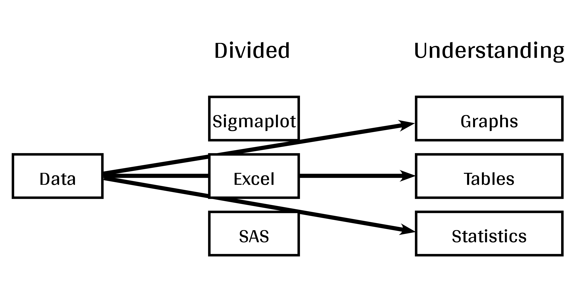

```{r, echo =F}
options(repos=structure(c(CRAN="http://cran.r-project.org")))
```

```{r, include = FALSE}
required.libraries <- c("knitr", 
                        "tidyverse", 
                        "vegan", 
                        "ggpubr", 
                        "ggsignif",
                        "ggpmisc", 
                        "ggdendro", 
                        "rworldmap", 
                        "maps", 
                        "mapproj", 
                        "grid",
                        "gridExtra", 
                        "RColorBrewer", 
                        "gridBase", 
                        "psych", 
                        "remotes")

needed.libraries <- required.libraries[!(required.libraries %in% installed.packages()[,"Package"])]
if(length(needed.libraries)) install.packages(needed.libraries)

if (!require(colorblindr)) remotes::install_github("clauswilke/colorblindr")

# Load all required libraries at once
lapply(required.libraries, require, character.only = TRUE)

#source("scripts/multiplot.R")

```

```{r theme, include = FALSE, cache=FALSE}
library(ggplot2)
theme_set(theme_gray(base_size = 12))
update_geom_defaults("point", list(size = 2))
```


```{r setup, echo = FALSE}
knitr::opts_chunk$set(
  comment = "#",
  collapse = TRUE,
  warning = FALSE,
  message = FALSE,
  cache = TRUE,
  fig.width=5, fig.height=5,
  fig.align = 'center',
  fig.retina = 3,
  fig.show = "hold"
)
```


# Introduction

#### To follow along:

Code and .HTML available at http://qcbs.ca/wiki/r/workshop3

#### Recommendations:

  1. create your own new script;
  2. refer to provided code only if needed;
  3. avoid copy-pasting or running the code directly from the script.

###### [ggplot2](https://ggplot2.tidyverse.org/) is also on GitHub: https://github.com/tidyverse/ggplot2


---
# Outline

###### 1. `ggplot2` mechanics

<div style="text-align:center">

</div>


###### 2. Advanced visualization

###### 3. Fine-tuning

###### 4. Saving plots

###### 5. Conclusion

---
# Learning objectives

<br>

- Teach the basics of data visualization using R.
- A good representation of one's data can be unique and thus no single function or package can meet everyone's needs.
- Creativity is important to scientists!
- A basic understanding of design to communicate effectively with graphs.

---
class: inverse, center, middle

# Visualization in science

---
# Visualization in science
<br>

#### Why are we using data visualization?

#### What makes an effective visualization?

<br>

.center[]

What do you thing about this one ?

---
# Visualization in science
<br>

1. Represent results of statistical analyses
2. Research and discuss (preliminary data from the literature, summaries, formulate hypotheses)
3. Explore your own data (exploratory data analysis, outlier detection)
4. Communicate and report
  - Clearly (design principles)
  - Precisely and accurately
  - Effectively and efficiently

---
# Visualization in science
<br>

Important questions:
- What do you want to communicate?
- What is your public?
- What is the best way to do it?

.center[
.alert[A rule of thumb: think simple — use less ink!]
]


---
# WARNING!

<br>

.alert[
### &#x26A0; `R` is not made for drawings.
]

Other drawing softwares are probably more interesting options such as [GIMP](https://www.gimp.org/) or [Inkscape](https://inkscape.org/). It is important to get the right tool for the right task!

---
## Why use R for plotting?

.center[]

---
# Why use R for plotting? Reproducibility

.center[]


.alert[Reproducible science comes with effort]:
- comment the script
- add relevant information in the figures (titles, labels, captions)

---
# Why R for graphs?

#### .alert[ Because of its powerful features!]

In this workshop, we focus only on `ggplot2`, but [multiple packages and functions](https://insileco.github.io/wiki/rgraphpkgs/) can be used for great visualization (e.g., ["base R"](https://bookdown.org/rdpeng/exdata/the-base-plotting-system-1.html), [plotly](https://plot.ly/r/), [sjPlot](http://www.strengejacke.de/sjPlot/), [mapview](https://r-spatial.github.io/mapview/), [igraph](https://igraph.org/r/)).

```{r, echo=FALSE, fig.width=9, fig.height=5.7}
source(file="./scripts/multiExamplePlot.R")
```


---
# `ggplot2` is versatile

1. [`ggplot2`](https://ggplot2.tidyverse.org/) package lets you make beautiful and customizable plots;
2. it implements the grammar of graphics, an easy to use system for building plots;
3. it [has many extensions](https://insileco.github.io/wiki/rgraphpkgs/#ggplot2andextensions).


.center[]


---
class: inverse, center, middle

# `ggplot2` mechanics: the basics

---

# Grammar of Graphics (GG) basics

```{r, eval = FALSE}
install.packages("ggplot2") # if not already installed
library(ggplot2)
```

```{r, echo = FALSE}
library(ggplot2)
```

A graphic is made of different layers:

.center[

]

We will learn how to build graphs step by step to make it look as we desire.

---
# Grammar of Graphics (GG) basics

These layers have specific names that you will see throughout the presentation:


.small[image from [Towards Data Science](https://towardsdatascience.com/a-comprehensive-guide-to-the-grammar-of-graphics-for-effective-visualization-of-multi-dimensional-1f92b4ed4149)]

---
# Grammar of Graphics (GG) basics

.center[

]


---
# Grammar of Graphics (GG) basics

Here are the basic requirements to draw the simplest ``ggplot`:

.center[

]


---
# Grammar of Graphics (GG)

A graphic is made of elements (layers)

- Data
- Aesthetics (aes), to make data visible
    - `x`, `y`: position along the x and y axis
    - `colour`: the colour of the point
    - `group`: what group a point belongs to
    - `shape`: the figure used to plot a point
    - `linetype`: the type of line used (solid, dashed, etc)
    - `size`: the size of the point or line
    - `alpha`: the transparency of the point

---
# Grammar of Graphics (GG)

A graphic is made of elements (layers)

- Data
- Aesthetics (aes)
- Geometric objects (geoms)
    * `geom_point()`: scatterplot
    * `geom_line()`: lines connecting points by increasing value of x
    * `geom_path()`: lines connecting points in sequence of appearance
    * `geom_boxplot()`: box and whiskers plot for categorical variables
    * `geom_bar()`: bar charts for categorical x axis
    * `geom_histogram()`: histogram for continuous x axis

---
# How layer in ggplot works

1. Create a simple plot object:
  * `plot.object <- ggplot()`

2. Add graphical layers:
  * `plot.object <- plot.object + layer()`

3. Repeat step 2 until satisfied, then print:
  * `plot.object` or `print(plot.object)`

---
# Prepare data for `ggplot2` 

`ggplot2` requires you to prepare the data as an object of class `data.frame` or `tibble` (common in the `tidyverse`).

```{r eval=TRUE, echo=TRUE}
library(tibble)
class(iris) # all set!

ir <- as_tibble(iris) # acceptable
class(ir)
```

---
# iris dataset

```{r, eval=-1}
?iris
str(iris)
```

.center[**Scientific questions**]
- Is there a relation between the **length** & the **width** of the iris **Sepal** ?
- Is there a relation between the **length** & the **width** of the iris **Pepal** ?
- Does the size of the **Petal & Sepal** vary together ?
- How are these measures distributed among the **5 Iris species** ?

.center[.alert[How to graphically address these questions with ggplot ?]]

---
# Exploring data structure

<!-- Explain the databases before the examples  -->

```{r, fig.width = 6.5, fig.height = 6.5}
library(psych)
pairs.panels(iris)
```

---
# Exploring data structure

```{r, echo = FALSE, fig.height=7, fig.width=9}
ggplot(data = iris,             # Data
       aes(x = Sepal.Length,    # Your X-value
           y = Sepal.Width,     # Your Y-value
           col = Species)) +    # Aesthtics
  geom_point(size = 5, alpha = 0.8) + # Point
  geom_smooth(method = "lm") +  # Linear regression
  labs(title = "Relation between sepal length and width\n for different iris species") + # Title
  theme(title = element_text(size = 18, face="bold"),
      text = element_text(size = 14))
```

.small[&#x267B; See [*Loading and manipulating data workshop*](http://qcbs.ca/wiki/r_workshop2) to learn how to clean your dataset.]


---

# Inheritance in `ggplot2`

.small[

.pull-left[
**Inheritance from ggplot**
```{r, fig.height = 5}
p <- ggplot(data = iris,
            aes(x = Sepal.Length,
                y = Sepal.Width))
p <- p + geom_point()
p   
```
]

.pull-right[
**No inheritance from ggplot**
```{r, fig.height = 5}
s <- ggplot()
s <- s + geom_point(data = iris,
                    aes(x = Sepal.Length,
                        y = Sepal.Width))
s # Print your final plot
```
]

]

---
# Grammar of Graphics: *recall*

<br>

Remember: a graphic is made of different layers:


---
# `ggplot()` dynamics: base layer

```{r, fig.height=4, fig.width=5}
ggplot()
```

---
# `ggplot()` dynamics: data layer

```{r, fig.height=4, fig.width=5}
ggplot(data = iris, aes(x = Sepal.Length, y = Sepal.Width)) +
  xlab("x = Sepal length") +
  ylab("y = Sepal width")
```

---

# `ggplot()` dynamics: geometric Layer

```{r, fig.height=4, fig.width=5}
ggplot(data = iris, aes(x = Sepal.Length, y = Sepal.Width)) +
  xlab("x = Sepal length") +
  ylab("y = Sepal width") +
  geom_point()
```

---
# Challenge #1 (5min) 

#### Draw your 1st ggplot!

.alert[Question]

> Is there a relation between the **length** & the **width** of the iris **petal** ?

> Does the *width* of the petal increase with its *length* ?

.center[Parameters to consider when addressing this question:]

 data | geom | x value | y value
:-------------:|:-------------:|:-------------:|:-------------:
iris|geom_point|Petal length|Petal width


---
# Challenge 1#: Solution 

```{r}
ggplot(data = iris, aes(x = Petal.Length, 
                        y = Petal.Width)) +
  geom_point()
```

---

class: inverse, center, middle

# Aesthetic mapping

## colour, shape, size, labels and transparency

---

# Aesthetic

##### Use aesthetics (`aes()`) to distinguish classes, groups and structure


```{r echo = FALSE, fig.width = 8, fig.height = 7}
library(gridExtra)
source(file="./scripts/4plot_aesthetic.R")
```

---

# Colouring: make your points talk

Change **colour** to

&nbsp;  differentiate between groups

&nbsp;  represent data values

&nbsp;  highlight specific elements

.pull-left[
```{r, echo = FALSE, fig.height=4.8, fig.width = 5}
ggplot(iris, aes(Sepal.Length, Sepal.Width))+
  geom_point(aes(colour = Species)) +
  labs(title = "Qualitative colour for groups") +
  theme(title = element_text(size = 16, face = "bold"),
        legend.title = element_text(size = 14),
        legend.position = 'bottom')
```
]

.pull-right[
```{r, echo = FALSE, fig.height=4.8, fig.width = 5}
ggplot(iris, aes(Sepal.Length, Sepal.Width))+
  geom_point(aes(colour = Sepal.Length)) +
  labs(title = "Gradient colouring for values") +
  theme(title = element_text(size = 16, face = "bold"),
        legend.title = element_text(size = 14),
        legend.position = 'bottom')
```
]

.small[See [Fundamentals of Data Visualization](https://serialmentor.com/dataviz/colour-basics.html)]

---

# Using `aes()` use to change colour

* Do the sepal length and width vary differently across species?

```{r, out.width = "50%", fig.align = 'default', fig.asp=2/3}
# No colour mapping
ggplot(data = iris) +
  geom_point(mapping = aes(x = Sepal.Length, y = Sepal.Width)) +
  labs(title = "No colour mapping")
# With colour mapping
ggplot(data = iris) +
  geom_point(mapping = aes(x = Sepal.Length, y = Sepal.Width, colour = Species)) +
  labs(title = "With colour mapping")
```

---
# Change colour manually

```{r, out.width = "50%", fig.align = 'default', fig.asp=2/3}
# Default
pp <- ggplot(data = iris) +
  geom_point(mapping = aes(x = Sepal.Length, y = Sepal.Width, colour = Species))
pp + labs(title = "Default")
# Manual
pp +
  scale_colour_manual(values = c("grey55", "orange", "skyblue")) +
  labs(title = "Manual")
```


---
# Colour gradient

```{r, out.width = "50%", fig.align = 'default', fig.asp=2/3}
# Default
pp2 <- ggplot(data = iris) +
  geom_point(mapping = aes(x = Sepal.Length, y = Sepal.Width, 
                           colour = Petal.Length))
pp2 + labs(title = "Default")
# Manual
pp2 + scale_colour_gradient(low = "blue", high = "red") +
  labs(title = "Manual")
```

---
# Use a predefined colour palette

```{r, eval = FALSE}
install.packages("RColorBrewer")
require(RColorBrewer)
display.brewer.all()
```


---
# Use a predefined colour palette

```{r, out.width = "50%", fig.align = 'default', fig.asp=2/3}
# Palette for groups
pp + scale_colour_brewer(palette = "Dark2") +
  labs(title = "Palette for groups")
# Palette for continuous values
pp2 + scale_colour_gradientn(colours = rainbow(5)) +
  labs(title = "Palette for continuous values")
```


---
# Use a predefined colour palette

Grey-scale palette for publication purposes

```{r, out.width = "50%", fig.align = 'default', fig.asp=2/3}
# Palette for groups
pp + scale_colour_grey() +
  labs(title = "Palette for groups")
# Palette for continuous values
pp2 + scale_colour_gradient(low = "grey85", high = "black") +
  labs(title = "Palette for continuous values")
```


---
# Use colourblind-friendly palettes

How your figure might appear under various forms of colourblindness?

```{r, echo=FALSE, fig.width=10, fig.height=7.5}
library(colorblindr)
cvd_grid(pp)
```

---
# Use colourblind-friendly palettes

```{r, out.width = "50%", fig.align = 'default', fig.asp=2/3}
# Palette for groups
pp + scale_colour_viridis_d() +
  labs(title = "viridis palette for groups")
# Palette for continuous values
pp2 + scale_colour_viridis_c() +
  labs(title = "viridis palette for continuous values")
```


---
# Changing `shape`, `size` and `alpha`

```{r, out.width = "50%", fig.align = 'default', fig.asp=2/3}
# shape for groups
ggplot(data = iris) +
  geom_point(mapping = aes(x = Sepal.Length, y = Sepal.Width, shape = Species)) +
  labs(title = "shape for groups")

# size and alpha for continuous values
ggplot(data = iris) +
  geom_point(mapping = aes(x = Sepal.Length, y = Sepal.Width,
                           size = Petal.Length, alpha = Petal.Length)) +
  labs(title = "size and alpha for continuous values")
```


---
# Challenge #2 

- Produce an informative plot from built-in datasets such as `mtcars`, `CO2` or `msleep`.

- Use appropriate aesthetic mappings for different data types


<br>

Data| x | y | Aesthetics
:-------------:|:-------------:|:-------------:|:-------------:
mtcars |*wt* |*mpg* | *disp* and *hp*
CO2 |*conc* |*uptake* | *Treatment* and *Type*
msleep |log10(*bodywt*) |*awake* | *vore* and *conservation*

<br>
.center[.alert[
 Pay attention to the data types!
]
]
---
# Challenge #2 - Solution example #1

```{r, fig.height=5, fig.width=6.2}
data(mtcars)
ggplot(data = mtcars) +
  geom_point(mapping = aes(x = wt, y = mpg,
                           colour = disp, 
                           alpha = hp))
```

.comment[Could you use `size` intead of `alpha`? What about `shape`?]

---
# Challenge #2 - Solution example #2

```{r, fig.height=5, fig.width=6.2}
data(CO2)
ggplot(data = CO2) +
    geom_point(mapping = aes(x = conc, y = uptake,
                             colour = Treatment, shape = Type))
```

.comment[Why not use `size = Type`?]

---
# Challenge #2 - Solution example #3

```{r, fig.height=5, fig.width=6.2}
data(msleep)
ggplot(data = msleep) +
    geom_point(mapping = aes(x = log10(bodywt), y = awake,
                             colour = vore, shape = conservation))
```

.comment[Why not use `size = Type`?]

---
# Changing the scale of the axes
.small[
```{r, out.width = "50%", fig.align = 'default', fig.asp=2/3}
# x axis in regular scale
ggplot(diamonds) + 
  geom_point(mapping = aes(x = carat, y = price)) +
  labs(title = "x-axis in regular scale")

# x-axis and y-axis in log10() scale
ggplot(diamonds) + geom_point(mapping = aes(x = carat, y = price)) +
  scale_x_log10() + 
  scale_y_log10() + 
  labs(title = "x- and y-axes in log10 scale")
```
]

.small[It is also possible to transform the coordinate system using `coord_trans(x = "log10", y = "log10")`]

<!-- explain the difference -->

---
class: inverse, center, middle

# Fine-tuning your plots

## Using `theme()` to make it look good!

---
# `theme()`

```{r, out.width = "50%", fig.align = 'default', fig.asp=2/3}
# Theme classic
pp + scale_colour_grey() + 
  theme_classic() +
  labs(title = "Classic")

# Theme minimal
pp + scale_colour_grey() + 
  theme_minimal() +
  labs(title = "Minimal")
```

NB: Good choices for publication purposes!

---
## ggThemeAssist: RStudio-addin


---
class: inverse, center, middle

# Fine-tuning your plots

## Using `facet_grid()` to change the arrangement of plots

---
# iris dataset: per-species facets
```{r, fig.align="center", fig.width=10, fig.height=6}
ggplot(data = iris) +
  geom_point(mapping = aes(x = Sepal.Length, y = Sepal.Width, colour = Species)) +
  facet_grid(~ Species, scales = "free")
```

---
# CO2 dataset: per-type facets
```{r, fig.align="center", fig.width=10, fig.height=5.5}
ggplot(data = CO2) +
  geom_point(mapping = aes(x = conc, y = uptake, colour = Treatment)) +
  xlab("CO2 Concentration (mL/L)") + ylab("CO2 Uptake (umol/m^2 sec)") + 
  facet_grid(~ Type)
```

<!-- relabeling ticks -->

---
# Title and axes components: changing size, colour and face

.center[]


---
# Title and axes components: size, colour and face

.pull-left[
**Default**
```{r, echo=FALSE, fig.align="center", fig.width=6, fig.height=6}
pp
```
]
.pull-right[
**Axes and title tuning**
```{r, echo=FALSE, fig.align="center", fig.width=6, fig.height=6}
pp +
  ggtitle("Relation between Sepal Length & Width") +
  xlab("Sepal length (cm)") +
  ylab("Sepal Width (cm)") +
  theme(axis.title.x = element_text(size = 16),
        axis.title.y = element_text(size = 16),
        axis.text.x = element_text(size = 12),
        axis.text.y = element_text(size = 12),
        plot.title = element_text(size = 16, face="bold"),
        legend.title = element_text(size=14, face="bold"),
        legend.text = element_text(size=12))
```

]

---

# Challenge #3 

Use the `tips` dataset found in `reshape2` &#x1F4E6; to reproduce the plot below.

Our tip: start from `theme_classic()` and add `theme()` to make your additional changes.

```{r, echo=FALSE, fig.width=10, fig.height=5}
library(reshape2)
tips.gg <- ggplot(tips, aes(x = total_bill,
                            y = tip/total_bill,
                            shape = smoker,
                            colour = sex,
                            size = size)) +
  geom_point() +
  facet_grid( ~ time) +
  scale_colour_grey() +
  labs(title = "Relation between total bill and tips during lunch and dinner",
       x = "Total bill ($)", y = "Ratio between tips and total bill") +
  theme_classic() +
  theme(axis.title = element_text(size = 16,
                                  colour = "navy"),
        axis.text = element_text(size = 12),
        plot.title = element_text(size = 16,
                                  colour = "orange3",
                                  face = "bold"),
        strip.text.x = element_text(size = 14, face="bold"))
tips.gg
```

---

# Challenge #3: Solution

```{r, eval=FALSE}
library(reshape2)
tips.gg <- ggplot(tips, aes(x = total_bill,
                            y = tip/total_bill,
                            shape = smoker,
                            colour = sex,
                            size = size)) +
  geom_point() +
  facet_grid( ~ time) +
  scale_colour_grey() +
  labs(title = "Relation between total bill and tips during lunch and dinner",
       x = "Total bill ($)", y = "Ratio between tips and total bill") +
  theme_classic() +
  theme(axis.title = element_text(size = 16,
                                  colour = "navy"),
        axis.text = element_text(size = 12),
        plot.title = element_text(size = 16,
                                  colour = "orange3",
                                  face = "bold"),
        strip.text.x = element_text(size = 14, face="bold"))
tips.gg
```

---

# Challenge #3: step-by-step solution

#### `aes()`

```{r, fig.width=7}
tips.gg <- ggplot(tips) +
  geom_point(mapping = aes(x = total_bill, y = tip/total_bill,
                      shape = smoker, colour = sex, size = size))
tips.gg
```


---
# Challenge #3: step-by-step solution

#### `facet_grid()`

```{r, fig.width=7}
tips.gg <- tips.gg +
  facet_grid( ~ time)
tips.gg
```


---
# Challenge #3: step-by-step solution

#### Grey-scale palette

```{r, fig.width=7}
tips.gg <- tips.gg +
  scale_colour_grey()
tips.gg
```

---
# Challenge #3: step-by-step solution

#### Adding plot title and labels

```{r, fig.width=7}
tips.gg <- tips.gg +
  labs(title = "Relation between total bill and tips during lunch and dinner",
       x = "Total bill ($)", y = "Ratio between tips and total bill")
tips.gg
```

---

# Challenge #3: step-by-step solution

#### Adding a theme and fine tuning it

.small[
```{r, fig.width=6, fig.height=4}
tips.gg <- tips.gg +
  theme_classic() +
  theme(axis.title = element_text(size = 16, colour = "navy"),
        axis.text = element_text(size = 12),
        plot.title = element_text(size = 16, colour = "orange3", face = "bold"),
        strip.text.x = element_text(size = 14, face = "bold"))
tips.gg
```
]

---
class: inverse, center, middle

# Fine-tuning your plots

### Using `geom_*()` to create different plots

---

# `ggplot2::geom_*()`

.center[

]

---

# `base::plot()`

.center[

]


---

## `ggplot2::ggplot()`
```{r, fig.align="center"}
ggplot(iris, aes(Sepal.Length))
```

---

# Histograms: `geom_histogram()`
A **histogram** is an accurate graphical representation of the distribution of numeric data
```{r, fig.align="center"}
ggplot(iris, aes(Sepal.Length)) +
  geom_histogram() + 
  ggtitle("Histogram of sepal length ")
```

---

# `geom_histogram()` *versus* `graphics::hist()`
.pull-left[
```{r}
ggplot(iris, aes(Sepal.Length)) +
  geom_histogram() + 
  ggtitle("Histogram of sepal length")
```
]
.pull-right[
```{r}
hist(iris$Sepal.Length,
     main = "Histogram of sepal length")
```
]]

---

##### Scatterplot and linear-fit: `geom_point()` and `geom_smooth()`
.small[
.pull-left[
```{r}
ggplot(mpg, aes(displ, hwy)) + 
  geom_point() +
  labs(title = "Scatterplot")
```
]

.pull-right[
```{r}
ggplot(mpg, aes(displ, hwy)) + 
  geom_point() + 
  labs(title = "Linear Regression") +
  geom_smooth(method = lm)
```
]
]
---

# Boxplot: `geom_boxplot()`

```{r, fig.align="center"}
ggplot(data = iris, aes(Species, Sepal.Length, 
                        fill = Species)) +
  geom_boxplot() + 
  labs(title = "Boxplot")
```

---

# Boxplot: `geom_boxplot()`

```{r, echo=FALSE, fig.align="center", fig.width = 7, fig.height = 5}
ggplot(data = iris, aes(Species, Sepal.Length, fill = Species)) +
  geom_boxplot() + 
  labs(title = "Boxplot")
```

.center[

]

---

##### Boxplot with annotations: `geom_boxplot()` and `geom_signif()`

```{r, fig.align="center"}
ggplot(data = iris, aes(Species, Sepal.Length)) +
  geom_boxplot() +
  geom_signif(comparisons = list(c("versicolor", "virginica")),
              map_signif_level=TRUE)
```

---

# Violin plot: `geom_violin()`

As explained on https://www.data-to-viz.com/graph/violin.html

> Violin plot allows to visualize the distribution of a numeric variable for one or several groups. [...] It is really close to a boxplot, but allows a deeper understanding of the distribution.

.pull-left[
```{r, echo=FALSE}
# Data
names=c(rep("A", 80) , rep("B", 50) , rep("C", 70))
value=c( sample(2:5, 80 , replace=T) , sample(4:10, 50 , replace=T),
       sample(1:7, 70 , replace=T) )
data=data.frame(names,value)

#Graph
qplot( x=names , y=value , data=data , geom=c("boxplot","jitter") , fill=names)
```
]
.pull-right[
```{r, echo=FALSE}
ggplot(data = data, aes(names, value, fill=names)) + geom_violin()

```
]

---
# Violin plot: `geom_violin()`

```{r, fig.align="center"}
ggplot(data = iris, aes(Species, Sepal.Length)) + 
  geom_violin() + 
  labs(title = "Violin plot")
```

---

# Summarise y values: `stat_summary()`

.pull-left[
```{r}
ggplot(mtcars, aes(cyl, mpg)) + 
  geom_point() +
  stat_summary(fun.y = "median", geom = "point",
               colour = "red") +
  labs(title = "Means")
```
]

.pull-right[
```{r}
ggplot(mtcars, aes(cyl, mpg)) + 
  geom_point() +
  stat_summary(fun.data = "mean_cl_boot", 
               colour = "red") +
  labs(title = "Means and confidence intervals")
```
]

---

# Summarise values  

See also `geom_errorbar()`, `geom_pointrange()`, `geom_linerange()`, `geom_crossbar()` for geoms to display summarised data.


---

# Representing maps: `geom_map()`
.small[
```{r}
crimes <- data.frame(state = tolower(rownames(USArrests)), USArrests)
crimesm <- reshape2::melt(crimes, id = 1)

library(maps)
states_map <- map_data("state")

ggplot(crimes, aes(map_id = state)) +
  geom_map(aes(fill = Murder), map = states_map) +
  expand_limits(x = states_map$long, y = states_map$lat) + 
  coord_map()
```
]
---


# Density plots: `geom_density()`

.small[A density plot shows the distribution of a numerical variable and it takes only set of numeric values as input.]
.pull-left[
```{r, echo=TRUE}
iris.dens <- ggplot(iris, aes(Sepal.Length)) +
  geom_density() 
iris.dens
```
]

.pull-right[
```{r, echo=TRUE}
cars.dens <- ggplot(cars, aes(dist)) +
  geom_density()
cars.dens
```
]

---

# Dendogram: `ggdendrogram()`

```{r}
library(ggdendro)
USArrests.short = USArrests[1:10,]
hc <- hclust(dist(USArrests.short), "ave")

ggdendrogram(hc, rotate = TRUE, theme_dendro = FALSE)
```


---

# Arrange plots: `ggarrange()`

**Add multiple graphs on the same plot**

```{r}
ggarrange(iris.dens, cars.dens, labels = c('a)','b)'))
```

---

# Final Challenge

Create your own graph and follow these recommendations:
  * Dataset: any (recommended: use your dataset)
  * Explore a new geom_* and other plot elements
  
Use the following links for tips:
https://ggplot2.tidyverse.org/reference/index.html
http://shinyapps.stat.ubc.ca/r-graph-catalog/

---
## Final Challenge: Solution example #1
.small[
```{r, fig.align='center'}
data(msleep)
msleep.challenge4 <- ggplot(msleep, aes(vore, log10(brainwt), fill=vore))
msleep.challenge4 + geom_violin() +
  geom_signif(comparisons = list(c("herbi", "insecti"))) + 
  labs(main = "Brain weight among different vore", y = "log10(Brain weight (Kg))") + 
  scale_fill_grey() + 
  theme_classic()
```
]
---
## Final Challenge: Solution example #2
.small[
```{r, fig.align='center'}
data(mtcars)
mtcars.short <- mtcars[1:20,]
mtcars.short.hc <- hclust(dist(mtcars.short), "complete")
dendro.challenge4 <- ggdendrogram(mtcars.short.hc, rotate = TRUE, theme_dendro = FALSE)
dendro.challenge4 + ggtitle("Car dendro from motor spec") +
  xlab("Cars") +
  theme(axis.title.y = element_text(size = 16),
        axis.title.x = element_blank(),
        axis.text.x = element_blank(),
        axis.text.y = element_text(size = 12),
        plot.title = element_text(size = 14, face="bold"))
```
]

---

### Miscellaneous: interactive plots using `plotly()`
.small[
.alert[**Select the species data to display directly from the legend**]
```{r, echo = TRUE, fig.align='center', fig.width=9, fig.height=5.5}
p = ggplot(iris, 
           aes(x=Sepal.Length, y=Sepal.Width, colour=Species, shape=Species)) +
    geom_point(size=6, alpha=0.6)

plotly::ggplotly(p)
```
]

---
class: inverse, center, middle

# Saving your plots with ggplot2

---

# Saving plots in RStudio

<div style="text-align:center">

</div>
.small[
.alert[Think about the margin of the document you are using. If you resize the image after saving it, the labels and text will change size as well which could be hard to read.]
]
---
# Saving plots in code

`ggsave()` writes directly to your working directory and allows you to specify the name of the file, the dimensions of the plot, the resolution, etc.

```{r, eval=FALSE}
my1rstPlot <- ggplot(iris, aes(Petal.Length, Petal.Width)) +
  geom_point()

ggsave("my1stPlot.pdf",
       my1rstPlot,
       height = 8.5, width = 11, units = "in", res = 300)
```

NB: Vectors (e.g., pdf, svg) format are more flexible than raster format (jpeg,
png, ...) if the image needs modification afterwards.

---
# Saving plots in code
<br>

Other methods to save image: see `?pdf` `?jpeg`

```{r, eval=FALSE}
pdf("./graph_du_jour.pdf")
  print(my1rstPlot) # print function is necessary
graphics.off()
```


---
class: inverse, center, middle

# Going further


---
# Available elements


[Data Visualization with ggplot2 Cheat Sheet](https://www.rstudio.com/wp-content/uploads/2015/03/ggplot2-cheatsheet.pdf)

.center[]

https://www.rstudio.com/resources/cheatsheets

---
# Additional resources

* `help(package = ggplot2)`
* http://ggplot2.tidyverse.org/reference/
* Fundamentals of Data Visualization https://serialmentor.com/dataviz/

.center[]

---
# Concluding remarks
<br>

  1. There are other useful packages that can be used with `ggplot2`! To name a few: `ggbio`, `ggpmisc`, `geomnet`, `gganimate`, `ggnetwork` and `ggtree`. Have a look at [www.ggplot2-exts.org](https://www.ggplot2-exts.org/) for other `ggplot2` extensions.


  2. Note that you can learn more about design and image manipulation with the "Introduction to graphic design and image manipulation with open source tools": https://qcbs.ca/wiki/graphics


---
class: inverse, center, bottom

# Thank you for attending!


