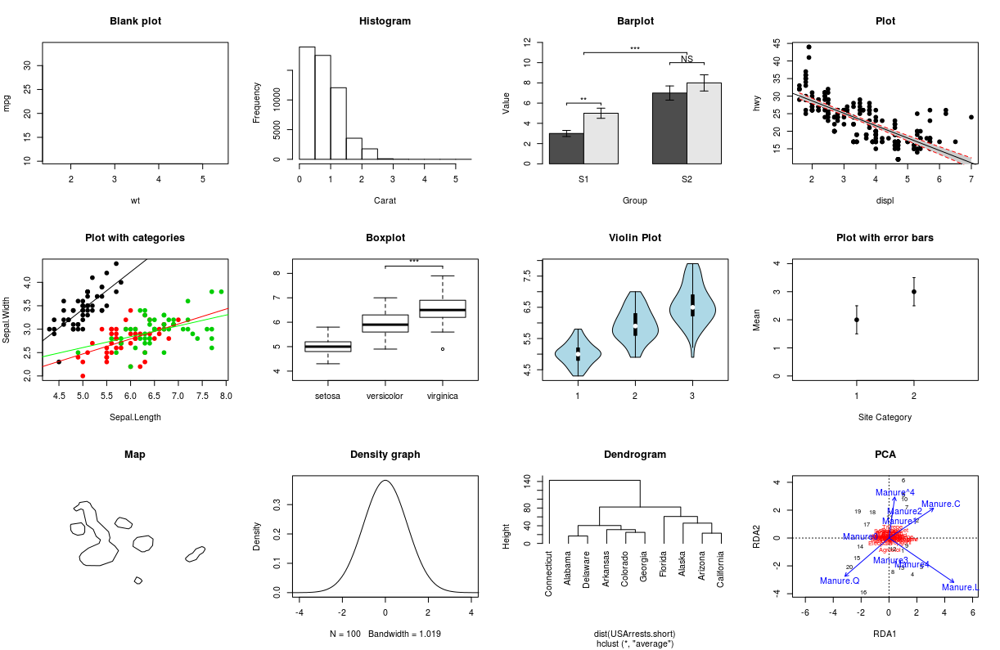

```{r, echo =F}
options(repos=structure(c(CRAN="http://cran.r-project.org")))
```

```{r, include = FALSE}
vc_pkg <- c("knitr", "tidyverse", "vegan", "ggpubr", "ggsignif",
  "ggpmisc", "ggdendro", "rworldmap", "maps", "mapproj", "grid",
  "gridExtra", "RColorBrewer", "gridBase", "psych", "remotes")

lapply(vc_pkg, qcbsRworkshops::install_cran_pkgs)

if (!require(colorblindr)) remotes::install_github("clauswilke/colorblindr")

#source("scripts/multiplot.R")

```

```{r theme, include = FALSE, cache=FALSE}
library(ggplot2)
theme_set(theme_gray(base_size = 12))
update_geom_defaults("point", list(size = 2))
```


```{r setup, echo = FALSE}
knitr::opts_chunk$set(
  comment = "#",
  collapse = TRUE,
  warning = FALSE,
  message = FALSE,
  cache = TRUE,
  fig.width=5, fig.height=5,
  fig.align = 'center',
  fig.retina = 3,
  fig.show = "hold"
)
```


# Introduction

#### To follow along:

Code and .HTML available at http://qcbs.ca/wiki/r/workshop3


#### Recommendations:

  1. create your own new script;
  2. refer to provided code only if needed;
  3. avoid copy pasting or running the code directly from script.

###### NB [ggplot2](https://ggplot2.tidyverse.org/) is also on GitHub: https://github.com/tidyverse/ggplot2


---
# Outline

##### 1. ggplot mechanics

<div style="text-align:center">

</div>


##### 2. Advanced visualization

  point, line, histogram, box plot, error bar, significant value & linear regression

##### 3. Fine-tuning

##### 4. Saving plots

##### 5. Conclusion


---
# Learning objectives

<br>

- Teach the basics of data visualization using R;
- A good representation of one's data can be unique and thus no single function or package can meet everyone's needs;
- Creativity is important for scientists!
- A basic understanding of design to communicate effectively with graphs.

---
class: inverse, center, middle

# Visualization in science

---
# Visualization in science
<br>

#### Why are we using data visualization?

#### What makes an effective visualization?

<br>

.center[]

What do you thing about this one ?

---
# Visualization in science
<br>

1. Represent results of statistical analyses
2. Research and discuss (preliminary data from the literature, summaries, formulate hypotheses)
3. Explore your own data (exploratory data analysis, outlier detection)
4. Communicate and report
  - Clearly (design principles)
  - Precisely and accurately
  - Effectively and efficiently

---
# Visualization in science
<br>

Important questions:
- What do you want to communicate?
- To who?
- How to do it? (data type, data preparation)

.center[
.alert[A rule of thumb: think simple — use less ink!]
]


---
# WARNING!

<br>

.alert[
### &#x26A0; R is not made for drawings.
]

Other drawing softwares are probably more interesting options such as [GIMP](https://www.gimp.org/) or [Inkscape](https://inkscape.org/). It is important to get the right tool for the right task!

---
## Why use R for plotting?

.center[]

---
# Why use R for plotting? Reproducibility

.center[]


.alert[Reproducible science comes with effort]:
- comment the script
- add relevant information in the figures (titles, labels, captions)

---
# Why R for graphs?

#### .alert[ Because of its powerful features!]

In this workshop, we focus only on `ggplot2`, but [multiple packages and functions](https://insileco.github.io/wiki/rgraphpkgs/) can be used for great visualization (e.g., ["base R"](https://bookdown.org/rdpeng/exdata/the-base-plotting-system-1.html), [plotly](https://plot.ly/r/), [sjPlot](http://www.strengejacke.de/sjPlot/), [mapview](https://r-spatial.github.io/mapview/), [igraph](https://igraph.org/r/)).

```{r, echo=FALSE, fig.width=9, fig.height=5.7}
source(file="./scripts/multiExamplePlot.R")
```


---
# `ggplot2` is versatile

1. [`ggplot2`](https://ggplot2.tidyverse.org/) package lets you make beautiful and customizable plots;
2. it implements the grammar of graphics, an easy to use system for building plots;
3. it [has many extensions](https://insileco.github.io/wiki/rgraphpkgs/#ggplot2andextensions).


.center[]


---
class: inverse, center, middle

# `ggplot` mechanics: the basics

---

# Grammar of Graphics (GG) basics

```{r, eval = FALSE}
install.packages("ggplot2") # if not already installed
library(ggplot2)
```

```{r, echo = FALSE}
library(ggplot2)
```

A graphic is made of different layers:

.center[

]

We will learn how to build graphs step by step to make it look like we want.

---
# Grammar of Graphics (GG) basics

These layers have specific names that you will see throughout the presentation:


.small[image from [Towards Data Science](https://towardsdatascience.com/a-comprehensive-guide-to-the-grammar-of-graphics-for-effective-visualization-of-multi-dimensional-1f92b4ed4149)]

---
# Grammar of Graphics (GG) basics

.center[

]


---
# Grammar of Graphics (GG) basics

But here are the basic requirements to draw the simplest ggplot:

.center[

]


---
# Grammar of Graphics (GG)

A graphic is made of elements (layers)

- Data
- Aesthetics (aes), to make data visible
    - `x`, `y`: position along the x and y axis
    - `colour`: the colour of the point
    - `group`: what group a point belongs to
    - `shape`: the figure used to plot a point
    - `linetype`: the type of line used (solid, dashed, etc)
    - `size`: the size of the point or line
    - `alpha`: the transparency of the point

---
# Grammar of Graphics (GG)

A graphic is made of elements (layers)

- Data
- Aesthetics (aes)
- Geometric objects (geoms)
    * `geom_point()`: scatterplot
    * `geom_line()`: lines connecting points by increasing value of x
    * `geom_path()`: lines connecting points in sequence of appearance
    * `geom_boxplot()`: box and whiskers plot for categorical variables
    * `geom_bar()`: bar charts for categorical x axis
    * `geom_histogram()`: histogram for continuous x axis

---
# How layer in ggplot works

1. Create a simple plot object:
  * `plot.object <- ggplot()`

2. Add graphical layers:
  * `plot.object <- plot.object + layer()`

3. Repeat step 2 until satisfied, then print:
  * `plot.object` or `print(plot.object)`

---
# Prepare data for ggplot

`ggplot2` requires you to prepare the data as an object of class `data.frame` or `tibble` (common in the `tidyverse`).

```{r eval=TRUE, echo=TRUE}
library(tibble)
class(iris) # all set!

ir <- as_tibble(iris) # acceptable
class(ir)
```

---
# Iris database

```{r, eval=-1}
?iris
str(iris)
```

.center[**Scientific questions**]
- Is there a relation between the **length** & the **width** of the iris **Sepal** ?
- Is there a relation between the **length** & the **width** of the iris **Pepal** ?
- Does the size of the **Petal & Sepal** vary together ?
- How are these measures distributed among the **5 Iris species** ?

.center[.alert[How to graphically address these questions with ggplot ?]]

---
# Exploring data structure

<!-- Explain the databases before the examples  -->

```{r, fig.width = 6.5, fig.height = 6.5}
library(psych)
pairs.panels(iris)
```

---
# Exploring data structure

```{r, echo = FALSE, fig.height=7, fig.width=9}
ggplot(data = iris,             # Data
       aes(x = Sepal.Length,    # Your X-value
           y = Sepal.Width,     # Your Y-value
           col = Species)) +    # Aesthtics
  geom_point(size = 5, alpha = 0.8) + # Point
  geom_smooth(method = "lm") +  # Linear regression
  labs(title = "Relation between sepal length and width\n for different iris species") + # Title
  theme(title = element_text(size = 18, face="bold"),
      text = element_text(size = 14))
```

.small[&#x267B; See [*Loading and manipulating data workshop*](http://qcbs.ca/wiki/r_workshop2) to learn how to clean your dataset.]


---

# Inheritance in `ggplot`

.small[

.pull-left[
**Inheritance from ggplot**
```{r, fig.height = 5}
p <- ggplot(data = iris,
            aes(x = Sepal.Length,
                y = Sepal.Width))
p <- p + geom_point()
p   
```
]

.pull-right[
**No inheritance from ggplot**
```{r, fig.height = 5}
s <- ggplot()
s <- s + geom_point(data = iris,
                    aes(x = Sepal.Length,
                        y = Sepal.Width))
s # Print your final plot
```
]

]

---
# Grammar of Graphics - *recall*

<br>

Remember: a graphic is made of different layers:


---
# `ggplot` dynamics: base layer

```{r, fig.height=4, fig.width=5}
ggplot()
```

---
# `ggplot` dynamics: data layer

```{r, fig.height=4, fig.width=5}
ggplot(data = iris, aes(x = Sepal.Length, y = Sepal.Width)) +
  xlab("x = Sepal lenght") +
  ylab("y = Sepal width")
```

---

# `ggplot` dynamics: geometric Layer

```{r, fig.height=4, fig.width=5}
ggplot(data = iris, aes(x = Sepal.Length, y = Sepal.Width)) +
  xlab("x = Sepal lenght") +
  ylab("y = Sepal width") +
  geom_point()
```

---
# Challenge #1 (5min) 

#### Draw your 1rst ggplot!

.alert[Question]

>Is there a relation between the **length** & the **width** of the iris **Petal** ?

> Does the *width* of the Petal increase with its *length* ?


.center[Parameters to consider when addressing this question:]

 data | geom | x value | y value
:-------------:|:-------------:|:-------------:|:-------------:
iris|geom_point|Petal length|Petal width


---
# Challenge 1# - Solution 

```{r}
ggplot(data = iris, aes(x = Petal.Length, y = Petal.Width)) +
  geom_point()
```

---

class: inverse, center, middle

# Aesthetic mappings

## color, shape, size, etc.

---

# Aesthetic

##### Use aesthetics to distinguish class, group & structure


```{r echo=FALSE, fig.width=8, fig.height=7}
library(gridExtra)
source(file="./scripts/4plot_aesthetic.R")
```

---

# Color : make your points talk

**Color to**

&nbsp;  differentiate groups

&nbsp;  represent data values

&nbsp;  highlight specific elements

.pull-left[
```{r, echo = FALSE, fig.height=4.8, fig.width = 5}
ggplot(iris, aes(Sepal.Length, Sepal.Width))+
  geom_point(aes(color = Species)) +
  labs(title = "Qualitative color for groups") +
  theme(title = element_text(size = 16, face = "bold"),
        legend.title = element_text(size = 14),
        legend.position = 'bottom')
```
]

.pull-right[
```{r, echo = FALSE, fig.height=4.8, fig.width = 5}
ggplot(iris, aes(Sepal.Length, Sepal.Width))+
  geom_point(aes(color = Sepal.Length)) +
  labs(title = "Sequential color for values") +
  theme(title = element_text(size = 16, face = "bold"),
        legend.title = element_text(size = 14),
        legend.position = 'bottom')
```
]

.small[See [Fundamentals of Data Visualization](https://serialmentor.com/dataviz/color-basics.html)]

---

# Example of aesthetic color

* Do the sepal length and width vary differently between species?

```{r, out.width = "50%", fig.align = 'default', fig.asp=2/3}
# No color mapping
ggplot(data = iris) +
  geom_point(mapping = aes(x = Sepal.Length, y = Sepal.Width)) +
  labs(title = "No color mapping")
# With color mapping
ggplot(data = iris) +
  geom_point(mapping = aes(x = Sepal.Length, y = Sepal.Width, color = Species)) +
  labs(title = "With color mapping")
```


---
# Change color manually


```{r, out.width = "50%", fig.align = 'default', fig.asp=2/3}
# Default
pp <- ggplot(data = iris) +
  geom_point(mapping = aes(x = Sepal.Length, y = Sepal.Width, color = Species))
pp + labs(title = "Default")
# Manual
pp +
  scale_colour_manual(values = c("grey55", "orange", "skyblue")) +
  labs(title = "Manual")
```


---
# Color gradient

```{r, out.width = "50%", fig.align = 'default', fig.asp=2/3}
# Default
pp2 <- ggplot(data = iris) +
  geom_point(mapping = aes(x = Sepal.Length, y = Sepal.Width, color = Petal.Length))
pp2 + labs(title = "Default")
# Manual
pp2 + scale_color_gradient(low = "blue", high = "red") +
  labs(title = "Manual")
```


---
# Use predefined color palette

```{r, eval = FALSE}
install.packages("RColorBrewer")
require(RColorBrewer)
display.brewer.all()
```


---
# Use predefined color palette

```{r, out.width = "50%", fig.align = 'default', fig.asp=2/3}
# Palette for groups
pp + scale_color_brewer(palette = "Dark2") +
  labs(title = "Palette for groups")
# Palette for continuous values
pp2 + scale_color_gradientn(colours = rainbow(5)) +
  labs(title = "Palette for continuous values")
```


---
# Use predefined color palette

Grey scale for publication purpose

```{r, out.width = "50%", fig.align = 'default', fig.asp=2/3}
# Palette for groups
pp + scale_color_grey() +
  labs(title = "Palette for groups")
# Palette for continuous values
pp2 + scale_colour_gradient(low = "grey85", high = "black") +
  labs(title = "Palette for continuous values")
```


---
# Use color blind friendly palette

How your figure might appear under various forms of colorblindness?

```{r, echo=FALSE, fig.width=10, fig.height=7.5}
library(colorblindr)
cvd_grid(pp)
```

---
# Use color blind friendly palette

```{r, out.width = "50%", fig.align = 'default', fig.asp=2/3}
# Palette for groups
pp + scale_color_viridis_d() +
  labs(title = "Viridis palette for groups")
# Palette for continuous values
pp2 + scale_color_viridis_c() +
  labs(title = "Viridis palette for continuous values")
```


---
# Aesthetic shape, size and alpha

```{r, out.width = "50%", fig.align = 'default', fig.asp=2/3}
# Shape for groups
ggplot(data = iris) +
  geom_point(mapping = aes(x = Sepal.Length, y = Sepal.Width, shape = Species)) +
  labs(title = "Shape for groups")
# Size for continuous values
ggplot(data = iris) +
  geom_point(mapping = aes(x = Sepal.Length, y = Sepal.Width,
                           size = Petal.Length, alpha = Petal.Length)) +
  labs(title = "Size and alpha for continuous values")
```


---
# Challenge #2 

- Produce a informative plot from built-in datasets such as `mtcars`, `CO2` or `msleep`.

- Use appropriate aesthetic mappings for different data type


<br>

Data| x | y | Aesthetic
:-------------:|:-------------:|:-------------:|:-------------:
mtcars |wt |mpg | disp & hp
CO2 |conc |uptake | Treatment & Type
msleep |log10(bodywt) |awake | vore & conservation

<br>
.center[.alert[
 Pay attention to data type!
]
]
---
# Challenge #2 - solution

```{r, fig.height=5.2, fig.width=6.8}
data(mtcars)
ggplot(data = mtcars) +
  geom_point(mapping = aes(x = wt, y = mpg,
                           color = disp, alpha = hp))
```

.comment[Could you use `size` intead of `alpha`? What about `shape`?]

---
# Challenge #2 - solution

```{r, fig.height=5.2, fig.width=6.8}
data(CO2)
ggplot(data = CO2) +
    geom_point(mapping = aes(x = conc, y = uptake,
                             color = Treatment, shape = Type))
```

.comment[Why not use `size = Type`?]

---
# Challenge #2 - solution

```{r, fig.height=5.2, fig.width=6.8}
data(msleep)
ggplot(data = msleep) +
    geom_point(mapping = aes(x = log10(bodywt), y = awake,
                             color = vore, shape = conservation))
```

.comment[Why not use `size = Type`?]

---
# Transformation axis scale

```{r, out.width = "50%", fig.align = 'default', fig.asp=2/3}
# x axis in regular scale
ggplot(diamonds) + geom_point(mapping = aes(x = carat, y = price)) +
  labs(title = "x axis in regular scale")
# x axis in log10 scale
ggplot(diamonds) + geom_point(mapping = aes(x = carat, y = price)) +
  scale_x_log10() + scale_y_log10() + labs(title = "x axis in log10 scale")
```

.small[NB: It is also possible to transform the coordinate system using `coord_trans(x = "log10", y = "log10")`]

<!-- explain the difference -->


---
class: inverse, center, middle

# Fine-tuning your plots (theme)

## make it look good!

---
# Theme

```{r, out.width = "50%", fig.align = 'default', fig.asp=2/3}
# Theme classic
pp + scale_color_grey() + theme_classic() +
  labs(title = "Theme classic")
# Theme minimal
pp + scale_color_grey() + theme_minimal() +
  labs(title = "Theme minimal")
```

NB: Good choices for publication purpose!

---
## Theme assist: RStudio addin


---
class: inverse, center, middle

# Fine-tuning your plots (facets): arrangement of plots

---
# Facet: Iris
```{r, fig.align="center", fig.width=8, fig.height=6}
ggplot(data = iris, aes(x = Sepal.Length, y = Sepal.Width,
                        color = Species)) +
  geom_point() +
  facet_grid(~Species, scales = "free")
```

---
# Facet: CO2
```{r, echo=F, fig.align="center", fig.width=8, fig.height=8}
CO2.plot.nofacet <- ggplot(data = CO2, aes(x = conc, y = uptake, colour = Treatment)) +
    geom_point() +
    xlab("CO2 Concentration (mL/L)") +
    ylab("CO2 Uptake (umol/m^2 sec)") +
    ggtitle("Without Facet")
CO2.plot.facet <- CO2.plot.nofacet + facet_grid(~ Type) + ggtitle("Facet")
#multiplot(CO2.plot.nofacet, CO2.plot.facet)
```


<!-- relabeling ticks -->

---
# Title & Axis size, color, face

.center[]


---
# Title & Axis size, color, face

.pull-left[
**Default**
```{r, echo=FALSE, fig.align="center", fig.width=6, fig.height=6}
pp
```
]
.pull-right[
**Axis & Title tuning**
```{r, echo=FALSE, fig.align="center", fig.width=6, fig.height=6}
pp +
  ggtitle("Relation between Sepal Lenght & Width") +
  xlab("Sepal length (cm)") +
  ylab("Sepal Width (cm)") +
  theme(axis.title.x = element_text(size = 16),
        axis.title.y = element_text(size = 16),
        axis.text.x = element_text(size = 12),
        axis.text.y = element_text(size = 12),
        plot.title = element_text(size = 16, face="bold"),
        legend.title = element_text(size=14, face="bold"),
        legend.text = element_text(size=12))
```

]

---

# Challenge #3 

##### Use the `tips` dataset found in `reshape2` &#x1F4E6; to reproduce the plot below

```{r, echo=FALSE, fig.width=10, fig.height=6}
library(reshape2)
tips.gg <- ggplot(tips, aes(x = total_bill,
                            y = tip/total_bill,
                            shape = smoker,
                            color = sex,
                            size = size)) +
  geom_point() +
  facet_grid( ~ time) +
  scale_color_grey() +
  labs(title = "Tips per total bill at Lunch and Dinner",
       x = "Total bill", y = "Tips/total bill") +
  theme(axis.title = element_text(size = 16,
                                  colour = "navy"),
        axis.text = element_text(size = 12),
        plot.title = element_text(size = 16,
                                  colour = "orange3",
                                  face = "bold"),
        strip.text.x = element_text(size = 14, face="bold"))
tips.gg
```

---

# Challenge - solution #3 

```{r, eval=FALSE}
tips.gg <- ggplot(tips, aes(x = total_bill,
                            y = tip/total_bill,
                            shape = smoker,
                            color = sex,
                            size = size)) +
  geom_point() +
  facet_grid( ~ time) +
  scale_color_grey() +
  labs(title = "Tips per total bill at Lunch and Dinner",
       x = "Total bill", y = "Tips/total bill") +
  theme(axis.title = element_text(size = 16,
                                  colour = "navy"),
        axis.text = element_text(size = 12),
        plot.title = element_text(size = 16,
                                  colour = "orange3",
                                  face = "bold"),
        strip.text.x = element_text(size = 14, face="bold"))
tips.gg

```

---

# Challenge #3 - step by step solution

#### Aesthetic

```{r, fig.width=7}
tips.gg <- ggplot(tips,
                  aes(x = total_bill, y = tip/total_bill,
                      shape = smoker, color = sex, size = size)) +
  geom_point()
tips.gg
```


---
# Challenge #3 - step by step solution

#### Facet

```{r, fig.width=7}
tips.gg <- tips.gg +
  facet_grid( ~ time)
tips.gg
```


---
# Challenge #3 - step by step solution

#### Grey color palette

```{r, fig.width=7}
tips.gg <- tips.gg +
  scale_color_grey()
tips.gg
```

---
# Challenge #3 - step by step solution

#### Plot Title

```{r, fig.width=7}
tips.gg <- tips.gg +
  labs(title = "Tips per total bill at Lunch and Dinner")
tips.gg
```


---

# Challenge #3 - step by step solution

#### Theme tunning: Plot & Axis Title

.small[
```{r, fig.width=6, fig.height=4}
tips.gg <- tips.gg +
  theme(axis.title = element_text(size = 16, colour = "navy"),
        axis.text = element_text(size = 12),
        plot.title = element_text(size = 16, colour = "orange3", face = "bold"),
        strip.text.x = element_text(size = 14, face = "bold"))
tips.gg
```
]

---

# Geom: ggplot
<div style="text-align:center">

</div>

---

# Base plot
<div style="text-align:center">

</div>

---

## Blank plot
.pull-left[
*ggplot2*
```{r, eval=FALSE}
gblank <- ggplot(mtcars, aes(wt, mpg))
```

```{r, echo=FALSE}
gblank <- ggplot(mtcars, aes(wt, mpg))
gblank <- gblank + theme(plot.subtitle = element_text(vjust = 1),
                        plot.caption = element_text(vjust = 1)) +
  labs(title = "Blank plot")
gblank
```
]

.pull-right[
*Base Plot*
```{r}
plot(mpg~wt, data = mtcars, type = "n")
```
]

---

# Histogram
An histogram is an accurate graphical representation of the distribution of numeric data
.pull-left[
```{r}
ggplot(iris, aes(Sepal.Length)) +
  geom_histogram() + ggtitle("Histogram of sepal length ")
```
]
.pull-right[
```{r}
ggplot(cars, aes(dist)) +
  geom_histogram() + ggtitle("Histogram of car distance taken to stop ")
```
]

---

# Histogram

.pull-left[
*ggplot2*
```{r, eval=FALSE}
ggplot(diamonds, aes(carat)) + geom_histogram()
```
```{r, echo=FALSE}
ggplot(diamonds, aes(carat)) + geom_histogram(binwidth = .5) + labs(title = "Histogram")
```
]

.pull-right[
*Base Plot*
```{r}
hist(diamonds$carat)
```
]

---

#Barplot
.pull-left[
*ggplot2*
```{r, eval=FALSE}
ggplot(mpg, aes(class)) + geom_bar()
```
```{r, echo=FALSE}
ggplot(mpg, aes(class)) + geom_bar()+ labs(title = "Barplot")
```
]

.pull-right[
*Base Plot*
```{r}
barplot(table(mpg$class))
```
]

---

# Significant values
.pull-left[
*ggplot2*
```{r, eval=FALSE}
ggplot(mpg, aes(class)) +
  geom_bar() +
  geom_signif()
```

```{r, echo=FALSE}
library(dplyr)
library(ggsignif)
ir.s=iris %>%
  group_by(Species) %>%
  summarise(mean.sp = mean(Sepal.Length))
#iris %>%
#  group_by(Species) %>%
#  summarise(pval = t.test(Sepal.Length,
#                          var.equal = TRUE)$p.value)

dat <- data.frame(Group = c("S1", "S1", "S2", "S2"),
                  Sub   = c("A", "B", "A", "B"),
                  Value = c(3,5,7,8),
                  low = c(2.5,4.5,6,7.5),
                  high = c(3.5,5.5,7,8.5))

gbar2 = ggplot(data = dat, aes(x = Group, y = Value,fill = Sub)) +
  geom_bar(#aes(fill = Sub),
    stat="identity",
    position="dodge",
    width=.5) +
  geom_errorbar(aes(ymin=low,
                    ymax=high),
                width = 0.1,
                position =  position_dodge(.5), colour="black") +
  labs(title = "Barplot") +
  scale_fill_manual(values = c("grey80",
                               "grey20")) +
  geom_signif(stat="identity",
              data=data.frame(x=c(0.875, 1.875),
                              xend=c(1.125, 2.125),
                              y=c(5.8, 8.8),
                              Sub=c("A","B"),
                              annotation=c("**", "NS")),
              aes(x=x,xend=xend, y=y, yend=y,
                  annotation=annotation)) +
  geom_signif(comparisons=list(c("S1", "S2")),
              annotations="***",
              y_position = 9.3,
              tip_length = 0,
              vjust=0.4)

gbar2
```
]

.pull-right[
*Base Plot*
Manual function
```{r, eval=FALSE}
barplot()
sign.bar()
```

```{r, echo=FALSE}
df=data.frame(S1 = c(3,5), S2=c(7,8))
my.bp =barplot(as.matrix(df),
               beside = TRUE,
               xlab = "Group",
               ylab = "Value",
               main = "Barplot",
               ylim = c(0,12),
               legend = rownames(df),
               args.legend = list(x = "topright",
                                  bty = "n",
                                  inset=c(-0.07, 0))
               # args.legend=list(
               #   x=ncol(df)+4,
               #   y=min(colSums(df)),
               #   bty = "n"
               # )
)
sign.bar = function(pos,select.pair, y, offset = 0.2, label, mid = FALSE) {
  # create the y coordinate of the line
  y <- y
  # set an offset for tick lengths
  offset <- offset
  # draw first horizontal line
  if (!mid) {
    lines(pos[select.pair],c(y, y))
    # draw ticks
    lines(pos[c(select.pair[1],select.pair[1])],c(y, y-offset))
    lines(pos[c(select.pair[2],select.pair[2])],c(y, y-offset))
  } else {
    lines(x = c(c(pos[select.pair[1]-1]+
                    pos[select.pair[1]])/2,
                c(pos[select.pair[2]]+
                    pos[select.pair[2]+1])/2),
          c(y, y))
    # draw ticks
    lines(c(c(pos[select.pair[1]-1]+
                pos[select.pair[1]])/2,
            c(pos[select.pair[1]-1]+
                pos[select.pair[1]])/2),
          c(y, y-offset))
    lines(c(c(pos[select.pair[2]]+
                pos[select.pair[2]+1])/2,
            c(pos[select.pair[2]]+
                pos[select.pair[2]+1])/2),
          c(y, y-offset))
  }
  # draw asterics
  text(pos[select.pair[1]]+((pos[select.pair[2]]-pos[select.pair[1]])/2),y+offset*2,
       labels = label)
}
sign.bar(my.bp, select.pair = c(1,2),y =6,label = "**")
sign.bar(my.bp, select.pair = c(3,4),y =8.8,label = "NS")
sign.bar(my.bp, select.pair = c(2,3),y =10,label = "***",mid = TRUE)
```
]

---

#Plot: linear reagression

.pull-left[
*ggplot2*
```{r, eval=FALSE}
ggplot(mpg, aes(displ, hwy)) +
  geom_point() +
  geom_smooth(method = lm)
```
```{r, echo=FALSE}
lm.gg <- ggplot(mpg, aes(displ, hwy)) + geom_point() + geom_smooth(method = lm)+ labs(title = "Linear Regression Plot")
lm.gg
```
]

.pull-right[
*Base Plot*
```{r, eval=FALSE}
lm.out  <- lm(hwy~displ, data = mpg)
plot(hwy~displ, data = mpg)
abline(lm.out)

```
```{r, echo=FALSE}
lm.out  <- lm(hwy~displ, data = mpg)
newx <- seq(min(mpg$displ), max(mpg$displ), length.out=100)
preds <- predict(lm.out, newdata = data.frame(displ=newx),
                 interval = 'confidence')
plot(hwy~displ, data = mpg, bg = "black", col = "black", pch =21)
polygon(c(rev(newx), newx),
        c(rev(preds[ ,3]), preds[ ,2]),
        col = 'grey80', border = NA)
abline(lm.out)
lines(newx, preds[ ,3], lty = 'dashed', col = 'red')
lines(newx, preds[ ,2], lty = 'dashed', col = 'red')
```
]

---

# Boxplot

.center[

]


```{r, echo=FALSE, fig.align="center", fig.width=3, fig.height=3}
ggplot(data = iris, aes(Species, Sepal.Length, fill=Species)) +
  geom_boxplot()+ labs(title = "Boxplot")
```

---

# Boxplot with significant value

.pull-left[
*ggplot2*
```{r, eval=FALSE}
ggplot(data = iris, aes(Species, Sepal.Length)) +
  geom_boxplot()
```

```{r, echo=FALSE}
ggplot(data = iris, aes(Species, Sepal.Length)) +
  geom_boxplot()+ labs(title = "Boxplot")+
  geom_signif(comparisons = list(c("versicolor", "virginica")),
              map_signif_level=TRUE)
```
]

.pull-right[
*Base Plot*
```{r, eval=FALSE}
boxplot(iris$Sepal.Length ~ iris$Species)

```

```{r, echo=FALSE}
boxplot(iris$Sepal.Length ~ iris$Species) # For analysis of variance
```
]

---

# Violin plot

As explained on https://www.data-to-viz.com/graph/violin.html

> Violin plot allows to visualize the distribution of a numeric variable for one or several groups. [...] It is really close to a boxplot, but allows a deeper understanding of the distribution.

.pull-left[
```{r, echo=FALSE}
# Data
names=c(rep("A", 80) , rep("B", 50) , rep("C", 70))
value=c( sample(2:5, 80 , replace=T) , sample(4:10, 50 , replace=T),
       sample(1:7, 70 , replace=T) )
data=data.frame(names,value)

#Graph
qplot( x=names , y=value , data=data , geom=c("boxplot","jitter") , fill=names)
```
]
.pull-right[
```{r, echo=FALSE}
ggplot(data = data, aes(names, value, fill=names)) + geom_violin()

```
]

---
# Violin plot

.pull-left[
*ggplot2*
```{r, eval=FALSE}
ggplot(data = iris, aes(Species,
                        Sepal.Length)) +
  geom_violin()
```
```{r, echo=FALSE}
violP.gg <- ggplot(data = iris, aes(Species, Sepal.Length)) + geom_violin()+ labs(title = "Violin plot")
violP.gg
```
]

.pull-right[
*Base Plot*

```{r, eval=FALSE}
library(vioplot)
vioplot(iris$Sepal.Length[iris$Species == "setosa"],
        iris$Sepal.Length[iris$Species == "versicolor"],
        iris$Sepal.Length[iris$Species == "virginica"],
        col = "lightblue")

```


```{r, eval=FALSE}
library(vioplot)
vioplot(iris$Sepal.Length[iris$Species == "setosa"],
        iris$Sepal.Length[iris$Species == "versicolor"],
        iris$Sepal.Length[iris$Species == "virginica"],
        col = "lightblue")
```
]


---

#Plot with errors bars

.pull-left[
*ggplot2*
```{r, eval=FALSE}
ggplot(df, aes(trt, resp, colour = group)) +
  geom_pointrange()+
  geom_errorbar() +
```
```{r, echo=FALSE}
df <- data.frame(
  trt = factor(c(1, 1, 2, 2)),
  resp = c(1, 5, 3, 4),
  group = factor(c(1, 2, 1, 2)),
  upper = c(1.1, 5.3, 3.3, 4.2),
  lower = c(0.8, 4.6, 2.4, 3.6)
)

ggplot(df, aes(trt, resp, colour = group)) +
  geom_pointrange(aes(ymin = lower, ymax = upper))+
  geom_errorbar(aes(ymin = lower, ymax = upper), width = 0.2) +
  labs(title = "Plot with error bars")
```
]

.pull-right[
*Base Plot*
```{r, eval=FALSE}
plot(y~x)
error.bar <- function(...)
error.bar(x,y)
```
```{r, echo=FALSE}
x = as.numeric(c(1,2))
y = c(2,3)
mean = mean(y)
plot(y~x,
     type = "p",
     pch =21,
     bg = "black",
     col = "black",
     ylim = c(0,4),
     xlim = c(0,3),
     xaxt="n",
     #main = "My graph",
     xlab = "Site Category",
     ylab = "Mean")
axis(side = 1, at = c(1,2), labels = levels(c("yo","man")), cex.lab =1, cex.axis =1)

error.bar <- function(x,
                      y,
                      epsilon = NULL,
                      se = NULL,
                      se.mul = 1,
                      col = "black") {
  x = as.numeric(x)
  if(is.null(se)){
    stderr <- function(x) sqrt(var(x,na.rm=TRUE)/length(na.omit(x)))
    se = se.mul*stderr(y)
  } else {se = se.mul*se}

  segments(x, y-se,x, y+se,col = col)
  if(is.null(epsilon)){
    epsilon = 0.02} else {epsilon = epsilon}
  segments(x-epsilon,y-se,x+epsilon,y-se,col = col)
  segments(x-epsilon,y+se,x+epsilon,y+se,col = col)
}
error.bar(x,y)
```

]

---

# Map

.pull-left[
*ggplot2*
```{r, eval=FALSE}
library(maps)
states_map <- map_data("state")
ggplot(crimes, aes(map_id = state)) +
  geom_map() + coord_map()
```
```{r, echo=FALSE}
crimes <- data.frame(state = tolower(rownames(USArrests)), USArrests)
crimesm <- reshape2::melt(crimes, id = 1)
library(maps)
states_map <- map_data("state")
map.gg <- ggplot(crimes, aes(map_id = state)) +
  geom_map(aes(fill = Murder), map = states_map) +
  expand_limits(x = states_map$long, y = states_map$lat) + coord_map()+ labs(title = "Map")
map.gg
```
]

.pull-right[
*Base Plot*
```{r, eval=FALSE}
library(rworldmap)
library(mapproj)
newmap <- rworldmap::getMap(resolution = "low")
plot(newmap)
```
```{r, echo=FALSE}
library(rworldmap)
newmap <- rworldmap::getMap(resolution = "low")
plot(newmap, xlim = c(-92, -89)
     , ylim = c(-1.5, 0.5)
     , asp = 1
     , main = "Galapagos islands")
```
]

---

# Density plot

A density plot shows the distribution of a numerical variable and it takes only set of numeric values as input
.pull-left[
```{r, echo=FALSE}
ggplot(iris, aes(Sepal.Length)) +
  geom_density() + ggtitle("Distribution of sepal length ")
```
]

.pull-right[
```{r, echo=FALSE}
ggplot(cars, aes(dist)) +
  geom_density() + ggtitle("Distribution of car distance taken to stop ")
```
]

---
# Density plot

.pull-left[
*ggplot2*
```{r, eval=FALSE}
ggplot(diamonds, aes(carat)) +
  geom_density()
```
```{r, echo=FALSE}
density.gg <- ggplot(diamonds, aes(carat)) +geom_density()+ labs(title = "Density graph")
density.gg
```
]

.pull-right[
*Base Plot*
```{r, eval=FALSE}
plot(density(c(-20, rep(0,98), 20)),
     xlim = c(-4, 4))
```
```{r, echo=FALSE}
plot(density(c(-20, rep(0,98), 20)), xlim = c(-4, 4),
     main = "Density graph")
```
]

---

# Dendogram

.pull-left[
*ggplot2*
```{r, eval=FALSE}
library(ggdendro)
ggdendrogram(hc)
```
```{r, echo = FALSE}
library(ggdendro)
USArrests.short = USArrests[1:10,]
hc <- hclust(dist(USArrests.short), "ave")
ggdendrogram(hc, rotate = TRUE, theme_dendro = FALSE) +
  labs(title = "Dendrogram")
```
]

.pull-right[
*Base Plot*
```{r, eval=FALSE}
plot(hc, hang = -1, main = "Dendrogram")
```
```{r, echo=FALSE}
plot(hc, hang = -1, main = "Dendrogram")
```

]

---

# Multiplot

**A function to add multiple graph on the same plot**

```{r}
#multiplot(density.gg, map.gg, violP.gg, lm.gg, cols = 2)
```

---

# Final Challenge 
  * Dataset: any (recommanded: use your dataset)
```{r, eval=FALSE}
data(msleep) ; data(mtcars) ; data(OrchardSprays)
```
```{r, echo=FALSE, fig.height=6, fig.width=8, fig.align='center'}
msleep.challenge4 <- ggplot(msleep, aes(vore, log10(brainwt), fill=vore))
msleep.challenge4 <- msleep.challenge4 + geom_violin()
msleep.challenge4 <- msleep.challenge4 + geom_signif(comparisons = list(c("herbi", "insecti")))
msleep.challenge4 <- msleep.challenge4 + ggtitle("Brain weight among different vore")
msleep.challenge4 <- msleep.challenge4 + ylab("Brain weight (log10(Kg))")
msleep.challenge4 <- msleep.challenge4 + scale_fill_grey()
msleep.challenge4 <- msleep.challenge4 + theme_classic()
msleep.challenge4 <- msleep.challenge4 + theme(axis.title.x = element_text(size = 16),
                                               axis.title.y = element_text(size = 16),
                                               axis.text.x = element_text(size = 12),
                                               axis.text.y = element_text(size = 12),
                                               plot.title = element_text(size = 16, face="bold"),
                                               legend.title = element_text(size=14, face="bold"),
                                               legend.text = element_text(size=12))
#msleep.challenge4

brain_body.challenge4 <- ggplot(msleep, aes(log10(bodywt), log10(brainwt)))
brain_body.challenge4 <- brain_body.challenge4 + geom_point()
brain_body.challenge4 <- brain_body.challenge4 + geom_smooth(method = lm)
brain_body.challenge4 <- brain_body.challenge4 + ggtitle("Linear regression on bodywt ~ brainwt")
brain_body.challenge4 <- brain_body.challenge4 + ylab("Brain weight log10(Kg)") + xlab("Body weight log10(Kg)")
brain_body.challenge4 <- brain_body.challenge4 + theme(axis.title.x = element_text(size = 16),
                                                       axis.title.y = element_text(size = 16),
                                                       axis.text.x = element_text(size = 12),
                                                       axis.text.y = element_text(size = 12),
                                                       plot.title = element_text(size = 14, face="bold"),
                                                       legend.title = element_text(size=14, face="bold"),
                                                       legend.text = element_text(size=12))
#brain_body.challenge4


mtcars.short <- mtcars[1:20,]
mtcars.short.hc <- hclust(dist(mtcars.short), "complete")
dendro.challenge4 <- ggdendrogram(mtcars.short.hc, rotate = TRUE, theme_dendro = FALSE)
dendro.challenge4 <- dendro.challenge4 + ggtitle("Car dendro from motor spec")
dendro.challenge4 <- dendro.challenge4 + xlab("Cars")
dendro.challenge4 <- dendro.challenge4 + theme(axis.title.y = element_text(size = 16),
                                               axis.title.x = element_blank(),
                                               axis.text.x = element_blank(),
                                               axis.text.y = element_text(size = 12),
                                               plot.title = element_text(size = 14, face="bold"))
#dendro.challenge4

data(OrchardSprays)
Orchard.challenge4 <- ggplot(data = OrchardSprays, aes(x=treatment, y=decrease)) + geom_boxplot()
Orchard.challenge4 <- Orchard.challenge4 + ggtitle("Decrease of Orchad bees with different treatments")
Orchard.challenge4 <- Orchard.challenge4 + ylab("Orchad bees decrese")
Orchard.challenge4 <- Orchard.challenge4 + theme(axis.title.y = element_text(size = 14),
                                                 axis.title.x = element_text(size = 14),
                                                 axis.text.x = element_text(size = 12),
                                                 axis.text.y = element_text(size = 12),
                                                 plot.title = element_text(size = 14, face="bold"))
#Orchard.challenge4


#multiplot(msleep.challenge4,dendro.challenge4, brain_body.challenge4, Orchard.challenge4, cols = 2)

```


---

.small[
```{r, eval=FALSE}
msleep.challenge4 <- ggplot(msleep, aes(vore, log10(brainwt), fill=vore))
msleep.challenge4 <- msleep.challenge4 + geom_violin()
msleep.challenge4 <- msleep.challenge4 + geom_signif(comparisons = list(c("herbi", "insecti")))
msleep.challenge4 <- msleep.challenge4 + ggtitle("Brain weight among different vore")
msleep.challenge4 <- msleep.challenge4 + ylab("Brain weight (log10(Kg))")
msleep.challenge4 <- msleep.challenge4 + scale_fill_grey()
msleep.challenge4 <- msleep.challenge4 + theme_classic()
msleep.challenge4 <- msleep.challenge4 + theme(axis.title.x = element_text(size = 16),
                                               axis.title.y = element_text(size = 16),
                                               axis.text.x = element_text(size = 12),
                                               axis.text.y = element_text(size = 12),
                                               plot.title = element_text(size = 16, face="bold"),
                                               legend.title = element_text(size=14, face="bold"),
                                               legend.text = element_text(size=12))

```
```{r, fig.align='center', echo=FALSE, fig.height=4, fig.width=6}
msleep.challenge4
```
]

---

.small[
```{r, eval=FALSE}
brain_body.challenge4 <- ggplot(msleep, aes(log10(bodywt), log10(brainwt)))
brain_body.challenge4 <- brain_body.challenge4 + geom_point()
brain_body.challenge4 <- brain_body.challenge4 + geom_smooth(method = lm)
brain_body.challenge4 <- brain_body.challenge4 + ggtitle("Linear regression on bodywt ~ brainwt")
brain_body.challenge4 <- brain_body.challenge4 + ylab("Brain weight log10(Kg)") + xlab("Body weight log10(Kg)")
brain_body.challenge4 <- brain_body.challenge4 + theme(axis.title.x = element_text(size = 16),
                                                       axis.title.y = element_text(size = 16),
                                                       axis.text.x = element_text(size = 12),
                                                       axis.text.y = element_text(size = 12),
                                                       plot.title = element_text(size = 14, face="bold"),
                                                       legend.title = element_text(size=14, face="bold"),
                                                       legend.text = element_text(size=12))

```
```{r, fig.align='center', echo=FALSE, fig.height=4, fig.width=6}
brain_body.challenge4
```

]

---

.small[
```{r, fig.align='center'}
mtcars.short <- mtcars[1:20,]
mtcars.short.hc <- hclust(dist(mtcars.short), "complete")
dendro.challenge4 <- ggdendrogram(mtcars.short.hc, rotate = TRUE, theme_dendro = FALSE)
dendro.challenge4 <- dendro.challenge4 + ggtitle("Car dendro from motor spec")
dendro.challenge4 <- dendro.challenge4 + xlab("Cars")
dendro.challenge4 <- dendro.challenge4 + theme(axis.title.y = element_text(size = 16),
                                               axis.title.x = element_blank(),
                                               axis.text.x = element_blank(),
                                               axis.text.y = element_text(size = 12),
                                               plot.title = element_text(size = 14, face="bold"))
dendro.challenge4
```
]

---

.small[
```{r, fig.align='center'}
Orchard.challenge4 <- ggplot(data = OrchardSprays, aes(x=treatment, y=decrease)) + geom_boxplot()
Orchard.challenge4 <- Orchard.challenge4 + ggtitle("Decrease of Orchad bees with different treatments")
Orchard.challenge4 <- Orchard.challenge4 + ylab("Orchad bees decrese")
Orchard.challenge4 <- Orchard.challenge4 + theme(axis.title.y = element_text(size = 14),
                                                 axis.title.x = element_text(size = 14),
                                                 axis.text.x = element_text(size = 12),
                                                 axis.text.y = element_text(size = 12),
                                                 plot.title = element_text(size = 14, face="bold"))
Orchard.challenge4
```
]

---

# Solution to final challenge

```{r, fig.align='center', fig.height=6, fig.width=8}
#multiplot(msleep.challenge4,dendro.challenge4, brain_body.challenge4, Orchard.challenge4, cols = 2)
```

---
# Miscellaneous: interactive plots
<br>

.alert[**Select the Species data to display directly From the legend**]
```{r, echo=FALSE, fig.align='center', fig.width=11, fig.height=7.5}
library(tidyverse)
library(plotly)
# Scatterplot
p=ggplot(iris, aes(x=Sepal.Length, y=Sepal.Width, color=Species, shape=Species)) +
    geom_point(size=6, alpha=0.6)

ggplotly(p)
```


---
class: inverse, center, middle

# Saving your plots with ggplot2

---

# Saving plots in RStudio

<div style="text-align:center">

</div>

.alert[Think about the margin of the document you are using. If you resize the image after saving it, the labels and text will change size as well which could be hard to read.]

---
# Saving plots in code

`ggsave()` writes directly to your working directory and allows you to specify the name of the file, the dimensions of the plot, the resolution, etc.

```{r, eval=FALSE}
my1rstPlot <- ggplot(data = iris,
                     aes(x = Petal.Length,
                         y = Petal.Width)) +
  geom_point()
ggsave("my1rstPlot.pdf",
       my1rstPlot,
       height = 8.5, width = 11, units = "in", res = 300)
```

NB: Vectors (e.g., pdf, svg) format are more flexible than raster format (jpeg,
png, ...) if the image needs modification afterwards.

---
# Saving plots in code
<br>

Other methods to save image: see `?pdf` `?jpeg`

```{r, eval=FALSE}
pdf("./graph_du_jour.pdf")
  print(my1rstPlot) # print function is necessary
graphics.off()
```


---
class: inverse, center, middle

# Going further


---
# Available elements


[Data Visualization with ggplot2 Cheat Sheet](https://www.rstudio.com/wp-content/uploads/2015/03/ggplot2-cheatsheet.pdf)

.center[]

https://www.rstudio.com/resources/cheatsheets

---
# Additional resources

* `help(package = ggplot)`
* http://ggplot2.tidyverse.org/reference/
* Fundamentals of Data Visualization https://serialmentor.com/dataviz/

.center[]

---
# Concluding remarks
<br>

1. There are other useful packages that can be used with `ggplot2`! To name a few: ggbio, ggpmisc, geomnet, gganimate, ggnetwork, ggtree. Have a look at [www.ggplot2-exts.org](https://www.ggplot2-exts.org/) that list extensions.


2. Note that you can learn more about design and image manipulation with the "Introduction to graphic design and image manipulation with open source tools": https://qcbs.ca/wiki/graphics


---
class: inverse, center, bottom

# Thank you for attending!


