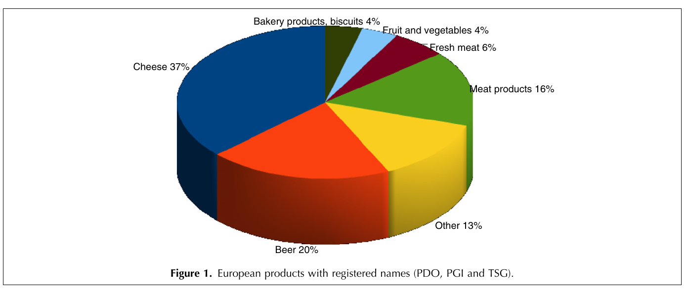
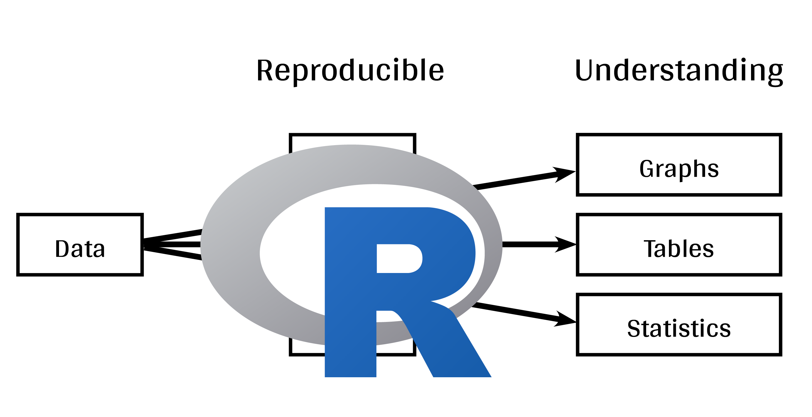
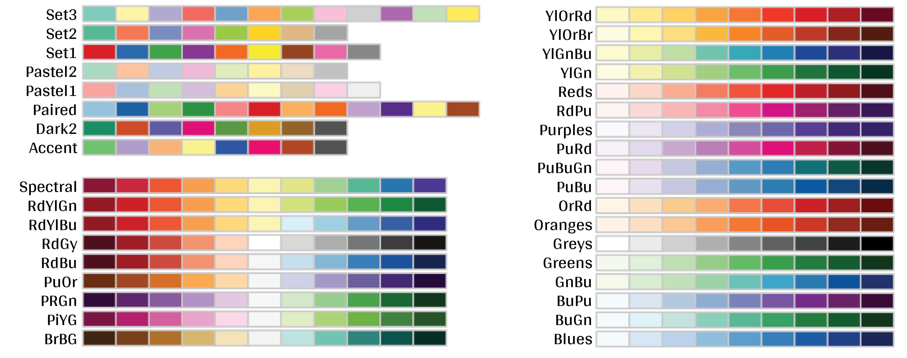
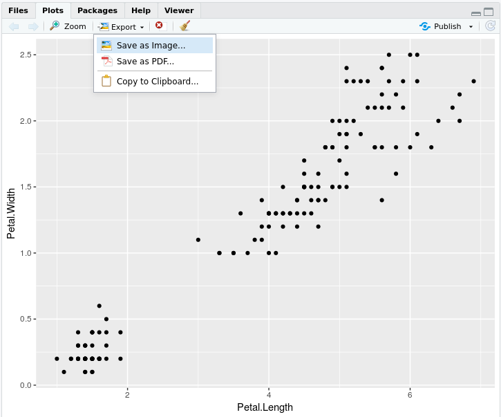
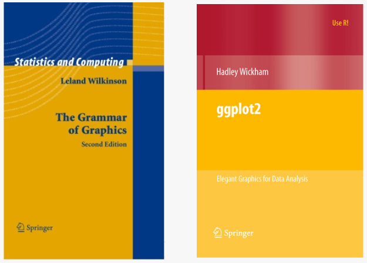

```{r setup, echo = FALSE}
knitr::opts_chunk$set(
  comment = "#",
  collapse = TRUE,
  warning = FALSE,
  message = FALSE,
  cache = TRUE,
  fig.width = 6, fig.height = 6,
  fig.retina = 3,
  fig.align = 'center'
)
options(repos=structure(c(CRAN="http://cran.r-project.org")))
```

class: inverse, center, middle

```{R install_pkgs, echo = FALSE, results = "asis"}
cat(
  qcbsRworkshops::first_slides(6, c('grid', 'gridExtra', 'ggplot2', 'ggsignif','ggdendro', 'maps', 'mapproj', 'RColorBrewer', 'GGally','patchwork','plotly'), lang = "fr")
)
```

---
# Objectifs d'apprentissage

##### 1. Utilisez R pour créer différents graphiques


---

class: inverse, center, middle

# Introduction

---
# Introduction

##### Pour suivre cet atelier:

Code et .HTML sont disponibles à l'adresse suivante: http://qcbs.ca/wiki/r/workshop3

##### Recommandations:

  1. créez votre propre script R ;
  2. référez-vous au script R fourni uniquement si nécessaire ;
  3. évitez de copier-coller ou d'exécuter le code directement à partir du script.
  

###### [ggplot2](https://ggplot2.tidyverse.org/) est aussi sur GitHub: https://github.com/tidyverse/ggplot2


---
# Plan de l'atelier

###### 1. La mécanique `ggplot2`

.center[

]


###### 2. Visualisation avancée

###### 3. Ajustement et peaufinage

###### 4. Enregistrer un graphique

###### 5. Conclusion

---
# Objectifs d'apprentissage

<br>

- Apprendre les bases de la visualisation des données à l'aide de R.
- Trouver des librairies et des ressources pour répondre à vos besoins.
- Inspirer plus de créativité dans les domaines scientifiques !
- Développer votre compréhension de la conception pour une communication graphique efficace.

---
class: inverse, center, middle

# Visualisation en science

---
# Visualisation en science
<br>

#### Pourquoi utilisons-nous la visualisation de données ?

#### Qu'est-ce qui rend une visualisation efficace ?

<br>

.center[]

Que pensez-vous de celle-ci ?

---
# Visualisation en science
<br>

1. Représenter les résultats des analyses statistiques
2. Formuler des hypothèses et comprendre/résumer des théories
3. Explorer vos propres données (analyse exploratoire, détection des valeurs aberrantes)
4. Communiquer et rendre compte
  - Clairement (en utilisant de bons principes de conception)
  - De manière précise et exacte (un bon graphique vaut 1000 mots)
  - De manière effective et efficace


???

note: _changed points here as answers from previous slide question_

---
# Visualisation en science
<br>

**Questions importantes** :

- Que voulez-vous communiquer ?
- Qui est votre public ?
- Quelle est la meilleure façon de le faire ?

.center[
.alert[Une règle générale : restez simple - utilisez moins d'encre !]
]

--

#### Ressources utiles

- [Fundamentals of Data Visualization](https://serialmentor.com/dataviz/) (ggplot)
- [A Compendium of Clean Graphs in R](https://www.shinyapps.org/apps/RGraphCompendium/index.php#line-plots) (base plot)
- [Graphics Principles](https://graphicsprinciples.github.io/) (trucs et astuces de conception)

---
# AVERTISSEMENT!

<br>

.alert[
 `R` n'est pas fait pour le dessin.
]

D'autres logiciels de dessin sont probablement de meilleures options comme [GIMP](https://www.gimp.org/) ou [Inkscape](https://inkscape.org/). Il est important d'utiliser le bon outil pour la bonne tâche !

---
# Pourquoi utiliser R pour les graphiques ?

.center[]

---
# Pourquoi utiliser R pour les graphiques ? 

#### .alert[Reproductibilité]

.center[]


.alert[La science reproductible requiert un effort]:
- commentez votre script
- ajoutez des informations dans vos figures (titres, étiquettes, légendes, annotations)
- ...

---
# Pourquoi utiliser R pour les graphiques ?

#### .alert[En raison de ses puissantes fonctionnalités !]

Dans cet atelier, nous nous concentrons uniquement sur `ggplot2`, mais [plusieurs librairies et fonctions](https://insileco.github.io/wiki/rgraphpkgs/) peuvent être utilisées pour une excellente visualisation (par exemple, ["base R"](https://bookdown.org/rdpeng/exdata/the-base-plotting-system-1.html), [plotly](https://plot.ly/r/), [sjPlot](http://www.strengejacke.de/sjPlot/), [mapview](https://r-spatial.github.io/mapview/), [igraph](https://igraph.org/r/)).


```{r, echo=FALSE, fig.width=9, fig.height=5.7}
source(file="./scripts/multiExamplePlot.R")
```


---
# `ggplot2` est polyvalent

1. La librairie [`ggplot2`](https://ggplot2.tidyverse.org/) vous permet de réaliser de *beaux* graphiques personnalisables;
2. `ggplot2` met en œuvre la grammaire des graphiques, un système fiable pour construire des graphiques;
3. `ggplot2` a de [nombreuses extensions](https://exts.ggplot2.tidyverse.org/gallery/).


.center[]


---
class: inverse, center, middle

# La mécanique `ggplot2`: les bases

---
# Les bases de la grammaire des graphiques (GG)

```{r, eval = FALSE}
install.packages("ggplot2") # if not already installed
library(ggplot2)
```

```{r, echo = FALSE}
library(ggplot2)
```

Un graphique est construit à partir de différente couches:

.center[

]

En utilisant le système GG, nous pouvons construire des graphiques étape par étape pour des résultats personnalisables. 

---
# Les bases de la grammaire des graphiques (GG)

Ces couches ont des noms spécifiques que vous verrez tout au long de la présentation :


.small[image adaptée de [The Grammar of Graphics](https://www.springer.com/gp/book/9780387245447)]

???

note: _changed image to more intuitive layers_

---
exclude: true
# Les bases de la grammaire des graphiques (GG)

.center[

]

???

note: _removed this slide becase it felt random_

---
# Les bases de la grammaire des graphiques (GG)

Voici les éléments de base pour dessiner le plus simple des `ggplot`:


.center[

]


---
# La grammaire des graphiques (GG)

Un graphique est constitué d'éléments (couches):

- Données
    - vos données, dans un format bien ordonné, fourniront les ingrédients de votre graphique
    - utiliser les techniques `dplyr` pour préparer les données en vue d'un format de tracé optimal
    - en général, une ligne pour chaque observation que vous voulez représenter


???

note: _included subpoints for data since other bullets had subpoints_
---
# La grammaire des graphiques (GG)

Un graphique est constitué d'éléments (couches):

- Données
- Esthétique (aes), pour rendre les données visibles
    - `x`, `y`: position le long des axes x et y
    - `colour`: la couleur des géométries selon les données
    - `fill`: la couleur intérieure des géométries
    - `group`: à quel groupe appartient une géométrie
    - `shape`: la forme des points
    - `linetype`: le type de ligne utilisé (pleine, pointillée, etc.)
    - `size`: la taille des points ou des lignes
    - `alpha`: la transparence des géométries
    
--

.alert[note: l'esthétique est basée sur les quantités dans vos données, mais les graphiques peuvent également avoir certaines de ces qualités qui ne sont pas fonction des données (p. ex. la coloration basée sur un groupe de données est une esthétique, mais les points peuvent avoir une couleur qui n'est pas fonction des données)].

---
# La grammaire des graphiques (GG)

Un graphique est constitué d'éléments (couches):

- Données
- Esthétique (aes)
- Objets géométriques (geoms)
    * `geom_point()` : diagramme de dispersion
    * `geom_line()` : lignes reliant des points par une valeur croissante de x
    * `geom_path()` : lignes reliant des points dans l'ordre d'apparition
    * `geom_boxplot()` : diagramme en boîte (boxplot) pour les variables catégoriques
    * `geom_bar()` : diagrammes à barres pour un axe des x catégorique
    * `geom_histogram()` : histogramme pour l'axe des x continu
    * `geom_violin()` : kernel de distribution de la dispersion des données 
    * `geom_smooth()` : ligne de lissage en fonction des données

    

---
# La grammaire des graphiques (GG)

Un graphique est constitué d'éléments (couches):

- Données
- Esthétique (aes)
- Objets géométriques (geoms)
- Facettes
    * `facet_wrap()` ou `facet_grid()` pour de petits multiples
    
???

note: _descriptions of scales to talk about more layers_

---
# La grammaire des graphiques (GG)

Un graphique est constitué d'éléments (couches):

- Données
- Esthétique (aes)
- Objets géométriques (geoms)
- Facettes
- Statistiques
    * similaire aux géométries, mais issue de calcul sur les données
    * indique les moyennes, les comptages et autres résumés statistiques des données
    
    
???

note: _descriptions of themes to talk about more  layers_

---
# La grammaire des graphiques (GG)

Un graphique est constitué d'éléments (couches):

- Données
- Esthétique (aes)
- Objets géométriques (geoms)
- Facettes
- Statistiques
- Coordonnées - ajustement des données sur une page
    * `coord_cartesian` pour fixer des limites
    * `coord_polar` pour les graphiques circulaires
    * `coord_map` pour différentes projections cartographiques
    
    
???

note: _descriptions of other layerss_


---
# La grammaire des graphiques (GG)

Un graphique est constitué d'éléments (couches):

- Données
- Esthétique (aes)
- Objets géométriques (geoms)
- Facettes
- Statistiques
- Coordonnées 
- Thèmes
    * Effets visuels globaux par défaut
    * polices, couleurs, formes, contours
    
???

note: _descriptions of other layerss_

---
# Comment fonctionnent les couches dans ggplot

1. Créer un objet graphique simple :
  * `plot.object <- ggplot()`

2. Ajouter des couches géométriques :
  * `plot.object <- plot.object + geom_*()`
  
3. Ajouter des couches d'apparence :
  * `plot.object <- plot.object + coord_*() + theme()`

3. Répétez l'étape 2-3 jusqu'à ce que vous soyez satisfait, puis imprimez :
  * `plot.object` ou `print(plot.object)`.


---
# Préparer les données pour `ggplot2`

La librairie `ggplot2` requiert de préparer les données comme un objet de la classe "data.frame" ou "tibble" (commun dans l'univers `tidyverse`).

```{r eval=TRUE, echo=TRUE}
library(tibble)
class(iris) # Tout est prêt !

ir <- as_tibble(iris) # acceptable
class(ir)
```

**&#x267B; Rappel de l'atelier [*Charger et manipuler des données*](https://wiki.qcbs.ca/r_atelier2)**:

Les graphiques plus complexes dans les `ggplot2` nécessitent que les données soient en format long

---
# Le jeu de données iris

```{r, eval=-1}
?iris
str(iris)
```

.center[**Questions scientifiques**]
- Y a-t-il une relation entre la **longueur** et la **largeur** des **sépales** des iris ?
- Est-ce que la taille des **pétales** et des **sépales** varie ensemble ?
- Comment ces mesures sont-elles réparties entre les 3 espèces d'iris ?

.center[.alert[Comment pouvons-nous répondre graphiquement à ces questions avec `ggplot`?]]

---
# Explorer la structure des données

<!-- Explain the databases before the examples  -->

```{r, fig.width = 10.25, fig.height = 6.5}
install.packages("GGally")
library(GGally)
ggpairs(iris, aes(colour = Species)) + theme_bw()
```

???

note: _ggpairs (ggplot version of psych package) allows us to explore correlations in data_

---
# Explorer la structure des données

```{r, echo = FALSE, fig.height=7, fig.width=9}
ggplot(data = iris,             # Données
       aes(x = Sepal.Length,    # Valeurs en X
           y = Sepal.Width,     # Valeurs en Y
           col = Species)) +    # Esthétiques
  geom_point(size = 5, alpha = 0.8) + # Point
  geom_smooth(method = "lm") +  # Régression linéaire
  labs(title = "Relation entre la longueur et la largeur\ndes sépales pour différentes espèces d'iris") + # Title
  theme(title = element_text(size = 18, face = "bold"),
      text = element_text(size = 14))
```

.small[&#x267B; Voir l'atelier [*Charger et manipuler des données*](https://wiki.qcbs.ca/r_atelier2) pour apprendre comment nettoyer vos données.]


---
exclude: true
# L'héritage dans  `ggplot2`

.small[

.pull-left[
**avec héritage**
```{r, fig.height = 5}
p <- ggplot(data = iris,
            aes(x = Sepal.Length,
                y = Sepal.Width))
p <- p + geom_point()
p # Imprimer le graphique final
```
]

.pull-right[
**sans héritage**
```{r, fig.height = 5}
s <- ggplot()
s <- s + geom_point(data = iris,
                    aes(x = Sepal.Length,
                        y = Sepal.Width))
s # Imprimer le graphique final
```
]

]

??? 

note: _removed this slide because it felt random, but is maybe worth going over at some point - edit. moved to challenge 1 answer_

---
# La grammaire des graphiques: *rappel*

Un graphique est constitué de différentes couches :


---
# La dynamique `ggplot()` : la couche de données

```{r, fig.height=4, fig.width=5}
ggplot(data = iris)
```

---
# La dynamique `ggplot()` : la couche d'esthétiques

```{r, fig.height=4, fig.width=5}
ggplot(data = iris, aes(x = Sepal.Length, y = Sepal.Width)) 
```

---
# La dynamique `ggplot()` : la couche de géométries

```{r, fig.height=4, fig.width=5}
ggplot(data = iris, aes(x = Sepal.Length, y = Sepal.Width)) +
  geom_point()
```

---
# # La dynamique `ggplot()` : les couches extras - facette, stats, coordonnées

```{r,fig.height=4.5}
ggplot(data = iris, aes(x = Sepal.Length, y = Sepal.Width)) +
  geom_point() + 
  facet_wrap(~Species) +
  coord_trans(x = "log10",
              y = "log10")
```

---
# Défi #1 (5min) 

#### Créer votre 1er graphique ggplot!

.alert[Question]

> Y a-t-il une relation entre la **longueur** et la **largeur** des **pétales** des iris?

> La **largeur** des pétales augmente-t-elle avec leur **longueur**?

.center[Paramètres à prendre en compte pour répondre à cette question :]

 données | géométrie | valeurs x | valeurs y 
:-------------:|:-------------:|:-------------:|:-------------:
iris | geom_point | longueur des pétales | largeur des pétales


---
# Défi 1#: Solution 

```{r}
ggplot(data = iris, aes(x = Petal.Length,
                        y = Petal.Width)) +
  geom_point()
```


---
# Défi 1#: Solution 

.pull-left[
```{r}
ggplot(data = iris, aes(x = Petal.Length,
                        y = Petal.Width)) +
  geom_point()
```
]

.pull-right[
**note**: L'esthétique peut être soit dans la ligne `ggplot()`, et sera héritée par chaque géométrie, soit dans la ligne `geom_*()` à appliquer à cette géométrie seulement !
]

---
# Défi 1#: Solution 

.pull-left[
```{r}
ggplot(data = iris, aes(x = Petal.Length,
                        y = Petal.Width)) +
  geom_point(shape = 2, color = "blue")
```
]

.pull-right[
**note**: L'esthétique peut être soit dans la ligne `ggplot()`, et sera héritée par chaque géométrie, soit dans la ligne `geom_*()` à appliquer à cette géométrie seulement !

<br>
<br>

**note 2**: les commandes `colour`, `alpha`, `shape`, et `size` peuvent être définies en dehors des valeurs de `aes()`, et seront alors statiques, non dépendantes des données.
]
---

class: inverse, center, middle

# Esthétique ou *Aesthetic mappings*

## couleur, forme, taille, étiquettes et transparence

---
# Esthétique

**Utiliser l'esthétique (`aes()`) pour distinguer les classes, les groupes et la structure**


```{r echo = FALSE, fig.width = 8, fig.height = 6.5}
library(gridExtra)
source(file="./scripts/4plot_aesthetic.R")
```

---
# Les couleurs: faire parler vos données

Changez la **couleur** pour

&nbsp;  différencier les groupes

&nbsp;  représenter les valeurs des données

&nbsp;  mettre en évidence des éléments spécifiques


.pull-left[
```{r, echo = FALSE, fig.height=4.8, fig.width = 5}
ggplot(iris, aes(Sepal.Length, Sepal.Width))+
  geom_point(aes(colour = Species)) +
  labs(title = "Couleurs qualitatives pour des groupes",
       x = "Longeur des sépales",
       y = "Largeur des sépales") +
  theme(title = element_text(size = 14, face = "bold"),
        legend.title = element_text(size = 14),
        legend.position = 'bottom')
```
]

.pull-right[
```{r, echo = FALSE, fig.height=4.8, fig.width = 5}
ggplot(iris, aes(Sepal.Length, Sepal.Width))+
  geom_point(aes(colour = Petal.Length)) +
  labs(title = "Gradient de couleurs pour des valeurs",
       x = "Longeur des sépales",
       y = "Largeur des sépales") +
  theme(title = element_text(size = 14, face = "bold"),
        legend.title = element_text(size = 14),
        legend.position = 'bottom')
```
]

.center[
.footnote[Voir [Fundamentals of Data Visualization](https://serialmentor.com/dataviz/colour-basics.html)]
]

???

note: _hard to get caption in the right place with these css commands... Used footnote here for best results, but there is probably a better way_

---
# Utiliser `aes()` pour changer les couleurs

La longueur et la largeur des sépales varient-elles selon les espèces ?
.pull-left[
```{r, fig.align = 'default', fig.asp=2/3}
ggplot(data = iris,
       aes(x = Sepal.Length, y = Sepal.Width)) +
  geom_point() +
  geom_smooth(method = lm)+
  labs(title = "Avec code de couleur")
```
]

.pull-right[
```{r,  fig.align = 'default', fig.asp=2/3}
ggplot(data = iris, 
       aes(x = Sepal.Length, y = Sepal.Width, colour = Species)) +
  geom_point() +
  geom_smooth(method = lm) +
  labs(title = "Sans code de couleur")
```
]

---
# Changer les couleurs manuellement

.pull-left[
```{r, fig.align = 'default', fig.asp=2/3}
pp <- ggplot(data = iris) +
  geom_point(aes(x = Sepal.Length, 
                 y = Sepal.Width, 
                 colour = Species))
pp + labs(title = "Défaut")
```
]
.pull-right[
```{r, fig.align = 'default', fig.asp=2/3}
pp +
  scale_colour_manual(values = c("grey55", 
                                 "orange", 
                                 "skyblue")) +
  labs(title = "Personnalisé")
```
]

???
note: _changed to left/right because cut off_

---
# Gradient de couleurs

.pull-left[
```{r, fig.align = 'default', fig.asp=2/3}
pp2 <- ggplot(data = iris) +
  geom_point(aes(x = Sepal.Length, 
                 y = Sepal.Width,
                 colour = Petal.Length))
pp2 + labs(title = "Défaut")
```
]
.pull-right[
```{r, fig.align = 'default', fig.asp=2/3}
pp2 + 
  scale_colour_gradient(low = "blue", 
                        high = "red") +
  labs(title = "Personnalisé")
```
]

???
note: _changed to left/right because cut off_

---
# Utiliser une palette de couleurs prédéfinie

```{r, eval = FALSE}
install.packages("RColorBrewer")
library(RColorBrewer)
display.brewer.all()
```




---
# Utiliser une palette de couleurs prédéfinie

```{r, fig.align = 'center', fig.asp=2/3}
pp + scale_colour_brewer(palette = "Dark2") +
  labs(title = "Palette pour des groupes")
```

---
# Utiliser une palette de couleurs prédéfinie

```{r, fig.align = 'center', fig.asp=2/3}
pp2 + scale_color_viridis_c()+
  labs(title = "Palette pour des variables continues")
```


---
# Utiliser une palette de couleurs prédéfinie

Palette de gris pour la publication

```{r,  fig.align = 'center', fig.asp=2/3}
pp + scale_colour_grey() +
  labs(title = "Palette pour des groupes")
```

---
# Utiliser une palette de couleurs prédéfinie

```{r,  fig.align = 'center', fig.asp=2/3}
pp2 + scale_colour_gradient(low = "grey85", high = "black") +
  labs(title = "Palette pour des variables continues")
```


---
# Utiliser des palettes de couleurs visibles pour les daltoniens

Comment votre figure peut-elle apparaître sous différentes formes de daltonisme ?
Nous pouvons utiliser [colorblindr](https://github.com/clauswilke/colorblindr) qui n'est pas actuellement sur CRAN, donc nous l'installons avec la librairie [remotes](https://cran.r-project.org/web/packages/remotes/index.html).

```{R colorblindr_install, message = FALSE}
# install.packages("remotes")
remotes::install_github("clauswilke/colorblindr", quiet = TRUE)
library(colorblindr)
```

---
# Utiliser des palettes de couleurs visibles pour les daltoniens

```{r, fig.width = 11, fig.height = 7}
cvd_grid(pp)
```

---
# Utiliser des palettes de couleurs visibles pour les daltoniens


.pull-left[
```{r, fig.height = 5}
pp + scale_colour_viridis_d() +
  labs(title = "Palette viridis pour des groupes")
```
]

.pull-right[
```{r, fig.height = 5}
pp2 + scale_colour_viridis_c() +
  labs(title = "Palette viridis pour des variables continues")
```
]


---
# Changer la forme, la taille et la transparence

.pull-left[
```{r, fig.height = 4.5, fig.width = 5.5}
ggplot(data = iris) +
  geom_point(aes(x = Sepal.Length, 
                 y = Sepal.Width, 
                 shape = Species)) +
  labs(title = "Formes pour des groupes")
```
]

.pull-right[
```{r, fig.height = 4.5, fig.width = 5.5}
ggplot(data = iris) +
  geom_point(aes(x = Sepal.Length, 
                 y = Sepal.Width,
                 size = Petal.Length, 
                 alpha = Petal.Length)) +
  labs(title = "Taille et transparence pour des variables continues")
```
]


---
# Défi #2 

- Créer un graphique informatif à partir de jeu de données disponible de R, comme `mtcars`, `CO2` ou `msleep`.

- Utiliser les esthétiques appropriés pour différents types de données


<br>

Données | x | y | Esthétiques
:-------------:|:-------------:|:-------------:|:-------------:
mtcars |*wt* |*mpg* | *disp* et *hp*
CO2 |*conc* |*uptake* | *Treatment* et *Type*
msleep |log10(*bodywt*) |*awake* | *vore* et *conservation*
ToothGrowth | *dose* | *len* | *supp* 

<br>
.center[.alert[
 Faites attention aux types de données !
]
]

---
# Défi #2 

#### .alert[Salles de réunion ! - 15 min]
<br> 

Créez un graphique à partager avec le groupe


???
note: _assign each group a dataset to make a plot from: mtcars, CO2, msleep, and ToothGrowth to make exploratory plots_

---
# Défi #2 - Solution exemple #1

.small[

Données | x | y | Esthétiques
:-------------:|:-------------:|:-------------:|:-------------:
mtcars |*wt* |*mpg* | *disp* et *hp*

]

```{r, fig.height=3.5, fig.width=6}
data(mtcars)
ggplot(data = mtcars) +
  geom_point(mapping = aes(x = wt, y = mpg,
                           colour = disp,
                           alpha = hp))
```

.comment[Pourriez-vous utiliser `size` au lieu de `alpha`? Et `shape`?]

---
# Défi #2 - Solution exemple #2

.small[

Données | x | y | Esthétiques
:-------------:|:-------------:|:-------------:|:-------------:
CO2 |*conc* |*uptake* | *Treatment* et *Type*

]

```{r, fig.height=3.5, fig.width=6}
data(CO2)
ggplot(data = CO2) +
    geom_point(mapping = aes(x = conc, y = uptake,
                             colour = Treatment, shape = Type))
```

.comment[Pourquoi ne pas utiliser `size = Type`?]

---
# Défi #2 - Solution exemple #3

.small[

Données | x | y | Esthétiques
:-------------:|:-------------:|:-------------:|:-------------:
msleep |log10(*bodywt*) |*awake* | *vore* et *conservation*

]

```{r, fig.height=3.5, fig.width=6}
data(msleep)
ggplot(data = msleep) +
    geom_point(mapping = aes(x = log10(bodywt), y = awake,
                             colour = vore, shape = conservation))
```

---
# Défi #2 - Solution exemple #4

.small[

Données | x | y | Esthétiques
:-------------:|:-------------:|:-------------:|:-------------:
ToothGrowth | *dose* | *len* | *supp* 

]

```{r, fig.height=3.5, fig.width=6}
data(ToothGrowth)
ggplot(ToothGrowth, aes(x = dose, y = len, color = supp)) +
  geom_point() + 
  geom_smooth(method = lm, formula = 'y~x')
```

---
class: small-code
# Changer l'échelle des axes
.tiny[
.pull-left[
```{r,fig.height=4}
ggplot(diamonds) +
  geom_point(aes(x = carat, y = price)) +
  labs(title = "Axe des x à l'échelle normale")
```
]
]
.pull-right[
```{r,fig.height=4}
ggplot(diamonds) + 
  geom_point(aes(x = carat, y = price)) +
  coord_trans(x = "log10",
              y = "log10") +
  labs(title = "Axes x et y sur une échelle log10")
```
]

<br>
.footnote[Il est également possible de transformer le système de coordonnées en utilisant <br>
`scale_x_log10()` et `scale_y_log10()`]

<!-- explain the difference -->

???
note: _changed to coord_trans because that's what we indroduced earlier as a layer_

---
class: inverse, center, middle

# Perfectionner vos graphiques

# Utiliser le `theme()` pour faire bonne figure!

---
# `theme()`


.pull-left[
```{r, fig.height = 5}
pp + scale_colour_grey() +
  theme_classic() +
  labs(title = "Thème classique")
```
]

.pull-right[
```{r, fig.height = 5}
pp + scale_colour_grey() +
  theme_minimal() +
  labs(title = "Thème minimal")
```
]

.footnote[NB: De bons choix pour la publication !]


---
# `theme()`

Utiliser `theme_set()` pour changer le thème pour tous vos prochains graphiques, 
ou `theme_update()` pour modifier certains aspects d'un thème. 


.pull-left[
**Choisir le thème**
```{r, fig.height = 5}
# Choisir le thème classic par défaut
theme_set(theme_bw())
pp
```
]

.pull-right[
**Mettre à jour le thème**
```{r, fig.height = 5}
# supprimer la grille mineure
theme_update(panel.grid.minor = element_blank())
pp
```
]


```{r, include=FALSE}
theme_set(theme_bw())
theme_update(panel.grid.minor = element_blank())
```

---
exclude: true
# ggThemeAssist: Extension de RStudio


???
note: _removed this slide to add theme image instead_


---
# `theme()`

Les élements d'un thème


---
class: inverse, center, middle

# Perfectionner vos graphiques

# Utiliser `facet_grid()` pour changer la disposition des graphiques

---
# iris: facettes par espèce
```{r, fig.align="center", fig.width=10, fig.height=6}
ggplot(data = iris) +
  geom_point(mapping = aes(x = Sepal.Length, y = Sepal.Width, colour = Species)) +
  facet_grid(~ Species, scales = "free")
```

---
# CO2: facettes par type
```{r, fig.align="center", fig.width=10, fig.height=5.5}
ggplot(data = CO2) +
  geom_point(mapping = aes(x = conc, y = uptake, colour = Treatment)) +
  xlab("Concentration du CO2 (mL/L)") + ylab("Absorption du CO2 (umol/m^2 sec)") +
  facet_grid(~ Type)
```

<!-- relabeling ticks -->

---
# Titre et axes: changer la taille, la couleur et l'apparence

.center[]


---
# Titre et axes: changer la taille, la couleur et l'apparence

.pull-left[
**Défaut**
```{r, echo=FALSE, fig.align="center", fig.width=5.5, fig.height=5}
pp
```
]
.pull-right[
**Ajustement des axes et du titre**
```{r, echo=FALSE, fig.align="center", fig.width=5.5, fig.height=5}
pp +
  ggtitle("Relation entre longueur et largeur des sépales") +
  xlab("Longueur des sépales (cm)") +
  ylab("Largeur des sépales (cm)") +
  theme(axis.title.x = element_text(size = 16),
        axis.title.y = element_text(size = 16),
        axis.text.x = element_text(size = 12),
        axis.text.y = element_text(size = 12),
        plot.title = element_text(size = 16, face = "bold"),
        legend.title = element_text(size = 14, face = "bold"),
        legend.text = element_text(size = 12))
```

]

---
# Défi #3 

Utilisez les données `tips` qui se trouvent dans `reshape2` &#x1F4E6; pour reproduire le graphique ci-dessous.


Notre conseil: commencez par `theme_classic()` et ajoutez `theme()` pour faire vos changements supplémentaires.

```{r, echo=FALSE, fig.width=10, fig.height=5}
library(reshape2)
tips.gg <- ggplot(tips, aes(x = total_bill,
                            y = tip/total_bill,
                            shape = smoker,
                            colour = sex,
                            size = size)) +
  geom_point() +
  facet_grid( ~ time) +
  scale_colour_grey() +
  labs(title = "Relation entre la facture totale et les pourboires pendant les repas",
       x = "Facture totale ($)", y = "Ratio entre pourboires et facture totale") +
  theme_classic() +
  theme(axis.title = element_text(size = 16,
                                  colour = "navy"),
        axis.text = element_text(size = 12),
        plot.title = element_text(size = 16,
                                  colour = "orange3",
                                  face = "bold"),
        strip.text.x = element_text(size = 14, face ="bold"))
tips.gg
```

---
# Défi #3 

#### .alert[Salles de réunion! - 15 min]

???
note: _give teams time to work together to recreate this plot. Refer to theme elements slide_

---
# Défi #3: Solution

```{r, eval=FALSE}
library(reshape2)
tips.gg <- ggplot(tips, aes(x = total_bill,
                            y = tip/total_bill,
                            shape = smoker,
                            colour = sex,
                            size = size)) +
  geom_point() +
  facet_grid( ~ time) +
  scale_colour_grey() +
  labs(title = "Relation entre la facture totale et les pourboires pendant les repas",
       x = "Facture totale ($)", y = "Ratio entre pourboires et facture totale") +
  theme_classic() +
  theme(axis.title = element_text(size = 16,
                                  colour = "navy"),
        axis.text = element_text(size = 12),
        plot.title = element_text(size = 16,
                                  colour = "orange3",
                                  face = "bold"),
        strip.text.x = element_text(size = 14, face ="bold"))
tips.gg
```

---
# Défi #3: solution par étapes

#### `aes()`

```{r, fig.width = 7, fig.height=5}
theme_set(theme_classic())
tips.gg <- ggplot(tips) +
  geom_point(mapping = aes(x = total_bill, y = tip/total_bill,
                      shape = smoker, colour = sex, size = size))
tips.gg
```

```{r, include=FALSE}
theme_set(theme_classic())
```

---
# Défi #3: solution par étapes

#### `facet_grid()`

```{r, fig.width=7, fig.height=5}
tips.gg <- tips.gg +
  facet_grid( ~ time)
tips.gg
```


---
# Défi #3: solution par étapes

#### Palette de gris

```{r, fig.width=7,fig.height=5}
tips.gg <- tips.gg +
  scale_colour_grey()
tips.gg
```

---
# Défi #3: solution par étapes

#### Ajout du titre et des étiquettes du graphique

```{r, fig.width=7,fig.height=5}
tips.gg <- tips.gg +
  labs(title = "Relation entre la facture totale et les pourboires pendant les repas",
       x = "Facture totale ($)", y = "Ratio entre pourboires et facture totale")
tips.gg
```

---
# Défi #3: solution par étapes

#### Ajout et ajustement du thème

.small[
```{r, fig.width=6, fig.height=4}
tips.gg <- tips.gg +
  theme_classic() +
  theme(axis.title = element_text(size = 16, colour = "navy"),
        axis.text = element_text(size = 12),
        plot.title = element_text(size = 16, colour = "orange3", face = "bold"),
        strip.text.x = element_text(size = 14, face = "bold"))
tips.gg
```
]

---
class: inverse, center, middle

# Perfectionner vos graphiques

# Utiliser `geom_*()` pour créer différents types de graphique

---
# `ggplot2::geom_*()`

.center[

]

---
exclude: true
# `base::plot()`

.center[

]

???
note: removed this slide. Not sure why it's here. 

---
# `ggplot2::ggplot()`

```{r, fig.align="center"}
ggplot(iris, aes(Sepal.Length))
```


---
# Histogrammes: `geom_histogram()`

Un **histogramme** est une représentation graphique précise de la répartition des données numériques - une seule esthétique requise

```{r, fig.align="center",fig.height=5.5}
ggplot(iris, aes(Sepal.Length)) +
  geom_histogram() +
  ggtitle("Histogramme de la longueur des longueurs")
```


---
# Nuage de points et régression linéaire: `geom_point()` et `geom_smooth()`

.small[
.pull-left[
```{r, fig.width=5.5, fig.height=5.5}
ggplot(mpg, aes(displ, hwy)) +
  geom_point() +
  labs(title = "Nuage de points")
```
]

.pull-right[
```{r, fig.width=5.5, fig.height=5.5}
ggplot(mpg, aes(displ, hwy)) +
  geom_point() +
  labs(title = "Régression linéaire") +
  geom_smooth(method = lm)
```
]
]
---
# Diagramme en boîte: `geom_boxplot()`

```{r, fig.align="center"}
ggplot(data = iris, aes(Species, Sepal.Length,
                        fill = Species)) +
  geom_boxplot() +
  labs(title = "Diagramme en boîte")
```

---
# Boxplot: `geom_boxplot()`

```{r, echo=FALSE, fig.align="center", fig.width = 7, fig.height = 3.2}
ggplot(data = iris, aes(Species, Sepal.Length, fill = Species)) +
  geom_boxplot() +
  labs(title = "Diagramme en boîte")
```

.center[

]

---
# Diagramme en boîte avec annotations: `geom_boxplot()` et `geom_signif()`

```{r, fig.align="center",fig.height=5.5}
library(ggsignif)
ggplot(data = iris, aes(Species, Sepal.Length)) +
  geom_boxplot() +
  geom_signif(comparisons = list(c("versicolor", "virginica")),
              map_signif_level = TRUE)
```

---
# Graphique en violon: `geom_violin()`

Comme expliqué sur le site [from Data to Viz](https://www.data-to-viz.com/graph/violin.html)

> Le graphique en forme de violon permet de visualiser la distribution d'une variable numérique pour un ou plusieurs groupes. [...] Il est très proche du diagramme en boîte, mais permet une compréhension plus approfondie de la distribution.

.pull-left[
```{r, echo=FALSE, fig.height=4.4}
# Data
names <- c(rep("A", 80), rep("B", 50), rep("C", 70))
value <- c(sample(2:5, 80, replace = TRUE), 
           sample(4:10, 50, replace = TRUE),
           sample(1:7, 70, replace = TRUE))
data <- data.frame(names, value)

#Graph
qplot(x = names, y = value, data = data, geom = c("boxplot", "jitter"), fill = names)
```
]
.pull-right[
```{r, echo=FALSE, fig.height=4.4}
ggplot(data = data, aes(names, value, fill = names)) + geom_violin()
```
]

---
# Graphique en violon: `geom_violin()`

```{r, fig.align="center"}
violin <- ggplot(data = iris, aes(x = Species, y = Sepal.Length)) +
  geom_violin(trim = FALSE, fill = "grey70", alpha = .5) +
  labs(title = "Graphique en forme de violon")
violin
```

---
# Graphique en violon: `geom_violin()` + `_boxplot()` + `_jitter()`

```{r, fig.align="center"}
violin + 
  geom_jitter(shape = 16, position = position_jitter(0.2), alpha = .3) +
  geom_boxplot(width = .05)
```

???
note: _added this plot to show how multiple geoms can be used together_

---
# Résumer des valeurs: `stat_summary()`

.pull-left[
```{r, fig.height=5, fig.width=4}
ggplot(mtcars, aes(cyl, mpg)) +
  geom_point() +
  stat_summary(fun = "mean", geom = "point",
               colour = "red", size = 5) +
  labs(title = "Moyenne")
```
]

.pull-right[
```{r, fig.height=5, fig.width=4}
ggplot(mtcars, aes(cyl, mpg)) +
  geom_point() +
  stat_summary(fun.data = "mean_cl_boot", 
               colour = "red", size = 2) +
  labs(title = "Moyenne et intervalle de confiance")
```
]

---
# Résumer des valeurs

Voir aussi `geom_errorbar()`, `geom_pointrange()`, `geom_linerange()`, `geom_crossbar()` pour que les géométries puissent afficher des données résumées.


---
# Créer des cartes: `geom_map()`
.small[
```{r}
crimes <- data.frame(state = tolower(rownames(USArrests)), USArrests)
crimesm <- reshape2::melt(crimes, id = 1)

library(maps)
states_map <- map_data("state")

ggplot(crimes, aes(map_id = state)) +
  geom_map(aes(fill = Murder), map = states_map) +
  expand_limits(x = states_map$long, y = states_map$lat) +
  coord_map()
```
]

---
# Graphique de densité: `geom_density()`

.small[Un graphique de densité montre la distribution d'une variable numérique et il ne prend qu'un ensemble de valeurs numériques comme entrée.]
.pull-left[
```{r, echo=TRUE, fig.width=5, fig.height=4.4}
iris.dens <- ggplot(iris, aes(Sepal.Length)) +
  geom_density()
iris.dens
```
]

.pull-right[
```{r, echo=TRUE, fig.width=5, fig.height=4.4}
cars.dens <- ggplot(cars, aes(dist)) +
  geom_density()
cars.dens
```
]

---
# Dendogramme: `ggdendrogram()`

```{r}
library(ggdendro)
USArrests.short = USArrests[1:10,]
hc <- hclust(dist(USArrests.short), "ave")

ggdendrogram(hc, rotate = TRUE, theme_dendro = FALSE)
```


---
# Disposition des graphiques: `patchwork`

**Ajouter plusieurs graphiques sur une seule figure**

```{r, fig.width=9, fig.height=5}
# install.packages("patchwork")
library(patchwork)
iris.dens + cars.dens +
  plot_annotation(tag_levels = 'a')
```

---
# Défi final 

Créez votre propre graphique et suivez ces recommandations :
  * Jeu de données : n'importe lequel (recommandation : utilisez votre jeu de données)
  * Explorez un nouveau `geom_*` et d'autres couches de graphqiues


Utilisez les liens suivants pour obtenir des conseils :

- https://ggplot2.tidyverse.org/reference/index.html
- http://shinyapps.stat.ubc.ca/r-graph-catalog/

---
# Défi final: Solution exemple #1

.small[
```{r, fig.align='center',fig.height=4}
data(msleep)
msleep.defi4 <- ggplot(msleep, aes(vore, log10(brainwt), fill = vore))
msleep.defi4 + geom_violin() +
  geom_signif(comparisons = list(c("herbi", "insecti"))) +
  labs(main = "Poids du cerveau pour les différents -vores", y = "log10(Poids du cerveau (Kg))") +
  scale_fill_grey() +
  theme_classic()
```
]

---
#  Défi final: Solution exemple #2
.small[
```{r, fig.align='center', fig.width=5, fig.height=4}
data(mtcars)
mtcars.short <- mtcars[1:20,]
mtcars.short.hc <- hclust(dist(mtcars.short), "complete")
dendro.defi4 <- ggdendrogram(mtcars.short.hc, rotate = TRUE, theme_dendro = FALSE)
dendro.defi4 + ggtitle("Dendrogramme des voitures selon les spécifications du moteur") +
  xlab("Voitures") +
  theme(axis.title.y = element_text(size = 16), axis.title.x = element_blank(),
        axis.text.x = element_blank(), axis.text.y = element_text(size = 12),
        plot.title = element_text(size = 14, face = "bold"))
```
]

---
## Divers : graphiques interactifs utilisant `plotly()`

.small[
.alert[**Sélectionnez les données sur les espèces à afficher directement dans la légende**]

```{r, echo = TRUE, fig.width=8, fig.height=5}
library(plotly)
p <- ggplot(iris,
            aes(x = Sepal.Length, y = Sepal.Width, colour = Species, shape = Species)) +
  geom_point(size = 6, alpha = 0.6)

ggplotly(p)
```
]

---
class: inverse, center, middle

# Sauvegarder vos graphiques avec ggplot2

---
# Sauvegarder des graphiques en RStudio

<div style="text-align:center">

</div>

.small[
.alert[Pensez à la marge du document que vous utilisez. Si vous redimensionnez l'image après l'avoir enregistrée, les étiquettes et le texte changeront également de taille, ce qui pourrait être difficile à lire.
]
]
---
# Sauvegarder des graphiques à l'aide de fonction R

`ggsave()` écrit directement dans votre répertoire de travail et vous permet de spécifier le nom du fichier, les dimensions du graphique, la résolution, etc.

```{r, eval=FALSE}
mon_1er_graph <- ggplot(iris, aes(Petal.Length, Petal.Width)) +
  geom_point()

ggsave("mon_1er_graph.pdf",
       mon_1er_graph,
       height = 8.5, width = 11, units = "in", res = 300)
```

NB: Le format vectoriel (par exemple, pdf, svg) est plus flexible que le format raster (jpeg, png, ...) si l'image doit être modifiée par la suite.

---
# Sauvegarder des graphiques à l'aide de fonction R

<br>

Autres méthodes de sauvegarde des figures: voir `?pdf` `?jpeg`

```{r, eval=FALSE}
pdf("./graph_du_jour.pdf")
  print(mon_1er_graph) # la fonction print est nécessaire
graphics.off()
```


---
# Sauvegarder des graphiques à l'aide de fonction R
<br>

**Tip:** Les fonctions `quartz()` (sur mac) ou `window()` (sur pc) facilitent la mise en forme avant de sauvegarder avec `ggsave()`!

???
note: _this function allows to resize plot live, then use ggsave without specifying plot._
```


---
class: inverse, center, middle

# Going further


---
# Available elements


[Data Visualization with ggplot2 Cheat Sheet](https://www.rstudio.com/wp-content/uploads/2015/03/ggplot2-cheatsheet.pdf)

.center[]

https://www.rstudio.com/resources/cheatsheets

---
# Additional resources

* `help(package = ggplot2)`
* http://ggplot2.tidyverse.org/reference/
* Fundamentals of Data Visualization https://serialmentor.com/dataviz/

.center[]

---
# Concluding remarks
<br>

  1. There are other useful packages that can be used with `ggplot2`! To name a few: `ggbio`, `ggpmisc`, `geomnet`, `gganimate`, `ggnetwork` and `ggtree`. Have a look at [www.ggplot2-exts.org](https://www.ggplot2-exts.org/) for other `ggplot2` extensions.


  2. Note that you can learn more about design and image manipulation with the "Introduction to graphic design and image manipulation with open source tools": https://qcbs.ca/wiki/graphics


---
class: inverse, center, bottom

# Merci d'avoir participé!!


